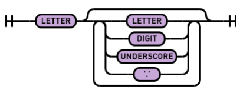
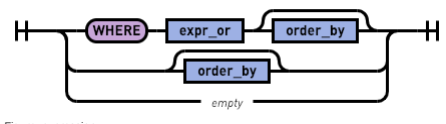
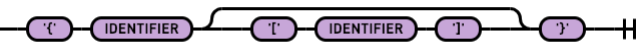
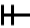
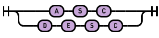
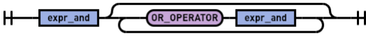
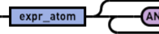
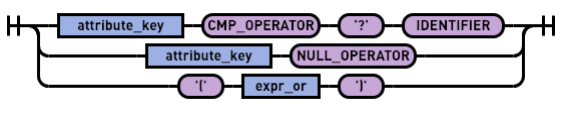
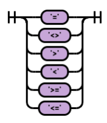
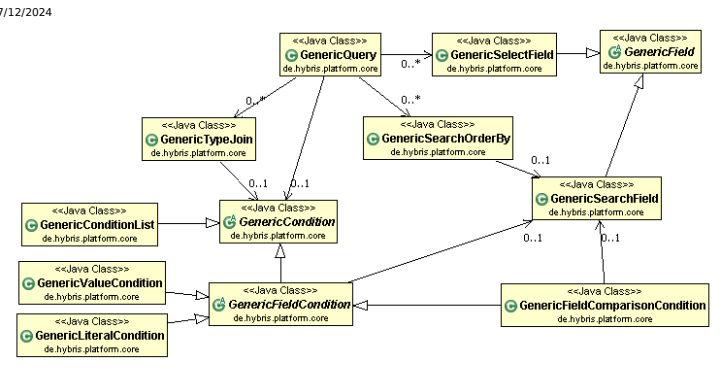

# Search Mechanisms

Both the FlexibleSearchService and the GenericSearch API allow developers to construct and execute queries against the SAP Commerce Cloud database, by focusing on SAP Commerce Cloud items rather than raw SQL. However, the way in which the queries are constructed is based on two completely different and complimentary approaches. The topics covered include:
FlexibleSearch SAP Commerce Cloud comes with a built-in query language of an SQL-based syntax, FlexibleSearch. FlexibleSearch enables searching over the items in SAP Commerce Cloud. GenericSearch While SAP FlexibleSearch offers a powerful search API to developers, some of them may prefer the GenericSearch API that is similar to Hibernate Criteria Queries. Hibernate is a collection of related projects, enabling developers to utilize POJO-style domain models in their applications in ways extending well beyond Object and Relational Mapping.

## Flexiblesearch

SAP Commerce Cloud comes with a built-in query language of an SQL-based syntax, FlexibleSearch. FlexibleSearch enables searching over the items in SAP Commerce Cloud. FlexibleSearch is a powerful retrieval language built into SAP Commerce Cloud. It enables searching for SAP Commerce Cloud types and items using an SQL-based syntax. The execution of a FlexibleSearch statement takes place in two phases: pre-parsing into an SQL-compliant statement and running that statement on the database. During the pre-parsing phase, the FlexibleSearch framework resolves the FlexibleSearch syntax into SQL-compliant syntax. For example, the following two code snippets show a FlexibleSearch query and the statement that results from the FlexibleSearch query, which is executed on the database:
FlexibleSearch query:
select {pk}, {code}, {name[de]} from {Product}
SQL statement (executed on the database):
SELECT item_t0.PK , item_t0.Code , lp_t0.p_name FROM products item_t0 JOIN productslp lp_t0 ON item_t0.PK = lp_t0.ITEMPK AND lp_t0.LAN WHERE (item_t0.TypePkString IN ( 23087380955301264 , 23087380955663520 , 230873809556 23087385363574432 , 23087380955568768 , 23087380955206016 ) )
FlexibleSearch abstracts the SAP Commerce Cloud type system from the actual database tables so that you can run searches on the type system level. Unlike on conventional SQL statements, in a FlexibleSearch query, you do not have to specify explicit database table names. The FlexibleSearch framework resolves type and database table dependencies automatically and species UNIONS and JOINS where necessary. The entire conversion process between type system and database representation takes place automatically. To access a type in a FlexibleSearch query, surround the type code with curly braces { and }, as in:
SELECT * FROM {Product}

FlexibleSearch queries are executed on the database directly using SQL statements. By consequence, it is not possible to run FlexibleSearch queries on jalo-only attributes as these attributes are not written into the database. Find more information in the Jalo-only Attributes document.

SAP Commerce Cloud executes FlexibleSearch queries in the context of a certain user account, using a session. As different user accounts have access to different items on SAP Commerce Cloud, the number of search results depends on the user account. The number of search results is dened by type access rights (these affect the Backoffice search results only), restrictions, catalog versions, and categories, for example. The more privileged a user account is, the more search results a FlexibleSearch yields in the context of that user account. By default, the user account assigned to a session is anonymous, so any FlexibleSearch query returns the search results matching the anonymous account by default. To run FlexibleSearch queries in the context of a user account different from anonymous, the session needs to be assigned to a different user account, such as:
import de.hybris.platform.servicelayer.user.UserService; ... // Injected by Spring userService.setCurrentUser(userService.getUserForUID("myUserAccount")); ...

## Related Information

The Type System

## Syntax Overview

See the overview of the FlexibleSearch syntax. The basic syntax of a FlexibleSearch query looks like this:
SELECT <selects> FROM <types> ( WHERE <conditions> )? ( ORDER BY <order> )?

A FlexibleSearch query consists of:
The mandatory <selects> parameter for the SELECT clause.

The mandatory <types> parameter for the FROM clause.
An optional <conditions> eld for the WHERE clause.

An optional ORDER BY clause.

| SQL Command / Keyword      | Description / Comment                              | Code Example SELECT ... FROM ... ORDER BY...   |
|----------------------------|----------------------------------------------------|------------------------------------------------|
| ORDER BY {alias:attribute} | Display results ordered by the value of attribute. | SELECT ... FROM ... ORDER BY ... ASC           |
| ASC                        | Sort results in ascending order (a...z, 0...9).    |                                                |
| DESC                       | Sort results in descending order                   | SELECT ... FROM ... ORDER BY ... DESC          |
| (z...a, 9...0).            |                                                    |                                                |
| DISTINCT                   | Eliminates double entries in the                   | SELECT DISTINCT ... FROM ...                   |
| query result.              |                                                    |                                                |

This is   For more    the SAP Help  16

| 7/12/2024 SQL Command / Keyword                                                                                                                                                                                                                                                   | Description / Comment                                                                                                                                                                                                        | Code Example                                 |
|-----------------------------------------------------------------------------------------------------------------------------------------------------------------------------------------------------------------------------------------------------------------------------------|------------------------------------------------------------------------------------------------------------------------------------------------------------------------------------------------------------------------------|----------------------------------------------|
| OR                                                                                                                                                                                                                                                                                | Performs a logical OR compare                                                                                                                                                                                                | ... WHERE ... OR ...                         |
| between two queries.                                                                                                                                                                                                                                                              |                                                                                                                                                                                                                              |                                              |
| AND                                                                                                                                                                                                                                                                               | Performs a logical AND compare                                                                                                                                                                                               | ... WHERE ... AND ...                        |
| between two queries.                                                                                                                                                                                                                                                              |                                                                                                                                                                                                                              |                                              |
| IS [NOT] NULL                                                                                                                                                                                                                                                                     | Returns the results that are [not]                                                                                                                                                                                           | ... WHERE ... IS [NOT] NULL                  |
| null                                                                                                                                                                                                                                                                              |                                                                                                                                                                                                                              |                                              |
| [NOT] IN                                                                                                                                                                                                                                                                          | Returns the results that are [not] part of the following statement ... WHERE ... [NOT] IN ...                                                                                                                                |                                              |
| [NOT] EXISTS                                                                                                                                                                                                                                                                      | Returns the results that are [not]                                                                                                                                                                                           | ...WHERE ... EXISTS ( {{ SELECT ... }} )     |
| matching a given subquery.                                                                                                                                                                                                                                                        |                                                                                                                                                                                                                              |                                              |
| LIKE                                                                                                                                                                                                                                                                              | Compares to a pattern.                                                                                                                                                                                                       | ... WHERE ... LIKE '...'                     |
| %                                                                                                                                                                                                                                                                                 | Wildcard matching any number of                                                                                                                                                                                              | ... WHERE ... LIKE '%...'||'...%...'||'...%' |
| characters.                                                                                                                                                                                                                                                                       |                                                                                                                                                                                                                              |                                              |
| _                                                                                                                                                                                                                                                                                 | Wildcard matching a single                                                                                                                                                                                                   | ... WHERE ... LIKE '...' || ' '              |
| character.                                                                                                                                                                                                                                                                        | ||'..._'                                                                                                                                                                                                                     |                                              |
| LEFT JOIN ON                                                                                                                                                                                                                                                                      | Merges two tables into one.                                                                                                                                                                                                  | ... LEFT JOIN ... ON ... = ...               |
| =                                                                                                                                                                                                                                                                                 | True if results are equal.                                                                                                                                                                                                   |                                              |
| !=, <>                                                                                                                                                                                                                                                                            | True if results are not equal.                                                                                                                                                                                               |                                              |
| <                                                                                                                                                                                                                                                                                 | True if result 1 is less than result 2.                                                                                                                                                                                      |                                              |
| <=                                                                                                                                                                                                                                                                                | True if result 1 is equal to or less than result 2.                                                                                                                                                                          |                                              |
| >                                                                                                                                                                                                                                                                                 | True if result 1 is greater than result 2.                                                                                                                                                                                   |                                              |
| >=                                                                                                                                                                                                                                                                                | True if result 1 is equal to or greater than result 2.                                                                                                                                                                       |                                              |
| CONCAT                                                                                                                                                                                                                                                                            | Concatenates two results - the example on the right hand side would return the string result. Note that SQL Server 2012 doesn't provide a CONCAT function. Strings are connected via '+', for example 'foo' + 'bar' instead. | NCONCAT ( 'resul', 't' )                     |
| Outer join parameter is used to include matches with missing rows in the ProductsLP table (=. the table that holds localized products) as well. Otherwise, the example query would only return products with an existing row in ProductsLP table, because it would only use JOIN. |                                                                                                                                                                                                                              |                                              |
| :o                                                                                                                                                                                                                                                                                | SELECT {p:PK} FROM {Product AS p} WHERE {p:description[en]:o} LIKE '%text%' OR {p:description[de]:o} LIKE '%text%'                                                                                                           |                                              |

| 7/12/2024 SQL Command / Keyword   | Description / Comment                                                                                                                                                                                                                                                                                                                                                                                                  | Code Example                                                                          |
|-----------------------------------|------------------------------------------------------------------------------------------------------------------------------------------------------------------------------------------------------------------------------------------------------------------------------------------------------------------------------------------------------------------------------------------------------------------------|---------------------------------------------------------------------------------------|
| {locAttr[ANY] }                   | A special version of a localized attribute condition, where an item is returned if any localization record holds a value for that attribute which fullls the given condition regardless of the actual language. Technically, this means that the LP table is joined without a language parameter, which means that the same item may occur multiple times in the search result! You should use DISTINCT to compensate. | SELECT DISTINCT {p:PK} FROM {Product AS p} WHERE {p:description[ANY]} LIKE '%hybris%' |

## The <Selects> Field

The values for the <selects> eld specify the database columns to be returned.

The asterisk (*) returns all database columns, as by SQL convention. To search for an attribute, specify the attribute identier in curly braces, such as: SELECT {code} FROM {Product}.

To retrieve values of localized attributes, use the language identier as a suffix in the attribute name, enclosed in squared brackets ([ and ]), such as:
SELECT {name[de]}, {name[en]} FROM {Product}
Find two examples of different queries:
SELECT * FROM {Category}
This query returns every database column from the Category table.

SELECT {pk},{code},{name[de]} FROM {Product}
This query returns the database columns pk, code, and the German localized entries of the name column [de] from the Product table.

## The <Types> Field

The values for the <types> eld in the FROM clause specify SAP Commerce Cloud types.

The values for the <types> eld are nested in curly braces { and } which are to be searched, such as:
SELECT * FROM {Product} SELECT * FROM {Category JOIN Catalog}
You can specify an alias to be used for distinguishing attribute elds, using the AS operator:
SELECT {p.code} FROM {Product AS p} ORDER BY {p.code}
You may also run JOIN and LEFT JOIN queries, as in:
This is   For more    the SAP Help  18 SELECT {cj.code} FROM {SyncItemCronJob AS sicj JOIN SyncItemJob AS sij ON {sicj:job} = {sij:pk} } SELECT {p1.PK},{p2.PK} FROM {Product AS p1 LEFT JOIN Product AS p2 ON {p1.code} = {p2.code} } WHERE {p1.PK} <> {p2.PK} ORDER BY {p1.code} ASC
Always remember that it is most important that the whole <types> block must be enclosed by { and } no matter how many types are actually inside it. Do not try to put in multiple <types> blocks in the FROM clause. Even though this may appear to be working, it may cause unpredictable errors.

## Searching Subtypes

Specifying a type to search causes a FlexibleSearch query to search that type and any subtypes.

The following code snippet returns the codes and the PKs of all instances of Product and VariantProduct:
SELECT {code},{pk} FROM {Product}
By adding a trailing exclamation mark ( ! ), the FlexibleSearch query searches only the specied type and omits all subtypes.

For example, the following code snippet searches only instances of Product, not of VariantProduct:
SELECT {code},{pk} FROM {Product!}
When searching for subtypes, the FlexibleSearch rst retrieves the subtypes to search, for example in the case of Product, types to search are Product and VariantProduct. As a type denition in SAP Commerce Cloud is an item and therefore has a Primary Key (PK), the FlexibleSearch retrieves the PK of all types to search. The list of the PKs of the types to search is put into an IN clause within the WHERE clause.

| FlexibleSearch Query                                                                                                                        | SQL Statement                                        |                           |
|---------------------------------------------------------------------------------------------------------------------------------------------|------------------------------------------------------|---------------------------|
| SELECT {p:code}, {p:pk}                                                                                                                     | SELECT                                               | item_t0.Code , item_t0.PK |
| FROM {Product AS p}                                                                                                                         | FROM products item_t0 WHERE (item_t0.TypePkString IN | (                         |
| 23087380955301264 , 23087380955663520 , 23087380955662768 , 23087380955661760 , 23087385363574432 , 23087380955568768 , 23087380955206016 ) |                                                      |                           |
| )                                                                                                                                           |                                                      |                           |
| SELECT {p:code}, {p:pk}                                                                                                                     | SELECT                                               | item_t0.Code , item_t0.PK |
| FROM {Product! AS p}                                                                                                                        | FROM products item_t0 WHERE (item_t0.TypePkString =  | 23087380955206016 )       |

In the code above, the use of ':' is the legacy alternative to '.' and is still supported for backward compatibility and a few special features.

## Changing Flexiblesearch Subtype Handling Behavior

Queries to types that have subtypes with separate deployment tables are joined using the UNION ALL clause. Sometimes this behavior can lead to duplicated records. You can change this behavior by setting the unionAllTypeHierarchy property to false in a current session. FlexibleSearch will use the UNION clause instead of UNION ALL as a result.

sessionService.executeInLocalViewWithParams(ImmutableMap.of(de.hybris.platform.jalo.flexiblesearch.

 new SessionExecutionBody() { @Override public List<Object> execute() { return r.get(); } });

## Excluding Types From A Search

You can omit certain types from a FlexibleSearch query run. If you want to make sure that certain types are omitted from a FlexibleSearch query run, there are two approaches at your disposal:
Using the itemtype operator and a parameter.

This approach is feasible if you can prepare and pass a Map with references to the types you want to exclude as a FlexibleSearch parameters, such as:
final Set<ComposedTypeModel> excludedTypes = new HashSet<ComposedTypeModel>(); excludedTypes.add(getComposedType("mySuborderType")); StringBuilder queryString = new StringBuilder("SELECT {").append(OrderModel.PK).append("} "); queryString.append("FROM {").append(OrderModel._TYPECODE).append("} "); queryString.append("WHERE {").append(OrderModel.ITEMTYPE).append("} NOT IN (?excluded)"); final FlexibleSearchQuery query = new FlexibleSearchQuery(queryString.toString(), Collections

Using a JOIN clause
This approach is feasible if you cannot pass parameters, for example, because you need to enter a FlexibleSearch statement directly:
SELECT {o.PK} FROM {Order AS o JOIN ComposedType AS t ON {o.itemtype}={t.PK} } WHERE {t.code} NOT IN ( 'Foo', 'Bar' )

## The <Conditions> Field

The values for the <conditions> eld in the optional WHERE clause narrow down the number of matches by specifying at least one condition that is matched by all search results.

Make sure to avoid spaces at the beginning and end of the search condition term, as = 'al' and = 'al ' are not identical search conditions and cause different search results.

This is   For more    the SAP Help  20 Avoid Spaces in Search Condition Terms

SELECT * FROM {Product} WHERE {code} LIKE '%al%'
Using the common SQL boolean operators ( AND, OR ) you can connect conditions, such as:
SELECT * FROM {Product} WHERE {code} LIKE '%al%' AND {code} LIKE '%15%'
Use the IS NULL operator to nd all entries that have no value:
SELECT * FROM {Product} WHERE {code} IS NULL
Negating a condition is possible using the SQL boolean operators NOT:
SELECT * FROM {Product} WHERE {code} NOT LIKE '%al%'
It is possible to combine negating and connecting conditions:
SELECT * FROM {Product} WHERE {code} LIKE '%al%' AND {code} NOT LIKE '%15%'
The negation of the IS NULL operator is IS NOT NULL:
SELECT * FROM {Product} WHERE {code} IS NOT NULL
The WHERE clause also allows subselects using double curly braces ( {{ and }} ), such as:
SELECT {cat:pk} FROM {Category AS cat} WHERE NOT EXISTS ( {{ SELECT * FROM {CategoryCategoryRelation} WHERE {target}={cat:pk} }} /* Sub-select */ )

## The <Order> Field

The FlexibleSearch complies with the SQL syntax in terms of ordering results. By specifying an attribute in an ORDER BY clause, the list of search results are sorted according to the specied type.

You can also optionally specify ASC to sort the search results in ascending order (null, 0 through 9, A through Z) or DESC to sort the search results in descending order (Z through A, 9 through 0, null). ASC and DESC are mutually exclusive, ASC is default.

Examples:

The following FlexibleSearch query sorts the search results by the values of the code database column, in descending order:
SELECT {code},{pk} FROM {Product} ORDER BY {code} DESC
The following FlexibleSearch query sorts the search results by the values of the code database column, in ascending order: ( ASC is default order):
SELECT {code},{pk} FROM {Product} ORDER BY {code}

## Parameters

A FlexibleSearch query optionally contains parameters, marked by a prexed question mark.

Parameters enable you to pass values into the FlexibleSearch query. For example, in the following code snippet, the parameter product can be used to pass a search pattern:
SELECT {p:pk} FROM {Product AS p} WHERE {p:code} LIKE ?product The following FlexibleSearch query has two parameters, startDate and endDate:
SELECT {pk} FROM {Product} WHERE {modifiedtime} >= ?startDate AND {modifiedtime} <=?endDate

## No-Cache Mode For Flexiblesearch

FlexibleSearch heavily uses cache for storing search results. In most cases, this behavior is desirable but sometimes it is better to skip cache completely. When a query contains a frequently changing parameter such as current time in milliseconds, or a query result is huge and actually would pollute the cache, it's better to use the no-cache mode for Flexiblesearch. The FlexibleSearchService allows you to easily skip cache on demand. The following code example shows how to do that:
final FlexibleSearchQuery fQuery = new FlexibleSearchQuery("SELECT {PK} FROM {Foo} WHERE {modificat fQuery.addQueryParameter("modificationTime", Long.valueOf(System.currentTimeMillis())); fQuery.setDisableCaching(true); final SearchResult<FooModel> searchResult = flexibleSearchService.search(fQuery);
By simply using the setDisableCaching method on a FlexibleSearchQuery object, you are instructing FlexibleSearch to skip cache just for the current query. Keep in mind that the type Foo used in the example above is an articial one.

## Using Flexiblesearch In Backoffice

Triggering FlexibleSearch queries within Backoffice is possible in two ways: using the Backoffice Saved Queries functionality or using ViewType instances.

A ViewType instance is SAP Commerce Cloud representation of a database view. The ViewType representation in Backoffice is called a Report Denition. The Backoffice Saved Queries feature provides a way to execute custom FlexibleSearch queries and browse the results. A SavedQuery instance is a means of using a FlexibleSearch query to retrieve items in the SAP
Commerce Cloud instead of using the GenericSearch.

## Using Flexiblesearch Using The Sap Commerce Cloud Api

Using FlexibleSearch queries using the SAP Commerce Cloud API takes place in two steps, both of which can be done in one Java statement: setting up and running the query.

## Constructing A Flexiblesearch Query

A FlexibleSearch query is constructed as a string which contains the query, such as:
final String query = "SELECT {pk} FROM {Product}" // Flexible search service injected by Spring final SearchResult<ProductModel> searchResult = flexibleSearchService.search(query);
This is   For more    the SAP Help  22 To refer to a SAP Commerce Cloud type attribute in the FlexibleSearch query such as the primary key (PK) of an item, you need to reference the attribute when constructing the query. In cases where the attribute is clear without ambiguity, specifying the attribute alone is enough. Still, it is recommended to reference the type of the attribute as well for unambiguity. SAP Commerce Cloud resolves and translates the attribute reference automatically into the FlexibleSearch query: Examples:

| Java Code                                                                                                                                                | FlexibleSe     |
|----------------------------------------------------------------------------------------------------------------------------------------------------------|----------------|
| final String query = "SELECT {" + ProductModel.PK + "} FROM {" + ProductModel._TYPECODE + "}";                                                           | SELECT         |
| String query = "SELECT {p:" + ProductModel.PK + "} FROM {" + ProductModel._TYPECODE + " AS p}\n"+ "WHERE {" + ProductModel.VARIANTTYPE + "} IS NOT NULL" | SELECT WHERE { |

## Calling A Flexiblesearch Tip Use Paging On Queries With Many Results

If you run a FlexibleSearch query that potentially returns more than 50 search results, be sure to use the paging mechanism of the FlexibleSearch described in the Hints section.

To call a FlexibleSearch statement using the API use flexibleSearchService, which is always available through the Spring, and has to be properly injected to your service as follows:
<bean id="myFancyService" class="de.hybris.platform.foobar.MyFancyService" > <property name="flexibleSearchService" ref="flexibleSearchService"/> </bean>
public class MyFancyService implements FancyService
{ ... private FlexibleSearchService flexibleSearchService; @Required public void setFlexibleSearchService(final FlexibleSearchService flexibleSearchService) { this.flexibleSearchService = flexibleSearchService; } ... }
The flexibleSearchService search(...) method returns a de.hybris.platform.servicelayer.search.SearchResult instance, which holds a List of the individual search results. To access this List, call the SearchResult class getResult() method, such as:
final String query = "SELECT {" + ProductModel.PK + "} FROM {" + ProductModel._TYPECODE + "}"; final SearchResult<ProductModel> searchResult = flexibleSearchService.search(query); List<ProductModel> result = searchResult.getResult();
You can then process this Collection instance like any other Collection instances:
final String query = "SELECT {" + ProductModel.PK + "} FROM {" + ProductModel._TYPECODE + "}"; final SearchResult<ProductModel> searchResult = flexibleSearchService.search(query); final ProductModel product = searchResult.getResult().iterator().next();

## Caution

The Collection returned by SearchResult.getResult() uses the lazy translation approach. At rst access to a collection element, the element is translated to an item. In case the item was removed between gathering of the search result and translation of the specic element, the returned collection has a null value at this position.

## Passing Parameters

To pass parameters, create a Map instance holding the parameters and pass the Map to the search( ...) method, as in:

## Tip

If you do not need to pass parameters to the query, you can pass null for the parameter map.

final Map<String, Object> params = new HashMap<String, Object>(); String query = "SELECT {" + PriceRowModel.PK + "} FROM {" + PriceRowModel._TYPECODE "} "+ "WHERE {" + PriceRowModel.PRODUCT + "} = ?product AND "+ "{" + PriceRowModel.NET + "} = ?net AND "+ "{" + PriceRowModel.CURRENCY + "} = ?currency AND "+ "{" + PriceRowModel.UNIT + "} = ?unit AND "+ "{" + PriceRowModel.UNIT_FACTOR + "} = ?unitfactor AND "+ "{" + PriceRowModel.UG + "} = ?userpricegroup AND "+ "{" + PriceRowModel.MIN_QUANTITY + "} = ?minquantity AND "+ "{" + PriceRowModel.PRICE + "} = ?price "; params.put("product", product); params.put("net", priceCopy.isNet()); params.put("currency", priceCopy.getCurrency()); params.put("unit", priceCopy.getUnit());
params.put("unitfactor", priceCopy.getUnitFactor());
params.put("userpricegroup", priceCopy.getUserPriceGroup()); params.put("minquantity", priceCopy.getMinQuantity()); params.put("price", priceCopy.getPriceValue()); final SearchResult<PriceRowModel> searchResult = flexibleSearchService.search(query, params);

If your query uses the statement ?product, then the key in the parameter map has to be product (without the ? ).

## Instantiating Of Search Results

If you retrieve only the PK database column (that is, only the PKs of SAP Commerce Cloud items), and provide the kind of type as a Java class, you can immediately cast the models represented by the PKs into the actual model instances. In other words, executing the following code returns a Collection of CatalogModel instances, not a Collection of PKs:
final String query = "SELECT {" + CatalogModel.PK + "} FROM {" + CatalogModel._TYPECODE + "} ORDER final SearchResult<CatalogModel> searchResult = flexibleSearchService.search(query);
If you retrieve more than one database column, you receive several individual entries per row of result and you will not be able to cast the search result into item instances directly, not even if one of the database columns retrieved is the PK column.

This is   For more    the SAP Help  24

## Paging Of Search Results

Managing more than some 50 or 100 search results in one single Collection is complicated and performs comparably slow. For this reason, the FlexibleSearch framework offers a paging mechanism.

Some FlexibleSearch queries run the risk of returning a very large number of search results, such as SELECT * FROM
{Products} WHERE {code} LIKE ?search OR {name} LIKE ?search, where ?search is a parameter from a text eld.

To use this paging mechanism, use the search(...) method with FlexibleSearchQuery object as parameter. You have to set on FlexibleSearchQuery the setNeedTotal to true. If this parameter is set to true, the FlexibleSearch framework splits the number of returned search results into pages. Using the start and range parameters, you can retrieve pages of search results. The following code snippet, for example, iterates over all the search results of the FlexibleSearch query, three at a time:
int start = 0; final int range = 3; int total; String query = "SELECT {" + UnitModel.PK + "} FROM {"+ UnitModel._TYPECODE + "} ORDER BY " + UnitMo final FlexibleSearchQuery fQuery = new FlexibleSearchQuery(query); fQuery.setCount(range); fQuery.setNeedTotal(true); do { fQuery.setStart(start); final SearchResult<LanguageModel> searchResult = flexibleSearchService.search(fQuery); total = searchResult.getTotalCount(); start += range; } while(start < total);
Be aware that every navigation, either backward or forward, through a paged search result triggers a new search query on the database. Internally, the FlexibleSearch runs the query in full and uses an offset parameter to specify the portion of all search results to return. The fact that every navigation causes a database query has three major consequences:
1. Complex queries cause heavy load on the database:
Executing a simple SELECT statement is rather fast, even with millions of search results. However, if your FlexibleSearch query requires JOIN or UNION to execute, load on the database (and, by consequence, response times) increases rapidly. As a rule of thumb, remember that the more different items are involved, the longer the execution time is. For example, the following table gives some short examples of some rather basic FlexibleSearch statements and the actual SQL queries triggered:

| FlexibleSearch statement   | SQL statement   | Description   |
|----------------------------|-----------------|---------------|

| 7/12/2024 FlexibleSearch statement   | SQL statement                                                                                                                                                                                                                                                     | Description This FlexibleSearch statement results in no big surprises. Basically,\ SAP Commerce Cloud translates the type system related data into the matching SQL data. Note that the actual database table to be searched is products, and not product as you might expect.         |
|--------------------------------------|-------------------------------------------------------------------------------------------------------------------------------------------------------------------------------------------------------------------------------------------------------------------|----------------------------------------------------------------------------------------------------------------------------------------------------------------------------------------------------------------------------------------------------------------------------------------|
| SELECT {pk}                          | SELECT                                                                                                                                                                                                                                                            | item_t0.PK                                                                                                                                                                                                                                                                             |
| FROM {Product}                       | FROM products item_t0 WHERE (item_t0.TypePkString IN ( 23087950835790560 , 23087950835774560 , 23087950837855968 , 23087950837852464 , 23087950837859216 , 23087950837848976 , 23087950837843968 , 23087950835790306 , 23087950835765569 ) )                      | Even though you run the FlexibleSearch on the Product type, the SQL statement is run on the productslp table instead of on the products table. This is because the description attribute is localized, and localized attributes for a type are stored in an individual database table. |
| SELECT {description}                 | SELECT                                                                                                                                                                                                                                                            | lp_t0.p_description                                                                                                                                                                                                                                                                    |
| FROM {Product}                       | FROM productslp lp_t0 WHERE ( (lp_t0.LANGPK=?) ) AND (lp_t0.ITEMTYPEPK IN ( 23087950835790560 , 23087950835774560 , 23087950837855968 , 23087950837852464 , 23087950837859216 , 23087950837848976 , 23087950837843968 , 23087950835790306 , 23087950835765569 ) ) |                                                                                                                                                                                                                                                                                        |

| FlexibleSearch statement     | SQL statement                                                                                                                                                                                                                                                                                                       | Description The seemingly simple example, SELECT {code}, {description} FROM {Product}, requires a JOIN over the products table and the localized tables of the products table ( products_lp ) in order to get ahold of the localizations of the description attribute as well. Whenever you run FlexibleSearch statements on localized and nonlocalized attributes of the same type, a JOIN is necessary.                |                     |
|------------------------------|---------------------------------------------------------------------------------------------------------------------------------------------------------------------------------------------------------------------------------------------------------------------------------------------------------------------|----------------|---------------------|
| SELECT {code}, {description} | SELECT                                                                                                                                                                                                                                                                                                              | item_t0.Code , | lp_t0.p_description |
| FROM {Product}               | FROM products item_t0 JOIN productslp lp_t0 ON item_t0.PK = lp_t0.ITEMPK AND lp_t0.LANGPK=? WHERE ( item_t0.TypePkString IN ( 23087950835790560 , 23087950835774560 , 23087950837855968 , 23087950837852464 , 23087950837859216 , 23087950837848976 , 23087950837843968 , 23087950835790306 , 23087950835765569 ) ) |                |                     |

2. Search results may differ over time:
When a FlexibleSearch query is run for the rst time, the search results correspond to the dataset in the database by execution time. As every navigation through paged search results runs a new database query, the FlexibleSearch statement always receives a list of search results which correspond to the point of time when the statement is executed. This means, however, that the list of search results does not necessarily match the list of search results which were found when the FlexibleSearch query was initially executed. Items referenced in the initial query may have been updated, created, or removed in the meantime.

## 3. Order By Required:

The order in which unordered database search results are returned may differ on every database statement execution, depending on the database implementation. By consequence, an unordered FlexibleSearch query might receive different search results on every navigation through paged search results. To avoid seemingly random search results, using paged search results requires an ORDER BY clause in the FlexibleSearch. Note, that ordering the paged search results does not solve the issue with search results differing over time.

## Testing Flexiblesearch Queries Using The Sap Commerce Cloud Administration Console

The SAP Commerce Cloud offers a tool to test FlexibleSearch queries.

## Procedure

1. Open the SAP Commerce Cloud Administration Console.

This is   For more    the SAP Help  27 For more information, see Accessing the Administration Console.

2. Go to the Console tab and select the FlexibleSearch option. 3. The FlexibleSearch page displays. If you do not have any queries ready, you can use Query samples located in the sidebar.

4. Enter the query in FlexibleSearch query or Direct SQL query eld. 5. Click the Execute button.

## Restrictions

Restrictions are rules obeyed by FlexibleSearch which allow to limit search results depending on which type is searched and which user is currently logged in. This happens transparently and does not require any code adjustment on business layer. A restriction is basically just a fragment of the WHERE clause of a FlexibleSearch statement - that includes other UserGroups (whose members are affected by the restriction as well). A restriction always applies to a specied type and a specied User or UserGroup. It automatically adds them to the WHERE clauses of all applicable FlexibleSearch statements and thereby restricts the number of search results of these statements due to these additional search conditions. For example:

| FlexibleSearch Statement                                                                                                  | Restriction Statement    | Effective           |
|---------------------------------------------------------------------------------------------------------------------------|--------------------------|---------------------|
| SELECT {p:pk} FROM {Product AS p} WHERE {p:code} LIKE '%test%' statement - that is, a restriction adds search conditions. | {p:description} NOT NULL | SELECT WHERE AND {p |

## Scope Of Restrictions

The effect of restrictions is transparent, no interaction is necessary. Whenever a restriction is active and applies to the combination of restricted type and user, the search results are limited.

Unlike type access rights (which are only effective within Backoffice), restrictions apply to FlexibleSearch results throughout SAP Commerce Cloud. In other words, restrictions affect FlexibleSearch results in Backoffice, in SAP, and in an SAP Commerce Cloud-based web application. Type access rights only affect Backoffice. Since restrictions work on FlexibleSearch queries only, restrictions do not affect the following use cases:
External search engines Search results supplied by third-party search engines are not affected by restrictions. To get third-party search engine search results affected by restrictions, you need to lter these search results by running a FlexibleSearch statement over them.

Item.getProperty(), LocalizableItem.getLocalizedProperty() fetches item references directly via PK - any stored item is returned no matter if it would have been ltered by a currently active restriction
SAP Commerce Cloud includes a mechanism that allows using restrictions for cron jobs. For details, please refer to cronjob - Technical Guide.

## Using Parameters In Restrictions

IS NOT NULL

## Or {Hidden}=1.

But sometimes it may also be required to specify a restriction which relies upon a session bound parameters instead of a xed literal value. To do so use the ?session FlexibleSearch parameter which is available inside every query. Now we're able to write restrictions like {user} = ?session.user or {country} IN ( ?session.countries) which gives us the freedom to lter differently depending upon which session context settings have been made.

## Caution

When referring to custom session context attribute (like countries above) make sure that the session context does contain this attribute. Otherwise any attempt to run a query which is affected by the restriction will throw a FlexibleSearch error!

## Disabling Restrictions

For development, testing and debugging purposes, it may prove useful to disable restrictions as they falsify FlexibleSearchService query results.

## Assigning The Session To An Admin User

By convention, restrictions do not apply to admin users (that is, users who are members of the admingroup user group). This means that a session assigned to a member of the admingroup user group is not affected by restrictions. This setting is in effect as long as the session is assigned to an admin user and applies to all restrictions. Find an example on how to assign the session to the admin user below:
...

import de.hybris.platform.servicelayer.user.UserSer ... @Autowired private UserService userService;
... userService.setCurrentUser(userService.getAdminUser ...

The following code snippet shows how to get Products for a category available for admin user. The important part here is the fact that setting admin user in the session as well getting products is executed in local view by using sessionService.executeInLocalView.

...

import de.hybris.platform.product.ProductService; import de.hybris.platform.servicelayer.session.Sess import de.hybris.platform.servicelayer.session.Sess import de.hybris.platform.servicelayer.user.UserSer ... @Autowired private SessionService sessionService; @Autowired private UserService userService; @Autowired private ProductService productService; ... public List<ProductModel> getProductsByCategory() { return (List<ProductModel>) sessionService.executeI { @Override public List<ProductModel> execute() { userService.setCurrentUser(userService.getAdminUser return productService.getProductsForCategory(getSom } }); } private CategoryModel getSomeCategory() { ... return someCategoryHere; }
Enabling or Disabling Search Restrictions Find below an example of how to enable and disable a search restriction:
...

import de.hybris.platform.search.restriction.Search ... // Disable search restrictions searchRestrictionService.disableSearchRestrictions( // some query goes here // Enable search restrictions searchRestrictionService.enableSearchRestrictions() // some query goes here

## Creating Restrictions

A restriction is represented by a SearchRestriction class instance, which has the following mandatory attributes:

| SearchRestriction Attribute   | Allowed Value     | Description                                                                                                                             |
|-------------------------------|-------------------|-----------------------------------------------------------------------------------------------------------------------------------------|
| active                        | java.lang.Boolean | Species whether the SearchRestriction is enabled (true) or disabled (false. Defaults to true.                                           |
| code                          | java.lang.String  | The identier for the restriction. Must be unique throughout all SearchRestriction type instances.                                       |
| principal                     | Principal         | The user or user group to whom the restriction applies.                                                                                 |
| query                         | java.lang.String  | The query of the SearchRestriction, that is, a WHERE clause of a FlexibleSearch statement that narrows down a FlexibleSearch statement. |
| restrictedType                | ComposedType      | The type on which FlexibleSearch queries are to be restricted when executed with the specied principal.                                 |
| generate                      | java.lang.Boolean | Denes whether the build process should generate a jalo code for this type system element. SearchRestriction extends TypeManagerManaged that has the nonoptional generate eld.                                                                                                                                         |

You can create a restriction by using the SAP Commerce Cloud API, and with ImpEx.

This is   For more    the SAP Help  30 To learn how to create a restriction in Backoffice, see Creating Restrictions in Backoffice.

## Creating Restrictions Via The Sap Commerce Cloud Api

To create a restriction we need to use model service to create a new SearchRestrictionModel instance and then populate it with desired attributes, for example:
final ComposedTypeModel restrictedType = typeService.getComposedTypeForClass(LanguageModel.class);
final PrincipalModel principal = userService.getUse final SearchRestrictionModel searchRestriction = mo searchRestriction.setCode("some code"); searchRestriction.setActive(Boolean.TRUE); searchRestriction.setQuery("{active} IS TRUE"); searchRestriction.setRestrictedType(restrictedType) searchRestriction.setPrincipal(principal); searchRestriction.setGenerate(Boolean.TRUE); modelService.save(searchRestriction);
Creating Restrictions via the ImpEx Extension The following sample code shows how to create restrictions using an Impex-compliant CSV le:
INSERT_UPDATE SearchRestriction;code[unique=true];name[lang=de];name[lang=en];query;principal(UID);
;Frontend_Navigationelement;Navigation;Navi

## Related Information

ImpEx Visibility Control The Cronjob Service

## Creating Restrictions In Backoffice

Dene a new personalization rule in Backoffice Administration Cockpit to create restrictions for FlexibleSearch.

## Procedure

1. Log in to Backoffice using an account with sufficient rights to create restrictions.

2. Go to System Personalization . 3. Click the + icon to open the Create New Personalization rule window. 4. Enter your restriction query string into the Filter eld. 5. Click the ... icon next to the Apply on eld and select a user or a user group for the restriction to be effective on. 6. Click the ... icon next to theRestricted Type eld and select a type to apply the restriction to. 7. Give your new restriction a unique identier. 8. Click Done to save the new restriction.

## Flexiblesearch Samples

This document discusses a number of FlexibleSearch samples. As the FlexibleSearch is a key component of SAP Commerce Cloud, reading this document is recommended for all developers. This document does not discuss the FlexibleSearch in general, please refer to FlexibleSearch for general information on FlexibleSearch.

## Basic Select Statements

This section discusses FlexibleSearch statements with one single SELECT operator. Some of these samples overlap in terms of operators, this is hard to avoid for such a subject.

## Select Statements With Negation

The following FlexibleSearch statements are samples for using the negation operator NOT.

## Getting All Products Whose Code Is Not Empty

The following FlexibleSearch statement returns Primary Keys (PK) of every Product whose code attribute is different from null. Be aware that in SQL syntax the empty string "" is not considered to be null. In other words: the following FlexibleSearch statement nds Products whose code is set to "".

SELECT {p.pk} FROM {Product AS p} WHERE {p.code} IS NOT NULL

## Getting All Categories Whose Code Does Not Contain A Certain String

The following FlexibleSearch statement returns the PKs of every Category whose code attribute does not contain the string test.

SELECT {c:pk} FROM {Category AS c} WHERE {c:code} NOT LIKE '%test%'

## Select Statements With Several Return Columns

The arguments passed for the SELECT operator specify the columns from the database that are to be returned by the FlexibleSearch query.

## Returning Every Database Column Of Every Category

The following FlexibleSearch statement returns every database column of every Category in SAP Commerce Cloud. The list of returned database columns could be something along the lines of: hjmpts, modiedts, createdts, typepkstring, pk, ownerpkstring, aclts, propts, p_showemptyattributes, p_normal, p_thumbnails, p_revision, p_code, p_data_sheet, p_logo, p_catalogversion, p_picture, p_detail, p_catalog, p_others, p_order, p_thumbnail, and p_externalid.

SELECT * FROM {Category}

## Getting The Point Of Time When A Category Was Last Modied, Category Code And Pk

The following FlexibleSearch statement returns three database columns of every Category in SAP Commerce Cloud. Note that the code attribute is enclosed by curly braces.

SELECT {cat:modifiedtime}, {cat:code}, {cat:pk} FROM {Category AS cat}

## Select Statements Over Several Attributes

A FlexibleSearch statement allows narrowing down the list of search results by specifying several attributes in a search condition. A SAP Commerce Cloud item must match the search condition in the respective attribute to become included in the This is   For more    the SAP Help  32 search result list. For example, if the FlexibleSearch statement queries for the code and the name attribute, the list of search results contains only items that have a matching value in both the code and the name attribute.

Getting all Products whose code or name contains a certain string The following FlexibleSearch returns the PKs of all Products whose code attribute or name attribute contains a string that ends with myProduct.

SELECT {p:PK} FROM {Product AS p} WHERE {p:code} LIKE '%myProduct' OR {p:name} LIKE '%myProduct' ORDER BY {p:code} ASC
The percent sign (%) works as a wildcard character:
a% nds all strings that start with an a,

%a nds all strings that end with an a, %a% nds all strings that contain an a.
By introducing a parameter (?name in the following FlexibleSearch query) into the query, you can search for any search string:
SELECT {p:PK} FROM {Product AS p} WHERE {p:code} LIKE ?name OR {p:name} LIKE ?name ORDER BY {p:code} ASC
Be aware that the search condition WHERE LIKE **?name** only nds products whose name attribute matches the value of the ?name parameter exactly. To nd Products whose name attribute contains the value of the ?name parameter only partially, you need to use wildcard characters, as in WHERE LIKE CONCAT('%', **CONCAT(?**
name, **'%'))** or enclosing parameter by wildcard characters like:
...LIKE ?name; query.addQueryParameter("name", "%h%") . Both solutions are SQL-injection safe.

## Select Statements Over Several Languages

SAP Commerce Cloud allows for attributes to be localized, that is, to have an individual value for each language in SAP Commerce Cloud. By specifying the language code enclosed by square brackets ([ and ], respectively) after the attribute name, such as **{description[de]}**. Not specifying a language code for a localized attribute causes SAP Commerce Cloud to use the default language for the current session.

Getting all Products with an empty name in the current SAP Commerce Cloud language The following FlexibleSearch query returns the PKs of all Products whose name attribute is not set (IS NULL). The name attribute is localized, but the FlexibleSearch query does not specify a language explicitly, therefore the FlexibleSearch defaults to the current session language.

SELECT {p:PK} FROM {Product AS p} WHERE {p:name} IS NULL
Getting all Products with an empty name in German or an empty description in English The following FlexibleSearch query returns the PKs of all Products and whose... name attribute is not set for the German language (IS NULL) or

description attribute is not set for the English language (IS NULL).
Both the name attribute and the description attributes are localized. The FlexibleSearch query species the language explicitly
(via de and en, respectively). If no language is specied, the FlexibleSearch would default to the current session language.

SELECT {p:PK} FROM {Product AS p} WHERE {p:name[de]} IS NULL OR {p:description[en]} IS NULL

## Searching Several Languages At Once

By specifying different language codes, you can search localized attributes in various languages at a time. The following FlexibleSearch statement searches both the English and German values of the description attribute:
SELECT {p:PK} FROM {Product AS p} WHERE {p:description[en]:o} LIKE '%text%' OR {p:description[de]:o} LIKE '%text%'
Here, :o (outer join) parameter is used to include matches with missing rows in the ProductsLP table (=. the table that holds localized products) as well. Otherwise , the query would only return products with an existing row in ProductsLP table, because it would only use JOIN.

## Tip Add Or Clause To Search Additional Attributes Or Languages

To search another language, add the attribute to be searched with an explicit specication of the language to be searched to the WHERE clause via an OR clause. For example, the following FlexibleSearch statement searches the description attribute of the Product in the three languages English, German, and French (en, de, and fr, respectively) and the name attribute in German:
SELECT {p:PK} FROM {Product AS p} WHERE {p:description[en]:o} LIKE '%text%' OR {p:description[de]:o} LIKE '%text%' OR {p:name[de]:o} LIKE '%text%' OR {p:description[fr]:o} LIKE '%text%'
It is also possible to replace the hard-coded search string with a parameter. Please refer to the SELECT statements with parameters section below for details.

## Select Statements With Parameters

A parameter in a FlexibleSearch query allows inserting varying search patterns. This is a common eld of use for applications where one single query is intended to be used for various searches, such as:
Search elds in the store frontend.

Search elds in Backoffice.
Item retrieval in the application business code.

## Using One Parameter In A Flexiblesearch Statement

The following FlexibleSearch statement queries the description attribute in three SAP Commerce Cloud languages (en, de, fr) for one single parameter, ?param. In other words, the FlexibleSearch nds all Product instances whose description in English, German, or French contains the search pattern specied by ?param.

SELECT {p:PK} FROM {Product AS p} WHERE {p:description[en]:o} LIKE ?param OR {p:description[de]:o} LIKE ?param OR {p:description[fr]:o} LIKE ?param Note, that there are :o characters in WHERE clause. They are used to force the related table to be outer-joined (in case of localized properties the xxxLP table). Using two parameters in a FlexibleSearch statement Getting every Product that is in at least one of two Categories:
SELECT {cpr:target} FROM {CategoryProductRelation AS cpr} WHERE {cpr:source} LIKE ?param1 OR {cpr:source} LIKE ?param2 Getting every Product that was changed between two dates:
SELECT {pk} FROM {Product} WHERE {modifiedtime} >= ?startDate AND {modifiedtime} <= ?endDate

## Select Statements With Concatenation

The FlexibleSearch feature allows concatenating strings within a statement. Be aware that each CONCAT operator call allows only two parameters. To concatenate more than two parameters, you need to run more than one CONCAT operator calls.

## Enclosing A Search String By Percent Signs %

The following FlexibleSearch statement gives an example on the CONCAT operator by concatenating the leading % character with the concatenation of myProduct and the % character for a total of %myProduct%:
SELECT {p:PK} FROM {Product AS p} WHERE {p:description[de]} LIKE 
 CONCAT(
 '%', CONCAT( 'myProduct', '%' ) ) OR {p:description[en]} LIKE CONCAT( '%', CONCAT( 'myProduct', '%' ) ) ORDER BY {p:code} ASC
This function is useful in combination with parameters, as in the following FlexibleSearch statement:
SELECT {p:PK} FROM {Product AS p} WHERE {p:description[de]} LIKE CONCAT( '%', CONCAT( ?param, This is   For more    the SAP Help  35
 '%'

 ) ) OR {p:description[en]} LIKE CONCAT( '%', CONCAT( ?param, '%' ) ) ORDER BY {p:code}

## Select Statements With Distinct Operator

The DISTINCT operator makes sure that duplicate results are returned only once. Duplicate return results may occur from subselects, JOIN clauses or from identical parameters, for example.

Finding every Product that is in at least one of two given Categories The following FlexibleSearch statement returns every Product that is assigned to at least one of the two Categories provided by the two parameters ?param1 and ?param2. The DISTINCT operator ensures that every Product is returned only once even if it were assigned to both Categories.

SELECT DISTINCT {cpr:target} FROM {CategoryProductRelation AS cpr} WHERE {cpr:source} LIKE ?param1 OR {cpr:source} LIKE ?param2 SELECT Statements with GROUP BY Operator Getting every Product which has been ordered, grouped by the Product SELECT {oe:product} FROM {OrderEntry AS oe} GROUP BY {oe:product}

## Subselects

A subselect is a SELECT statement within a SELECT statement. Via a subselect, a SELECT statement can affect (narrow down or expand, for example) a search result list. The basic syntax looks as follows:
SELECT * FROM ${type} WHERE {{ SELECT * FROM ${other_type} WHERE ${subselect_search_condition} }}

Subselects in FROM clause of the query are also allowed (the example above presents subselect in the WHERE clause of the query). See Subselect with Parameters section below for more details.

Subselect Over Several Types Getting every Product that has a directly or indirectly assigned PriceRow This is   For more    the SAP Help  36 has at least one DiscountRow directly assigned to it (subselect 1) or is assigned to a ProductDiscountGroup that thas a DiscountRow assigned to it (subselect 2)
SELECT DISTINCT {p:PK}, {p:name}, {p:code} FROM {Product AS p} WHERE {p:PK} IN ( {{ -- subselect 1 SELECT {dr:product} FROM {DiscountRow AS dr} }} ) OR {p:PK} IN ( {{ -- subselect 2 SELECT {prod:PK} FROM { Product AS prod LEFT JOIN DiscountRow AS dr ON {prod:Europe1PriceFactory_PDG} = {dr:pg} } WHERE {prod:Europe1PriceFactory_PDG} IS NOT NULL }} ) ORDER BY {p:name} ASC, {p:code} ASC

## Getting Every Product That Is In At Least 3 Categories

The following FlexibleSearch statement returns every Product that is in more than three Categories (specied by the WHERE howmany > 3 clause in subselect 1). The subselect 2 returns the number of categories a Product is in (via searching the CategoryProductRelation). The subselect 1 returns only those products which are in more than three Categories (WHERE howmany >3).

SELECT {p:PK} FROM {Product AS p} WHERE {p:PK} IN ( -- subselect 1 SELECT prod FROM ( {{ -- subselect 2 SELECT {cpr:target} AS prod, count({cpr:target}) AS howmany FROM {CategoryProductRelation AS cpr} GROUP BY {cpr:target} }} ) temptable WHERE howmany > 3 ) ORDER BY {p:name} ASC, {p:code} ASC

Add a Parameter for Flexibility By replacing the hard-coded 3 with a parameter, you could use the statement to nd every Product that is in a specied number of categories, such as:
SELECT {p:PK} FROM {Product AS p} WHERE {p:PK} IN
This is   For more    the SAP Help  37
 (

 -- subselect 1 SELECT prod FROM ( {{ -- subselect 2 SELECT {cpr:target} AS prod, count({cpr:target}) AS howmany FROM {CategoryProductRelation AS cpr} GROUP BY {cpr:target} }} ) temptable WHERE howmany > ?number ) ORDER BY {p:name} ASC, {p:code} ASC
Please also refer to the Subselect with Parameters section below for additional information.

## Subselect With Parameters Getting All Products Ordered On Or After A Certain Date

The following FlexibleSearch statement returns every Product that was ordered on or after a certain date. Via subselect 2, the FlexibleSearch statement retrieves every Order that was created on or after the value specied by the ?date parameter. Of these search results, subselect 1 retrieves the OrderEntries that belong to these Orders. The outermost SELECT statement gets the Products referred by the OrderEntries.

SELECT {p:PK} FROM {Product AS p} WHERE {p:PK} IN ( {{ -- subselect 1 SELECT DISTINCT {oe:product} FROM {OrderEntry AS oe} WHERE {oe:order} IN ( {{ -- subselect 2 SELECT {o:PK}
 FROM {Order AS o}
 WHERE {o:date} >= ?date }} ) }} )

## Getting Every Product Without A Pricerow In A Specied Currency

The following FlexibleSearch statement returns every Product that does not have a PriceRow assigned for the specied Currency. The subselect returns every PriceRow for the specied currency. This search result is then negated via the outer FlexibleSearch statement, which returns every Product that is not included in the search results that are returned by the subselect.

SELECT {p:PK} FROM {Product AS p} WHERE {p:PK} NOT IN ( {{ -- subselect SELECT {pr:product} FROM {PriceRow AS pr} WHERE {pr:currency} = ?currency }} ) ORDER BY {p:name} ASC, {p:code} ASC
This is   For more    the SAP Help  38

Reporting query with subselect in FROM clause and SQL aggregate functions.
This query calculates average Order value and average Order unit count within specied date range. Result of this query is a pair of numeric values. The rst one is the average Order value, and the second one is the average order unit count. The term unit count of the order means the sum of quantities of the order entries. For example if an order consists of:

1 red T-shirt 1 blue T-shirt 2 yellow T-shirt
Then the order unit count for this order is 4.

SELECT AVG(torderentries.totprice), AVG(torderentries.totquantity)
FROM ( {{ 
SELECT SUM({totalPrice}) AS totprice, SUM({quantity}) AS totquantity FRO
WHERE {creationtime} >= ?startDate AND {creationtime} < ?endDate
}} ) AS torderentries

## Combined Select Statements With Union Operator

The following FlexibleSearch statement uses the UNION operator to retrieve the set of results for two SELECT statements:
SELECT x.PK FROM ( {{SELECT {PK} as PK FROM {Chapter} WHERE {Chapter.PUBLICATION} LIKE 6587084167216798848 }} UNION ALL {{ SELECT {PK} as PK FROM {Page} WHERE {Page.PUBLICATION} LIKE 6587084167216798848 }}) x

## Flexiblesearch Tips And Tricks

You can use the FlexibleSearch to build advanced queries for reports, get information from collection attributes, use and format dates, or use conditional parts of the query.

## Flexible Search And Collections

Let's say you have a subtype of Order that holds a collection of VoucherCard items. You wish to get all VoucherCards that are assigned to a particular order, and the prices assigned to the VoucherCards.

As long as the collection element type has a reference to the item that holds the collection, all is simple:
SELECT {vc.PK}, {vc.price} FROM { Order AS o JOIN VoucherCard AS vc ON {vc.order}= {o.pk} } WHERE {o.PK} = ?order This is   For more    the SAP Help  39 Things get more complicated if the reference between element and holder is missing. You can use some workaround based on the fact that a collection attribute is stored as a list of PKs:
SELECT {dm.code}, {pm.code} FROM { DeliveryMode AS dm JOIN PaymentMode AS pm ON {dm.supportedPaymentModeInternal} LIKE CONCAT( '%', CONCAT( {pm.PK} , '%' ) ) }

## Join Clauses

In FlexibleSearch queries, only two kinds of JOIN clauses are available:
LEFT JOIN JOIN
These clauses can be useful if you wish to select items that are connected to other items via a relation, for example:
SELECT {p:PK}, {c:code} FROM { Product as p JOIN CategoryProductRelation as rel ON {p:PK} = {rel:target} JOIN Category AS c ON {rel:source} = {c:PK} }

## Union Clauses

UNION clauses allow to unite the results of different queries. Here is a simple example of how to get all pages and chapters of a publication. ?pk is a query parameter, for which a value must be specied at run time.

SELECT uniontable.PK, uniontable.CODE FROM ( {{ SELECT {c:PK} as PK, {c:code} AS CODE FROM {Chapter AS c} WHERE {c:PUBLICATION} LIKE ?pk }} UNION ALL {{ SELECT {p:PK} as PK, {p:code} AS CODE FROM {Page AS p} WHERE {p:PUBLICATION} LIKE ?pk }} ) uniontable

## Using Temporary Tables

When you use temporary tables, you need to use a slightly different syntax to retrieve values from a temporary table. Instead of the FlexibleSearch syntax (INNERTABLE:PK), you have to use the native SQL syntax (INNERTABLE.PK), such as:
SELECT INNERTABLE.PK, INNERTABLE.CatCode FROM ( {{ SELECT {p:PK} AS PK, {c:code} AS CatCode FROM { Product as p JOIN CategoryProductRelation as rel ON {p:PK} = {rel:target} JOIN Category AS c ON {rel:source} = {c:PK} }
This is   For more    the SAP Help  40

## Conditional Case Statements

If you create a complex query and you want to return different results of an attribute based on some condition, try the CASE
statement.

See an example of getting all categories names, codes, and number of super categories. If category does not have any subcategories mark it as root category, otherwise mark it as normal category.

SELECT {c:name[en]} AS Name, {c:code} AS Code, ( CASE WHEN COUNT(DISTINCT{superCategory:PK}) <= 0 THEN 'root category' ELSE 'normal category' END ) as TYPE, COUNT(DISTINCT{superCategory:PK}) AS SuperCategories FROM { Category as c LEFT JOIN CategoryCategoryRelation as rel ON {c:PK} = {rel:target} LEFT JOIN Category AS superCategory ON {rel:source} = {superCategory:PK} } GROUP BY {c:PK}, {c:code}, {c:name[en]}

| NAME                | CODE        | TYPE            | SUPERCATEGORIES   |
|---------------------|-------------|-----------------|-------------------|
| AMD                 | HW2120      | normal category | 2                 |
| AMD                 | HW2120      | normal category | 2                 |
| ATI                 | HW2320      | normal category | 1                 |
| ATI                 | HW2320      | normal category | 1                 |
| Accessories         | accessories | root category   | 0                 |
| Accessories         | accessories | root category   | 0                 |
| Anti-Virus Software | antivirus   | normal category | 1                 |
| Apparel             | apparel     | root category   | 0                 |
| Apparel             | apparel     | root category   | 0                 |

You can also put SELECT statements into CASE statements, as in this little more complicated query snippet below. The query basically counts super categories for each category and sub categories only for the root category. It may seem that such a query would never be used but it sometimes is the only solution for a report table lling query - a table that also is responsible to aggregate and sort results.

SELECT {c:name[en]} AS Name, {c:code} AS Code, ( CASE WHEN COUNT(DISTINCT{superCategory:PK}) <= 0 THEN 'root category' ELSE 'normal category' END ) as TYPE, ( CASE
This is   For more    the SAP Help  41 WHEN ( COUNT(DISTINCT{superCategory:PK}) <= 0 ) THEN ( {{ SELECT COUNT({innerC:PK}) FROM { Category as innerC LEFT JOIN CategoryCategoryRelation as innerRel ON {innerC:PK} = {innerRel:target} } WHERE {innerRel:source} = {c:pk} }} ) ELSE 0 END ) as RootSubCategories, COUNT(DISTINCT{superCategory:PK}) AS SuperCategories FROM { Category as c LEFT JOIN CategoryCategoryRelation as rel ON {c:PK} = {rel:target} LEFT JOIN Category AS superCategory ON {rel:source} = {superCategory:PK} } GROUP BY {c:PK}, {c:code}, {c:name[en]}

| NAME                | CODE          | TYPE            | ROOTSUBCATEGORIES   | SUPERCATEGORIES   |
|---------------------|---------------|-----------------|---------------------|-------------------|
| Accessories         | accessories   | root category   | 0                   | 0                 |
| Accessories         | accessories   | root category   | 0                   | 0                 |
| Anti-Virus Software | antivirus     | normal category | 0                   | 1                 |
| CPU                 | cpu           | normal category | 0                   | 1                 |
| Content blocks      | contentblocks | root category   | 3                   | 0                 |
| Content blocks      | contentblocks | root category   | 3                   | 0                 |
| Digital photography | photography   | normal category | 0                   | 1                 |
| Electronical Goods  | electronics   | root category   | 2                   | 0                 |
| Hardware            | hardware      | normal category | 0                   | 1                 |
| Mainboards          | boards        | normal category | 0                   | 1                 |
| Memory              | memory        | normal category | 0                   | 1                 |
| Men's shoes         | CL2100        | normal category | 0                   | 1                 |
| Men's shoes         | CL2100        | normal category | 0                   | 1                 |
| Operating Systems   | operating     | normal category | 0                   | 1                 |

## Date Formatting

If you use dates in SQL, it is very likely that you would need to compare only parts of the date - for example, you would need to consider only months, dates, hours, but skip seconds and milliseconds. Nearly in every report you need to group your results by some date - months, hours, and so on. Here is how you do that on MySQL and Oracle.

## Oracle

SELECT to_char({o:date},'mm/yyyy'), COUNT(DISTINCT{o:PK}) FROM {Order AS o}
This is   For more    the SAP Help  42

## Mysql

SELECT DATE_FORMAT({o:date},'%M/%Y'), COUNT(DISTINCT{o:PK}) FROM {Order AS o} GROUP BY DATE_FORMAT({o:date},'%M/%Y')

## String Formatting

In addition to date-specic operators, database system also offers String-specic operators.

## Mysql Functions

| MySQL Functions Function   | Description                                                                                                                          |
|----------------------------|--------------------------------------------------------------------------------------------------------------------------------------|
| ASCII()                    | Returns numeric value of left-most character.                                                                                        |
| BIN()                      | Returns a string representation of the argument.                                                                                     |
| BIT_LENGTH()               | Returns length of argument in bits.                                                                                                  |
| CHAR_LENGTH()              | Returns number of characters in argument.                                                                                            |
| CHAR()                     | Returns the character for each integer passed.                                                                                       |
| CHARACTER_LENGTH()         | A synonym for CHAR_LENGTH().                                                                                                         |
| CONCAT_WS()                | Returns concatenate with separator.                                                                                                  |
| CONCAT()                   | Returns concatenated string.                                                                                                         |
| ELT()                      | Returns string at index number.                                                                                                      |
| EXPORT_SET()               | Returns a string such that for every bit set in the value bits, you get an on string and for every unset bit, you get an off string. |
| FIELD()                    | Returns the index (position) of the rst argument in the subsequent arguments.                                                        |
| FIND_IN_SET()              | Returns the index position of the rst argument within the second argument.                                                           |
| FORMAT()                   | Returns a number formatted to specied number of decimal places.                                                                      |
| HEX()                      | Returns a hexadecimal representation of a decimal or string value.                                                                   |
| INSERT()                   | Inserts a substring at the specied position up to the specied number of characters.                                                  |
| INSTR()                    | Returns the index of the rst occurrence of substring.                                                                                |
| LCASE()                    | Synonym for LOWER().                                                                                                                 |
| LEFT()                     | Returns the leftmost number of characters as specied.                                                                                |
| LENGTH()                   | Returns the length of a string in bytes.                                                                                             |
| LIKE                       | Simple pattern matching.                                                                                                             |
| LOAD_FILE()                | Loads the named le.                                                                                                                  |

| 7/12/2024 Function   | Description                                                                                  |
|----------------------|----------------------------------------------------------------------------------------------|
| LOCATE()             | Returns the position of the rst occurrence of substring.                                     |
| LOWER()              | Returns the argument in lowercase.                                                           |
| LPAD()               | Returns the string argument, left-padded with the specied string.                            |
| LTRIM()              | Removes leading spaces.                                                                      |
| MAKE_SET()           | Returns a set of comma-separated strings that have the corresponding bit in bits set.        |
| MATCH                | Performs full-text search.                                                                   |
| MID()                | Returns a substring starting from the specied position.                                      |
| NOT LIKE             | Negation of simple pattern matching.                                                         |
| NOT REGEXP           | Negation of REGEXP.                                                                          |
| OCTET_LENGTH()       | A synonym for LENGTH().                                                                      |
| ORD()                | Returns character code for leftmost character of the argument.                               |
| POSITION()           | A synonym for LOCATE().                                                                      |
| QUOTE()              | Escapes the argument for use in an SQL statement.                                            |
| REGEXP               | Pattern matching using regular expressions.                                                  |
| REPEAT()             | Repeats a string the specied number of times.                                                |
| REPLACE()            | Replaces occurrences of a specied string.                                                    |
| REVERSE()            | Reverses the characters in a string.                                                         |
| RIGHT()              | Returns the specied rightmost number of characters.                                          |
| RLIKE                | Synonym for REGEXP.                                                                          |
| RPAD()               | Appends string the specied number of times.                                                  |
| RTRIM()              | Removes trailing spaces.                                                                     |
| SOUNDEX()            | Returns a soundex string.                                                                    |
| SOUNDS LIKE(v4.1.0)  | Compares sounds.                                                                             |
| SPACE()              | Returns a string of the specied number of spaces.                                            |
| STRCMP()             | Compares two strings.                                                                        |
| SUBSTR()             | Returns the substring as specied.                                                            |
| SUBSTRING_INDEX()    | Returns a substring from a string before the specied number of occurrences of the delimiter. |
| SUBSTRING()          | Returns the substring as specied.                                                            |
| TRIM()               | Removes leading and trailing spaces.                                                         |
| UCASE()              | Synonym for UPPER().                                                                         |
| UNHEX()(v4.1.2)      | Converts each pair of hexadecimal digits to a character.                                     |
| UPPER()              | Converts to uppercase.                                                                       |

This is   For more    the SAP Help  44

| Oracle Functions Function                                                            | Denition                                                                                                                                                                                                 |
|--------------------------------------------------------------------------------------|----------------------------------------------------------------------------------------------------------------------------------------------------------------------------------------------------------|
| ASCII                                                                                | The ASCII function returns the decimal representation in the database character set of the rst character of char.                                                                                        |
| CHR                                                                                  | The CHR function returns the character having the binary equivalent to n as a VARCHAR2 value in either the database character set.                                                                       |
| COALESCE                                                                             | The COALESCE function returns the rst non-null expr in the expression list. At least one expr must not be the literal NULL. If all occurrences of expr evaluate to null, then the function returns null. |
| CONCAT                                                                               | The CONCAT function returns the concatenation of 2 strings. You can also use the || command for this.                                                                                                    |
| CONVERT                                                                              | The CONVERT function converts a string from one character set to another. The datatype of the returned value is VARCHAR2.                                                                                |
| DUMP                                                                                 | The DUMP function returns a VARCHAR2 value containing the datatype code, length in bytes, and internal representation of expr. The returned result is always in the database character set.              |
| INSTR                                                                                | Returns the position of a String within a String. For more information, see Oracle instr function.                                                                                                       |
| INITCAP                                                                              | Transform String to init cap.                                                                                                                                                                            |
| INSTRB                                                                               | Returns the position of a String within a String, expressed in bytes.                                                                                                                                    |
| INSTRC                                                                               | Returns the position of a String within a String, expressed in Unicode complete characters.                                                                                                              |
| INSTR2                                                                               | Returns the position of a String within a String, expressed in UCS2 code points.                                                                                                                         |
| INSTR4                                                                               | Returns the position of a String within a String, expressed in UCS4 code points.                                                                                                                         |
| LENGTH                                                                               | The LENGTH function returns the length of char. LENGTH calculates length using characters as dened by the input character set.                                                                           |
| LENGTHB                                                                              | Returns the length of a string, expressed in bytes.                                                                                                                                                      |
| LOWER                                                                                | The LOWER function returns a string with all lower case characters.                                                                                                                                      |
| LPAD                                                                                 | Adds characters to the left of a string until a xed number is reached. If the last parameter is not specied, spaces are added to the left.                                                               |
| LTRIM                                                                                | LTRIM removes characters from the left of a string if they are equal to the specied string. If the last parameter is not specied, spaces are removed from the left side.                                 |
| REPLACE                                                                              | The replace function replaces every occurrence of a search_string with a new string. If no new string is specied, all occurrences of the search_string are removed.                                      |
| REVERSE                                                                              | Reverses the characters of a String.                                                                                                                                                                     |
| RPAD                                                                                 | Adds characters to the right of a string until a xed number is reached. If the last parameter is not specied, spaces are added to the right.                                                             |
| This is custom documentation. For more information, please visit the SAP Help Portal | 45                                                                                                                                                                                                       |

| 7/12/2024 Function   | Denition                                                                                                                                                                                            |
|----------------------|-----------------------------------------------------------------------------------------------------------------------------------------------------------------------------------------------------|
| RTRIM                | RTRIM removes characters from the right of a string if they are equal to the specied string. If the last parameter is not specied, spaces are removed from the right side.                          |
| SOUNDEX              | SOUNDEX returns a character string containing the phonetic representation of char. This function lets you compare words that are spelled differently, but sound alike in English.                   |
| SUBSTR               | Returns a substring. For more information, see Oracle substring.                                                                                                                                    |
| SUBSTRB              | Returns a substring expressed in bytes instead of characters.                                                                                                                                       |
| SUBSTRC              | Returns a substring expressed in Unicode code points instead of characters.                                                                                                                         |
| SUBSTR2              | Returns a substring using USC2 code points.                                                                                                                                                         |
| SUBSTR4              | Returns a substring using USC4 code points.                                                                                                                                                         |
| TRANSLATE            | TRANSLATE returns expr with all occurrences of each character in from_string replaced by its corresponding character in to_string. Characters in expr that are not in from_string are not replaced. |
| TRIM                 | The TRIM function trims specied characters from the left and/or right. If no characters are specied, the left and right spaces are left out.                                                        |
| (pipes)              | With pipes, you can concatenate strings.                                                                                                                                                            |
| UPPER                | Transform a string to all upper case characters.                                                                                                                                                    |
| VSIZE                | The VSIZE function returns the byte size of a String.                                                                                                                                               |

## Boolean Parameters In Queries

Since not all databases recognize true as a query parameter, 0 and 1 should be used instead of false and true.

## Query And Jdbc Hints

A hint is an optimization directive that you can embed into an SQL statement to instruct the database on how to execute the query. Platform allows you to inuence query execution by using hints. Some database engines allow you to set additional hints for an underlying optimizer that in certain circumstances may speed up query execution. In addition, the Java JDBC driver allows you to set some options on the PreparedStatement object that may also help in some situations.

Keep in mind that providing query hints is an advanced topic and requires deep knowledge of the database engine.

## Architecture

Platform provides a set of interfaces that allow you to dene both the Query and the PreparedStatement hints:

The top level Hint interface acts only as a marker interface. The two sub-interfaces are responsible for modifying a query String and the PreparedStatement object respectively. The main FlexibleSearchQuery object has two additional methods to pass Hint instances to the FlexibleSearch engine:
public void addHints(final Hint... hints) public void addHints(final List<? extends Hint> hints

## Queryhint Implementation

Platform provides one implementation of the QueryHint interface for use in the SAP S/4HANA database. The HanaHints class acts as a factory builder for any hints SAP S/4HANA supports.

Please keep in mind that the HanaHints class is a generic implementation so it doesn't provide any methods that would refer to the existing hints by name. You must exactly know the hint names to use them.

HanaHints provides the create(String... hints) method that allows you to create a HanaHints object as follows:
// will add IGNORE_PLAN_CACHE to the query HanaHints hints = HanaHints.create("IGNORE_PLAN_CACHE"); // will add IGNORE_PLAN_CACHE and USE_OLAP_PLAN to the query HanaHints hints = HanaHints.create("IGNORE_PLAN_CACHE", "USE_OLAP_PLAN");
If you need to add more hints to the existing HanaHints object, you can use the add(String hint) method. This can be useful for an instance in iterations:
HanaHints hints = HanaHints.create("IGNORE_PLAN_CACHE"); moreHints.forEach(hints::add);
After building the HanaHints object, it is easy to add it to the FlexibleSearchQuery object:
FlexibleSearchQuery fQuery = new FlexibleSearchQuery("SELECT {PK} FROM {User}"); fQuery.addHints(hints);
After the query is translated into a real SQL query, the hints are compiled into the proper hint directive and added to the very end of the query in the following form:
WITH HINT(HINT1,HINT2,....)
So the example from above would look like this:
SELECT item_t0.PK FROM users item_t0 WHERE (item_t0.TypePkString IN (?,?,?,?) ) WITH HINT(IGNORE

FlexibleSearchQuery objects allow you to add more than one hint to the query. In case of HANA-specic hints, it doesn't make sense since HanaHints compiles each separate hint into one WITH HINT directive.

The HanaHints class works in a safe way so that hints are applied only when the SAP S/4HANA database is really used.

## Preparedstatement Hints

Platform provides the JdbcHints class that allows you to create hints that operate on the underlying PreparedStatement object. Use the JdbcHints\#preparedStatementHints() factory method to produce an instance of the PreparedStatementHint interface to gain access to the PreparedStatement object.

To change the fetch size, use:
PreparedStatementHint = JdbcHints.preparedStatementHints().withFetchSize(50);
To change the timeout, use:
PreparedStatementHint hints = JdbcHints.preparedStatementHints().withQueryTimeOut(200);
It is also possible to provide your own code by implementing the PreparedStatementHint interface and using the generic method:
PreparedStatementHint hints = JdbcHints.preparedStatementHints().withHint(yourPreparedStatementHint or even using a JDK8 inline function as follows:
PreparedStatementHint hints = JdbcHints.preparedStatementHints().withHint(ps -> { ps.setCursorName("fooBar"); returns ps; });
you can also chain all calls:
PreparedStatementHint hints = JdbcHints.preparedStatementHints().withFetchSize(50).withQueryTimeOut ps.setCursorName("fooBar") return ps; });
Since PreparedStatementHint is an instance of the Hint interface, you can easily add it to the FlexibleSearchQuery object:
FlexibleSearchQuery fQuery = new FlexibleSearchQuery("SELECT {PK} FROM {User}"); fQuery.addHints(JdbcHints.preparedStatementHints().withQueryTimeOut(200));

All PrepatedStatementHint objects are applied one by one in a chain on the same underlying PreparedStatement object

## Setting Maxdop Using Queryhints

MAXDOP (the max degree of parallelism) value controls intra-query parallelism. That type of query parallelism refers to an execution of one query divided into parallel processes that run in multiple threads of available CPUs. In SAP Commerce Cloud, you can set the MAXDOP value as a property either globally or in local session context. That property is:
flexiblesearch.hints.sqlserver.maxdop =
As a value, it takes an integer between 0 and 32767. Any other value results in an error. 0 means that the SQL server uses the total available number of logical CPUs to execute the query. 1 means that the SQL server uses a single thread to execute the This is   For more    the SAP Help  48 query. A value higher than 1 means that the SQL server divides the query and runs them across as many threads as specied by the property.

Assuming you have set the MAXDOP value to 4, a FlexibleSearch query SELECT {PK} FROM {Language} translates to the following SQL query:
SELECT item_t0.PK FROM junit_languages item_t0 WHERE (item_t0.TypePkString=?) OPTION (MAXDOP 4) 

Setting the MAXDOP value globally affects FlexibleSearch queries that run on the main data source. Setting the MAXDOP value in local session context affects FlexibleSearch queries on both main and read-only data sources. Remember that the read-only data source is available only in production systems.

## Polyglot Persistence Query Language

The polyglot persistence query language is a part of FlexibleSearch. You can use it to search for items inside an alternative storage, for example inside a document-type storage. FlexibleSearch is used to search in a default, relational storage. The polyglot persistence query language is its counterpart for an alternative storage .

The polyglot query structure is a simplied version of the FlexibleSearch query structure. The FlexibleSearch SELECT...FROM
is replaced with GET.

For example, to get:
all Title instances, ordered by code, use:
GET {Title} ORDER BY {code}
all Title instances with a given code, ordered by code, use:
GET {Title} WHERE {code}=?code ORDER BY {code}

## Syntax Overview

A polyglot search query consists of the GET keyword followed by a type key and an expression:
Figure: query A type key is an item type identier inside curly brackets, for example {Title}:
Figure: type_key An identier starts with a letter (a-Z), and then contains zero, or more of: letter (a-Z), digit (0-9), underscore ("_"), or the dot (".").

This is   For more    the SAP Help  49

Figure: IDENTIFIER
An expression can start with the optional WHERE keyword.

WHERE can be followed by expr_or:
GET {Title} WHERE {code}=?code1 or {code}=?code2 WHERE can be also followed by optional order_by:
GET {Title} WHERE {code}=?code1 or {code}=?code2 ORDER BY {code}
An expression can contain order_by as the only element:
GET {Title} ORDER BY {code}
An expression can be empty - you don't have to include expressions in your queries at all:
GET {Title}
The diagram shows the described options:

## Order_By Structure

Here is an example of an order_by query, with search results ordered by a localized attribute:
GET {Product} WHERE {name}?=name ORDER BY {name[en]} ASC, {name[de]} DESC
The order_by element consists of the ORDER_BY keyword followed by one or more order_key elements separated by "," (a comma).

Figure: order_by This is   For more    the SAP Help  50 The order_key element consists of an attribute_key followed by the optional ORDER_DIRECTION element.

Figure: order_key Here is an example of order_key - it consists of an attribute_key (includes a language identier), and ORDER_DIRECTION:
{name[en]} ASC
attribute_key consists of the identier element (described above) surrounded by curly brackets, with the optional localization identier inside square brackets.

Figure: attribute_key

order_direction is: the ASC keyword for ascending, or the DESC keyword for a descending sort order.

Figure: ORDER_DIRECTION

## Expr_Or Structure

Here is an example of an expr_or query, with logical operations and sort order:
GET {Title} WHERE {code}=?code1 OR {code}=?code2 AND {code} IS NOT NULL ORDER BY {code[en]} DESC
To keep the operations in order, expr_or element consists of the expr_and element followed by the optional OR_OPERATOR and expr_and elements:

Figure: expr_or This is the OR part of the query:
{code}=?code1 OR expr_and

The expr_and element consists of the expr_atom element followed by the optional AND_OPERATOR and expr_atom elements.

Figure: expr_and This is   For more    the SAP Help  51 This is the AND part of the query:
{code}=?code2 AND {code} IS NOT NULL
expr_atom consists of:
attribute_key element followed by the CMP_OPERATOR element and '?' (question mark) followed by the IDENTIFIER
element, or

attribute_key element followed by NULL_OPERATOR, or expr_or element inside round brackets

Figure: expr_atom cmp_operator is one of the following: "=" (equal), "<>" (not equal), ">" (greater than), "<" (lower than), ">=" (greater or equal), "<=" (lower or equal):

Figure: CMP_OPERATOR
null_operator consists of the IS NULL keywords divided by the optional NOT keyword:

Figure: NULL_OPERATOR
ws is a white space (space, tabulator, new line, or carriage return) character:
Figure: ws Related Information Polyglot Persistence

## Read-Only Replica

This is   For more    the SAP Help  52 Read-only replica is a secondary data source to where you can redirect resource-heavy read-only operations, thus improving the performance of the main data source. SAP Commerce Cloud allows you to dene and use a read-only replica of your database as a secondary data source. Resourceheavy read-only operations like database object calls (DAO) and item relational attribute getters/setters benet most from the read-only replica. Queries that are part of transactions always use the main database, because the asynchronous nature of the read-only database causes delays between both types of data source.

Read-only replica is available only on Production environments, as well as Large and X-Large Sandbox environments for testing purposes. Small and Medium Sandbox environments don't have access to this feature.

## Implementation

Commerce uses two types of data source: main and read-only. The main data source connects to a read-write main database.

The read-only data source connects to at least one read-only database. The presence of the ApplicationIntent=ReadOnly connection parameter indicates that Commerce must check for the available read-only data source and direct read-only operations to it. Enabling this feature on a global level happens across several steps:
\# enable platform support for read replica and set the application intent db.azure.checkReadOnlyReplica.datasources=readonly slave.datasource.readOnly.db.connectionparam.applicationIntent=ReadOnly \# enable FlexibleSearch for read replica flexiblesearch.readOnly.datasource=readonly \# Set the data source in a separate cache domain so it doesn't pollute the cache of the main data s flexiblesearch.datasource.readonly.cacheDomain=readOnlyCacheDomain \# Set value of TTL in seconds for given cache domain flexiblesearch.cacheDomain.readOnlyCacheDomain.ttl=60 To disable FlexibleSearch queries on the read replica, leave the value of the flexiblesearch.readOnly.datasource blank:
flexiblesearch.readOnly.datasource=
While making a connection, Azure doesn't guarantee it reaches the read-only replica even when ApplicationIntent=ReadOnly is in place. This is a result of Azure SQL architecture. Because of that limitation, every time Commerce makes a connection to the read-only data source, this query follows it immediately: SELECT
DATABASEPROPERTYEX(DB_NAME(), 'Updateability'). If it returns READ_ONLY, Commerce marks the connections as readOnly = true. If it returns READ_WRITE, Commerce marks the connections as readOnly = false. This connection check happens only while making a connection to the read-only data source, and doesn't affect read-write operations aimed at the main data source. Read-only replica uses an out-of-the-box MSSQL database driver. Don't change it to another type of database driver unless it's compatible with MSSQL.

## Cache Domain

The read-only replica is an asynchronous data source. Because of that, the read-only source is always some time behind the main data source. Under normal circumstances, this delay is only milliseconds long. This means that without cache separation of both types of data source, processes and business logic that require up-to-date data can get the stale, outdated information from the read-only replica. To avoid that, you have the option to set up cache domains. Cache domains sort data sources into groups. Data sources in the same group can use that cache domain's cached data. Each group has access only to the domain it's part of and can't get the data from other domains. You set up cache domains through properties. Assuming you have named your data sources as A, B, and C, putting A and B in the same cache domain means that executing a query gives you results from either A or B. C has its own cache domain that only it can access. See the following code sample for reference:
flexiblesearch.datasource.A.cacheDomain=domainA flexiblesearch.datasource.B.cacheDomain=domainA flexiblesearch.datasource.C.cacheDomain=domainB

## Cache Domain Ttl

Data caching works differently for the main and read-only data sources. The cache of the main data source expires as data in it changes. The cache of the read-only data source expires based on a TTL (time-to-live) congurable duration. The TTL combined with the lag behind time is the maximum time data in the read-only replica can be behind the primary data source. You congure the TTL for the entire cache domain using global properties. Assuming you want to set the TTL value to 100 seconds for the cache domain A, the property takes the following values:
flexiblesearch.cacheDomain.domainA.ttl=100 Dening the TTL value for a cache domain results in the invalidation of a cached data immediately after the TTL ends. In addition to global TTL settings, you can use query categorization to set the TTL value for a single query:
flexiblesearch.categorizedQuery.MyCategory1.ttl=30 Setting a TTL value as a query hint can lead to multiple TTL times being active at the same time. If that happens, the following sequence applies when determining the order for selecting the correct TTL for a query:
1. TTL dened in a session context 2. TTL dened for query categories using query hints This is   For more    the SAP Help  54 3. TTL dened for a cache domain for a data source If you don't dene the TTL value through either of those three conguration options, Commerce doesn't use any TTL and caches the data until its invalidation by change.

## Related Information

Automation of the Read-Only Replica

## Querying The Read-Only Replica

You can execute FlexibleSearch queries on the read-only data source. You can execute FlexibleSearch queries on all types of data source available in your SAP Commerce Cloud subscription. Using the read-only data source for complex queries improves the performance of the main data source.

Set the main data source as the active one to write and execute a query on the read-only replica.

## Enabling The Property

You have to dene the intended data source for the FlexibleSearch query. Use the following property to do that:
flexiblesearch.readOnly.datasource. It instructs the FlexibleSearch which data source it queries to get the data.

Commerce doesn't enforce any naming convention of the available data sources; use your own set of names as you see t. Without the congured property, you can't use a read-only data source for FlexibleSearch queries. All queries execute on the main data source instead.

## Read-Only Data Source In A Local Context

ApplicationIntent parameter to ReadOnly.

To run a FlexibleSearch query on the read-only data source in a local session, use the ctx.enable.fs.on.read-replica session conguration parameter. See the following code sample for reference of a full query execution, including enabling the session parameter and removing it after the query is complete:
try { // create local session context and enable execution of FlexibleSearch on read replica final SessionContext ctx = JaloSession.getCurrentSession().createLocalSessionContext(); ctx.setAttribute(CTX_ENABLE_FS_ON_READ_REPLICA, true); // execute arbitrary query using readonly datasource final String query = "SELECT {" + ProductModel.PK + "} FROM {" + ProductModel._TYPECODE + "} ORDE final SearchResult<ProductModel> searchResult = flexibleSearchService.search(query); } finally { // disable readonly execution ctx.removeAttribute(CTX_ENABLE_FS_ON_READ_REPLICA); }
This is   For more    the SAP Help  55 Alternatively, you can set the attribute to false instead of removing it altogether:
ctx.setAttribute(CTX_ENABLE_FS_ON_READ_REPLICA, false);.

ctx.enable.fs.on.read-replica is equivalent to CTX_ENABLE_FS_ON_READ_REPLICA, which is a static import from ReadOnlyConditionsHelper. You can use either of them to the same result.

For more complex scenarios, FlexibleSearchService offers an API to evaluate if the read-only data source is enabled in the session context:
if (flexibleSearchService.isReadOnlyDataSourceEnabled(ctx).orElse(false)) { log.INFO("FlexibleSearch execution will use readonly datasource") } else { log.INFO("FlexibleSearch execution will use master datasource") }

## Query Categorization

Query categorization uses query hints to congure common behavior of queries sharing the same business context. You can use multiple hints to one query. Having determined the categories, you can choose which of them query the read-only replica as a data source. Use the property You can run FlexibleSearch queries on the read replica in local context without turning it on globally for constant use in all queries. Remember that you still have to enable read scale-out support in Azure and set the flexiblesearch.categorizedQuery.<categoryName>.useReadOnlyDataSource with true for the category that queries the read-only data source, and falseYou can run FlexibleSearch queries on the read replica in local context without turning it on globally for constant use in all queries. for the category that queries only the main data source.

// determine which categories use the read-only data source flexiblesearch.categorizedQuery.MyCategory1.useReadOnlyDataSource=true flexiblesearch.categorizedQuery.MyCategory2.useReadOnlyDataSource=false // write the queries query1 = new FlexibleSearchQuery("select {PK} from {Product}");
query1.addHints(FlexibleSearchHints.categorizedQuery("MyCategory1")); query2 = new FlexibleSearchQuery("select {PK} from {Product}"); query2.addHints(FlexibleSearchHints.categorizedQuery("MyCategory2"));
In the example above, query1 uses the read-only data source if it's available, while query2 runs only on the main data source.

If you add more than one hint that handles the intended data source of a query, FlexibleSearch queries the read-only data source if no query categories are read-write only (flexiblesearch.categorizedQuery.

<categoryName>.useReadOnlyDataSource=false), or when at least one category uses the read-only replica
(flexiblesearch.categorizedQuery.<categoryName>.useReadOnlyDataSource=true).

You can also use the Administration Console to run FlexibleSearch queries on a read-only data source. It allows you to switch between available data sources before executing a query.

## Additional Features Backoffice Queries

Assuming you have congured a read-only data source, all database-driven queries in Backoffice Administration Cockpit use it to execute queries. When the backoffice.search.read-replica.enabled property is set to false, all data comes from the main, read-write data source. If you change the value of that property to true, the data comes from the read-only data source. You can also exclude specic primary item types from the search, so that you always get results for them from the main database. The backoffice.search.read-replica.type.codes.exclude property allows you to do that.

## Job And Cronjob Conguration In Backoffice

You can congure Jobs and CronJobs in the Backoffice to run them on the read-only replica. This feature also enables you to perform Solr indexing and catalog synchronization on the read-only replica. For more information, see Running Jobs and CronJobs on the Read Replica.

## Task Engine Support

You can offload the polling of tasks to the read-only data source. The task.polling.queryTaskProvider.readreplica.enabled property denes that functionality. Its default value is false. To use the read-only data source for task polling, set the value of that propery to true.

## Read-Only Replica In The Administration Console

The Administration Console gives you access to FlexibleSearch queries. You can run them on either the main data source, or the read-only replica. You also have the access to the Azure SQL Usage tab. It's a section dedicated to the database metrics and performance. It displays the Read Only Data Source DTU Usage, Number of Connections, Read Only Data Source Redo Queue Size, and Read Only Data Source Secondary Replica Lag. Use them to monitor the performance of all databases available in your Commerce subscription. Additionally, when the read-only replica is on, all database queries in the Deployment section of the Maintenance tab get their data from the secondary data source. For more information, see Usage.

## Running Jobs And Cronjobs On The Read Replica

You can run Jobs and CronJobs on the read-only data source.

## Prerequisites

A read-only data source is available.

## Context

The Jobs and CronJobs functionality in Backoffice now includes also the read-only replica as its designated source. It's part of the read-only replica feature that improves the performance of the main data source through redirecting read-oriented, heavy queries to the read-only secondary data source.

## Procedure

1. Go to System Background Processes .

To congure a Job, click Jobs. To congure a CronJob, click CronJobs.

2. Select a Job/CronJob you want to run on the read-only replica.

3. Navigate to details of that Job/CronJob.

In details of a Job, go to Advanced Attributes Additional Attributes . Find the section Use read-only datasource and choose the applicable setting. In details of a CronJob, go to Administration Additional Attributes . Find the section Use read-only datasource and choose the applicable setting.

4. Click Save to keep the changes.

## Results

Backoffice executes Jobs and CronJobs on the read-only replica.

This conguration of Jobs and CronJobs works only if you didn't dene an Alternative Data Source ID. Remember that standard CronJob settings overwrite Job settings, while ad-hoc CronJobs use the Jobs settings.

## Read-Only Replica Default Properties

Read-only replica comes out of the box with a few properties with precongured, xed values.

| Property                                                       | Value               |
|----------------------------------------------------------------|---------------------|
| db.azure.checkReadOnlyReplica.datasources                      | readonly            |
| slave.datasource.readOnly.db.connectionparam.applicationIntent | ReadOnly            |
| flexiblesearch.readOnly.datasource                             | readonly            |
| flexiblesearch.datasource.readonly.cacheDomain                 | readOnlyCacheDomain |
| flexiblesearch.cacheDomain.readOnlyCacheDomain.ttl             | 60                  |
| backoffice.search.read-replica.enabled                         | true                |
| backoffice.cache.on.read-replica.enabled                       | false               |
| task.polling.queryTaskProvider.read-replica.enabled            | false               |

## Genericsearch

While SAP FlexibleSearch offers a powerful search API to developers, some of them may prefer the GenericSearch API that is similar to Hibernate Criteria Queries. Hibernate is a collection of related projects, enabling developers to utilize POJO-style domain models in their applications in ways extending well beyond Object and Relational Mapping.

## Introduction

Both the FlexibleSearchService and the GenericSearch API allow developers to construct and execute queries against the SAP Commerce Cloud database, by focusing on SAP Commerce Cloud items rather than raw SQL. However, the way in which the queries are constructed is based on two completely different and complimentary approaches. A FlexibleSearchService query is constructed by placing a FlexibleSearch query statement in a String, for example:
""SELECT {" + CategoryModel.PK + "} FROM {" + CategoryModel._TYPECODE + "} WHERE {" CategoryModel.I
The ?id placeholder in the query is the place for a real condition parameter that is replaced during query execution. In contrast to this, a query, for the GenericSearchService is constructed by combining instances of GenericField and GenericCondition to form GenericQuery. GenericQuery is a Java-based object describing the search criteria, an example of which is shown below. Users of Hibernate ORM can see a close parallel between this approach and the Hibernate's Criteria Queries.

final String categoryID = "Foo"; final GenericCondition idCondition = GenericCondition.equals( new GenericSearchField(CategoryModel._TYPECODE, CategoryModel.ID ), categoryID); final GenericConditionList gl = GenericCondition.createConditionList(idCondition); final GenericQuery query = new GenericQuery(CategoryModel._TYPECODE, gl);
To execute the FlexibleSearch, use the FlexibleSearchService:
Collection result = flexibleSearchService.<CategoryModel> search("SELECT {" + CategoryModel.PK + "} FROM {" + CategoryModel._TYPECODE + "} WHERE {" CategoryModel.ID "}").getResult();
Likewise, to execute the GenericSearch, use the GenericSearchService:
Collection result = genericSearchService.search(query).getResult();
This document describes the latter approach, of performing GenericSearch calls by constructing GenericQuery instances. See FlexibleSearch for a detailed discussion on the former. Additionally, see the hybris Platform Search Mechanisms document for an overview of all search mechanisms available in SAP Commerce Cloud.

## Genericsearch

The GenericSearch is a search framework that allows you to easily search on items stored within the Platform. Its functionality may be a bit limited, but on the other hand, it is easy to understand and to handle. Although it technically uses the FlexibleSearch, it encapsulates the FlexibleSearch syntax and usage. The functionality of the GenericSearch includes:

Searching of items as well as raw data elds Unlimited number of conditions Inner joins and outer joins between item types possible Unlimited number of order by clauses Subselects.
The GenericSearch is the tool of choice for a typical Find me all products sort of query that the real FlexibleSearchService would be an overkill to work with. If you do not have extensive experience with the Platform, it is recommended to get familiar with the GenericSearch at rst and use it as a ladder to work yourself upwards to the FlexibleSearch. Before an actual GenericSearch statement is executed, it is run through a syntax checker. In other words, an incorrect statement is never executed. On top of that, you may assign names to GenericSearch statements so you may save them in the database. To run a GenericSearch statement, set up a query and then have the current session run that query. Technically, you create a GenericQuery object and add elds to it, that contain the parts of your query that you want. An example for that:

// create a query to find products GenericQuery query = new GenericQuery(ProductModel._TYPECODE); // run the search genericSearchService.search(query).getResult();
First, it creates a query that looks for products. Then it runs that query. Since the query is not limited in any way, it will nd all products within the platform. Now, rene the query:
// create a query to find products final GenericQuery query = new GenericQuery(ProductModel._TYPECODE); // create a new field as a container for the search results // the field searches in ProductModel.NAME // roughly translated into SQL terms: SELECT FROM ProductModel.Name final GenericSearchField nameField = new GenericSearchField(ProductModel._TYPECODE, ProductModel.NA // add a search condition to the field created above // corresponds about to the SQL statement: // WHERE (nameField) IS LIKE 'display' final GenericCondition condition = GenericCondition.createConditionForValueComparison(nameField, Op // Add that search condition to query query.addCondition(condition); // order by name - ascendingly query.addOrderBy(new GenericSearchOrderBy(nameField, true)); // run the search genericSearchService.search(query).getResult();
The listing above searches for all products with names containing the string display and presents them in an ascendant order by their name. The next listing extends that even more:
// create a query to find products final GenericQuery query = new GenericQuery(ProductModel._TYPECODE); // create a new field as a container for the search results // the field searches in ProductModel.NAME // roughly translated into SQL terms: SELECT FROM ProductModel.Name final GenericSearchField nameField = new GenericSearchField(ProductModel._TYPECODE, ProductModel.NA // add a search condition to the field created above // corresponds about to the SQL statement: // where (nameField) IS LIKE 'display' final GenericCondition condition = GenericCondition.createConditionForValueComparison(nameField, Op // Add that search condition to query query.addCondition(condition); // order by name - ascendingly query.addOrderBy(new GenericSearchOrderBy(nameField, true)); //create a join with all medias within the platform GenericCondition joinCondition = GenericCondition.createJoinCondition(productMediaField, mediaField // add the join to the previous search so that only entries that // match both searches are returned query.addInnerJoin(joinCondition); // run the search genericSearchService.search(query).getResult();
This listing returns all products with names containing the string display that have a media assigned to them. If you need to, you can also assign a parameter to the search. The following listing shows how to do it:

// create a query to find products final GenericQuery query = new GenericQuery(ProductModel._TYPECODE); // create a new field as a container for the search results // the field searches in ProductModel.NAME // roughly translated into SQL terms: SELECT FROM ProductModel.Name final GenericCondition condition = GenericCondition.createConditionForValueComparison(nameField, Op // Add that search condition to query query.addCondition(condition); // order by name - ascendingly query.addOrderBy(new GenericSearchOrderBy(nameField, true)); //create a join with all medias within the Platform final GenericCondition joinCondition = GenericCondition.createJoinCondition(productMediaField, medi // add the join to the previous search so that only entries that match both searches are returned query.addInnerJoin(joinCondition); // run the search genericSearchService.search(query).getResult(); //reset the value query.getCondition().setResettableValue("myNameQualifier", "floppy"); // (2) // find products with "floppy" in a name genericSearchService.search(query).getResult();
The main difference is marked by (1) - it is the name of a parameter that you may hand over, for example in the URL. In the (2) this parameter is set to a new value, in this case String oppy. The search string to look for is then no longer display, but oppy. All other search parameters remain the same. It is also possible to search for raw data instead of Item instances. To search for a code of a product, instead of for the Product itself, you should to do the following:
// the same code as above // get only a code of products final GenericSelectField codeField = GenericSelectField(ProductModel._TYPECODE, ProductModel.CODE, query.addSelectField(codeField); // find codes of products with "display" in their name genericSearchService.search(query).getResult();

## Genericsearch In Action

The most helpful resource for learning and seeing the GenericSearch in action is to take a look at the JUnit test for it in. The code sample below contains a commented example taken from GenericSearchTest.java illustrating a simple GenericSearch:

## Genericsearchtest.Java

public void testGenericConditions() throws Exception{ //Create a GenericCondition final GenericSearchField codeField = new GenericSearchField(ProductModel._TYPECODE, ProductMode GenericCondition condition = GenericCondition.createConditionForValueComparison(codeField, Oper // Add this to a new GenericConditionList final GenericConditionList conditionList = GenericCondition.createConditionList(condition); // Create another GenericCondition and append it to this GenericConditionList final GenericSearchField nameField = new GenericSearchField(ProductModel._TYPECODE, ProductMode conditionList.addToConditionList(GenericCondition.createConditionForValueComparison(nameField, "pRoduCt", /* upper */true)); // Create a GenericQuery GenericQuery query = new GenericQuery(ProductModel._TYPECODE); // Add the condition list to the GenericQuery query.addCondition(conditionList); // Also add two GenericSelectField to the GenericQuery final GenericSelectField codeSelectField = new GenericSelectField(ProductModel._TYPECODE, Produ This is   For more    the SAP Help  61 final GenericSelectField nameSelectField = new GenericSelectField(ProductModel._TYPECODE, Produ query.addSelectField(codeSelectField); query.addSelectField(nameSelectField); // Run the query Collection result = genericSearchService.search(query, new StandardSearchContext(ctxDe)).getRes ... }

## Genericsearchquery As Container For Genericquery

GenericSearchQuery is a container object that allows to congure some additional search criteria and other options, like a user, for which the query is executed or pagination. The base AbstractQuery class keeps common functionality for both GenericSearchQuery and FlexibleSearchQuery. One of the GenericSearchQuery constructors provides a possibility to pass GenericQuery object as follows:
final GenericCondition idCondition = GenericCondition.equals(new GenericSearchField(CatalogModel._T final GenericConditionList gl = GenericCondition.createConditionList(idCondition); final GenericQuery query = new GenericQuery(CatalogModel._TYPECODE, gl); final GenericSearchQuery gsq = new GenericSearchQuery(query); gsq.setCount(5); gsq.setUser(userService.getUserForUID("ahertz")); gsq.setCatalogVersions(catalogVersionService.getCatalogVersion("clothes", "Online")); final SearchResult<CatalogModel> searchResult = genericSearchService.search(gsq);

## Behind The Scenes

Behind the scenes, the GenericQuery is ultimately converted into a FlexibleSearchQuery by the toFlexibleSearch method and than executed as FlexibleSearch query:
public String toFlexibleSearch(final Map valueMap){ final StringBuilder sb = new StringBuilder(); toFlexibleSearch(sb, null, valueMap); return sb.toString(); }

## Genericsearch In Uml

The UML diagram below illustrates the relationship between the main GenericSearch objects.

## Related Information

How to Implement a Custom Search Provider http://docs.jboss.org/hibernate/core/3.6/reference/en-US/html/querycriteria.html