# Access Rights

Permissions services for SAP Commerce Cloud provide a framework that you can use to dene and implement your own access rights policy. By using permissions services, you can dene specic access rights for users and the user groups. You can manage the access right for types, attributes, or you can assign them globally by dening access rights for the users without referring to any existing types, items, or attributes. Further in the document, both users and user groups are also called Principals. Also, the term permissions has the same meaning as user access rights or access rights.

## Introduction

Permission is an abstract concept, sometimes also referred to as user right. Permission services don't dene what a permission is. This means that the instructions for permissions services and results from permissions services need to be further processed by your own application. The meaning of the permission is something that must be dened by implementing a security policy for a particular system. Such particular security policy covers many more topics than just permissions. It also includes, for example, data encryption, type of credentials used, security auditing, and so on. Permissions services don't automatically restrict access to items or types, rather they provide a framework for your own application to implement the correct response that reects your particular access right security policy. Permissions support you in deciding what kind of access users or user groups can have to the objects. Groups can contain other groups or other users. The groups or users that belong to the higher-level group inherit the access rights from the superior group that has the permissions assigned. By dening access rights - in other words, by assigning permissions, you can specify a very detailed level of access to the types, items, and their attributes for a particular user or user group. Complex grading of access rights for an individual user or user group can be represented through a hierarchical structure. This is due to the fact that the access rights can be inherited from the groups higher in the hierarchy by the more specic principals lower in the hierarchy. Permissions system determines how the access rights inheritance is going down through the several hierarchy levels. This way you can assign access rights to a high-level general group from where they're propagated down the hierarchy through the lower-level principals. It also helps you in predicting what kind of effective access rights is granted to the particular user or user group and how to resolve possible conicts in case of mutually excluding access rights inherited from more than one superior group.

## About Permissions Scope

Generally, you can assign permissions to types, items, and attributes. Additionally, you can assign global permissions to users.

## Global Permissions

Related to the user or user group and is meant to have the lowest priority. It means that the global permissions assigned to the particular user/group can be overwritten by assigning permissions to the specic item, type, or attribute. The global permissions apply in case there are no other permissions dened.

## Type Permissions

Apply to the entire type's data. Access rights to the type can be granted in several stages, for example Read, Change, Create, and Delete. However, permissions framework lets you dene and use your own structure of permissions.

## Item Permissions

Can be assigned to the particular instance of the previously dened type. Simply speaking, if you can create many items of some type, this could allow you to override type-related access rights and assign permissions for a certain user to the particular item. Attribute Permissions This is   For more    the SAP Help  2 Can be granted or denied explicitly for the individual attributes holding the informational content of a type or an item. This can be used for even more rened access control. It's also important to notice that permission assignments can be either positive (allowed or granted) or negative (disallowed or denied).

## About Permissions Stages

There are a few access rights - in other words, permissions stages mentioned in the previous section. These stages used as an example are: Read, Change, Create, and Delete. However, the permissions services aren't limited to those listed stages. The framework is able to handle any kind of permissions that you may have created and implemented into your own application. The names and the number of permissions stages only depend on your particular needs for having a customized access rights policy for your users. Permissions services provide you a framework ready to support you with this task. Depending on your security policy, it's possible to build a front-end application that can enforce certain limitations in using the available access rights. For example, you may wish to create such application where it isn't possible to perform any action on an attribute that belongs to the type to which the user has been assigned deny permission. In such a case, if user has no access to the type, then it isn't possible to perform any action to its attributes. Access rights, however, aren't enforced by default by any of the Platform services. As a result, it's up to the particular application that uses permissions services framework to dene such restrictions. It's therefore also possible to build such application that doesn't have such limitations. The choice between these two options depends only on the security policy that the application owner wants to apply for the principals.

## Permissions Priority

By creating access right policy, it's important to think about priority and in which order the permissions are applied to the principals: users and user groups. The general idea is that the most general permission has the lowest priority while the most specic permission has the highest priority. For example, if the user has been granted type permission: Read to the type while attribute permission: Read has been denied, then the user is able to see all the type attributes except the particular one that has been denied. Another example would be a user that belongs to two different groups, one of which is granted a read permission to a type, while the other group is denied the same permission for the same type. In result of permissions inheritance the user inherits both permissions, however, the effective permission for the user is deny. Simply speaking, while on the same level in the inheritance hierarchy, deny settings rank higher in priority than grant settings.

Access rights work differently in the Platform and the Backoffice Framework. A key difference is that in the Backoffice Framework, attribute level permissions don't override type-level permissions, which is possible in Platform.

## Global Permissions

Global Permissions are assigned to the particular user or user group - in other words, to principals. As they don't relate to any particular type, object, nor attribute, they provide the most general kind of access rights to the users. Any further and more specic permission assignment like type-, item-, or attribute permission overrides the global permissions regarding the particular type, item, or attribute.

## Type Permissions

Type-related permissions dene the user access rights to the type. The user with assigned permissions to the type also has default access to all type attributes. This is valid unless more specic permissions have been assigned. Type permissions can be assigned to grant or deny certains actions, for example: Read, Change, Create, and Delete Type-level permissions should be a starting point in building security policy, since they're simple to dene and cheap to evaluate (low-performance penalty for checking).

## Attribute Permissions

Using attribute permissions allows you to explicitly assign permission to selected attributes of a type. Attribute-related permissions override type-related permissions. For example, if the type permission for a type is set to grant: <Change>, you can deny permission: <Change> to any of the attributes of that type.

## Item Permissions

Using item permission assignments allows you to dene very ne-grained access control in that you're able to grant or deny permissions to item instances. However, it's best to assign permission at a type level using principal groups as managing and checking permissions at item level can considerably degrade performance if a huge number of items is involved. On the other hand, such mechanism might be useful in many scenarios, such as overriding defaults or securing particularly important item instances.

Item permissions are based on permissions dened for catalog versions: even if two catalog-version-aware items are of the same type, they might have different item permissions if they belong to different catalog versions with different read or write restrictions.

## Assigning Permissions

You can assign permissions - in other words, create access rights for a principal by:
Using the Permissions Service API: You can use Permissions Service API for enriching your application with user access rights management features. Using ImpEx: For details, see Legacy Permissions in ImpEx Scripts.

Using ImpEx scripts is now restricted only to legacy permissions: Read, Change, Create, and Delete. There's no generalpurpose syntax for importing arbitrary permissions. You can overcome this limitation by providing BeanShell scripts in the ImpEx le that can directly call permissions services. However, this solution is neither elegant nor easy to write. Read the next section to investigate the legacy permissions that are compatible with the ImpEx scripts syntax.

## Legacy Permissions In Impex Scripts

With the permissions services framework, you can design your own access rights names for your front-end application. However, due to the legacy dependency from the ImpEx scripting feature, it's worth to mention the following access right names: Read, Change, Create, Delete. These names were used to provide compatibility with the syntax of the ImpEx scripts used to import data to the SAP Commerce Cloud type system. You can still use the same terminology, however, permissions services system doesn't depend on any particular front-end application and doesn't enforce any particular naming convention for your access rights. It depends entirely on you what kind of access rights names you create to use in your application.

The Read, Change, Create, Delete access rights names are clear and self-describing, and are used in this document as an example. For more information on user rights in ImpEx, see ImpEx API.

## Read

This permission species whether the user account is granted access to the respective type. The type's attributes are displayed, but no actions are possible at this access level. If this permission is set to: deny, then the user account cannot:
See instances of this type

Read the values for the type's attributes
The type permission: Read applies to all attributes of the type unless explicitly overridden.

## Change

This permission species whether the user account is allowed change the value of the type - in other words, modify all attributes of the type. The Change permission is different from the Create and Delete. Being assigned the Change permission doesn't allow users to create or delete instances of a type, such as new products or delete them. You can also deny a user the type-related Change access right. The permission check result provides you with a feedback information that you can use to forbid users the access to the particular type. The type-related Change permission applies to all attributes of the type unless explicitly overridden.

## Create

The create permission assignment to the type species whether the user is allowed to create instances of the type, for example, creating individual products, customers, or system languages. A user account with granted Create access right but denied Change access right can create instances of the type, but can't set any of the attributes of the type. In result, the user account can only create type instances with no attribute values set at all. By consequence, there's usually no reason to assign Create permission to the user but to deny the Change access right at the same time.

## Delete

The delete permission species whether the user has the right to delete items of the type. For example, using this permission you can decide if deleting a product of a certain type is allowed or not. In some cases, type permission Delete may not suffice to delete SAP Commerce Cloud items of that type. Deleting may not be possible due to, for example:
Other required access rights not being granted

The user account not having sufficient overall rights Restrictions applying to the user account.
For example, to delete a product from the catalog user account needs the Delete access right and Change access right for catalog version.

## Change_Perm

The change_perm permission species whether the user has the right to grant permissions to other users.

Changing Permission Assignment During Runtime Operation This is   For more    the SAP Help  5 Changing permissions assignment for users and user groups takes immediate effect internally. If your application assigns permissions to a user, then the permissions services immediately return feedback information to you, ready to be handled by your application's user rights management system. As a result, even those users who are logged in into your application by the time of changes are affected and if a user is logged in while the user's access rights are changed, then the changed access rights are immediately effective. However, if your application has, for example, browser-based user interface, then part of the pages may actually be kept in the browser memory (browser cache). If the user opens such a page before the related permissions have been assigned, then the state of the page may not change automatically, even if the new permissions assignment is already in effect. The similar effect is current for any web-based access interface to the application. After the permissions have been changed some elements may no longer be editable, but it's rst clear to the users after they make an attempt to modify attribute values for an item or type through web interface. Usually, refreshing the application to let it apply newly assigned permissions solves this uncertainty. Generally, it's advisable to avoid confusion and not to modify permission assignments when users are logged in. If you need to change user access rights when SAP Commerce Cloud is in live operation, use a scheduled maintenance time window to assign new permissions.

## Effective Access Rights For A User Account In A User Group

Users can belong to user groups. If a user group is assigned permissions, then all the users belonging to that group inherit the same permissions. However, it may also happen that the user belongs to several groups having several, sometimes mutually exclusive, permissions. In this case, users inherit these permissions, but the mechanism is in place that tries to resolve possible conicts and provide the proper information about the effective permissions. Effective permissions aren't those that are assigned but those that apply to the specic user or user group based on the permissions assigned directly and inherited from the groups located higher in the hierarchy. It's a common approach that the permissions aren't assigned to user accounts directly, but to the user group instead. All members of that user group, both users or other user groups, automatically inherit those access rights. This way access rights can be inherited within a complete user group hierarchy. Subgroups and individual user accounts in such a hierarchy may override their inherited permissions assignments, expanding or restricting the range of effective access rights. Generally, if we consider the permissions of a user group, the permissions assigned to the groups closest and upwards in the hierarchy will be the ones that are valid for that point.

The nal result depends also on what kind of permissions are assigned to the groups higher in the hierarchy. If, for example, access is explicitly granted by one user group and explicitly denied by another user group on the same hierarchy level, then the access is denied for:
Subgroup inheriting those permissions, User that belongs to both groups.

There are two exceptions in the system of access rights:
User accounts that belong to the admingroup user group. This also applies to user accounts that are inherited members of admingroup, that is, members of a subgroup of admingroup. User accounts with uid: admin.

A user account that is a member of the admingroup user group or users with uid: admin always have full access rights. Read more in Restrictions.

## User Account As Member Of Vertical User Group Hierarchy

This is   For more    the SAP Help  6 The effective permissions for a particular user are those permissions that are assigned to the user group closest to that user account within a user groups hierarchy:
If permissions are assigned to an individual user account, then those permissions are considered as closest ones to the user account in the inheritance hierarchy, and therefore are effective. If the user group has no permissions assigned, then the permissions assigned to the closest user group one level up in the user group hierarchy are valid. If no permission has been assigned throughout the user group hierarchy, then access right defaults to deny.

## Example

The user group customergroup contains the user group customer_eu. The customer_eu usergroup contains the User demo1 and the usergroup customer_de. The customer_de usergroup contains the User demo2.

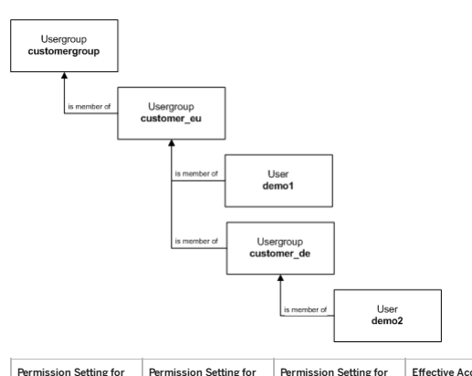

| Permission Setting for   | Permission Setting for   | Permission Setting for   | Effective Access Right   | Effective Access Right   |
|--------------------------|--------------------------|--------------------------|--------------------------|--------------------------|
| customergroup            | customer_eu              | customer_de              | for demo1                | for demo2                |
| granted                  | (no setting)             | (no setting)             | granted                  | granted                  |
| denied                   | (no setting)             | (no setting)             | denied                   | denied                   |
| granted                  | (no setting)             | denied                   | granted                  | denied                   |
| denied                   | granted                  | (no setting)             | granted                  | granted                  |
| denied                   | granted                  | denied                   | granted                  | denied                   |
| (no setting)             | granted                  | denied                   | granted                  | denied                   |
| (no setting)             | (no setting)             | granted                  | denied (default)         | granted                  |

## User Account As Member Of Several Individual User Groups

If user account is a member of several user groups not forming a hierarchy, then all permissions assigned to these user groups apply by inheritance to the user account. Again, deny setting for access rights rank higher than grant setting for access rights. It means that if the same access right (for example: read, change) is dened in a conicting manner by parent user groups being on the same hierarchy level, then the deny setting rank higher than grant setting.

This is   For more    the SAP Help  7

## Example

The user testuser is a member of both testgroup1 and testgroup2.

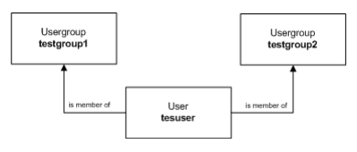

| Permission Setting for   | Permission Setting for   | Permission Setting for testuser   | Effective Access Right for   |
|--------------------------|--------------------------|-----------------------------------|------------------------------|
| testgroup1               | testgroup2               | testuser                          |                              |
| granted                  | (no setting)             | (no setting)                      | granted                      |
| denied                   | (no setting)             | (no setting)                      | denied                       |
| granted                  | (no setting)             | denied                            | denied                       |
| denied                   | granted                  | (no setting)                      | denied                       |
| denied                   | granted                  | denied                            | denied                       |
| (no setting)             | granted                  | denied                            | denied                       |
| (no setting)             | (no setting)             | (no setting)                      | denied (default)             |

## User Account As Member Of User Groups Which Form More Than One Hierarchy

In this section, we have a combination of the two following situations:
User account belongs to several user groups Some of the user groups form a hierarchy

## Example

The example shows a user account as a member of two user groups, one of which is part of a user group hierarchy. Deny access rights rank higher than grant access rights. If the same access right is dened in a conicting manner by user groups that are on the same hierarchy level, then the deny access rights rank higher than grant access rights.

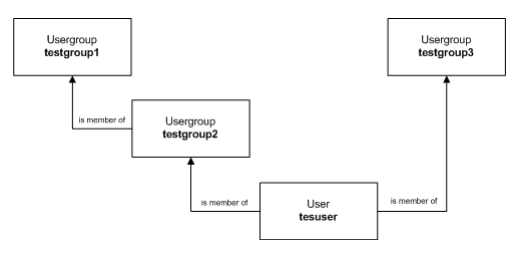

| 7/12/2024 Permission Setting for Permission Setting for   | Permission Setting for Permission Setting for   | Permission Setting for Permission Setting for   | Permission Setting for Permission Setting for   | Effective Access Right Effective Access Right   |
|-----------------------------------------------------------|-------------------------------------------------|-------------------------------------------------|-------------------------------------------------|-------------------------------------------------|
| testgroup1 testgroup1                                     | testgroup2 testgroup2                           | testgroup3 testgroup3                           | testuser testuser                               | for testuser for testuser                       |
| granted                                                   | (no setting)                                    | (no setting)                                    | (no setting)                                    | granted                                         |
| denied                                                    | (no setting)                                    | (no setting)                                    | (no setting)                                    | denied                                          |
| granted                                                   | (no setting)                                    | denied                                          | (no setting)                                    | denied                                          |
| denied                                                    | granted                                         | (no setting)                                    | (no setting)                                    | granted                                         |
| denied                                                    | granted                                         | denied                                          | (no setting)                                    | denied                                          |
| (no setting)                                              | granted                                         | denied                                          | granted                                         | granted                                         |
| (no setting)                                              | (no setting)                                    | granted                                         | (no setting)                                    | granted                                         |
| (no setting)                                              | (no setting)                                    | (no setting)                                    | (no setting)                                    | denied (default)                                |

The inheritance mechanism considers the closest inheritance levels.

## Related Information

Permissions in The Backoffice Framework

## Managing And Checking Access Rights

You can use the permission management service to manage access rights in SAP Commerce Cloud. Additionally, the permission checking service allows you to check the existing permission assignments on a particular user or user groups.

## Managing And Checking Access Rights

The permissions services is a framework that can be used to implement access rights system on the SAP Commerce Cloud Platform. By using the permissions services framework you can manage and check the access rights for users and user groups. You can assign, modify or remove permissions related to your users like employees and customers. You can also manage and check access rights assigned for the user groups. The framework has separate services for managing the access rights and checking what kind of access rights are assigned. For example, you may assign the different access rights for your employees who manage SAP Commerce Cloud and for the customers who visit your web shop. The employees who administer SAP Commerce Cloud need to assign, modify, or remove permissions. For this task, use the PermissionManagementService. On the other hand, customers who visit your web shop do not need to manage permissions and there is no need to give them access to the PermissionManagementService.

However, you may need to use the service that checks what the customer can see in your web shop. This is the task for PermissionCheckingService.

Access Rights should correspond to your security requirements, data model and organizational structure, and must be dened during design of your application, as a part of a security policy. In other words, you need to design and implement access rights system used by your application.

## Permission Services

Permission services described in this document focus on the permission assignment, which in most cases is a relation between:

Permission: Distinguished by its name Principal: User or user group Object: Item, type or an attribute to which the permission is assigned
The only exception are the global permissions, that are only assigned for the users. They should apply in those situations when no other, more specic access rights, are assigned to the items, types or attributes. The usual way to use permissions in the system is:

Assigning permission to user groups Checking permissions for single users
However, permission services allow also to assign permissions for the single users and check permissions for the user groups, if needed. This is because the methods in permission services take a PrincipalModel argument, which can be either a user or usergroup.

## Permissionmanagementservice

Responsible for managing permissions and permission assignments. Possible operations supported by this service are:
Creating new permissions

Listing available permissions Assigning permissions Replacing permissions Removing permissions
PermissionCheckingService PermissionCheckingService is used to check the effective permission assignments, in other words: effective user access rights.

## Permissioncrudservice

This is a convenience service that is a wrapper over PermissionCheckingService and provides checking operations for the four basic platform-dened permissions: Create, Read, Update, Delete (since CRUD).

## Other

PermissionCheckResult: Provides information whether the permission is granted or denied

PermissionCheckValue: Simple enumeration of dened permissions used by other services PermissionsConstants: Contains a list of pre-dened permissions PermissionAssignment: Object used by PermissionManagementService to return the information about the permission for the particular user or users group.

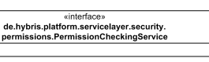

Figure: Permissions Services.

## Permissionmanagementservice

PermissionManagementService is used to dene and manage permission assignments. There are two basic operations for manipulating permissions without doing any assignments:
Create a new permission void createPermission(String permissionName);
Return a collection containing names of all dened permissions:
Collection<String> getDefinedPermissions();
There are no means to delete the permission, once it is created. Such an operation would require checking the entire database to ensure that the permission is not used anywhere. This could also lead to a hole in the security system. Since permissions are only distinguished by name, removing a permission and then adding another one with the same name makes the existing security audit logs useless.

## Creating Permission Assignments

To create the permission assignment, use PermissionAssignment object, which provides information whether the permission is granted for a principal, or denied. The principal is usually a usergroup, but it can be also a user. The following code snippet provides an example on how to grant permission A_PERMISSION to an item aCountry for a group aGroup.

//create a permission permissionManagementService.createPermission("A_PERMISSION");
This is   For more    the SAP Help  11
<!-- ... --> final CountryModel aCountry = ... final PrincipalModel aGroup = ... //create a permission assignment object which grants A_PERMISSION for aGroup final PermissionAssignment permissionAssignment = new PermissionAssignment("A_PERMISSION", aGroup); //create permission assignment to aCountry. permissionManagementService.addItemPermission(aCountry, permissionAssignment);
The next example shows how to deny A_PERMISSION to an item aCountry for an user anUser. The second constructor of PermissionAssignment class is used here to take explicit value for denied ag.

//create a permission permissionManagementService.createPermission("A_PERMISSION"); <!-- ... --> final CountryModel aCountry = ... final PrincipalModel anUser = ... //create a permission assignment object which denies A_PERMISSION for anUser final PermissionAssignment permissionAssignment = new PermissionAssignment("A_PERMISSION", anUser, //create permission assignment to aCountry. permissionManagementService.addItemPermission(aCountry, permissionAssignment);
There is also a addItemPermissions() method that enables to add multiple permission assignments to an item in one invocation. In the same way permission can be assigned to:
Attribute descriptors: By using addAttributePermission() or addAttributePermissions() methods

Item types: By using addTypePermission() or addTypePermissions() methods
Global permission assignments are even simpler. To create a global permission there is no need for any object. In the code sample, note PermissionAssignment constructor that takes explicit value of denied ag as false which means that permission is granted.

//create a permission permissionManagementService.createPermission("A_PERMISSION"); <!-- ... --> final PrincipalModel aGroup = ... //create a permission assignment object which grants A_PERMISSION for aGroup final PermissionAssignment permissionAssignment = new PermissionAssignment(TEST_PERMISSION_1, aGrou //assign the permission. permissionManagementService.addGlobalPermission(permissionAssignment);
Retrieving and Removing Permission Assignments The methods for getting and removing permission also use PermissionAssignment object. When retrieving this object provides the information about existing permission assignments. When removing, this object provides information which assignment is to be removed.

For details about the available methods, see API documentation for PermissionManagementService class.

## Permissioncheckingservice

Permission checking service provides the answer to questions of the following form:
Is a permission to an object granted for a principal? Is a permission granted for a principal globally?

The answers is returned for:
Given permission Principal Object Item Item type Attribute descriptor The answer is calculated out of the existing permission assignments created with the PermissionManagementService using permission checking rules. This way the answer provides information about actual permission assignments, that means, the permissions that were directly assigned. The combination of actual permission assignments and permission checking rules produce effective permission assignments. Effective permission assignments might not physically exist in the system, but are the effect of using checking rules. For example, if there is an actual permission assignment to a user group, then every member of the group has that permission effectively assigned. This happens because user group permissions are inherited by users who belong to the group. Permission checking rules take into account permission inheritance within principal group hierarchy and inheritance within type and attribute descriptor hierarchy. The rules also prioritize different kind of permission assignments. For example, global assignments have the lowest priority. To see more detailed description, check the API documentation for PermissionCheckingService.

The result of checking permission assignment can be one of the following constants dened by PermissionCheckValue:

## Allowed

Permission is granted for a principal DENIED Permission is explicitly denied for a principal

## Not_Defined

No actual permission assignment was found for the given permission checking operation

## Conflicting

Situation when there are both DENIED and ALLOWED equal-priority assignments for a principal The methods of PermissionCheckingService do not directly return PermissionCheckValue contants. When checking, it is much more convenient to get a single boolean yes or no answer. For that purpose a PermissionCheckResult interface is used as a result type. This interface gives acces to the raw checking results represented by a PermissionCheckValue enumeration. However, it also provides two convenience methods: isGranted() and isDenied(), which map PermissionCheckValue constants onto a boolean value. This mapping can be changed by using different PermissionCheckValueMappingStrategy. By default this strategy assumes that:
Only ALLOWED maps to true Other values map to false

## Use Cases

This section contains examples on checking permission for some most expected use cases. To fully understand these examples, check API documentation for PermissionCheckingService to nd more details about permission checking rules.

Assume that:

There is a permission READ_CATALOG dened User user1 is a member of group1 The following objects are dened:
CatalogModel catalog1 = ... CatalogModel catalog2 = ... PrincipalModel user1 = ... PrincipalModel group1 = ...

## Checking Item Permissions Within Principal Group Hierarchy

Code snippet shows how permissions to an item within principal group hierarchy can be checked.

boolean result; //The actual result is NOT_DEFINED, since no permission assignments has been done so far. result = permissionCheckingService.checkItemPermission(catalog1, user1, "READ_CATALOG").isGranted() result = permissionCheckingService.checkItemPermission(catalog2, user1, "READ_CATALOG").isGranted() /* * Let's deny "READ_CATALOG" globally for group1 */ permissionManagementService.addGlobalPermission(new PermissionAssignment("READ_CATALOG", group1, tr //The actual result is now DENIED because of global "READ_CATALOG" denial for group1 and principal result = permissionCheckingService.checkItemPermission(catalog1, user1, "READ_CATALOG").isGranted() result = permissionCheckingService.checkItemPermission(catalog2, user1, "READ_CATALOG").isGranted() /* * Let's grant "READ_CATALOG" for group1 to catalog1 */ permissionManagementService.addItemPermission(catalog1, new PermissionAssignment("READ_CATALOG", gr
//The result is now ALLOWED, although there is global denial for group1. This is because global ass
//have lower priority. result = permissionCheckingService.checkItemPermission(catalog1, user1, "READ_CATALOG").isGranted() //The result is still DENIED, because no permission assignment has been done to catalog2 to overrid // "READ_CATALOG" denial for group1. result = permissionCheckingService.checkItemPermission(catalog2, user1, "READ_CATALOG").isGranted()

## Assigning Type Permissions

Building on the example in the previous section, permission assignments to the type can be used as shown in the code sample below.

ComposedTypeModel catalogType = ... permissionManagementService.addTypePermission(catalogType, new PermissionAssignment("READ_CATALOG", //The result is still ALLOWED, because of permission assignment to catalog1. Type permission assign // of lower priority, // so it does not change anything. result = permissionCheckingService.checkItemPermission(catalog1, user1, "READ_CATALOG").isGranted() //The result is now ALLOWED, because permission assignment to catalog type overrides global "READ_C //denial for group1. result = permissionCheckingService.checkItemPermission(catalog2, user1, "READ_CATALOG").isGranted()
This is   For more    the SAP Help  14 For more sophisticated examples, check the PermissionCheckingServiceTest, where the permission checking rules are tested for various scenarios.

## Best Practices And Tips

Permissions are not automatically enforced. This means that your code must invoke a method or two from PermissionCheckingService and then act accordingly in order to have a permission-based security. By default, everything is denied. Assign permissions for the user groups. Every member of the group inherits the permission assignments. This work across the group hierarchy. Assign permissions to the types. Every item of that type will inherit this permission assignments. This works across type hierarchy. Use attribute descriptor assignments for ne-grained control of the attribute values.

Use global permission assignments as a fall-back or default assignment. The global permissions have the lowest priority and are always overriden by the item, type, or attribute permissions assignments. Design your permissions schema and keep it simple.

## Known Limitations

You cannot search for the effective permission assignments using Flexible Search like: return all items that have a permission XYZ granted for principal P. The reason is that the effective permission assignments are calculated, and there is no easy way for the database server to perform such calculations when retrieving item rows from the database. This also means that permissions cannot be used for ltering rows in the data access layer.

Since permission assignments are currently not represented by models, you cannot directly import them using the ImpEx scripts. The only way is to use PermissionManagementService from ImpEx using scripting.

## Related Information

Users in Platform

## Cross-Origin Resource Sharing Support

SAP Commerce Cloud supports the Cross-Origin Resource Sharing mechanism. The CORS mechanism denes a way for a browser and a server to decide which cross-origin requests for restricted resources can or cannot be allowed.

Imagine a script on http://www.example.com/somepage.html wanting to access resources from https://www.example.com:87/resources. Your browser considers these two addresses as two different origins and it will prevent the /somepage.html script from fetching the resources from /resources. It is possible to safely relax this limitation by preparing CORS congurations in such a way that the /somepage.html request will be accepted.

## Enabling Cors Support In Sap Commerce Cloud Extensions

To enable CORS support in SAP Commerce Cloud extensions, include these sections in the [extname]-web-spring.xml les of chosen extensions.

## Extname-Web-Spring.Xml

<bean id="extnamePlatformFilterChain" class="de.hybris.platform.servicelayer.web.PlatformFilterChai
<constructor-arg>
<list>
<ref bean="corsFilter"/> [...]
This is   For more    the SAP Help  15

</list>
</constructor-arg>
</bean>

## Conguring Cors In Sap Commerce Cloud Web Applications Global Cluster Conguration

The CORS conguration is stored in the database inside CorsConfigurationProperty items. It is global and applies to all nodes connected to a cluster. To edit your conguration, in Backoffice go to System CORS Filter CorsCongurationProperty and create or modify instances of the CorsConfigurationProperty type.

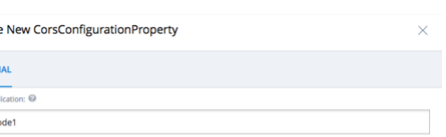

As a context use the name of your extension - we use webAppName in this document as an example. As a key, use one of the

available properties.

| CORS Header   | CorsCongurationProperty   | Default Value   | Description                                                                                                                               |
|---------------|---------------------------|-----------------|-------------------------------------------------------------------------------------------------------------------------------------------|
| Access-Control-AllowOrigin               | allowedOrigins            | null            | List of hosts that can receive CORS response from your extension.                                                                         |
| Access-Control-AllowMethods               | allowedMethods            | GET HEAD        | List of the supported HTTP methods.                                                                                                       |
| Access-Control-AllowHeaders               | allowedHeaders            | null            | The names of the supported author request headers.                                                                                        |
| Access-Control-ExposeHeaders               | exposedHeaders            | null            | List of the response headers other than simple response headers that the browser should expose to the author of the cross-domain request. |
| Access-Control-AllowCredentials               | allowCredentials          | null            | Indicates whether the user credentials, such as cookies, HTTP authentication, or clientside certicates, are supported.                                                                                                                                           |

| 7/12/2024 CORS Header   | CorsCongurationProperty   | Default Value   | Description                                                                                                                            |
|-------------------------|---------------------------|-----------------|----------------------------------------------------------------------------------------------------------------------------------------|
| Access-Control-Max-Age  | maxAge                    | null            | Indicates how long the results of a preight request can be cached by the web browser, in seconds. If -1 - unspecied.                   |
| Access-Control-AllowPatterns                         | allowedOriginPatterns     | false           | Alternative to allowedOrigins that supports more exible origins patterns with "*" anywhere in the host name in addition to port lists. |

It is not allowed to use the combination of the allowCredentials=true and allowedOrigins=* attributes. Use allowedOriginPatterns instead.

## Use Xss Lter To Set The Header

Add Access-Control-Allow-Origin in the response header as, xss.filter.header.Access-Control-Allow-Origin=<\#domain name\#>
You must replace the domain name with the actual domain. Enter * to allow access from all domains.

Local Node Conguration To congure CORS in a SAP Commerce Cloud extension, use these properties:

## Project.Properties

corsfilter.webAppName.allowedOrigins=http://localhost:8080 corsfilter.webAppName.allowedMethods=GET PUT POST DELETE

## Caution

Properties from the database take precedence before local properties. If a property with the same context and key is congured both in the database and the properties le, the value is taken from the database.

## Default Conguration

When no CORS properties are dened, all CORS requests are rejected.

## Https Traffic Certicate

SAP Commerce Cloud handles the HTTPS traffic using a certicate signed by a self-signed RootCA.

## Caution

Since the private key is known, this approach is intended only for the development environments.

Platform trusts this RootCA by default so it is possible to access an HTTPS resource from Platform itself.

This is   For more    the SAP Help  17

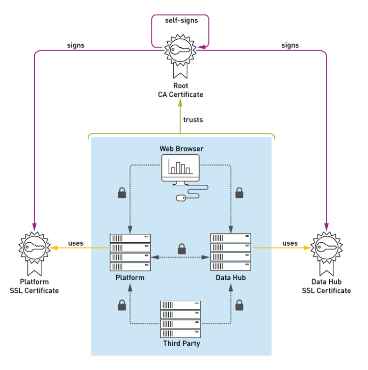

Sample SSL certificates are provided for developer environments and allow you to use localhost only. Those certificates should be disabled in production environments. You can disable them by setting empty values to the following properties in your local.properties file:
additional.javax.net.ssl.trustStore=
additional.javax.net.ssl.trustStorePassword=

## Implementing Encoding Algorithms With The Generic Password Encoder

This is custom documentation. For more information, please visit the SAP Help Portal With the Platform, you can implement additional PasswordEncoder interfaces by using the GenericSaltedPasswordEncoder class. This feature enables you to add additional encoding algorithms into the Platform without the need to manually create a custom class for your algorithm.

## Introduction

By default, the Platform implements the MD5, SHA-256 and SHA-512 algorithms. If you want, you can use the new feature to add any of the Java supported MessageDigest algorithms. For details, see Java Cryptography Architecture Standard Algorithm Name Documentation .

## Implementing Messagedigest Algorithms

To implement an algorithm, in the core-spring.xml le congure the GenericSaltedPasswordEncoder class as a spring bean with the algorithm parameter. Use genericPasswordEncoder as a parent for that bean. As the parameter's value set one of the available MessageDigest algorithms. Use the following example of implementing the SHA-384 algorithm to implement other MessageDigest algorithms:
1. In the **platform/ext/core/resources/core-spring.xml** le, declare a bean and set "SHA-384" for the value attribute :
<bean id="sha384PasswordEncoder" parent="genericPasswordEncoder"> <property name="algorithm" value="SHA-384"/> </bean>
2. Add this entry into the encoders map in the core.passwordEncoderFactory bean:
platform/ext/core/resources/core-spring.xml
<bean id="core.passwordEncoderFactory" class="de.hybris.platform.persistence.security.Password <property name="encoders"> <map> <!-- ... --> <entry> <key> <value>sha-384</value> </key>
 <ref bean="sha384PasswordEncoder" />
 </entry> </map> </property> </bean>
You must restart the Platform to apply the changes.

## Caution

The MD5 Message-Digest Algorithm is not considered strong anymore.

## Password Autocomplete

The autocomplete function gives you suggestions while you type your login and password into the eld. It allows you to quickly provide the credentials for different users, for example while testing your software.

Password Autocomplete in SAP Commerce Cloud The login and password autocomplete feature is disabled on a global level in SAP Commerce Cloud. However, on the cockpit level it is turned on, meaning that the global settings are overwritten by these ones specied in the extension project.properties le. You can nd an example of login and password autocomplete setting enabled in the project.properties le for SAP Commerce Cloud Product Cockpit. The project.properties le is located in the
${HYBRIS_BIN_DIR}/modules/cockpit-applications/deprecated/productcockpit/ folder.

productcockpit.default.login=<login> productcockpit.default.password=<password>

## Disabling Password Autocomplete

For security reasons, you might want to disable Password Autocomplete. Do it on the cockpit level by deleting the values for the following properties in your extension project.properties le:
\# Default login and password for logging into your cockpit: <yourcockpitname>.default.login= <yourcockpitname>.default.password=

## Password Change Auditing

The password change auditing feature lets you register all the changes introduced to your passwords. You can track changes such as the time a password changed, or who changed it. Additionally, password change auditing lets you store the hash and the encoding type of the previous password. Data about changes is stored in UserPasswordChangeAudit items.

## Enabling Password Change Auditing

To enable password change auditing, set the user.audit.enabled property to true:
\# enables user audit of password changes user.audit.enabled=true On the model service side, it is the UserPasswordChangeAuditPrepareInterceptor that provides the logic responsible for recording password changes. On the Jalo side, the logic is executed inside the setPassword method of a User object.

## Extending Scope Of Audit

To extend the scope of audited information, you need to extend the UserPasswordChangeAudit class with the additional attributes you want to store. To set values for these attributes, you can use the processAfterCreation extension point of UserAuditFactory. The rst step is to extend de.hybris.platform.servicelayer.user.impl.UserAuditFactory, and override the processAfterCreation method. Then, you must overwrite the userAuditFactory bean.

## Password Security Policies

SAP Commerce Cloud Platform provides customizable extension points that enable you to have ne control of password handling. With password security policies, you can dene requirements that your passwords must meet before you can set or change them. This feature tremendously contributes to increasing Platform security.

This is   For more    the SAP Help  20

## 

Regex and blacklist are two out-of-the-box password security policies delivered with Platform. Regex prevents users from using passwords that could be too easy to crack. Blacklist bans the most common passwords. You can implement your own policies too.

SAP Commerce Cloud Platform automatically handles the password security policies for Backoffice. If you want to enable this feature for customers, implement appropriate password policy handling in your storefront.

## Implementation

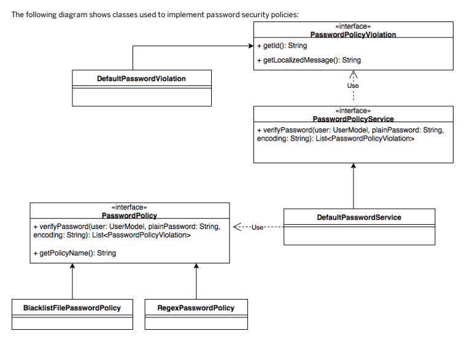

The PasswordPolicyService interface provides the verifyPassword method that checks whether your password matches dened policy requirements. If your password doesn't violate the requirements, an empty collection is returned. If it does violate, verifyPassword returns a list with PasswordPolicyViolation objects. Each violation has its unique id. You can obtain those ids calling the getId method.

PasswordPolicyService is used every time you set a new password, no matter if via Service Layer, or Jalo. In Service Layer, you change a password by calling the setPassword method on the UserService bean. DefaultUserService delegates a check to PasswordPolicyService, and throws PasswordPolicyViolationException if a new password doesn't fulll requirements. The same check takes place inside the setPassword method on a User Jalo object. Nevertheless, the recommended way to validate user input for a new password is to call verifyPassword explicitly, and set the password only if no violations are returned.

The PasswordPolicyViolation interface provides the getLocalizedMessage method that returns localized violation messages. You can use these messages to provide feedback for users in the view layer.

## Assigning Password Policies To User Groups

Password policies aren't enabled for any user group unless you congure them. To enable an example policy named foo for user groups group1 and group2, set the following property as shown:
password.policy.foo.groups.included=group1,group2 You can also use the * character as a wildcard - it matches all user groups and thus enables a given policy for everyone in the system. To exclude users when using a wildcard, use the excluded property:
\# match all groups except excluded_group for foo policy password.policy.foo.groups.included=* password.policy.foo.groups.excluded=excluded_group

## Available Password Policies

Platform comes with two out-of-the-box implementations of password policies:

| Password policy name   | Implementation class                                                                                   | Bean                    | Description                 |
|------------------------|--------------------------------------------------------------------------------------------------------|-------------------------|-----------------------------|
| regex                  | de.hybris.platform.servicelayer.user.impl.RegexPasswordPolicy                                          | regexPasswordPolicy     | Matches a set of required a |
| (user-spring.xml)      | regular expressions dened against a password                                                           |                         |                             |
| blacklist              | de.hybris.platform.servicelayer.user.impl.BlacklistFilePasswordPolicy                                  | blacklistPasswordPolicy | Checks password against a   |
| (user-spring.xml)      | prohibited passwords den le available on classpath the password.policy.bla property in platform/projec |                         |                             |

## Regex Password Policy

The regex password policy allows you to congure a set of rules based on regular expressions. For example, you can decide that your passwords are at least 8 characters long and include at least one digit. These rules can either be required or disallowed:

| Type       | Property                          | Description                               |
|------------|-----------------------------------|-------------------------------------------|
| Required   | password.policy.regex.required.   | Regular expression must match against a   |
| [rule_id]  | new password                      |                                           |
| Disallowed | password.policy.regex.disallowed. | Regular expression must not match against |
| [rule_id]  | a new password                    |                                           |

Replace the [rule_id] placeholder with an assigned unique password violation id. This text is returned by the getId method.

It's also used to nd proper localization text for the getLocalizedMessage method.

See the example of dening regex rules:
\# enforces passwords to be between 6 and 128 characters password.policy.regex.required.certainsize=.{6,128}
This is   For more    the SAP Help  22

\# enforces passwords to contain digit password.policy.regex.required.mustcontaindigit=.*\\d+.* \# prohibits from setting '12345678' as a password password.policy.regex.disallowed.not12345678=12345678 To provide localization texts for these rules, create password.policy.violation.regex.required.[rule_id] or password.policy.violation.regex.disallowed.[rule_id] keys with translation in resources/localization/[extension]-locales_en.properties bundle.

See how you can provide localization for rules dened in the previous example:
password.policy.violation.regex.required.certainsize=Password must contain between 8 and 128 charac password.policy.violation.regex.required.mustcontaindigit=Password must contain at least 1 digit. password.policy.violation.regex.disallowed.not12345678=Using '12345678' as the password is not allo password.policy.violation.blacklist.blacklistedpassword=Selected password is a blacklisted.

## Blacklist Password Policy

Blacklist password policy allows you to specify a le that contains a list of passwords (one password per line) that aren't allowed. To specify a blacklist le name, set the password.policy.blacklist.file property with a name of the le available on the classpath.

For example, this setting allows you to use the password-blacklist.txt le stored in an extension resources folder:
password.policy.blacklist.file=password-blacklist.txt

## Creating Custom Password Policies

To create a custom password policy, create a bean that implements the PasswordPolicy interface.

DefaultPasswordPolicyServices uses autowiring by type so it detects a custom implementation available to use. Assign your policy to appropriate groups. A policy name is a string returned by the getName method. Remember to obey the contract and provide password policy violations with correct translations.

## Password Storage Strategies

When saving user passwords, it is important to protect them against unauthorized access. For that reason, Platform always stores passwords in an encoded format. You can choose from multiple encoding strategies (known as password encoders) available. In addition, you can implement your own strategies.

## Strategies

Currently, Platform is shipped with the following strategies:

bcrypt - a default strategy supporting legacy systems Argon2id - a strong, recommended strategy scrypt - a strong, recommended strategy
This is   For more    the SAP Help  23

PBKDF2 is deprecated but can be used by way of exception if FIPS-140 compliance is required.

Plain text, MD5, SHA-256, and SHA-512 are deprecated as not safe.

## Change The Default

Instead of specifying the strategy, some APIs allow you to set passwords using a default strategy. The default strategy in Platform is bcrypt. You can change it if necessary through the <default.password.encoding> property. Here is an example showing how to switch from the default bcrypt strategy into Argon2id:
\# \# The code of the password encoder to use as default. These are the available options (from core-sp \# \# '*' .. legacy 'default' mapping to 'plain' (not changeable before 5.7 - do not use anymore) \# 'plain' .. plain text \# 'sha-256' .. SHA 256 \# 'sha-512' .. SHA 512 \# 'md5' .. MD5 (for legacy reasons - do not use in production) \# 'pbkdf2' .. PBKDF2 (strong and configurable) \# 'bcrypt' .. (strong and configurable; a current default for FIPS compliance purposes) \# 'scrypt' .. (strong and configurable; one of the OWASP-recommended strategies) \# 'argon2' .. (strong and configurable; most recommended by OWASP) \#\#default.password.encoding=bcrypt \#default.password.encoding=argon2 This way of changing the default strategy preserves previously stored passwords created using the default strategy. If the previous strategy was unsafe, all passwords using it are unsafe as well.

## Congure New Generic Strategy

Adding a new password hashing strategy is now made easy by providing a generic implementation that just requires you to specify the hashing algorithm. Refer to Implementing Encoding Algorithms with the Generic Password Encoder to nd out how to do it.

## Implement Your Own Strategy

It is also possible to implement and add a custom password hashing strategy:
public class DummyEncoder implements PasswordEncoder { @Override public String encode(final String uid, final String plain) { return Integer.toString(plain.hashCode()); }
This is   For more    the SAP Help  24
 @Override public boolean check(final String uid, final String encoded, final String plain) { return encoded.hashCode() == plain.hashCode(); } @Override public String decode(final String encoded) throws EJBCannotDecodePasswordException { throw new EJBCannotDecodePasswordException(new Throwable("Dummy encoded passwords ca } }
Now add the implementation via Spring:
<bean id="dummy" class="foo.bar.DummyEncoder"/> <bean id="core.passwordEncoderFactory" class="de.hybris.platform.persistence.security.PasswordEncod <property name="encoders"> <map> <!-- Attention: Ensure to preserve the built-in encoders. If you remove or change them, the existing passwords will be lost !!! --> <entry key="*" value-ref="${default.password.encoder}" /> <entry key="plain" value-ref="core.plainTextEncoder" /> <entry key="sha-256" value-ref="sha256PasswordEncoder" /> <entry key="sha-512" value-ref="sha512PasswordEncoder" /> <entry key="md5" value-ref="core.saltedMD5PasswordEncoder" /> <entry key="pbkdf2" value-ref="pbkdf2PasswordEncoder" /> <entry key="argon2" value-ref="argon2PasswordEncoder"/> <entry key="scrypt" value-ref="scryptPasswordEncoder"/> <entry key="bcrypt" value-ref="bcryptPasswordEncoder"/> <!-- the new one --> <entry key="dummy" value-ref="dummy" />
 </map>
 </property> </bean>
See above to nd out how to change the default so you can use the new strategy.

## Localize Labels For Encoders

To localize a Backoffice label for a newly created encoder, add an appropriate entry to the labels.properties le located in the *<YOUR_EXTENTION>*/resources/*<YOUR_EXTENTION>*-backoffice-labels directory. This entry should match the following pattern:
hmc.encrypt_<encoder>=*<localized encoding name>*
The encoder should match the key property in the core.passwordEncoderFactory bean in the ext/core/resources/core-spring.xml directory, for example:
hmc.encrypt_bcrypt=BCrypt If you need a quick and dirty solution, you can put this entry into the resources/platformbackoffice-backofficelabels/labels.properties le in the platformbackoffice extension, however, we don't recommend modifying this le.

## One-Time Password

SAP Commerce Cloud supports the functionality of creating and validating one-time passwords. These passwords can be used in various scenarios.

This page may contain information about features that were only introduced in an update release. Ensure you are always on the latest release to be able to make use of all xes, security updates, and features. For a complete list of what was introduced in each update release, see What's New.

## Customer Login With One-Time Verication Token

You can enhance security using the one-time password functionality. To enable one-time passwords for customers when logging into composable storefronts:
Update your composable storefront codebase and enable the one-time password functionality for customers. For more information on how to do this, see Activating Customer Login with Verication Token.

When one-time verication token for customer login is enabled, the Customer User token can be retrieved from the Commerce Authorization Server only with the one-time password <Token Id> provided as <username> and one-time password <Token Code> provided as <password>. To be able to fetch a user token you rst have to create a one-time login password for that Customer. After fetching one-time password <Token Id> from the OCC API and receiving <Token Code> in an email, you can request a Customer Token with the following command:
curl --location --request POST 'https://<COMMERCE_CLOUD_BACKOFFICE_URL>/authorizationserver/oauth/t --header 'Accept: application/json, text/plain, */*' \ --header 'Authorization: Basic <BASE64_ENCODED_OAUTH_CLIENT_CREDENTIALS>' \ --header 'Content-Type: application/x-www-form-urlencoded' \ --header 'X-Requested-With: XMLHttpRequest' \ --data-urlencode 'grant_type=password' \ --data-urlencode 'scope=basic' \ --data-urlencode 'username=<TOKEN_ID>' \ --data-urlencode 'password=<TOKEN_CODE>'
For more information, see Overriding Default API Endpoint Conguration.

One-time password for customer login functionality only affects Customer type Users. Employee type Users are not affected and should authenticate/fetch tokens in a standard way using their credentials.

## Preventing Brute Force Attacks

Using the otp.customer.login.token.max.verification.attempts property, you can set the maximum number of failed login attempts for a one-time token. If the maximum number of failed login attempts is reached, the specic one-time token can no longer be used to authenticate as it was removed. By default, the token is removed after the third failed attempt.

You can override it in local.properties, as shown in the example:
This is   For more    the SAP Help  26 otp.customer.login.token.max.verification.attempts = 5 The Customer login one-time password functionality can be adjusted by overriding the default conguration properties, described below:
\# Specifies if the one time password (OTP) functionality is enabled for customer login otp.customer.login.enabled = false
\# Specifies the token encoder to be used for one time password code encoding functionality, see the otp.customer.login.token.code.encoder = pbkdf2 \# When OTP is enabled allows to specify the length of verification tokens for OTP login functionali \# the minimum allowed value is 6 characters, maximum allowed value is 34 characters otp.customer.login.token.code.length = 8 \# When OTP is enabled allows to set a specific character set with which the code for the OTP login \# The minimal charset length should be 10 characters. If the provided charset is shorter, the defau otp.customer.login.token.code.alphabet = 1234567890ABCDEFGHKLMNPRSTUWXYZabcdefghijklmnoprstuwxyz \# When OTP is enabled allows to specify time to live in seconds for the OTP login functionality \# the maximum allowed value is 900 seconds (15 minutes), minimum allowed value is 60 seconds otp.customer.login.token.ttlseconds = 300 \# Specifies the maximum number of failed verification attempts for a single token, after which the \# 1 means that the token is removed after the first failed verification attempt ( no retries allowe otp.customer.login.token.max.verification.attempts = 3 \# Number of bits used to generate the random part of the token id for the one time password (OTP) l \# The minimum allowed value is 128 bits. Its recommended to use at least 256 bits. Max value is 102 otp.customer.login.token.id.generator.bits = 256 \# This short name is used to quickly identify the tokens generated for the OTP login functionality. \# The token id format is <{shortName}[{randomPart}]> \# The short name should be unique for initial verification purpose and kept short (max 10 character \# If the short name exceeds 10 characters, it will be fallback to default 'OTH' (other) short name. otp.customer.login.token.purpose.short.name = LGN

## Leveraging One-Time Password Feature

One-time passwords can be easily reused for other scenarios. To do so, you can dene the new purpose of the one-time password by:

Extending de.hybris.platform.core.enums.SAPUserVerificationPurpose in *-items.xml with a new purpose, for example REGISTRATION, ORDER or other.

Use the de.hybris.platform.servicelayer.user.UserVerificationTokenService to create, lookup, and handle one-time token verication in your business logic.
Each de.hybris.platform.core.enums.SAPUserVerificationPurpose can have a custom set of additional conguration properties dened. Here's an example of a sample set of custom properties for the new REGISTRATION verication purpose type:
\#\# The recipe for configuring new OTP purpose functionality is to create a set of properties accord \#\# The same safe defaults as for customer login OTP are used for other OTP functionalities. \#\# Lets see this on example set of properties for customer registration OTP after REGISTRATION code \#otp.customer.registration.enabled = false \#otp.customer.registration.token.code.encoder = pbkdf2 \#otp.customer.registration.token.code.length = 8 \#otp.customer.registration.token.code.alphabet = 1234567890ABCDEFGHKLMNPRSTUWXYZabcdefghijklmnoprst \#otp.customer.registration.token.ttlseconds = 300 \#otp.customer.registration.token.max.verification.attempts = 3 \#otp.customer.registration.token.id.generator.bits = 256 \#otp.customer.registration.token.purpose.short.name = REG
If some property value isn't provided for a new verication purpose type, the default value is applied.

## Related Information

Flows Verication Token Overriding Default API Endpoint Conguration

## Protecting Against Cross-Site Scripting

Inadequately protected web applications are exposed to cross-site scripting (XSS) attacks.

XSS attacks are aimed at end users and are possible after a malicious code is sent to and executed by end users' web browsers. This code can be sent in the form of a web page link or through a web application into which it was previously injected. For example, an attacker can inject a malicious code into an unprotected online store and its database by leaving a comment about a product. If not stripped or encoded, the code will be executed after being displayed in end users' web browsers. Depending on the code's purpose, it might enable the attacker to access the end users' private information such as cookies or passwords they use in a given web application.

## The Xss Encoder

The **security.core.server.csi-1.00.8.jar** library encodes different kinds of content and helps prevent XSS attacks from malicious data being stored inside the Platform database.

| Context    | Method                                                            |
|------------|-------------------------------------------------------------------|
| HTML / XML | out = XSSEncoder.encodeHTML( in ) and XSSEncoder.encodeXML( val ) |
| JavaScript | out = XSSEncoder.encodeJavaScript( val )                          |
| URL        | out = XSSEncoder.encodeURL( val )                                 |
| CSS        | out = XSSEncoder.encodeCSS( val )                                 |

The library was added to the hybris ext/core/lib folder. The following methods are available to prevent XSS.

For more information, see:
SAP Encoding Functions for AS Java and JavaScript

Output Encoding Contexts

## Web Security Xssfilter

XSSFilter is a simple generic cross-site scripting protection lter for the Platform.

Under normal operation, enabling the lter adds an average overhead of 50 ms per page requests in a performance testing environment. When the number of requests reaches the limit of the system capacity, the response time may increase signicantly.

XSSFilter can be enabled or disabled. By default, the lter is enabled, and SAP recommends that it remains enabled.

XSSFilter doesn't handle HTTP request bodies. It lters request parameters and headers only.

## Conguring Xssfilter

You can nd a set of modiable properties included in platform/project.properties:
\#\#\#\#\#\#\#\#\#\#\#\#\#\#\#\#\#\#\#\#\#\#\#\#\#\#\# WEB-SECURITY SETTINGS \#\#\#\#\#\#\#\#\#\#\#\#\#\#\#\#\#\#\#\#\#\#\#\#\#\#\#\#\#\#\#\#\#\#\#\#\#\# \# 
\# Here web related security settings can be found. 

\# \#\#\#\#\#\#\#\#\#\#\#\#\#\#\#\#\#\#\#\#\#\#\#\#\#\#\#\#\#\#\#\#\#\#\#\#\#\#\#\#\#\#\#\#\#\#\#\#\#\#\#\#\#\#\#\#\#\#\#\#\#\#\#\#\#\#\#\#\#\#\#\#\#\#\#\#\#\#\#\#\#\#\#\#\#\#\#\# \# enable globally xss.filter.enabled=true \# define action on violation matching globally \# STRIP .. strips all text occurrences which match the patterns below but allow \# processing the request (default) \# REJECT.. if any pattern matches the whole request gets rejected with the BAD REQUEST \# error code xss.filter.action=STRIP \# our default rules xss.filter.rule.script_fragments=(?i) xss.filter.rule.src=(?ims)[\\s\r\n]+src[\\s\r\n]*=[\\s\r\n]*'(.*?)' xss.filter.rule.lonely_script_tags=(?i)</script> xss.filter.rule.lonely_script_tags2=(?ims) xss.filter.rule.src=(?ims)[\\s\r\n]+src[\\s\r\n]*=[\\s\r\n]*'(.*?)' xss.filter.rule.lonely_script_tags=(?i)</script> xss.filter.rule.lonely_script_tags2=(?ims)<< patterns: { (?i) (?i)</script> (?ims)<< patterns: { (?i)</script> (?ims) } output: >>abc<<
You can see that the patterns are the same in both lists but the outcomes differ because the patterns are ordered differently. Without sorting, pattern denitions are provided in an undened order. You can, however, order lters and rules in your list by sorting them alphabetically. See the example:
xss.filter.rule.001_script_fragments=(?i) xss.filter.rule.002_src=(?ims)[\\s\r\n]+src[\\s\r\n]*=[\\s\r\n]*'(.*?)' xss.filter.rule.003_lonely_script_tags=(?i)</script> xss.filter.rule.004_lonely_script_tags2=(?ims)<script(.*?)>
In this way you make sure you get the outcome you aim for.

Ordering lter rules alphabetically is disabled by default. To enable it, set:
xss.filter.sort.rules=true To override it per extension, set:
[extension_name].xss.filter.sort.rules=false

## Servlet 3.0

In Servlet 3.0 containers (Tomcat 7) there may be servlets making use of asynchronous processing. In that case make sure that the lter is congured to support that by adding <async-supported>true</async-supported>:
<filter> <filter-name>XSSFilter</filter-name> <filter-class>de.hybris.platform.servicelayer.web.XSSFilter</filter-class> <async-supported>true</async-supported> </filter>
Libraries The lter is part of the platform global classpath. Therefore, you do not need to add any library to your platform web application.

## Injecting Static Http Response Headers

You can congure SAP Commerce Cloud to inject static headers into HTTP response. To inject headers globally, that is for all SAP Commerce Cloud web applications, use:
xss.filter.header.[header name]=[header value]
This property can also be set for a specic web application only. To set it, prex the parameter with a web application name.

[webapp name].xss.filter.header.[header name]=[header value]
For example, you may want to add X-Frame-Options to all SAP Commerce Cloud web applications to prevent clickjacking. The X-
Frame-Options header is used only as an example - it is already set to SAMEORIGIN by default. You need to add the following parameter to the local.properties le.

xss.filter.header.X-Frame-Options=SAMEORIGIN
However, if you would like to add this header only for a web application "foo", you would have to add the parameter with the key prexed with the application name.

foo.xss.filter.header.X-Frame-Options=SAMEORIGIN

## Content Security Policy Response Headers

Use content security policy headers to ensure improved security of SAP Commerce Cloud.

This page may contain information about features that were only introduced in an update release. Ensure you are always on the latest release to be able to make use of all xes, security updates, and features. For a complete list of what was introduced in each update release, see What's New.

Content Security Policy headers are HTTP response headers that mitigate the risk of code-injection vulnerabilities, such as XSS or clickjacking. They allow you to specify resources that a browser can render when your customers access your application. SAP Commerce Cloud includes Content Security Policy response headers in web applications of the following extensions:
adminapi,

hac, oauth2, processing, samlsinglesignon, testweb,
This is   For more    the SAP Help  32 yempty.

See the default conguration of Content Security Policy headers:
adminapi: default-src 'self'; style-src 'self' 'unsafe-inline'; img-src 'self' data:; script-src 's hac: default-src 'self' https://license.hybris.com/store; style-src 'self' 'unsafe-inline'; img-src oauth2: default-src 'self'; style-src 'self' 'unsafe-inline'; img-src 'self'; script-src 'self' 'un processing: default-src 'self'; style-src 'self' 'unsafe-inline'; img-src 'self'; script-src 'self' samlsinglesignon: default-src 'self'; style-src 'self' 'unsafe-inline'; img-src 'self'; script-src testweb: default-src 'self'; style-src 'self' 'unsafe-inline'; img-src 'self'; script-src 'self' 'u yempty: default-src 'self'; style-src 'self' 'unsafe-inline'; img-src 'self'; script-src 'self' 'un

## Creating Custom Content Security Policy Response Headers

Create custom Content Security Policy headers to improve the security of your application. Use the following property to create your custom Content Security Policy response headers:
<extname>.xss.filter.header.Content-Security-Policy=
Use the following pattern to set policy directives:
policy-directive value1 value2 ... value_n Separate policy directives with semicolons (";"). See an example of a custom header:
<extname>.xss.filter.header.Content-Security-Policy=default-src 'self'; style-src 'self'

## Remember Me Feature

Platform supports the Remember Me feature so that users can log on to the application without the need to provide their credentials every time they access it.

Platform uses a cookie-based login token (LoginToken) to authenticate users whose credentials have been stored by the Remember Me feature. The token uses the CoreRememberMeService class that implements the Spring RememberMeServices class interface.

## Enhanced Login Token Generation

Using cookie-based login tokens has been enhanced as the following information is added to their value:

their TTL (Time to Live) timestamps that are further veried on the server side. If the value of the timestamp has expired, the user isn't authenticated. a randomly generated salt that is used for password rehashing. a randomly generated value that is stored in the database for each user
The randomly generated value can be revoked. As a result of such revocation, all cookie-based login tokens generated for users become invalid and users can't be authenticated through the old token. To revoke user tokens, use the de.hybris.platform.jalo.user.TokenService interface and the dedicated revokeTokenForUser(final String userId) method. The default implementation (DefaultTokenService) replaces random values with new ones.

This is   For more    the SAP Help  33 If you want to turn off the default behavior of the enhanced login token generation, add the following property to your local.properties le:
login.token.extended=false

## Caution

Due to security reasons, it's not recommended to disable this behavior.

## Accepting Login Tokens As Url Parameters

Login tokens aren't accepted as URL parameters. However, if you want to enable such login tokens, add the following property to your local.properties le:
login.token.url.enabled=true Caution Due to security reasons, it's not recommended to enable this behavior.

## Disabling Authentication Through Login Tokens

You can disable authentication through login tokens by adding the following property to your local.properties le:
login.token.authentication.enabled=false If you want to disable login token authentication for given web applications, use the login.token.authentication.

[extensionName].enabled=false property, for example:
login.token.authentication.backoffice.enabled If the property is not set for given web applications, the value of the login.token.authentication.enabled is used. See an example of a setting that enables authentication with login tokens for Backoffice and disables it for Administration Console:
login.token.authentication.hac.enabled=false login.token.authentication.backoffice.enabled=true login.token.authentication.enabled=false

## Setting Basic Authentication In Core Plus Services

This document explains how to set up basic authentication between SAP Commerce Cloud and Core+ services, and, more specically, between SAP Commerce Cloud and Core+-based REST clients.

## Suggested Reading

For more information on basic authentication, refer to the documentation provided on the Tomcat website at http://tomcat.apache.org/tomcat-7.0-doc/realm-howto.html .

## Transparent Attribute Encryption (Tae)

This is   For more    the SAP Help  34 To encrypt sensitive data transparently, SAP Commerce Cloud supports you in declaring a String-Attribute as encrypted just by adding the modier encrypted="true" in the items.xml le of your extension.

## Why Encryption?

You built a secure system, encrypted the most sensitive data, and built a rewall around the database servers. But the thief took the easy approach: They took the backup tapes of your database. Protecting the database data from such theft is not just good practice; it's a requirement for compliance with most laws, regulations, and guidelines. Consequently, encryption lets you protect your database from this vulnerability.

## How It Works

The rst layer of defense is the rewall around the whole information infrastructure of your organization, which keeps outsiders from accessing any of the information sources inside your company. If an intruder gets past the external rewall, that person will be required to supply a password to access the server or perhaps be asked to provide other authentication credentials such as security certicates. This is the second layer of security. After being authenticated, the legitimate user must only be allowed to access those assets that person is supposed to access. If a user gets into the database but has no authority to see any table, view, or any other data source, the information is still protected. This mechanism is the next layer of security. Some security-related compliancy regulations stress that it is possible for an intruder to somehow defeat all of the protective measures and get to the enterprise data. From a planning perspective, this possibility must be accepted, analyzed, and accounted for. The only option left for defending against an intruder at this point, the last layer of security, is to alter the data, via a process known as encryption, in such a way that the intruder will not nd it useful. Encryption alters data to make it unreadable to all except those who know how to decipher the information. In a symmetric cipher, the key for encryption and decryption is the same. The Caesar cipher is a simple example of such a symmetric cipher. Modern symmetric cryptographic algorithms are much more advanced than the Caesar cipher, but they operate in similiar fashion - one passes the plaintext into a cipher with a given key and out comes the ciphertext. The same procedure in reverse produces the original (plaintext) message.

## Encryption And Decryption Process

Encrypting a value involves passing the original data and the encryption key to the encryption algorithm to create encrypted data.

| Element              | Sample                                                           |
|----------------------|------------------------------------------------------------------|
| Original Data        | 1234 1234 1234 1234                                              |
| Key                  | nKZkqm!3~!;r^L#td,t!h1+;!vwM]Ipy"lEZ+ {kKA:UkjYn_:M)IDcIj)NYm|^1 |
| Encryption Algorithm | AES                                                              |
| Encryption Data      | LFGjqOi4quc=K8p+AIJJBoIQTPBh7yaSojr97rHES7YaTkYO6SqBA/M=         |

This is   For more    the SAP Help  35

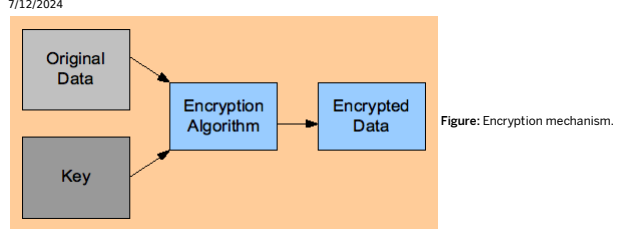

During decryption, the logic is reversed, producing the original value. As explained above, since the same key is used to encrypt and decrypt, this scheme is also known as symmetric encryption.

## Encryption Algorithm Used By Tae

TAE uses the AES (Advanced Encryption Standard) as default encryption algorithm, which was chosen in October 2000 by the National Institute of Standard and Technology (NIST). They selected an algorithm called Rijndael, developed by Joan Daemen and Vincent Rijman. AES allows key lengths of 128, 192 and 256 bits.

## Limitations Of Symmetric Encryption

All symmetric algorithms will work in roughly the same fashion. The same key is used to both encrypt and decrypt messages. This means that in order to send a message to someone you must agree on a key beforehand. This is the problem with symmetric, or secret-key encryption - the key needs to be kept secret, and any exposure of the key compromises the secrecy of any ciphertext, such as the encrypted credit card number created with that key.

## Key Generation

You can nd an AES key generator for 128, 192 and 256 bits key in SAP Commerce Cloud Administration Console.

1. Open SAP Commerce Cloud Administration Console.

2. Go to the Maintenance tab and select Encryption Keys option. 3. The Encryption Keys page in the Generator tab displays.

For more information, see Maintenance Tab.

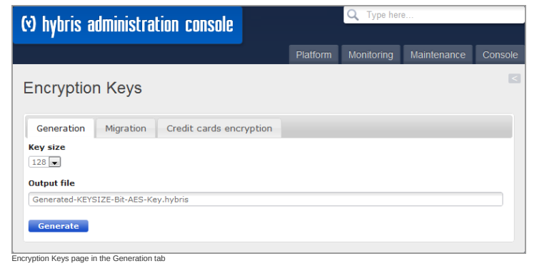

## Tae And Salt

Encryption is all about hiding data, but sometimes it is easier to guess the value of encrypted data if there is repetition in the original plain text value of the data. (This type of attack is called Known Plaintext Attack). For instance, a salary information table may contain repeated values. In that case, the encrypted values will be the same, too, and an intruder could determine all entries with the same salary. To prevent such an occurrence, an additive, also called salt, is added to the data. It that makes the encrypted value different, even if the input data is same. TAE, by default, applies a salt. TAE stores the salt with the data that is encrypted. Each time a new piece of data is encrypted, a new salt is generated. This means that the same text encrypts to a different value each time it is encrypted, even if the same key is used every time. To decrypt, the salt must be extracted from the encrypted data, and then combined with the key to create the decryption key.

## Key Management And Key Rotation

Key management is the foundation of any solid encryption implementation. Unless an organization establishes a systematic approach to generate, rotate and store its keys, its encryption activities will be largely futile. Unfortunately, while data encryption itself can be reasonably easy to achieve, efficient management of encryption keys across their lifecycle continues to be a problem. Annual rotation of encryption keys is required by data security regulations such as PCI DSS while security best practices indicate that rotation should be performed far more frequently. (The PCI Security Standards Council has indicated more frequent rotations will be required in a soon-to-be released revision of the standard).

## Caution

Key Rotation: SAP Commerce Cloud TAE supports re-encryption of all historical data with the new key on the y. The sample below explains how this works. A poorly implemented rotation process can create new data security vulnerabilities and may make critical data inaccessible even to authorized users. We strongly recommend that you never ever delete any encryption key you used for securing your productive data and that you will keep track of the related master password (symmetric.key.master.password).

project.properties/local.properties
\# all keys have to be stored under: ${platform_config_dir}/security/ symmetric.key.file.1=weak-symmetric.key symmetric.key.file.default=1 symmetric.key.master.password=w427tg3uy73uioomc1fohx1w6pew00n124mlt8ksplpm6ynz55z6305w2nwtj22 In the sample above all sensitive attributes (items.xml, encrypted=true) will be encrypted with the key that is specied by the setting symmetric.key.file.default.

In our sample this will be the key weak-symmetric.key (key id = 1). To make this encryption key unique for a specic SAP
Commerce Cloud installation this one is protected by the symmetric.key.master.password.

The format of the key denition is: symmetric.key.le.<key id> = <name of the key le>

## Caution

All key les have to be stored in ${platform_config_dir}/security/ and every key le which uses .hybris as its le extension is expected to be encrypted with the congured master password. It is recommended that you use our AES key generator because this one will place the le in the right place, create secure random keys and use the proper le extension, too. For more information, see section Key Generation.

As a result of this, conguration encrypted attributes will be stored like: 1:LFGjqOi4quc=K8p+AIJJBoIQTPBh7yaSojr97rHES7YaTkYO6SqBA/M= Here the prex '1:' indicates that the key id '1' will be used for decrypting this value.

## Changing The Used Encryption Key

In the new sample conguration shown below we specify a new encryption key (id=2) and by setting symmetric.key.file.default=2 this key will be used for all new encryption operations.

project.properties/local.properties
\# all keys have to be stored under: ${platform_config_dir}/security/ symmetric.key.file.1=weak-symmetric.key symmetric.key.file.2=Generated-256-Bit-AES-Key.hybris symmetric.key.file.default=2 symmetric.key.master.password=w427tg3uy73uioomc1fohx1w6pew00n124mlt8ksplpm6ynz55z6305w2nwtj22 As a result of this conguration encrypted attributes will be stored like: 2:m2FF0RUDs04=3QiJ+1QJG89AWB3slRZwqBrP65SUh/gOgIsZESrXuKs= Here the prex '2:' indicates that the key id '2' will be used for decrypting this value. At this time we will have the following encrypted entries in our database: 1:LFGjqOi4quc=K8p+AIJJBoIQTPBh7yaSojr97rHES7YaTkYO6SqBA/M= 2:m2FF0RUDs04=3QiJ+1QJG89AWB3slRZwqBrP65SUh/gOgIsZESrXuKs= At the point of time when an already encrypted entry will be rewritten, the key with id=2 will be used for this operation.

This is   For more    the SAP Help  38 So an entry like 1:LFGjqOi4quc=K8p+AIJJBoIQTPBh7yaSojr97rHES7YaTkYO6SqBA/M= will be (re)stored like 2:yJ2jg1s37Js=i3/Lwy6PXHrIN4LL3dUxIWaqW1/JTVY5d4CtyvP75Dc= And now the encrypted database entries will look like: 2:yJ2jg1s37Js=i3/Lwy6PXHrIN4LL3dUxIWaqW1/JTVY5d4CtyvP75Dc= 2:m2FF0RUDs04=3QiJ+1QJG89AWB3slRZwqBrP65SUh/gOgIsZESrXuKs= Here encrypted attributes will only be re-encrypted with the new key if the corresponding instance will be loaded and restored. To encrypt all encrypted attributes with the new key, use SAP Commerce Cloud Administration Console. A poorly implemented rotation process can create new data security. See also Encryption Keys Migration.

## More About Encryption Keys

Platform uses AES symmetric algorithm to encrypt any value for an attribute that is congured as encrypted=true in items.xml. If not congured differently by the user, Platform uses the default AES key named default-128-bit-aeskey.hybris located in the bin/platform/ext/core/resources/security directory. This le is pre-generated with use of the default salt 1234567.

## Remember

Change this salt to something unique and longer than the default value, and generate your own unique AES key.

The whole encryption key conguration is stored in properties and follows a simple schema:
symmetric.key.file.<ID>=filename symmetric.key.file.default=<ID>
The symmetric.key.file.<ID> property points to the le name of the key. The <ID> is an ID of the key. You can have more than one key congured and have them stored under unique IDs that are integer values. The symmetric.key.file.default property points to the ID of the key considered as the default one in the system, and every instance of an Item that is created uses this key to encrypt data. Take a look at example conguration:
symmetric.key.file.1=default-128-bit-aes-key.hybris summetric.key.file.default=1 Here is another conguration with more than one key:
symmetric.key.file.1=default-128-bit-aes-key.hybris symmetric.key.file.2=my-own-256-bit-aes-key.hybris symmetric.key.file.default=2 The above example shows a bit more complicated conguration where you have two keys. The key with ID=2 is the default one but the data is stored in the database encrypted with key ID 1 and key ID 2 may be used simultaneously. It results from how encrypted data is stored in the database. How encrypted data is stored in the database This is   For more    the SAP Help  39 Encrypted data is stored in the database using following pattern:
keyID:encrypted data The keyID before the colon is the ID of the key that is used to encrypt data that you see after the colon. This way you can have data in your database encrypted by many keys. One condition must be fullled though - you can't shuffle your keys in the conguration. Otherwise underlying logic may choose different key to decrypt data from the one which was used initially to encrypt it.

## Encryption Keys Migration

Encryption key migration importance and frequency depends on your security policy. It may also become necessary as an emergency measure in the case where existing keys have become unsecure or were compromised.

## Context Procedure

1. Open SAP Commerce Cloud Administration Console.

2. Go to the Maintenance tab and select Encryption Keys option.

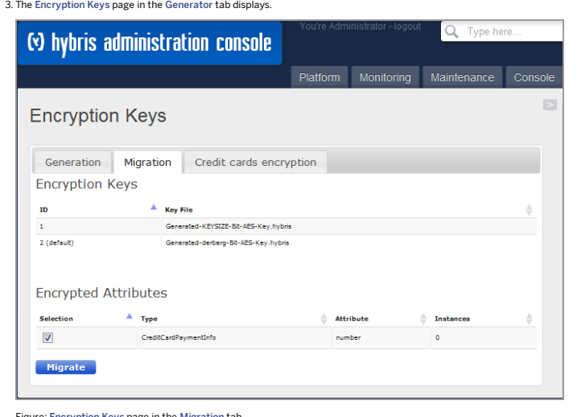

Figure: Encryption Keys page in the Migration tab.
If you did not congure your migration key in project.properties or local.properties le, then instructions on how to do it would display. Otherwise you can see below elds:
Encryption Keys: List of the congured encryption keys Encrypted Attributes: All types with their encrypted attributes are listed. You see the total count of encrypted instance (\#15) and how often every key is used (id=1, \#15). Every selected row is encrypted with the new default key after clicking the Migrate button.

## Tips And Pitfalls

Here are some tips and pitfalls related to TAE.

## Encrypting Search-Relevant Values

As it's impossible to decrypt any values at run time, TAE shouldn't be used for elds that need to be searched for, for example rst name or email address.

## Dontoptimize=True

Because you will not be able to search for encrypted values it could be a good idea to add the modier "dontOptimize=true" in your items.xml for the encrypted attribute.

## Db Persistence Type

Encrypting a string value increases its length, so be sure that you have chosen the right persistence type (VARCHAR, CLOB, TEXT) for storing your encrypted values.

## Cluster Conguration

For guaranteeing the integrity of your data, you have to be sure that every node is using the same encryption key. Since version 4.03 a general default key will be part of the release and is stored at $platformhome/bin/platform/ext/core/resources/security/default-128-bit-aes-key.hybris.

But we highly recommend, that you replace this weak and unsecure keyle by your own one, which has to be placed in
$platform_cong_dir/security/.

## Related Information

Administration Console

## User Account

SAP Commerce Cloud Platform enables you to manage the user account and its security with special properties.

## Preventing Password Brute-Force Attacks

It is possible to set a maximum number of unsuccessful login attempts in SAP Commerce Cloud to prevent brute-force attacks. After exceeding this number, the user isn't able to log in to the system anymore. You can set the maximum number of unsuccessful login attempts on per-group basis. If the user belongs to many groups that have this property set to different values, the minimum (most strict) value is used.

This is   For more    the SAP Help  41 Conguration You can set your maximum number of unsuccessful login attempts for a given group in Backoffice, in the User User Groups tab. After you select your target group, you have access to the Max brute force login attempts property eld in the Administration tab.

## Logs

When a user from a target group enters invalid credentials on the login screen, the following log is recorded:
INFO [hybrisHTTP36] [DefaultUserAuditLoginStrategy] user:foo failed 1 logins. Max failed logins all and if they exceed the maximum number of login attempts:
INFO [hybrisHTTP37] [DefaultUserAuditLoginStrategy] user:foo has reached the max number of failed l As a result, the user cannot log in to the account anymore.

## Details

The number of unsuccessful login attempts for each user is stored in the database in BruteForceLoginAttempts items.

Those items are persisted between system restarts and work correctly in the cluster environment. When the number of unsuccessful login attempts exceeds your congured value, the User.loginDisabled eld is set to true. This prevents the user from logging in to the system until the value is reverted to false. In addition, a BruteForceLoginDisabledAudit item is created to mark the fact that the user has been disabled because of too many unsuccessful login attempts. You can customize this mechanism by implementing de.hybris.platform.servicelayer.user.UserAuditLoginStrategy and registering a userAuditLoginStrategy bean.

## Deactivate User Accounts

The User.deactivationDate property allows you to deactivate a user account. If the deactivation date you set is earlier than the current date and time, you deactivate the account instantly. If the deactivate date is in the future, the account is active up to this date and time, and then it gets deactivated.

## Users In Platform

Users and user groups in SAP Commerce Cloud all descend from the generic Principal type that is the foundation for all other user-related, more specic sub-types. The Principal type is a base for the user type and, indirectly, the usergroup type. These are the starting points for you to use factory default user and usergroup accounts or to create your own user accounts and usergroup accounts. You can create your own employee sub-types to reect the company structure and the roles your employees play or structure. You can also create accounts for customers, or create the front end application that let your customers create and manage their own customer accounts.

## Overview On Principals

Principal is the main abstract class for user and usergroup types. However, in common informal use both user and user groups are also referred to as principals. The following diagram gives an overview of Principal types in SAP Commerce Cloud.

This is   For more    the SAP Help  42

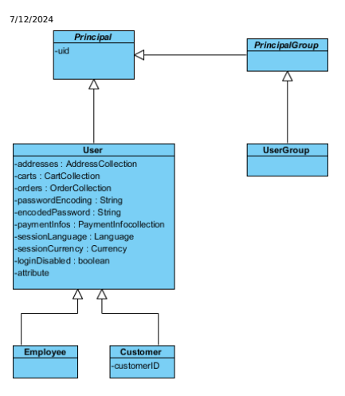

Please, bear in mind that the information presented here may differ when it comes to the Backoffice Application. To know more, see Business Roles in Backoffice

## Unique Identier

In the Principal class you can see uid. This stands for Unique Identier that must be dened for every single user and usergroup item. The main purpose for this is to provide a differentiation factor for users and groups, and to identify each item. As a result, the uid must be globally unique for all types that descend from Principal. This means you cannot have the user and group with the same name. Also, as attribute uid is unique both for customers and for employees, employee and customer cannot have the same identier.

## System Accounts

There are three special system user items, that are essential to the platform and cannot be modied nor deleted. These are:
employee: admin customer: anonymous

usergroup: admingroup
Both the anonymous and admin users are crucial for the internal processes of SAP Commerce Cloud. Therefore, both accounts are protected from removal and against renaming. SAP Commerce Cloud blocks all attempts of removing or renaming these user accounts. You can also add other users to admingroup. Those users would have the same rights as admin user. The only difference is that the Rule Framework is evaluated for all users, while it is not evaluated for admin user, as administrator has full access rights to everything within the system by default.

This is   For more    the SAP Help  43

Please, bear in mind that the information regarding users may differ when it comes to the Backoffice Application. To know more, see Business Roles in Backoffice

## Security

The security system concept in SAP Commerce Cloud is based on permissions that can be assigned to users and user groups, as well as global unique identiers used to identify and authenticate users. Additionally, encryption mechanisms are in place to protect the user passwords. Using available tools you can create the complex security system based on, for example:
Type related permissions applied to catalogs, products

Roles of your employees and restrictions

## Users

You can use the user type to create more specic types that dene accounts for your employees and customers. Technically it is also possible to create an item of a user type, however from functional point of view it is pointless and should be avoided.

## Customer Type

Extended from a user type, the customer type comes with SAP Commerce Cloud. This is designed to be used for customers who visit your front end application like web shop, create their accounts for placing orders, manage their proles, add and modify payment informations, and address data. Depending on your business context customers can create their own accounts, and have full or limited access to all their data. Example of such situation can be when customer creates a new account, adds name and other information together with address and payment information. By creating a new account user also creates uid, that is a unique login, for further authorization and authentication purposes. As a result customer can modify the name or family name, address data or payment information, however, the login, the global identier remains the same. You may congure your front end application to allow users changing data or to prevent them from modifying certain information. Crucial customer data for ordering process, like address or payment information, are kept safe by being duplicated to the Order item. When customer makes an order, the delivery address and payment information are copied to the Order item and are stored separately to secure that the shipment arrives at the correct address and is correctly paid. Even, if a customer changes payment information or delivery address after the order was made, the shipment is paid and delivered according to the information stored with the Order item. You can also use customer data to provide a support for localized service in your front end. For example, when a customer logs on to the system and starts a session, you could provide a localized version of the page for your customer. The customer type has one extra attribute not present in other types descending from Principal: customerID. This mainly serves as an example how the customer type can be extended with new attributes to better reect your business approach for collecting, using, and storing customer data. Customers can be member of:
Usergroup: For example, cockpit usergroup, VIP customergroup, frequent buyer group

Tax Group: For details, see europe1 Extension Price Group: For details, see europe1 Extension
Discount Group: For example, discount 5%. For details, see europe1 Extension Customers can be affected by:
Restrictions: For details, see Restrictions.

Access Rights: Permissions services framework denes access rights for users to the catalogs and other content. For details, see Access Rights.

## Note Customers Are Not Allowed To Manage Sap Commerce Cloud.

However, it is technically possible to grant customer account access to SAP Commerce Cloud management tools, this is not recommended and should not be allowed.

By factory default, SAP Commerce Cloud has one customer: anonymous. Other customers may be created as the need emerges. You can let the customers create their own account through the front end application, or you can do it by yourself, manually or by using ImpEx script to automate the process. For details on ImpEx, see ImpEx Import - Best Practices.

## Employee Type

Extended from user type. This user can usually do the same as the customer. Additionally, the employee user can have access to the back office management tools and can perform several management actions, dened by the system of permissions and other regulations. User employee is a representation of a member of your company. This account is used to - depending on assigned permissions - manage objects in SAP Commerce Cloud. The special case of employee user is admin. This account cannot be removed, renamed, or restricted. Access rights framework checks if the user is admin, if yes, then no evaluation rule is checked to dened permissions for admin. User admin has access to everything within SAP Commerce Cloud. The admin user is special in that extent that it is member of the admingroup user group. This groups has no factory default limitations, nor restrictions. You can create other employee users later as the need arises, manually or by using ImpEx scripts. For details on ImpEx, see ImpEx Import - Best Practices. Also, by installing new cockpits, you also receive some factory default users that come together with particular cockpit extensions. Employees can be affected by:
Restrictions: For details, see Restrictions documentation. Access Rights: Permissions services framework denes access rights for users to the catalogs and other content. For details, see Access Rights.

There are several factory default employee accounts that come with the SAP Commerce Cloud system. For few examples of such user accounts, see Factory Default User Accounts.

## User Groups

Unlike the user accounts, usergroup cannot be used to authenticate in SAP Commerce Cloud. The uid serves mainly as a group name. The group contain the collections of user accounts that belong to the group. The main purpose of that is to assign the permissions to the user group, that are further inherited to all group members. This enables easier permissions management, as they do not need to be assigned to particular user but to the set of users groups by the user groups. Member of a user group inherits all settings from that user group, unless explicitly overridden. That way, you can combine permissions to the types, items, and attributes for a large number of users in one single place. All the users who are members of a certain user group will be affected by these settings. If the exception is needed, you can than override groups settings by assigning specic permissions to the user account in the group.

Groups can also contains other user groups. This let you build the complex hierarchical structures for easier management of your users and better reecting of your company structure. For a basic discussion of how inheritance with user groups in SAP Commerce Cloud works, see Access Rights documentation.

## Company Type

The user group company is a particular case of a usergroup type that by factory default comes together with SAP Commerce Cloud. This is a representation of commercial entity. You can add here other user groups and employee accounts in order to cover your company structure in the required scope.

## Proles And Roles

Customer can be dened by a broad set of data like name, address, age, title, language, sex, etc. There are some attributes in the customer type that are factory default. However, you can also extend the type in order to store more details about your customers and let them create personalized proles. Such extended proles may serve as a digital representation of your customer personality enabling you better understanding of customers behavior, needs, requirements, and expectations. Customer prole can help you to identify some characteristics about people who actually come to your web shop, create customer accounts, visit several pages, browse products, ll in the carts, and eventually make orders. The knowledge acquired from user proles can be applied to predict the preferences of certain customer or customer groups. This is the step toward personalization of interactions between the customers and your company. Advanced Personalization Module can serve as an example, where such kind of information can be very useful to enrich your business relations with customers. By extending the customer type with new attributes to hold customer data, you can collect information about your target groups for marketing and sale purposes. Depending on the customer group certain customer qualies to, you could display different content, special offers, or hide certain areas of your web shop in order to prevent customers from accessing them. Static user proles based on the data provided by customers can be extended with the information based on the customers behavior and shopping history in order to better adapt to customer needs and provide additional tools like suggestions or preferences. Employee can also be treated as a personalized unit. Unlike the customer, the data related to the employee is rather backoffice oriented and describes the administrative role that the employee plays within SAP Commerce Cloud. There is no way to predict those roles, as they depend on your specic business context. However, the SAP Commerce Cloud system is very exible and allows you to create several employee accounts, assign different permissions to them or even combine permissions for employee users and company user group on an item or attribute level. Additionally, there are several factory default employee accounts that come with several cockpits, for details see the Overview of Factory Default Employee Accounts document.

## Related Information

ServiceLayer Security Restrictions Access Rights

## Managing Users And User Groups

Users and user groups in SAP Commerce Cloud have the same origin: Principal. They can be created, updated, and removed. The process is similar for both users and user groups. There are some issues to take into consideration, such as uniqueness of the uid, or system accounts that cannot be removed.

## Working With Users And User Groups

If you need to work with the user accounts, you can create them by instantiating a UserModel and saving it with the ModelService. For details, see Models. For most actions, you need to get the unique user identier, uid, which also serves as unique login for users.

UserModel getUserForUID(String userId); <T extends UserModel> T getUserForUID(String userId, Class<T> class);
The uid is usually used as the login for a user. If you know the user's uid, you can check if the user of the specied login already exists in the system.

boolean isUserExisting(String uid);
You can get the user group by a specic uid, which in this case is the unique name of the group, getUserGroupForUID. You can have many groups in your system dened. The groups may belong to other groups. Also, they may contain other groups as well. This is how to create a hierarchical tree structure. Normally, a user is a leaf in such a structure. However, the group not containing other groups can also be considered a leaf. If you want to check the groups to which a user belongs, you can use the following methods:
Set<UserGroupModel> getAllUserGroupsForUser(UserModel user); getAllUserGroupsForUser(UserModel user, Class<T> class); boolean isMemberOfGroup(UserModel member, UserGroupModel groupToCheckFor); boolean isMemberOfGroup(UserGroupModel member, UserGroupModel groupToCheckFor);
You can specify a Title for a user. For example, Mr., Ms., or Dr. The Title itself is a separate type. Because it is a minor type related to the user and does not usually change, the Title is also handled in the UserService by the getTitleForCode method. There is a set of methods to help you in checking the system user accounts, such as admin, anonymous, and admingroup.

EmployeeModel getAdminUser(); UserGroupModel getAdminUserGroup(); CustomerModel getAnonymousUser(); boolean isAdmin(UserModel user); boolean isAnonymousUser(UserModel user);
To check if a user is an admin or has the administrator right, which it inherited from the admingroup, you can generate a list of all admin users or check all groups for the specic user to verify if any of them is admingroup. You can use UserService methods to check the user in session and then, based on the result, to perform certain actions, for example:
UserModel currentuser = userService.getCurrentUser(); if(userService.isAnonymousUser(currentuser)) { System.out.print("You need to login to proceed"); }
Unique Identiers for Users and User Groups Users and user groups are identied by a unique identier, a uid. The uid is an attribute of the Principal class; it is used in any type that extends Principal. The uid is used to uniquely identify all principals in the SAP system. It is used identify users such as customer and employee, or user groups such as company.

The uid must be unique. It cannot be duplicated. You can avoid duplicating a uid by adding the suffix "group" to every uid that is used in the usergroup type, for example, admin and admingroup.

## Users Creating Users

Creating user is a process similar to creating any other model instance in the service layer architecture. To create a user, you call specic methods, as shown in the following code samples.

## Create An Employee User

final EmployeeModel empl = new EmployeeModel(); empl.setUid("test"); modelService.save(empl);

## Create A Customer User

final CustomerModel cust = new CustomerModel(); cust.setUid("test"); modelService.save(cust);
In the previous examples, we used the user called test. However, the user uid that serves as login must be globally unique within the system. You cannot have a customer and employee with the same uid. If a uid is already used, the system throws a model exception and you receive information about uid duplicate similar to the example shown below. You must change the uid and save it again.

de.hybris.platform.servicelayer.exceptions.ModelSavingException: ambiguous unique keys {uid=test} for model CustomerModel (<unsaved>) - found 1 item(s) using the sa How to name the methods depends on your business context. For example, your customers can create new accounts by visiting your web shop. In the web shop, you can implement a business application that:
Handles customer data

Calls UserService on the SAP Commerce Cloud side Creates an account for a customer
During this process, the customer is prompted to provide a unique login that serves as uid. If the login is already taken by another user, the SAP system returns the relevant information. You can use this information to display a more meaningful message to your user and prompt the user to pick another login. The login could be a string or email address. You can also assign specic permissions to anonymous users that allows them to view selected parts of your content or allows them to perform actions that do not require a unique login.

## Generating Uid With Key Generator

Another method of obtaining a unique identier for your customers within the system is to use a number series key generator.

This method creates a unique customer ID for each customer. To use the key generator, go to the **servicelayer/userspring.xml** le and enable the following beans:
customerIDGenerator: This is the key generator that creates the key for the user found in the customer_id eld. In the code example, it denes an eight-digit alphanumeric key, starting from 00000000. To generate a key with only numerical characters, you must set the numeric property to true.

customerIDPrepareInterceptor: This prepares the interceptor. The interceptor is activated only for the object with the number that is dened as the uid for the user. InterceptorMapping: This connects the interceptor with the particular customer. For more information on interceptors, see the Interceptors document.
This is   For more    the SAP Help  48
<!-- <bean id="customerIDGenerator" class="de.hybris.platform.servicelayer.keygenerator.impl.Persi init-method="init" > <property name="key" value="customer_id"/> <property name="digits" value="8"/> <property name="start" value="00000000"/> <property name="numeric" value="false"/> </bean> <bean id="customerIDPrepareInterceptor" class="de.hybris.platform.servicelayer.user.intercept > <property name="keyGenerator" ref="customerIDGenerator"/> </bean> <bean class="de.hybris.platform.servicelayer.interceptor.impl.InterceptorMapping" > <property name="interceptor" ref="customerIDPrepareInterceptor"/> <property name="typeCode" value="Customer"/> </bean> -->

## Updating Users Customer Type

| Action                | Description                                                                                                                                                                                                                                                                                                                                                                                                                                                                                                                                                                                                                                                                    |
|-----------------------|--------------------------------------------------------------------------------------------------------------------------------------------------------------------------------------------------------------------------------------------------------------------------------------------------------------------------------------------------------------------------------------------------------------------------------------------------------------------------------------------------------------------------------------------------------------------------------------------------------------------------------------------------------------------------------|
| Updating Address      | The UserModel, as well as the Cartmodel and the OrderModel, can have an address. You use the AddressService to create the address for a user. If the customer creates a cart, the address is cloned to the cart related to the customer. If the cart changes to order during a later step, then the order also keeps the user address. The address in the cart and order are copies made by cloning the customer address value. This can be useful. if, for example, a user places the order, but later changes the address before the order is placed. In such a situation, the shipment from the order is to be delivered to the address created when the order was created. |
| Updating Payment Info | Each customer has his/her own PaymentInfo. It holds the payment details for user.                                                                                                                                                                                                                                                                                                                                                                                                                                                                                                                                                                                              |
| Saving Carts          | For a specic user, you can save the cart-related data. This allows the user to stop browsing the web shop any time and return later to continue from the the point the user left the web shop.                                                                                                                                                                                                                                                                                                                                                                                                                                                                                 |
| Deactivating User     | You can modify the loginDisabled attribute to deactivate the user account. SAP recommends that you deactivate user accounts instead of removing them, as it is possible that there are still orders holding the address for the users. Once you have removed a user account, there is no way to link the existing order with the user who placed it. To deactivate a user, use user.setLoginDisabled(true);                                                                                                                                                                                                                                                                    |
| Employee Type         |                                                                                                                                                                                                                                                                                                                                                                                                                                                                                                                                                                                                                                                                                |

## Employee Type

| Action   | Description   |
|----------|---------------|

| 7/12/2024 Action    | Description                                                                                                                                                                                                                                                                                                                                                                                                                                                                                                                                                                            |
|---------------------|----------------------------------------------------------------------------------------------------------------------------------------------------------------------------------------------------------------------------------------------------------------------------------------------------------------------------------------------------------------------------------------------------------------------------------------------------------------------------------------------------------------------------------------------------------------------------------------|
| Changing User Roles | Users of the employee type can play different roles within a company. You can dene roles by creating specic user groups and assigning users to them. To change the role of your employee, you remove the user from one group and assign it to another group. For example, by assigning a user to the admingroup, you dene administrator as the role for this user . From a functional point of view, such a user has the same rights as an admin user. As one group can contain many users, and one user can belong to many groups, it is possible to dene several roles for one user. |

## Removing User

You can remove any user account, except system users such as admin and anonymous. Removing a user account is done in the same as any other model. To remove a user account, you must rst get the current user and then user a method that removes the user account.

UserModel user = UserService.getUserForUID("theUserId"); ModelService.remove(user);
If the user you want to remove is not found in the system, then then the UnknownIdentierException exception is thrown. If you try to remove a system user account, you also get an exception because you cannot remove a system user account.

## Historical User Data

Once the order is created, the Address and paymentInfo are cloned from the user type to the order. Cloning makes a copy of the data. The is done because the user can modify the payment information after placing an order, but the order should use the address given at the time of placing the order. The same is valid for the information about payment: paymentInfo. After a user has been removed, historical data related to user, order, and payment can remain in the system. For example, the user's address is stored in two locations. If you remove a user, you can have an order with an address but without a user name. This can happen because orders are not removed with the user. If the user is removed, then the order loses its reference to the user. This is why SAP recommends that you deactivate the user instead of removing the user account. Deactivated users are not automatically removed from the system. If you want to remove a deactivated user account from the system, you must do so manually.

## User Groups

Usergroup types are similar to the user types. Both user and usergroup types are extended from the Principal type. You can create user groups the same way as you would create the users. For more information, see the API Documents.

## Creating User Groups

User groups are containers that hold users and user groups. This allows you to create complex hierarchical structures. When you create user groups, you must ensure that no cyclic references are added in the user groups structures. For example, you can create group A that contains group B, that holds group C. However, you cannot create a cyclic reference in which group A contains group B, that contains group C, that contains group A.

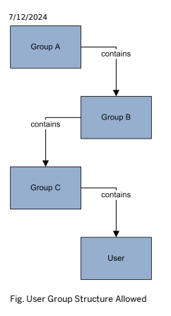

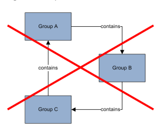

Fig. User Group Structure Not Allowed The purpose of a user group can be:
Roles: With the group hierarchy you can have a representation of the roles that your users play in the system. Permissions management: You can use the user groups to assign access rights to groups of your employees. User groups make it easier to assign and remove access rights to a number of users. Marketing targeting: You can dene your target groups and assign users to the groups that reect this kind of assignment. Customers could then have a different type of access to particular areas of your web shop content. Depending on the target group, you could show or hide the content from some customer groups. Different access layers: Generally, you can use the groups to separate those users who can perform management functions like employee users from those who can access your web shop without any management rights like customer users. Cockpit customization: Several cockpits come with the pre-dened user accounts that can have a specic access right scope to the particular cockpit management functions. Catalog visibility: With the assigning specic permissions to the different groups you can allow your users to see different catalogs, different products or different catalog versions depending on several criteria. For example, you can gather all users from a particular country into one group and display the product offer that is specically designed for that group.

## Updating User Group

You can update the attributes of the usergroup. For example, you can add users to the group or remove users, or change other attributes. Updating the usergroup can be done the same way as updating any other model in the Service Layer architecture. You need to get the user by the uid, and then proceed with other actions depending on what kind of information you want to update. For details on the operations on models, see Models documentation.

UserGroupModel usergroup = UserService.getUserGroupForUID("theUserGroupId");
It is also possible to change the uid of the user group. As the uid is the same as the user group name, it just means that you change the name of the user group.

## Removing User Group

It is not possible to remove the system user group: admingroup. Assuming you have the sufficient permissions assigned you can remove all other groups easily:
UserGroupModel usergroup = UserService.getUserGroupForUID("theUserGroupId"); ModelService.remove(usergroup);

## Related Information

Removing Model Instance Creating Model Instance How to Display a User Models

## Factory Default User Accounts

There are several factory default user accounts that come with the SAP Commerce Cloud system. The following table list all the default user acounts included in SAP Commerce Cloud.

Factory Default Employee Accounts

| User Name aarav.devi@acme.com aaron.customer@hybris.com abra.christensen@sapfsa.com abraham.mclane@acme.com acctmgra acctmgrb acctmgrc acctmgrd admin adrian.kent@hybris.com aiko.abe@sapfsa.com   |
|----------------------------------------------------------------------------------------------------------------------------------------------------------------------------------------------------|

akiro.nakamura@pronto-hw.com

| User Name   |
|-------------|

| akiro.nakamura@rustic-hw.com   |
|--------------------------------|

| aladdin.gentry@sapfsa.com   |
|-----------------------------|

| alan.martin@hybris.com   |
|--------------------------|

albert.decastro@acme.com alda.kamaka@acme.com alejandro.navarro@rustic-hw.com

| alistair@hybris.com   |
|-----------------------|

amanda.smith@stateofrosebud.com

| amelia.hill@acme.com   |
|------------------------|

amos.adkins@sapfsa.com

| analyticsmanager   |
|--------------------|

| anamaria.coots@acme.com   |
|---------------------------|

andrea.customer@hybris.com andrew.customer@hybris.com anette.customer@hybris.com angelyn.lobaugh@acme.com anil.gupta@pronto-hw.com anil.gupta@rustic-hw.com

| annabel.golder@acme.com anne.customer@hybris.com   |
|----------------------------------------------------|

anonymous anthony.customer@hybris.com

| anthony.lombardi@rustic-hw.com   |
|----------------------------------|

antonio.ferrari@sapfsa.com

| antonio.ferrari@sapfsa.com arjun.sewant@acme.com arnold.customer@hybris.com asagent asagentmanager asagentsales   |
|-------------------------------------------------------------------------------------------------------------------|

aubrey.baxter@sapfsa.com axel.krause@rustic-hw.com ayumi.nakamura@acme.com BackofficeIntegrationAdministrator

| User Name   |
|-------------|

| BackofficeIntegrationAgent   |
|------------------------------|

BackofficeProductAdministrator

| BackofficeProductManager   |
|----------------------------|

BackofficeWorkowAdministrator BackofficeWorkowUser BedfordWarehouseAgent BerlinDomWarehouseAgent BerlinHospitalWarehouseAgent BerlinMuseumWarehouseAgent BerlinZooWarehouseAgent bernard.customer@hybris.com bernardo.coelho@acme.com blossom.welch@sapfsa.com bobby.customer@hybris.com brandon.leclair@acme.com brian.customer@hybris.com bridget.customer@hybris.com burton.franco@sapfsa.com burtonlover@hybris.com byung-soon.lee@rustic-hw.com

| CajonWarehouseAgent   |
|-----------------------|

calvin.citizen@stateofrosebud.com cameralenslover@hybris.com canonlover@hybris.com carla.torres@rustic-hw.com CarltonWarehouseAgent carol.citizen@stateofrosebud.com carson.shepherd@sapfsa.com chandni.devaraju@acme.com chelsie.steck@acme.com chen.gao@acme.com chris.rumple@ehost.com christmascustomer@hybris.com

| 7/12/2024 User Name cmseditor cmsmanager cmsmanager-apparel-de cmsmanager-apparel-uk cmsmanager-electronics cmsmanager-electronics-de cmsmanager-electronics-eu cmsmanager-electronics-euzone cmsmanager-electronics-uk cmsmanager-electronics-us cmsmanager-powertools cmspublisher cmsreader-apparel cmsreviewer cmstranslator cmstranslator-Annette cmstranslator-Seb colt.ford@sapfsa.com csagent customer.support.1@sap.com customer.support.2@sap.com customer.support.3@sap.com customer.support.4@sap.com customer.support.5@sap.com customer.support.6@sap.com customer.support.7@sap.com customer.support.8@sap.com customer.support@chicago.com   |
|--------------------------------------------------------------------------------------------------------------------------------------------------------------------------------------------------------------------------------------------------------------------------------------------------------------------------------------------------------------------------------------------------------------------------------------------------------------------------------------------------------------------------------------------------------------------------------------------------------------------------------------------------------------|

customer.support@ichikawa.com customer.support@nakano.com customer.support@sanfrancisco.com CustomerSupportAdministrator CustomerSupportAgent

| 7/12/2024 User Name CustomerSupportManager cxmanager cxmanager-apparel-de cxmanager-apparel-uk cxmanager-electronics cxmanager-electronics-de cxmanager-electronics-eu cxmanager-electronics-euzone cxmanager-electronics-uk cxmanager-electronics-us cxmanager-powertools cxuser cxuser-apparel-de cxuser-apparel-uk cxuser-electronics cxuser-electronics-de cxuser-electronics-eu cxuser-electronics-euzone cxuser-electronics-uk cxuser-electronics-us cxuser-powertools dagmar.scher@acme.com daisy.smith@irc.uk dan.cameron@siteb.com daniel.customer@hybris.com daniele.sorber@acme.com darrin.hesser@acme.com deacon.fuller@sapfsa.com dean.barton@sapfsa.com debera.spiller@acme.com DefaultWarehouseAgent diana.best@sapfsa.com dietrich.brand@acme.com   |
|---------------------------------------------------------------------------------------------------------------------------------------------------------------------------------------------------------------------------------------------------------------------------------------------------------------------------------------------------------------------------------------------------------------------------------------------------------------------------------------------------------------------------------------------------------------------------------------------------------------------------------------------------------------------------------------------------------------------------------------------------------------------|

User Name

| dionne.siguenza@acme.com   |
|----------------------------|

| dipti.customer@hybris.com   |
|-----------------------------|

diptiman.customer@hybris.com

| donna@moore.com   |
|-------------------|

dorthy.geoghegan@acme.com dot.cohan@acme.com elena.bulav@internet.ru elena.petrova@sapfsa.com elizabeth.juhlin@acme.com elizabeth.miller@stateofrosebud.com emily.bennett@acme.com etta.berg@hybris.com eusebio.scharff@acme.com evangeline.jefferson@sapfsa.com fern.henline@acme.com francie.wildman@acme.com fsintegrationadmin gi.sun@pronto-hw.com gi.sun@rustic-hw.com GlasgowWarehouseAgent glen.hofer@acme.com granny.citizen@stateofrosebud.com h.williams@peabody.ca hac_editor hac_viewer hanna.andresen@acme.com hanna.schmidt@pronto-hw.com hanna.schmidt@rustic-hw.com harold.wine@asite.org hedley.mayer@sapfsa.com hermelinda.cusick@acme.com homer.citizen@stateofrosebud.com importmanager

| User Name InboundConsentTemplateUser IndianapolisWarehouseAgent idira.duffy@sapfsa.com IntegrationAdministrator IntegrationAgent   |
|------------------------------------------------------------------------------------------------------------------------------------|

| integrationapi_adminuser   |
|----------------------------|

| integrationapi_createuser   |
|-----------------------------|

integrationapi_viewuser integrationmonitoringtestuser integrationservicetestuser isabella.jackson@acme.com isha.customer@hybris.com jack.smith@stateofrosebud.com james.bell@pronto-hw.com james.bell@rustic-hw.com james.davis@acme.com jamey.sowa@acme.com jane.citizen@stateofrosebud.com janetta.estepp@acme.com jason.citizen@stateofrosebud.com

| JerseyWarehouseAgent   |
|------------------------|

jill.citizen joana.oliveira@sapfsa.com joey.citizen john.citizen@stateofrosebud.com john.li@sapfsa.com john.miller@sapfsa.com john.russel@hybris.com josephine.citizen@stateofrosebud.com jules.hasson@acme.com juliane.tickle@acme.com kadeem.gamble@sapfsa.com kai.ratliff@sapfsa.com

| 7/12/2024 User Name karleen.holub@acme.com kathy.liu@sapfsa.com keenreviewer0@hybris.com keenreviewer1@hybris.com keenreviewer10@hybris.com keenreviewer11@hybris.com keenreviewer12@hybris.com keenreviewer13@hybris.com keenreviewer14@hybris.com keenreviewer15@hybris.com keenreviewer16@hybris.com keenreviewer17@hybris.com keenreviewer18@hybris.com keenreviewer19@hybris.com keenreviewer2@hybris.com keenreviewer20@hybris.com keenreviewer21@hybris.com keenreviewer22@hybris.com keenreviewer23@hybris.com keenreviewer24@hybris.com keenreviewer25@hybris.com keenreviewer26@hybris.com keenreviewer27@hybris.com keenreviewer28@hybris.com keenreviewer29@hybris.com keenreviewer3@hybris.com keenreviewer30@hybris.com keenreviewer4@hybris.com keenreviewer5@hybris.com keenreviewer6@hybris.com keenreviewer7@hybris.com keenreviewer8@hybris.com   |
|----------------------------------------------------------------------------------------------------------------------------------------------------------------------------------------------------------------------------------------------------------------------------------------------------------------------------------------------------------------------------------------------------------------------------------------------------------------------------------------------------------------------------------------------------------------------------------------------------------------------------------------------------------------------------------------------------------------------------------------------------------------------------------------------------------------------------------------------------------------------|

keenreviewer9@hybris.com

| 7/12/2024 User Name keita.tanaka@acme.com kelsie.spencer@sapfsa.com kirti.customer@hybris.com KotoWarehouseAgent kritika.customer@hybris.com lael.garibay@acme.com lars.bauer@rustic-hw.com latisha.latimer@acme.com lavone.dupler@acme.com LeedsWarehouseAgent linda.wolf@pronto-hw.com linda.wolf@rustic-hw.com liu.yang@acme.com lucas.kowalski@rustic-hw.com mai.matsumoto@acme.com manager mara.martino@acme.com marco.rossi@sapfsa.com maria.stevens@hybris.com marie.dubois@rustic-hw.com marie.kempner@acme.com mark.farrel@hybris.com mark.rivers@pronto-hw.com mark.rivers@rustic-hw.com marketingmanager marvel.fargo@acme.com matheu.silva@rustic-hw.com MatsudoWarehouseAgent   |
|----------------------------------------------------------------------------------------------------------------------------------------------------------------------------------------------------------------------------------------------------------------------------------------------------------------------------------------------------------------------------------------------------------------------------------------------------------------------------------------------------------------------------------------------------------------------------------------------------------------------------------------------------------------------------------------------|

matthew.miller@stateofrosebud.com matthew.zhao@sapfsa.com maycustomer@hybris.com men@hybris.com menover30@hybris.com

| 7/12/2024 User Name menshortslover@hybris.com menvipbronze@hybris.com menvipgold@hybris.com merchantcontentmanager merchantproductmanager merchantvendormanager michael.adams@sapfsa.com michael.barton@sapfsa.com   |
|----------------------------------------------------------------------------------------------------------------------------------------------------------------------------------------------------------------------|

michael.clarke@sapfsa.com miguel.rodriguez@sapfsa.com mingmei.wang@pronto-hw.com mingmei.wang@rustic-hw.com MisatoWarehouseAgent

| monique.legrand@sapfsa.com   |
|------------------------------|

MunichMuseumWarehouseAgent NakanoWarehouseAgent natsumi.takahashi@acme.com

| nishi.customer@hybris.com noah.jenkins@acme.com oliver.baker@acme.com olivia.ann@hybris.com ossie.dilks@acme.com patricia.anderson@sapfsa.com   |
|-------------------------------------------------------------------------------------------------------------------------------------------------|

pedro.dasilva@sapfsa.com piedad.holdren@acme.com powerdrillslover@pronto-hw.com pradeepthi.customer@hybris.com pritika.customer@hybris.com productmanager punchout.customer@punchoutorg.com punchout.customer2@punchoutorg.com ravi.pandey@sapfsa.com RegApproverA

| 7/12/2024 User Name reggy.ray@hybris.com revenueCloudCustomerApiUser reviewer1@hybris.com reviewer10@hybris.com reviewer11@hybris.com reviewer12@hybris.com reviewer13@hybris.com reviewer14@hybris.com reviewer15@hybris.com reviewer16@hybris.com reviewer17@hybris.com reviewer18@hybris.com reviewer19@hybris.com reviewer2@hybris.com reviewer20@hybris.com reviewer21@hybris.com reviewer22@hybris.com reviewer23@hybris.com reviewer24@hybris.com reviewer25@hybris.com reviewer26@hybris.com reviewer27@hybris.com reviewer28@hybris.com reviewer29@hybris.com reviewer3@hybris.com reviewer30@hybris.com reviewer4@hybris.com reviewer5@hybris.com reviewer6@hybris.com reviewer7@hybris.com reviewer8@hybris.com reviewer9@hybris.com rewati.customer@hybris.com   |
|------------------------------------------------------------------------------------------------------------------------------------------------------------------------------------------------------------------------------------------------------------------------------------------------------------------------------------------------------------------------------------------------------------------------------------------------------------------------------------------------------------------------------------------------------------------------------------------------------------------------------------------------------------------------------------------------------------------------------------------------------------------------------|

| 7/12/2024 User Name richard.martin@acme.com richard.wilson@sapfsa.com richard@wilson.com ronnie.ray@hybris.com sade.mcdougall@acme.com   |
|------------------------------------------------------------------------------------------------------------------------------------------|

salome.levi@rustic-hw.com sandesh.patwary@acme.com sapCpqQuoteApiUser sapInboundB2BCustomerUser sapInboundB2CCustomerUser sapInboundClassicationUser sapInboundMDMB2CCustomerUser sapInboundOMMOrderUser sapInboundOMMReturnRequestUser sapInboundOMSOrderUser sapInboundPriceUser sapInboundProductUser sapInboundRCCongUser sapInboundSubscriptionPriceUser sbgadmin screwdriverslover@pronto-hw.com searchmanager SecondaryNakanoWarehouseAgent selfserviceuser2@hybris.com selfserviceuser3@hybris.com selfserviceuser4@hybris.com selfserviceuser5@hybris.com selfserviceuser6@hybris.com sheilah.duffin@acme.com ShinbashiWarehouseAgent shortslover@hybris.com shun.watanabe@acme.com stefan.bosch@sapfsa.com

| User Name summercustomer@hybris.com surabhi.customer@hybris.com TacomaWarehouseAgent tag.demph@sapfsa.com   |
|-------------------------------------------------------------------------------------------------------------|

takahiro.suzuki@sapfsa.com TampaWarehouseAgent temeka.meekins@acme.com teresa.citizen@stateofrosebud.com teresa.ruiz@sapfsa.com test-user-with-coupons@ydev.hybris.com test-user-with-orders@ydev.hybris.com thanksgivingcustomer@hybris.com thomas.schmidt@sapfsa.com tilda.prisbrey@acme.com

| tim.james@hybris.com   |
|------------------------|

tom.ziebarth@acme.com TranslatorGSW tuaInboundSimpleProductOfferingUser

| Tulsa1WarehouseAgent Tulsa2WarehouseAgent Tulsa3WarehouseAgent Tulsa4WarehouseAgent Tulsa5WarehouseAgent   |
|------------------------------------------------------------------------------------------------------------|

| ula.barragan@acme.com ulf.becker@rustic-hw.com ulysses.head@sapfsa.com   |
|--------------------------------------------------------------------------|

vada.rahm@acme.com vendor1vendoradministrator vendor1vendorcontentmanager vendor1vendorproductmanager vendor1vendorwarehousestaff vendor2vendoradministrator vendor2vendorcontentmanager

| 7/12/2024 User Name vendor2vendorproductmanager vendor2vendorwarehousestaff vendor3vendoradministrator vendor3vendorcontentmanager vendor3vendorproductmanager vendor3vendorwarehousestaff vendor4vendoradministrator vendor4vendorcontentmanager vendor4vendorproductmanager vendor4vendorwarehousestaff vendor5vendoradministrator vendor5vendorcontentmanager vendor5vendorproductmanager vendor5vendorwarehousestaff vendor6vendoradministrator vendor6vendorcontentmanager vendor6vendorproductmanager vendor6vendorwarehousestaff vendor7vendoradministrator vendor7vendorcontentmanager vendor7vendorproductmanager vendor7vendorwarehousestaff vendor8vendoradministrator vendor8vendorcontentmanager vendor8vendorproductmanager vendor8vendorwarehousestaff vipbronze@hybris.com vipgiold@hybris.com vipgold@hybris.com vipsilver@hybris.com vjdbcReportsUser wang.lei@acme.com WarehouseAdministrator   |
|--------------------------------------------------------------------------------------------------------------------------------------------------------------------------------------------------------------------------------------------------------------------------------------------------------------------------------------------------------------------------------------------------------------------------------------------------------------------------------------------------------------------------------------------------------------------------------------------------------------------------------------------------------------------------------------------------------------------------------------------------------------------------------------------------------------------------------------------------------------------------------------------------------------------|

| 7/12/2024 User Name WarehouseAgent WarehouseEAgent WarehouseManager WarehouseNAgent WarehouseSAgent WarehouseWAgent wei.liu@homemail.ch w_marketing w_marketing_DE w_marketing_EN w_marketing_ES w_marketing_FR w_marketing_GB w_marketing_GSW w_marketing_IT w_marketing_SWE w_productApproval w_productManagement w_purchase w_translator_DE w_translator_EN w_translator_ES w_translator_FR w_translator_GB w_translator_GSW w_translator_IT w_translator_SWE william.hunter@pronto-hw.com william.hunter@rustic-hw.com women@hybris.com womenvipgold@hybris.com womenvipsilver@hybris.com xaviera.crawford@sapfsa.com   |
|-----------------------------------------------------------------------------------------------------------------------------------------------------------------------------------------------------------------------------------------------------------------------------------------------------------------------------------------------------------------------------------------------------------------------------------------------------------------------------------------------------------------------------------------------------------------------------------------------------------------------------|

| User Name yan.shehorn@acme.com yformsmanager yoshie.dority@acme.com yu.yamamoto@acme.com yuka.kobayashi@acme.com yuri.chandler@sapfsa.com zhang.wei@acme.com   |
|----------------------------------------------------------------------------------------------------------------------------------------------------------------|

## Related Information

Users in Platform

## Visibility Control

You can congure SAP Commerce Cloud to allow or deny access to items, catalogs, and features. Some of these controls take effect in the front end, while others are specic to Backoffice Administration Cockpit. There are three types of visibility controls in SAP Commerce Cloud:

Those that are effective all across SAP Commerce Cloud, such as restrictions Those that are effective in a web front end only, such as product approval status Those that are effective in Backoffice only, such as access right settings
The following table only lists controls that are available in SAP Commerce Cloud by default. If you have built custom extensions, some of these controls may not take effect, or may work differently from what is described here.

| Available controls in the shop frontend                  | Available controls in Backoffice                          |
|----------------------------------------------------------|-----------------------------------------------------------|
| Restrictions.                                            | Restrictions.                                             |
| Category version visibility.                             | Category version visibility.                              |
| Product approval status.                                 | Backoffice access rights.                                 |
| Catalog version active attribute.                        | Usergroup-specic Backoffice conguration.                  |
| For more information, see Front End Visibility Controls. | For more information, see Backoffice Visibility Controls. |

## Restrictions

Restrictions affect Flexible Search results. If restrictions are in place, a user may not receive all search results that would be available without those restrictions. For more details, see Restrictions.

## Duration Of Effect

Visibility rights are bound to a session. If you change a visibility setting and the change appears to have no effect, try closing the session and logging in again. Some visibility settings are valid for the entire session lifetime and are not affected retroactively by changes made when the session has already been created. For an overview of catalog-related setting lifetimes, see Catalog Guide.

## Visibility Control Checklist

Quickly nd answers to problems related to the visibility of items in the storefront or Backoffice Administration Cockpit. The following table lists a number of possible visibility issues and their potential causes. The potential causes are discussed in more detail in the related topics.

| Problem                                       | Location                                                                                                                    | Potential cause                                                                                                                                                                               |
|-----------------------------------------------|-----------------------------------------------------------------------------------------------------------------------------|-----------------------------------------------------------------------------------------------------------------------------------------------------------------------------------------------|
| Changes I have made seem to have no           | Front end, Backoffice                                                                                                       | Session lifetime has expired.                                                                                                                                                                 |
| effect. Not all catalog versions are visible. | Front end                                                                                                                   | Restrictions are preventing visibility. The catalog version is not set to active. No category is visible for the current user.                                                                |
| No categories, or not all categories are      | Front end                                                                                                                   | Restrictions are preventing visibility.                                                                                                                                                       |
| visible.                                      | The user or user group has no read access to the category.                                                                  |                                                                                                                                                                                               |
| Individual product is not visible.            | Front end                                                                                                                   | Restrictions are preventing visibility. The product status is not set to approved.                                                                                                            |
| No catalogs are visible.                      | Backoffice                                                                                                                  | Restrictions are preventing visibility. Usergroup-specic Backoffice conguration is preventing visibility for this group. Appropriate Backoffice access rights are not granted for this group. |
| Not all catalog versions are visible.         | Backoffice                                                                                                                  | Restrictions are preventing visibility.                                                                                                                                                       |
| An attribute is invisible or not present on   | Backoffice                                                                                                                  | Appropriate Backoffice access rights are                                                                                                                                                      |
| the expected tab.                             | not granted for this group. Attribute has no explicit Backoffice conguration and is therefore moved to the Unbound section. |                                                                                                                                                                                               |
| I get an "Attribute not readable" error.      | Backoffice                                                                                                                  | Appropriate Backoffice access rights are not granted for this group.                                                                                                                          |
| Greyed-out editor.                            | Backoffice                                                                                                                  | Appropriate Backoffice access rights are not granted for this group.                                                                                                                          |
| Greyed-out Delete button.                     | Backoffice                                                                                                                  | Appropriate Backoffice access rights are not granted for this group.                                                                                                                          |
| Greyed-out Create context menu.               | Backoffice                                                                                                                  | Appropriate Backoffice access rights are not granted for this group.                                                                                                                          |

| 7/12/2024 Problem                       | Location                                                                                                      | Potential cause                                                                  |
|-----------------------------------------|---------------------------------------------------------------------------------------------------------------|----------------------------------------------------------------------------------|
| An entry (node) in the Explorer Tree is | Backoffice                                                                                                    | Usergroup-specic Backoffice conguration                                          |
| missing.                                | is preventing visibility for this group. Appropriate Backoffice access rights are not granted for this group. |                                                                                  |
| A tab is not showing.                   | Backoffice                                                                                                    | Usergroup-specic Backoffice conguration                                          |
| .                                       | is preventing visibility for this group.                                                                      |                                                                                  |
| A section is not showing.               | Backoffice                                                                                                    | Usergroup-specic Backoffice conguration is preventing visibility for this group. |
| Non-default attribute editor.           | Backoffice                                                                                                    | Usergroup-specic Backoffice conguration is preventing visibility for this group. |

## Front End Visibility Controls

SAP Commerce Cloud includes tools to control the visibility of items for customers in the storefront. If a customer can not see the full list of items you expect (only a number of products, for example), there may be an issue with either your custom extension, or a visibility setting. A good means of nding out whether there is a visibility issue or a source code problem is by assigning the admin employee to the session. For more information, see Restrictions.

If the full list of items appears, it is a visibility issue. If only a part of the list of items appears, it is not a visibility issue. Instead, the cause lies somewhere else.

If it is a visibility issue, you can check the following possible causes.

## Catalog Version Visibility

By default, only the catalog version marked active is visible in the frontend.

## Category Visibility

Each category has an attribute that species the users or user groups who are allowed to see and browse the category. You can nd this underCategory Visibility on the General tab in Backoffice Administration Cockpit, or allowedPrincipals in the type system). Users who are not specied for this attribute are not allowed to access the category. Hierarchically structured usergroups inherit visibility settings from their parent. If no category of a catalog version is visible to a user, then the catalog version will not be visible either: Having a catalog version with no category displayed would result in a catalog version with nothing useful to display in the web front end.

## Product Approval Status

Only products with an approval status of approved are visible by default in the front end. Products whose status is unapproved or check are not visible.

## Backoffice Visibility Controls

Backoffice has settings to control the visibility of items and features to certain groups within Backoffice Administration Cockpit.

This is   For more    the SAP Help  69 An admin user can restrict the visibility of Backoffice features and functions to employee users and user groups. Such restrictions have no effect on customer users or user groups.

## Catalog Version Visibility

You can assign read and write permissions to a catalog version in the Permissions tab of the catalog version details in Backoffice. A catalog version is accessible to a user if the user has read access to the catalog version. Whether the catalog version is active or not has no effect on this visibility. The user account who creates a catalog version is given read and write access by default. Read or write permissions must be set explicitly for all other users and groups.

## Backoffice Access Rights

You can grant or deny user accounts access to Backoffice.

## Usergroup Specic Backoffice Conguration

Backoffice allows setting up a specic conguration of features for individual user groups. This makes it possible to hide Backoffice elements from user groups, both in the Explorer Tree and in the Organizer. This does not affect access rights.

## Unbound Attributes

Backoffice moves attributes that are not explicitly placed anywhere onto the Administration tab of the Type details. Such movement will result if no explicit conguration for the attribute was specied.

## Related Information

Restrictions Catalog Guide FlexibleSearch

## Web Application Endpoint Control

Platform allows you to disable endpoints within web apps. This functionality may be useful especially for REST-oriented applications. The example below shows how to disable endpoints in a web app. The example web app offers the following endpoints:
/platform /platform/init /platform/update /platform/system /console/impex/export /console/impex/import Assume that you want to set up Platform to permanently disable the /hac/platform/init and /hac/platform/update endpoints. You can do it through a conguration that uses appropriate properties.

The conguration property responsible for disabling endpoints uses the following naming convention:
endpoint.extensionName.endpointPath.disabled=true|false, where:

endpoint is a constant part and must be always included extensionName is the name of the extension that provides the web app; in the example, it is the hac extension endpointPath is a dotted version of the endpoint path, for example, foo.bar.baz is the dotted version of the
/foo/bar/baz path. disabled is a constant part and must be always included
Here is the property congured to disable the /hac/platform/init and /hac/platform/update endpoints:
endpoint.hac.platform.init.disabled=true endpoint.hac.platform.update.disabled=true

Any conguration for this functionality is only read during system startup. It is not possible to change it during runtime.

## Resourcesguardservice

ResourcesGuardService enables you to check whether an endpoint in a web app is congured to be disabled or enabled. It also enables you to manage conguration propagation for endpoint paths and subpaths. You can inject it through Spring by using the ResourcesGuardService ID.

## Checking Whether Endpoints Are Disabled

ResourcesGuardService provides two public methods that enable you to check whether endpoints are disabled or enabled:

boolean isResourceDisabled(String extensionName, String resourcePath)
boolean isResourceEnabled(String extensionName, String resourcePath)
This example shows how to use them:
// assuming resourceGuardService was injected by Spring boolean platformInitDisabled = resourcesGuardService.isResourceDisabled("hac", "/platform/init"); boolean platformUpdateDisabled = resourcesGuardService.isResourceDisabled("hac", "/platform/update" // assertions assertThat(platformInitDisabled).isTrue(); assertThat(platformUpdateDisabled).isTrue();

## Propagating Conguration For Paths And Subpaths

By default, each conguration respects the parent-child hierarchy of paths and subpaths. It means that a conguration set for a given path propagates into all subpaths of that path.

For example, the /platform path has these three subpaths: /platform/init, /platform/update, and /platform/system. Disabling only the /platform path makes all the three subpaths disabled too - by default and without any further conguration:
endpoint.hac.platform.disabled=true To prevent your conguration from propagating from a path into its subpaths, explicitly congure those subpaths. Also, congure ResourcesGuardService by setting the endpoints.guardservice.respect.parents property value to This is   For more    the SAP Help  71 false.

For example, here are some available endpoints:
/platform /platform/init /platform/update
/platform/system And here is some conguration:
endpoints.guardservice.respect.parents=false endpoint.hac.platform.disabled=true endpoint.hac.platform.update.disabled=false As a result:

/platform/init and /platform/system endpoints inherit the conguration settings from their top-level parent,
/platform; these endpoints are disabled because their paths aren't explicitly congured otherwise you prevent the /platform conguration settings from propagating into the /platform/update subpath; the
/platform/update endpoint is not disabled

## Resourcesguardfilter

You need a tool to use all the presented congurations and settings to actually make a particular endpoint disabled. Platform provides a new Filter class called ResourcesGuardFilter. You can inject it into the standard SAP Commerce Cloud lter chain. Congure it on the web app level as in this example:
<bean id="myWebAppResourcesGuardFilter" class="de.hybris.platform.servicelayer.web.ResourcesGuardFi <property name="resourcesGuardService" ref="resourcesGuardService"/> <property name="extensionName" value="myWebApp" /> </bean> <bean id="myWebAppFilterChain" class="de.hybris.platform.servicelayer.web.BackOfficeFilterChain"> <constructor-arg> <list>
 <ref bean="myWebAppResourcesGuardFilter"/>
 <!-- Possible other filters here... --> </list> </constructor-arg> </bean>
By default, this lter sends the HTTP 404 code whenever it nds that a particular request URI matches a congured endpoint and that endpoint is disabled. It may also send a redirect to a particular page or endpoint if you congure it to do so, for example:
<bean id="myWebAppResourcesGuardFilter" class="de.hybris.platform.servicelayer.web.ResourcesGuardFi <property name="resourcesGuardService" ref="resourcesGuardService"/> <property name="extensionName" value="myWebApp" /> <property name="reditectTo" value="/404.jsp" /> </bean>

## Hiding Tabs In Sap Commerce Cloud Administration Console

If you disable endpoints that are URLs to Administration Console tabs, the tabs become invisible.

## Considerations

The provided tools read a conguration and help you determine whether some endpoints in your web app are congured to be disabled. Your web app, however, may have, for example, navigation links to those endpoints on some jsp pages. You need to implement your own logic to use ResourcesGuardService if you don't want the end user to see such links.