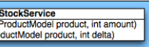
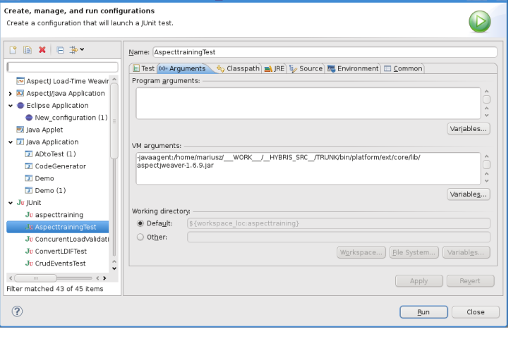

# Servicelayer

When implementing new business logic, you separate the business code into java classes called services. Each service implements a specic, well-dened requirement. The ServiceLayer is an API for developing services for SAP Commerce Cloud.

The topics include:
ServiceLayer Architecture The ServiceLayer uses a variety of different architecture concepts. Some of these are optional, others are mandatory. Working with the ServiceLayer We provide a series of procedures covering various aspects of the ServiceLayer. Use these procedures to get you started quickly with common ServiceLayer user cases.

Key Services Overview The ServiceLayer offers a variety of key services. These are built in to SAP Commerce Cloud and comprise System, Infrastructure, and Platform Services. Implementing Services While you may be able to build your entire business application using SAP Commerce Cloud services alone, you will no doubt need to implement services yourself. Before you do this, there are certain princples and best practices you should make yourself familiar with.

Transitioning to the ServiceLayer Previously, all persistence and business logic was written in the Jalo Layer. With the introduction of the Service Layer, all existing business logic in the Jalo Layer has moved to the Service Layer. As the Jalo Layer no longer contains business logic, the public API is signicantly smaller.

After Save Event After each database operation (whether caused by a committed transaction or not), an event is created. This event contains information about the item that was edited and the type of a database operation performed. You can collect these events and handle them according to your needs.

## Servicelayer Architecture

The ServiceLayer uses a variety of different architecture concepts. Some of these are optional, others are mandatory.

## Structure Overview

The ServiceLayer can be described as a layer of services on top of the persistence layer. The services themselves can be divided into subcomponents.

Figure: The ServiceLayer (blue) interconnects the persistence layer with the client. Arrows indicate exchange of data objects.

## Architectural Components Client

A client in this context is any software component that uses the ServiceLayer, such as:
Page Controllers of an MVC framework Web Service clients

Scripts Other services

## Services

A service holds the logic to perform business processes and provides this logic through a number of related public methods. These public methods usually are dened in a Java interface. Most often these methods operate on the same kind of model object, for example product, order, and so on. Services are expected to abstract from the persistence layer, that is, to only contain functional logic and no persistence-related code. That means if you implement a service, make sure to implement it in a way that the underlying implementation is as loosely coupled to the persistence layer as possible. For more information, see Wikipedia on Services .

Figure: Sample of relations between services. Note the pattern of having an interface and an implementation per service.

SAP Commerce Cloud exposes all of its functionality through services. The following kinds of services are available:
Business Services implement business use cases, such as cart handling or back order. Infrastructure Services provide the underlying technical foundation, such as internationalization, import, export, and so on. System services provide functionality required by the ServiceLayer, such as model handling and session handling.

The service methods should be as ne-grained as possible to enable reuse. Extensions must provide their functionality as services. Per extension you may provide as many services as you deem necessary, not just one.

Services may use other services to perform their tasks but should keep their interdependencies to a minimum to avoid overly tight coupling with other components. In a project, you may write your own services to either provide unique functionality or to aggregate other services' functionality.

Although technically not necessary, SAP Commerce Cloud recommends implementing services in terms of interfaces. See Spring Framework in SAP Commerce Cloud for reasons why.

Services interact with other components through models. For details see section Models below.

## Strategies

A service may delegate parts of its tasks to smaller micro-services, called strategies. The service then serves as a kind of façade to

the strategies. Clients still use the service and its stable API. But under the hood the functionality is split into multiple parts. Because these parts are smaller and very focused to their task, it is easier to adapt or replace them. Strategies therefore help to further encapsulate behavior and make it more adaptable.

Figure: Sample of a service (consisting of an interface denition and the related implementation) relying on strategies. Note how the strategies also follow the pattern of interface denition and related implementation.

## Daos

A DAO (Data Access Object) is an interface to the storage back end system. DAOs store and retrieve objects. You use DAOs to save, remove, and nd models. DAOs are the place to put SQL or FlexibleSearch statements and nowhere else. This is to ensure further decoupling from the underlying storage facility. DAOs interact with services via models and with the database via FlexibleSearch and SQL statements.

## Note

In SAP Commerce Cloud, DAOs use the SAP Commerce Cloud Type System for persistence. This means that SAP Commerce Cloud DAOs do not implement any individual logic and simply call the underlying persistence layer.

## Models

Models are a new way to represent SAP Commerce Cloud items. Each model contains all item attributes from all extensions thus unifying access to an item's data. Models are generated from the type system of SAP Commerce Cloud, see Type System Documentation. Furthermore they are more or less simple POJOs (Plain Old Java Objects) that can be used without any storage facility. Thus, it's pretty easy to mock them up, for example for testing and debugging. Models are used by DAOs, services, strategies, converters, and facades.

## Related Information

Adding a New Service Models

## Models

Models are a way to represent SAP Commerce Cloud items, whereby each of these items is represented by a Model class. Each Model contains all item attributes from all extensions thus unifying access to an item's data. Models are generated from the SAP Commerce Cloud type system. Furthermore, they are similar to POJOs (Plain Old Java Objects)
and are used without any storage facility. Consequently, it is easy to mock them for testing and debugging purposes.

Models are used by application developers working with the ServiceLayer and extension developers who create new items with corresponding Model classes.

## Basic Model Aspects

There are two basic aspects of Models, depending on the phase of SAP Commerce Cloud:
Model class generation, that is, at compile time. See topic Model Class Generation.

Model life cycle, that is, at run time. See topic Model Life Cycle.

## Model Class Generation

During a SAP Commerce Cloud build, the build framework generates Model classes and conguration les for each item type. Models are generated across all extensions, no matter whether the extension is available in source code or in binary only. The Model generation process also ignores the value of the generated attribute of the <coremodule> element in the extensioninfo.xml le of the extension.

Models are generated into the bootstrap/gensrc directory.

This is   For more    the SAP Help  5

## Note Why Are Models Generated Into The Gensrc Directory?

You might ask why the generated Models end up in the platform and not in the extension where the type is dened? This is due to the way the SAP Commerce Cloud Build Framework operates.

For example, let's take the cms extension. In this extension, the Catalog type is extended with an attribute called Store. The Store type is dened in the cms extension but the Catalog type is dened in the catalog extension. In the build order of SAP
Commerce Cloud, the catalog extension precedes the cms extension. Therefore, the catalog extension is unaware of the attributes dened in the cms extension. By consequence, putting the generated CatalogModel into the catalog extension causes a build failure: CatalogModel has an attribute of type StoreModel that is dened in the cms extension but has to be available in the catalog extension already.

For every type, an individual Model class is generated. A Model owns the following:

The name of the type from which the Model is generated, plus the suffix Model. For example, the Model for the Product type has the name ProductModel.

A similar package as the type from which the Model was generated :
The string model is added to the package after the extension root, and jalo is eliminated from the package.

For example, de.hybris.platform.europe1.jalo.TaxRow has the Model de.hybris.platform.europe1.model.TaxRowModel.

All attributes that the type has, represented as private elds.

Getter and setter methods for all attributes
As Models are generated during a early phase in the SAP Commerce Cloud build process - before actually building any extension - the Models are available by compile time.

## Tip Allows Checking The Data Model More Easily

As Models are generated to match the type system denitions in the items.xml les, you can use them to check the data model you have dened. This is faster than updating or initializing the SAP Commerce Cloud system and checking the data model in Backoffice, for example.

Example: Assume you dene an item type like this:
items.xml
<itemtype generate="true" code="ContactRequest" jaloclass="de.hybris.springmvcdemo.jalo.ContactRequest" extends="GenericItem" autocreate="true"
 >
 <attributes>
 <attribute qualifier="message" type="java.lang.String"> <persistence type="property"/>
 </attribute>
 </attributes>
</itemtype>
The Model class is then generated into the modelclasses folder of the platform like this:
Model as generated:
This is   For more    the SAP Help  6 package de.hybris.springmvcdemo.model; import de.hybris.platform.core.model.ItemModel;
/**
 * Generated Model class for type ContactRequest first defined at extension *springmvcdemo*
 */
@SuppressWarnings("all")
public class ContactRequestModel extends ItemModel {
/** <i>Generated type code constant.</i>*/
public final static String _TYPECODE = "ContactRequest";
/** 
 * <i>Generated constant</i> - Attribute key of <code>ContactRequest.message</code> attrib * at extension <code>springmvcdemo</code>. 

 */
public static final String MESSAGE = "message";
/** <i>Generated variable</i> - Variable of <code>ContactRequest.message</code> attribute 
 * at extension <code>springmvcdemo</code>. */
private String _message;
/**
 * <i>Generated constructor</i> - for all mandatory attributes.

 * @deprecated Since 4.1.1 Please use the default constructor without parameters
 */
@Deprecated public ContactRequestModel() {
super();
/**
 * <i>Generated constructor</i> - for all mandatory and initial attributes.

 * @deprecated Since 4.1.1 Please use the default constructor without parameters
 * @param _owner initial attribute declared by type <code>Item</code> at extension <code>c
 */
@Deprecated public ContactRequestModel(final ItemModel _owner)
{
super(
_owner
);
/**
 * <i>Generated method</i> - Getter of the <code>ContactRequest.message</code> attribute d
 * at extension <code>springmvcdemo</core>. 

 * @return the message
 */ public String getMessage()
{
if( !isAttributeLoaded(MESSAGE))
{
 this._message = getAttributeProvider() == null ? null : (String) getAttributePro getValueHistory().loadOriginalValue(MESSAGE, this._message); }
throwLoadingError(MESSAGE);
return this._message;
}
/** * <i>Generated method</i> - Setter of <code>ContactRequest.message</code> attribute defin
 * at extension <code>springmvcdemo</code>. 

 * * @param value the message
 */
public void setMessage(final String value)
{
this._message = value; markDirty(MESSAGE);
}
This is   For more    the SAP Help  7
} }
Note the constructor methods and the generated getter and setter methods for the Message attribute.

## Modifying The Model Generation

Attributes for Models are generated automatically by default based on attributes of the type, including getter and setter methods for those attributes. You can explicitly exclude attributes of a type from the generation process, or exclude entire types from the generation so that no Model is created for the type.

To exclude an entire type (including all subtypes) from the generation:
<itemtype generate="true" code="ContactRequest" ... > <model generate="false"/> <attributes>...</attributes>
</itemtype>

}
To exclude an attribute from the Model generation process, you have to explicitly dene the exclusion. The result is that neither the private eld nor getter and setter methods are generated. To exclude an attribute, use <model generate="false" /> in the attribute denition within the items.xml le, such as:
<attribute qualifier="message" type="java.lang.String">
 <persistence type="property"/>
 <model generate="false"/>
</attribute>
You can specify a constructor to be generated by specifying the attributes part of the constructor signature:
<itemtype generate="true" code="ContactRequest"
 ... >
 <model>
 <constructor signature="message"/>
 </model>
 <attributes>...</attributes>
</itemtype>
This results in a constructor at the model:
/**
 * <i>Defined constructor from items.xml</i>
 * @param _message mandatory attribute declared by type <code>ContactRequest</code> at 
 * extension <code>impex</code>
 */ public ContactRequestModel(final String _message)
{
super(); setMessage(_message);
}
You can add alternative getter and setter methods for an attribute:
<attribute qualifier="message" type="java.lang.String"> <persistence type="property"/>
 <model>
 <getter name="myMessage"/> </model>
</attribute>
An additional getter method getMyMessage() is then generated for the corresponding Model:
This is   For more    the SAP Help  8 public String getMessage()
{
 ...

}
public String getMyMessage()
{
 return this.getMessage();
}
Furthermore, you can replace the original getter and setter methods by using default ag:
<attribute qualifier="message" type="java.lang.String"> <persistence type="property"/>
 <model/>
 <getter name="myMessage" default="true"/>
 </model>
</attribute>
As the result, getMyMessage method is generated and the original getMessage method does not exist in the Model anymore:
public String getMyMessage() {
 // now executes logic of former getMessage() method
 ...

}
Another option is to mark alternative getter and setter methods as deprecated:
<attribute qualifier="message" type="java.lang.String"> <persistence type="property"/> <model/>
 <getter name="myMessage" default="deprecated"/> </model>
</attribute>
The generated getMyMessage method in the Model has @deprecated annotation:
public String getMessage() {
 ...

} /** * @deprecated use {@link \#getMessage()} instead */ @Deprecated public String getMyMessage()
{
 return this.getMessage(); }

## Model Life Cycle

A Model represents a state in the database. The representation is not live, that means that modied Model values are not written to the database automatically. Instead, when you modify a Model, you must explicitly save it to the database to have its state reected there.

## Life Cycle Of A Model

Figure: Schematic discussion of a Model's life cycle.

The corresponding phases in a Model's life cycle include:
Instantiating the Model This can be done by either creating a new Model instance or by loading a Model from the database.

Creating a Model instance This can be done by either of these ways. See topic Creating a Model Instance.

Through its constructor.

Through the factory method in the ModelService.

Loading an existing Model from the database is possible either by using the pk or by using a query expression. See topic Loading a Model.

Modifying Model Values if desired: Set the properties of a Model. Saving Model Values if created or modied: You save back the Model to update the database. If you have used a new Model, a new record is created in the database; otherwise the existing record is updated. Removing the model: If the Model is no longer needed, the database record is deleted.

You can use interceptors to hook into the Model's life cycle.

## Lazy Loading

Lazy loading is the process of not setting all values of an object right away on the object's instantiation. The Model loading mechanism uses lazy loading. Once you have loaded a Model, it contains all primitive values. However, at this state, relationships are not lled. As soon as you access such a relationship by calling the appropriate getter, the relationship is loaded on demand. That means that once you have loaded a Model, you do need to worry about loading any dependent Model.

When a Model is loaded, no Model values are loaded right away. The Model consists only of a blank Java object instance with no values set. All Model values are only loaded when any value of the Model is retrieved. This mechanism increases performance during Model initialization.

To change the loading mechanism, set the servicelayer.prefetch property in your local.properties le to all or literal. 'literal' behavior means prefetching only atomic attribute values and not prefetching reference attribute values. 'all' means that all attribute values are prefetched upon model loading.

## Note Loading All Attribute Values

It is not recommended to set the loading mechanism to All to avoid loading too much data or, in case of circular dependencies, stack overow exceptions.

## Lazy Loading Model Relations

Since the relationships of a Model are loaded on demand, in certain circumstances it is advisable to avoid calling their getter and setter methods. Consider the following basic example and two approaches, in which you would like to determine the total amount of all orders placed by the user.

To determine the cumulative value of the user's orders from within the ServiceLayer, a simple call to getOrders() could be made on the user Model and you could iterate over each order, accumulating the total price. In scenarios where you know the number of orders is relatively small, this is an effective strategy and results in clean code:
MyServiceImpl.java
... public Double getTotal(UserModel user ) {
 double cumulativeTotalPrice = 0.0d; for (final OrderModel order : user.getOrders()) {
 cumulativeTotalPrice += order.getTotalPrice().doubleValue();
 } } ...

However, consider a scenario where users may have thousands of orders. For example, in a B2B scenario, an entire company might be represented by one single user account. The rst call to getOrders() results in a SQL query that fetches all orders associated with that user. Ideally, the query and the results would be cached, but in a worst case, the query is executed and returns thousands of order rows. For each row in the query result, an order Model is instantiated and then cached.

An alternative approach is to perform this operation in a DAO using a FlexibleSearch query. The query aggregates the total price of each order into a single result with only one row being fetched from the database:
MyDaoImpl.java public Double getTotal() 
 {
 final FlexibleSearchQuery fq = new FlexibleSearchQuery("SELECT SUM(totalPrice) AS CUMULATIVE_PR
 fq.setResultClassList(Lists.newArrayList(Double.class));
 final SearchResult<Double> search = fs.search(fq);
 final List<Double> result = search.getResult();
 if (!result.isEmpty()) {
 return result.iterator().next();
 }
 
 return Double.valueOf(0);
 }

## Lazy Loading Relation And Collection Attributes

You can enable lazy loading mode for loading the relation and collection attributes for Models in LazyLoadModelList and LazyLoadItemSet for Model getters by using the following property:
servicelayer.lazy.collections=true The default value of the property is false. This global setting can be overwritten for a particular attribute, for example:
servicelayer.lazy.collections.Company.addresses.enabled=true In the example, the property enables the lazy loading mode for the addresses collection that is dened in the Company Model.

## Model Context

As soon as you load a Model or create it through the modelService, it is put in the Model context. The Model context keeps track of all changes to the Model, especially references to new, unsaved Models.

If you choose to save a Model individually, note that only unsaved Models are automatically saved. Models that are already created are not saved.

For example, let us assume you have a CategoryModel, that holds a reference to a ProductModel. You modify the CategoryModel:

If the ProductModel is created and not yet saved, then saving the CategoryModel saves the ProductModel as well. This is because the reference to the ProductModel is new and new references are always saved.

If the ProductModel is already saved, then saving the CategoryModel does not save the ProductModel. This is because the reference to the ProductModel points to an existing Model, and existing Models are not saved.
Because the Model context keeps track of your changes, it is possible to save all changes at once. You do not have to save each Model separately. You can save all Models at once. For details on saving Models, please refer to topic Saving a Model.

If you create a Model by using its constructor, note that the Model is not attached to the Model context. See topic Using a Constructor. You can manually modify the Model context in order to:
Add a Model to the context:
modelService.attach(model)
Remove a Model from the Model context, if you do not want your modications to be saved automatically:

modelService.detach(model)
Model context is bind to the HybrisRequestScope, which is similar to the standard request scope but belongs to a single thread only. The Model context is automatically cleared if the related session or the related request is closed or times out. By a consequence, unsaved Models are removed and can't pose a threat of memory leak.

The Model created or modied during request is stored in the context. If you load this kind of model from database, for example by using exible search, you get the same instance of the Model that is stored in the context. You must be aware that this behavior is not guaranteed for loaded but unmodied Models. If you try to display the same object twice without modifying it, you usually get the same object but you cannot depend on this. Better keep reference to this object in your own code.

This is   For more    the SAP Help  12 Keep in mind that the Model context is thread local and Models are not thread safe. You should synchronize access to the setters if you are passing your Models to different threads, for example by using SessionService.

You should not use the Model context after transaction rollback. If you try to use Models saved during a transaction which is rolled back, you may get an exception. It depends on your usage pattern. It happens because Models can be in an inconsistent state with their database representation. For example, the Model was saved, its primary key was generated and set but corresponding record in database was not persisted because of rollback operation. Therefore, after rollback you should not use any references to Models retrieved or created during this transaction.

## Modelservice

The ModelService is a service that deals with all aspects of a Model's life cycle. It is available in Spring under the ID
modelService and implements the de.hybris.platform.servicelayer.model.ModelService interface. Its main tasks include the following:
Loading Models by pk

Loading Models from items Creating Models Updating Models Deleting Models

## Creating A Model Instance

There are two ways to create a new Model instance:
Using a constructor

Using a factory method
Using a Constructor You do not need a special create method or other kind of factory. You simply create the new instance using new, such as:
ProductModel product = new ProductModel();
Values of Models are not written to the database directly but only on explicit save. Due to this, you do not have to specify values for mandatory attributes when instantiating the Model. However, by the time you try to save the Model, the values for mandatory attributes must be set, except for the default values.

## Model Constructor Methods

Constructor methods for mandatory attributes are deprecated. To instantiate Models, use only the non-argument constructor method, and set the values afterwards, such as:
ProductModel product = new ProductModel();
product.setCatalogVersion(catalogVersion); product.setCode(code);
Furthermore, you can use constructor dened at items.xml as explained in topic Modifying the Model Generation.

When you create a Model like this, notice it is not attached to the Model context. (See also topic Model Context) There are two ways to do it:
Using the ModelService save(Object) method: The Model is saved to the database and automatically attached.

modelService.save(Object)

Using the ModelService attach(Object) method: The Model is attached but not saved. Consequently, you either have to manually save it later or do a bulk save.
modelService.attach(Object)
In addition, a Model created that way is not lled with default values as dened in the items.xml le. You can ll it as follows:
modelService.initDefaults(model);
If you do not explicitly call it, the default values are automatically applied during the save process.

Using a Factory Method You also can use the ModelService to create a Model instance, for example by specifying the Model class:
ProductModel product = modelService.create(ProductModel.class)
Alternatively, you can specify the type's identier (code):
ProductModel product = modelService.create("Product")
This is useful at runtime if you dynamically wish to determine the type of a Model to create. Also, this method immediately puts the Model in the Model context. Consequently, you do not have to manually add the Model to the Model context, and the default values are assigned automatically. See also section Model Context above.

## Loading An Existing Model

To load an existing Model, you can look up by one of the following:
Using the Model pk

Using a FlexibleSearch query Using an example Model as search parameter

## Loading By Primary Key

The simplest case to load a Model is based on its primary key (pk). You call the get method from ModelService:
ProductModel product = modelService.get(pk)

## Loading By Query Expression

Commonly, you wish to look up Models based on a FlexibleSearch query. To do this use the flexibleSearchService. It implements the de.hybris.platform.servicelayer.search.FlexibleSearchService interface. It is available as a Spring bean with the ID flexibleSearchService:
FlexibleSearchQuery query = new FlexibleSearchQuery("SELECT {pk} FROM {Product} WHERE {code}
=?" + Product.CODE);
query.addQueryParameter(Product.CODE, code);
SearchResult<ProductModel> result = flexibleSearchService.search(query); List<ProductModel> products = result.getResult();
If no Model is found, search() method may throw ModelNotFoundException.

You may use searchUnique() method from the FlexibleSearchService that is similar to search() method. The difference is that searchUnique() method returns exactly one model or throws one of two types of exceptions:
This is   For more    the SAP Help  14

ModelNotFoundException: If no Model is found AmbiguousIdentifierException: If more than one Model fullling search parameters is found, for example, if you search for Products without a WHERE clause.
FlexibleSearchQuery query = new FlexibleSearchQuery("SELECT {pk} FROM {Product} WHERE {code}
=?code");
query.addQueryParameter("code", code);
ProductModel result = flexibleSearchService.searchUnique(query);

## Loading By Example Model

It is possible to use an example Model as a search parameter to load existing Models.

Loading by an example Model is moved from ModelService to FlexibleSearchService and is divided into two methods:
getModelByExample() and getModelsByExample().

Instead of searching for an existing Model using a FlexibleSearch query, as described in section Loading by Query Expression, you can also create a new example Model, change its attributes and search by this example for an existing Model in the system. Essentially, a Model of the same kind with matching values is returned. The functionality of getModelByExample() method does not allow to search for multiple Models. To search for multiple Models, use getModelsByExample() method.

To search for existing Models using an example Model:
1. Create a new Model.

2. Change its attributes to match the values you want to search for.

3. When you expect only one result, call the flexibleSearchService.getModelByExample(...) method, passing the Model.

4. When you expect more than one result, call the flexibleSearchService.getModelsByExample(...) method, passing the Model.
For example:
//search for a product with the unique code "test" ProductModel exampleProduct = new ProductModel();
exampleProduct.setCode("test");
ProductModel foundProduct = flexibleSearchService.getModelByExample(exampleProduct);
getModelByExample() method can throw two kinds of exception:
ModelNotFoundException: If no Model is found

AmbiguousIdentifierException: If more than one search result is found, for example if you search for ArticleApprovalStatus.APPROVED.
To avoid getting AmbiguousIdentifierException, use getModelsByExample() method, for example:
//search for a products with the nonunique ArticleApprovalStatus ProductModel exampleProduct = new ProductModel();
exampleProduct.setApprovalStatus(ArticleApprovalStatus.APPROVED);
List<ProductModel> foundProducts = flexibleSearchService.getModelsByExample(exampleProduct);

## Note Create() Method Vs New Operator

If you create an example Model using the modelService.create() method, the Init Defaults Interceptor of this Model is called. As a consequence, default values of the Model are set and used as search parameters, for example:

//search for a product with the unique code "test", ApprovalStatus="check", PriceQuantity=1.0 ProductModel exampleProduct = modelService.create(ProductModel.class);
exampleProduct.setCode("test");
ProductModel foundProduct = flexibleSearchService.getModelByExample(exampleProduct);
The effective search parameters for this code sample are:

| Parameter                   | Value   | Set By                                                  |
|-----------------------------|---------|---------------------------------------------------------|
| ProductModel.code           | test    | Explicit call                                           |
| ProductModel.approvalStatus | CHECK   | Default value from the LoadInterceptor for ProductModel |
| ProductModel.priceQuantity  | 1.0     | Default value from the LoadInterceptor for ProductModel |

If you create an example Model using new ProductModel(), no default values are set and only specied values of parameters are used for search.

It is also possible to search for localized attributes. However, if you do so, be sure to attach the example Model to the ModelContext. Without it, no LocaleProvider is set, which would result in java.lang.IllegalStateException: got no locale provider - cannot access default localized getters and setters.

//search for a product where the english name is "uniqueName_english" and the german name "uniqueName_d ProductModel exampleProduct = new ProductModel();
exampleProduct.setName("uniqueName_deutsch", Locale.GERMAN);
exampleProduct.setName("uniqueName_english", Locale.ENGLISH); modelService.attach(exampleProduct); // <- important

## Tip

For additional code samples, please refer to the FlexibleSearchServiceGetModelByExampleTest.java le.

## Saving A Model

There are two basic means of saving Models:
Saving an Individual Model with Referenced Models, Under Certain Circumstances To save a Model, call the modelService save(...) method:
modelService.save(model);
If a Model holds a reference to another Model and is to be saved, the referenced Models are also saved if they have not been saved before. The referenced Models that have already been saved before are not saved. Other, non-referenced Models are not saved.

For example, if a catalog version holds a new, unsaved CategoryModel and the catalog version is saved, then the CategoryModel is also saved. This function relies on the Model context. See also section Model Context above.

## Saving All Models At Once

modelService.saveAll();
This saves all modications as registered with the Model context. See also topic Model Context.

Collections There is a special behavior when using collections. You can't simply get a collection-based attribute of a Model, modify the collection's contents and call the ModelService save(...) method. The getter methods of Models return unmodiable lists, so you can't modify the collection. Instead, you have to:
1. Create a new collection object.

2. Add existing, non-modied values.

3. Add new or modied values.

4. Set the collection to the attribute.

5. Store the attribute by calling the save(...) for the Model.

This is the intended behavior to ensure data consistency: You explicitly have to create a new Collection, set values to it, and save the attribute for the collection. Thus, you know which values have been added and stored, and which values have not.

## Removing A Model

To remove a Model, call the remove method of the modelService:
modelService.remove(product)

## Refresh A Model

modelService.refresh(product)

## Note

Refreshing retrieves the Model's values from the cache of a given node, thus overriding the current values. Therefore, unsaved changes are lost.

## Converting Between Models And Sap Commerce Cloud Items

In some cases, you need to convert a Model into an SAP Commerce Cloud item, or vice versa. That is, you might need to switch from a ServiceLayer-based data Model to a Jalo Layer-based data Model, or vice versa. This section discusses how to deal with conversion between Models and items.

## Note

You should always avoid accessing Jalo items directly, unless there is no replacement in the ServiceLayer.

Converting a Model to an Item Sometimes you need to get access to the underlying item of a Model, for example to perform some logic only available in the item class and not yet ported to a service. To convert a Model to an item, use the getSource(...) method of the modelService:
Product productItem = modelService.getSource(productModel)

## Converting An Item To A Model

Sometimes, instead of using a Model, you get access to an item only. This typically occurs if legacy, Jalo Layer-based code is involved.

To make use of this item in your service layer-related code, you have to convert the item to a Model. Use the special get method in the modelService that takes an item as parameter and returns a Model, such as:
final Cart cart = JaloSession.getCurrentSession().getCart();
final CartModel result = modelService().get(cart);
return result; This is   For more    the SAP Help  17

## Dening Enums For Models

Models can optionally use Java Enums. That way, you can predene potential values for the Model's attributes. Typical use cases for Enums are:
days of the week (Monday, Tuesday, etc.)

months of a year (January, February, etc.)
colors of a t-shirt (red, green, blue, etc.)
To dene an Enum value for a Model:
1. Dene the enum values in the items.xml le, such as:
<enumtypes>
<enumtype code="ArticleApprovalStatus" autocreate="true" generate="true">
<value code="check"/>
<value code="approved"/>
<value code="unapproved"/>
</enumtype>
<enumtypes>
2. Dene an attribute of the enum type:
<attribute qualifier="approvalStatus" type="ArticleApprovalStatus">
<modifiers read="true" write="true" search="true" optional="false"/>
<persistence type="property"/>
</attribute>
3. Trigger the Model generation. The Model is generated with getter and setter methods for the enum, such as:
/**
*Generated method- Getter of theProduct.approvalStatus
* attribute defined at extensioncatalog.

* @return the approvalStatus
*/ public ArticleApprovalStatus getApprovalStatus()
{
if( !isAttributeLoaded(APPROVALSTATUS))
{
this._approvalStatus = (ArticleApprovalStatus) loadAttribute(APPROVALSTATUS);
} throwLoadingError(APPROVALSTATUS);
return this._approvalStatus;
}
/**
*Generated method- Getter of theProduct.articleStatus
* attribute defined at extensioncatalog.

* @return the articleStatus
*/ public MapgetArticleStatus()
{
return getLocalizedValue(this._articleStatus, ARTICLESTATUS, getCurrentLocale());
}
/**
*Generated method- Getter of theProduct.articleStatus * attribute defined at extensioncatalog.

* @param loc the value localization key
* @return the articleStatus * @throws IllegalArgumentException if localization key cannot be mapped to data language
*/
public MapgetArticleStatus(final Locale loc)
{
return getLocalizedValue(this._articleStatus, ARTICLESTATUS, loc);
}
/**
*Generated method- Setter ofArticleApprovalStatus.approvalStatus
* attribute defined at extensioncatalog.

This is   For more    the SAP Help  18
*
* @param value the approvalStatus */
public void setApprovalStatus(final ArticleApprovalStatus value)
{
this._approvalStatus = value; markDirty(APPROVALSTATUS);
}
/**
*Generated method- Setter oflocalized:ArticleStatusMapType.articleStatus
* attribute defined at extensioncatalog.

*
* @param value the articleStatus */
public void setArticleStatus(final Mapvalue)
{ setLocalizedValue( this._articleStatus,ARTICLESTATUS, getCurrentLocale(), value );
}
/**
*Generated method- Setter oflocalized:ArticleStatusMapType.articleStatus
* attribute defined at extensioncatalog.

*
* @param value the articleStatus
* @param loc the value localization key
* @throws IllegalArgumentException if localization key cannot be mapped to data language
*/
public void setArticleStatus(final Mapvalue, final Locale loc)
{
setLocalizedValue( this._articleStatus,ARTICLESTATUS, loc, value );
}

## Related Information

http://static.springframework.org/spring/docs/2.5.x/reference/index.html Spring Framework in SAP Commerce Cloud Interceptors

## Threads In Modelservice

Learn how to use threads in ModelContext. ModelContext is an abstraction of the Unit of Work pattern. A Unit of Work:
loads the state from a database to memory

manipulates the state in memory ushes the effective state from memory to database
This is   For more    the SAP Help  19

SAP Commerce Cloud ensures that ModelContext is unset after a new session is established. As a result:
Activating JaloSession or HttpSession creates new ModelContext.

Execution units managed by Platform start with clean ModelContext.
Boundaries for the Unit of Work that start when ModelContext is created and end when the last operation is executed by the execution unit are provided.

As ModelContext is implemented in SAP Commerce Cloud as ThreadLocal, it provides isolation between Execution Units
(threads) even without any transactions. If you use your own execution units, you need to provide such boundaries on your own. See an example of two methods executed one by one in the same Execution Unit:
public void setName()
{
TitleModel titleModel = modelService.get(PK.fromLong(12345L)); 
//new model created //based on a Jalo Item titleModel.setName("foo") 
modelService.saveAll() 
//flush data to lower layers
}
// in the meantime another thread modifies titleModel with 12345 PK public String getName() {
TitleModel titleModel = modelService.get(PK.fromLong(12345L)); 
//model already in the context 
//nothing will be loaded return titleModel.getName() }
If you don't provide any boundaries, the getName() method always returns "foo", even if another Execution Unit has changed titleModel between the setName() and getName() calls.

One of the possible solutions is to use the modelService.detachAll() method before the modelService.get() call as in the

following example:
public void setName()
{
modelService.detachAll();
TitleModel titleModel = modelService.get(PK.fromLong(12345L)); //new model created 
//based on a Jalo Item titleModel.setName("foo") 
modelService.saveAll() 
//flush data to lower layers
}
// in the meantime another thread modifies titleModel with 12345 PK
public String getName()
{
modelService.detachAll();
TitleModel titleModel = modelService.get(PK.fromLong(12345L)); 
//new model created 
//based on a Jalo Item return titleModel.getName()
}
The getName() method returns the name value from the database. Depending on what happens in other Execution Units between the call to set the setName() and getName() methods, the returned name could be anything, including "foo".

Not invoking the modelService.detachAll() method in combination with ThreadPools or Executors increases the probability of using stale data.

## Interceptors

Interceptors check whether constraints set for the behavior of life cycles of models are fullled. Use interceptors to make sure you delete or persist the correct data only, and that you handle data properly.

## 

To intercept the behavior of life cycles of models, various types of interceptors have been developed. Each such interceptor addresses a particular step of the life cycle. When the life cycle of a model reaches a certain step, a corresponding interceptor is activated.

During the interception, it is possible to modify the model or raise an exception to interrupt the step. For example, you can check that certain values are set for a model before the model is saved. After implementing an interceptor, you need to register it as a Spring bean.

## Life Cycle Of A Model

## Implement An Interceptor

To implement an interceptor you have to implement one of the following interfaces. Apart from the model that is being intercepted, a second argument is passed to the interceptor method, the interceptor context. It provides information about other models in the current context as well as useful utility methods.

## Tip

Interceptors can do much more. For example, the remove interceptor can store removed items in a separate table, but only those items that are validated by an additional validate interceptor.

| Description                                                                                                                                                                                                                                        | Interface to be Implemented                                                                                                                                                                      |
|----------------------------------------------------------------------------------------------------------------------------------------------------------------------------------------------------------------------------------------------------|--------------------------------------------------------------------------------------------------------------------------------------------------------------------------------------------------|
| The Load Interceptor is called whenever a model is loaded from the database. You may want to use this interceptor if you want to change values of the model after load. An exception raised during execution prevents the model from being loaded. | LoadInterceptor interface (de.hybris.platform.servicelayer.interceptor p public interface LoadInterceptor extends Interceptor { void onLoad(Object model, InterceptorContext ctx) throws Inter } |

| 7/12/2024 Type of                                                                                                                                        | Description                                                                                                                                                                                                                                                                                                                                                                       | Interface to be Implemented                                                                                                                                                                                                                                                                                        |
|----------------------------------------------------------------------------------------------------------------------------------------------------------|-----------------------------------------------------------------------------------------------------------------------------------------------------------------------------------------------------------------------------------------------------------------------------------------------------------------------------------------------------------------------------------|--------------------------------------------------------------------------------------------------------------------------------------------------------------------------------------------------------------------------------------------------------------------------------------------------------------------|
| Interceptor Init Defaults Interceptor                                                                                                                    | The Init Defaults Interceptor is called when a model is lled with its default values. This happens either when it is created via the modelService.create method or when the modelService.initDefaults method is called. You can use this interceptor to ll the model with additional default values, apart from the values dened in the items.xml le. For details, see items.xml. | InitDefaultsInterceptor interface (de.hybris.platform.servicelayer.inte public interface InitDefaultsInterceptor extends Interceptor { void onInitDefaults(Object model, InterceptorContext ctx) thro }                                                                                                            |
| Prepare                                                                                                                                                  | The Prepare Interceptor is called                                                                                                                                                                                                                                                                                                                                                 |                                                                                                                                                                                                                                                                                                                    |
| Interceptor                                                                                                                                              | before a model is saved to the database before it is validated by Validate interceptors, see below. Use this to add values to the model or modify existing ones before they are saved. An exception raised during execution prevents the model from being saved.                                                                                                                  | PrepareInterceptor interface (de.hybris.platform.servicelayer.intercept public interface PrepareInterceptor extends Interceptor { void onPrepare(Object model, InterceptorContext ctx) throws In }  Note Do not use this interceptor to perform validation. Use the Validate Interceptor instead.                 |
|                                                                                                                                                         | Note                                                                                                                                                                                                                                                                                                                                                                              |                                                                                                                                                                                                                                                                                                                    |
| Prepare interceptor is called before the impex translators.                                                                                              |                                                                                                                                                                                                                                                                                                                                                                                   |                                                                                                                                                                                                                                                                                                                    |
| Validate                                                                                                                                                 | The Validate Interceptor is called                                                                                                                                                                                                                                                                                                                                                |                                                                                                                                                                                                                                                                                                                    |
| Interceptor                                                                                                                                              | before a model is saved to the database after is been prepared by the Prepare interceptors, above. You can use Validate Interceptors to validate values of the model and raise an InterceptorException if any values are not valid.                                                                                                                                               | ValidateInterceptor interface (de.hybris.platform.servicelayer.intercep public interface ValidateInterceptor extends Interceptor { void onValidate(Object model, InterceptorContext ctx) throws I }  Note Do not use this interceptor to ll the model with values or otherwise prepare it for saving. Us instead. |
| Remove                                                                                                                                                   | The Remove Interceptor is called                                                                                                                                                                                                                                                                                                                                                  |                                                                                                                                                                                                                                                                                                                    |
| Interceptor                                                                                                                                              | before a model is removed from the database. You can use this interceptor, for example:                                                                                                                                                                                                                                                                                           | RemoveInterceptor interface (de.hybris.platform.servicelayer.intercepto public interface RemoveInterceptor extends Interceptor { void onRemove(Object model, InterceptorContext ctx) throws Int }                                                                                                                  |
| To remove models that are related to the model but are not in the model context. To prevent the removal of the model by raising an InterceptorException. |                                                                                                                                                                                                                                                                                                                                                                                   |                                                                                                                                                                                                                                                                                                                    |

## Register An Interceptor

After implementing an interceptor, register it as a Spring bean.

This is   For more    the SAP Help  23 1. To register an interceptor, add it to the Spring application context XML:
myextension-spring.xml
<bean id="myValidateInterceptor" class="mypackage.MyValidateInterceptor" autowire="byName"/>
The <id> is used in the following bean.

Add a de.hybris.platform.servicelayer.interceptor.impl.InterceptorMapping to the XML le: myextension-spring.xml
<bean id="MyValidateInterceptorMapping" class="de.hybris.platform.servicelayer.interceptor.impl.InterceptorMapping">
<property name="interceptor" ref="myValidateInterceptor"/>
<property name="typeCode" value="MyType"/> <property name="replacedInterceptors" ref="uniqueCatalogItemValidator"/>
<!-- The order property is only effective with 4.1.1 and later -->
<property name="order" value="5000"/>
</bean>

| Property in InterceptorMapping   | Mandatory?   | Description                                                                                                                                                                                                                                                                                                                                                                                                                                                                                |
|----------------------------------|--------------|--------------------------------------------------------------------------------------------------------------------------------------------------------------------------------------------------------------------------------------------------------------------------------------------------------------------------------------------------------------------------------------------------------------------------------------------------------------------------------------------|
| <interceptor>                    | Yes          | A reference to the actual interceptor.                                                                                                                                                                                                                                                                                                                                                                                                                                                     |
| <typeCode>                       | Yes          | The code of the type to intercept. Note that all subtypes are intercepted, too.                                                                                                                                                                                                                                                                                                                                                                                                            |
| <order>                          | No           | The running order of all registered Interceptors for a given typecode and its subtypes can be ordered by this property. The Interceptor with the lowest number is called rst. If this property is not set, the highest integer number is used by default. Any SAP Commerce Cloud Interceptor has no order number set by default. If two or more interceptors have the same order value (or no order value), then the exact order in which these interceptors trigger is not deterministic. |
| <replacedInterceptors>           | No           | A list of Interceptor bean id's (not the corresponding <InterceptorMapping> id) which are replaced by this current Interceptor.                                                                                                                                                                                                                                                                                                                                                            |

## Interceptor Enhancements

Interceptors used to be limited to the scenario in which they were executed. For example, PrepareInterceptor could only register new models to be saved, and RemoveInterceptor could only register new models to be removed.

Currently the Prepare and the Remove interceptors can both register models and specify a PersistenceOperation to be performed with these models. PersistenceOperation is an enumeration with the following values:

<SAVE>

<DELETE>

This simple functionality opens up many new possibilities like:

Generating audit entries for removed items Custom handling of orphaned attribute values (<partOf>-like)
etc.

This is   For more    the SAP Help  24 From the interceptor point of view, the most important changes took place in the InterceptorContext void registerElementFor(final Object model, PersistenceOperation operation);
 boolean contains(Object model, PersistenceOperation operation);
 Set<Object> getElementsRegisteredFor(PersistenceOperation operation); interface. There are a few new methods:
These methods allow an interceptor to:
register a model (specifying operation to be performed),

check if the given model is already registered using the given operation, get all models registered for the given operation.

## Note

To modify models within interceptors, use registerElementFor() instead of the modelService.save() and modelService.remove() methods.

To keep backward compatibility, and the behavior of existing methods without the <operation> parameter, InterceptorContext always has a <default operation>, which depends on the scenario in which the interceptor is executed. If the entry point to modelService was one of save* methods, the default operation for InterceptorContext is <SAVE>, which means that all models registered by interceptors without specifying a PersistenceOperation are registered with the <SAVE> operation.

Accordingly, if the entry point to modelService is one of the remove* methods, the default operation for InterceptorContext is <DELETE>, which means that all models registered by interceptors without specifying PersistenceOperation are registered with <DELETE> operation. Below you can nd a list of deprecated methods with the recommended replacements:

| Deprecated Method                                                              | Current Behaviour of Deprecated Method                                     | Recommended Method                                                   | Justication                                                                           |
|--------------------------------------------------------------------------------|----------------------------------------------------------------------------|----------------------------------------------------------------------|---------------------------------------------------------------------------------------|
| Set<Object>                                                                    | Returns all                                                                |                                                                      |                                                                                       |
| getAllRegisteredElements()                                                     | models registered for default persistence operation                        | Set<Object> getElementsRegisteredFor(PersistenceOperation operation) | The new method clearly states which models to return (registered for which operation) |
| void registerElement(final Object model, final Object source)                  | Registers element for default operation, providing additionally its source | void registerElement(final Object model)                             | Deprecated method uses Jalo "source" object                                           |
| or void registerElementFor(final Object model, PersistenceOperation operation) |                                                                            |                                                                      |                                                                                       |
| boolean contains(Object                                                        | Checks if the                                                              |                                                                      |                                                                                       |
| model)                                                                         | given model is already registered for the default persistence operation.   | boolean contains(Object model,                                       | The new method                                                                        |
| PersistenceOperation operation)                                                | clearly states which models to consider (registered for which operation)   |                                                                      |                                                                                       |

## Note

To avoid issues with thread or process synchronization, do not use the eventService.publishEvent() method from within interceptors.

This is   For more    the SAP Help  25 Example - Creating a RemoveInterceptor that Stores Deleted Users in a Separate Table.

1) Dene an item that stores the data of each deleted user:
items.xml
<itemtype code="UserAuditEntry" generate="true" autocreate="true">
<deployment table="UserAuditEntries" typecode="8998"/>
<attributes>
<attribute qualifier="uid" type="java.lang.String">
<persistence type="property"/>
</attribute>
<attribute qualifier="name" type="java.lang.String">
<persistence type="property"/>
</attribute>
<attribute qualifier="displayName" type="java.lang.String">
<persistence type="property"/>
</attribute>
<attribute qualifier="changeTimestamp" type="java.util.Date">
<persistence type="property"/>
</attribute>
</attributes>
</itemtype>
2) Create an interceptor that creates an instance of the above item each time a user is deleted:
public class AuditingUserRemoveInterceptor implements RemoveInterceptor
{
@Override public void onRemove(final Object o, final InterceptorContext ctx) throws InterceptorEx
{
if (o instanceof UserModel)
{
final UserModel user = (UserModel) o; final UserAuditEntryModel auditEntryModel = ctx.getModelService().creat auditEntryModel.setChangeTimestamp(new Date());
auditEntryModel.setDisplayName(user.getDisplayName());
auditEntryModel.setName(user.getName());
auditEntryModel.setUid(user.getUid());
ctx.registerElementFor(auditEntryModel, PersistenceOperation.SAVE);
}
}
}
3) Register the interceptor in the spring context using InterceptorMapping.

Example: Validating UserAuditEntryModels Optionally, we can consider a more contrived scenario where we want to validate UserAuditEntryModels and only allow those where the username is not empty.

To achieve this goal, let's dene the following ValidateInterceptor:
public class AuditEntryValidateInterceptor implements ValidateInterceptor
{
@Override public void onValidate(final Object o, final InterceptorContext ctx) throws Interceptor
{
if (o instanceof UserAuditEntryModel)
{
final UserAuditEntryModel auditEntry = (UserAuditEntryModel) o; if (StringUtils.isEmpty(auditEntry.getName()))
{
throw new InterceptorException("User audit entries cannot have 
}
}
}
}

When this interceptor is registered, all <UserAuditEntries> created by the AuditingUserRemoveInterceptor are validated with the above interceptor. If the validation fails, all changes are rolled back (the user is not removed and <UserAuditEntry> is not created).

## Related Information

Models

## Disabling Interceptors

You can disable interceptors in a session if necessary. You can do it programmatically by using the sessionService class, or declaratively via ImpEx import. You can disable interceptors for data integration scenarios to relax certain constraints imposed on a data model. Disabling interceptors may also be useful from the performance point of view. If you are sure that your data doesn't violate a particular interceptor, you can disable it for a given operation.

## Disable Interceptors Programmatically

To disable interceptors in code, use the sessionService.executeInLocalViewWithParams method. It is an implementation of a template method pattern and takes a map of attributes that are set in a session before execution of the provided callback method, and reverted afterwards. There are three attributes that allow you to disable specic interceptors during execution of callback:

disable.interceptor.beans (InterceptorExecutionPolicy\#DISABLED_INTERCEPTOR_BEANS constant) This attribute takes a set of Spring bean IDs.

disable.interceptor.types (InterceptorExecutionPolicy\#DISABLED_INTERCEPTOR_TYPES constant) This attribute takes a set of interceptor types
(de.hybris.platform.servicelayer.interceptor.impl.InterceptorExecutionPolicy.InterceptorType)
that you want to disable.
disable.UniqueAttributesValidator.for.types
(InterceptorExecutionPolicy\#DISABLED_UNIQUE_ATTRIBUTE_VALIDATOR_FOR_ITEM_TYPES) This attribute takes a set of item types for which you want to disable UniqueAttributesValidator.

The following example of a currency model has the out-of-the box dened ValidateInterceptor. This interceptor checks if a currency digit is not a negative number. If it is, the following code fails:
final CurrencyModel currency = modelService.create(CurrencyModel.class);
currency.setSymbol("$");
currency.setIsocode("USD"); currency.setDigits(-1);
modelService.save(currency); // throws ModelSavingException caused by InterceptorException The following code snippet shows how to disable all validate interceptors so that you can save the data successfully. Currently, this method only supports the validator type interceptors:
final Map<String, Object> params = ImmutableMap.of(InterceptorExecutionPolicy.DISABLED_INTERCEPTOR_TYPE
 ImmutableSet.of(InterceptorExecutionPolicy.InterceptorType.VALIDATE));
sessionService.executeInLocalViewWithParams(params, new SessionExecutionBody()
{ @Override public void executeWithoutResult()
This is   For more    the SAP Help  27

 {
 final CurrencyModel currency = modelService.create(CurrencyModel.class);
 currency.setSymbol("$"); currency.setIsocode("Dollar"); currency.setDigits(-1); 
 modelService.save(currency); // save successful - all validate interceptors are disabled
 }
});
You can also choose to be more granular and disable specic interceptors on a per-bean basis:
final Map<String, Object> params = ImmutableMap.of(InterceptorExecutionPolicy.DISABLED_INTERCEPTOR_BEAN sessionService.executeInLocalViewWithParams(params, new SessionExecutionBody()
{
 @Override public void executeWithoutResult()
 {
 final CurrencyModel currency = modelService.create(CurrencyModel.class);
 currency.setSymbol("$");
 currency.setIsocode("Dollar");
 currency.setDigits(-1);
 modelService.save(currency); // save successful - validateCurrencyDataInterceptor intercepto }
});
In case we know that there is no Currency with the Dollar IsoCode, we can disable UniqueAttributesValidator for the Currency type, as shown in the code:
final Map<String, Object> params = ImmutableMap.of(InterceptorExecutionPolicy.DISABLED_UNIQUE_ATTRIBUTE_
sessionService.executeInLocalViewWithParams(params, new SessionExecutionBody() {
@Override public void executeWithoutResult()
{
final CurrencyModel currency = modelService.create(CurrencyModel.class);
currency.setSymbol("$"); currency.setIsocode("Dollar");
currency.setDigits(-1);
modelService.save(currency); // save successful - UniqueAttributesValidator not call
}
});

## Disable Interceptors Via Impex

Similarly, the following import fails:
INSERT_UPDATE Currency;isocode[unique=true];digits;symbol ;EUR_Test;-2;€
with the following exception:
[de.hybris.platform.servicelayer.i18n.interceptors.ValidateCurrencyDataInterceptor@13097d1b]:
Number of digits for CurrencyModel must be greater than 0.;EUR;-2;€ To disable all validator type interceptors, use the disable.interceptor.types=validate header attribute:
This is   For more    the SAP Help  28 INSERT_UPDATE Currency[disable.interceptor.types=validate];isocode[unique=true];symbol;digits; ;EUR_Test2;$;-2; To disable specic interceptors, specify a comma-separated bean-IDs list for the disable.interceptor.beans header attribute.

The following impex species only one such interceptor:
INSERT_UPDATE Currency[disable.interceptor.beans='validateCurrencyDataInterceptor'];isocode[unique=true
;EUR_Test;$;-2; To disable UniqueAttributesValidator, specify a comma-separated item types for which you want to disable it:
INSERT_UPDATE Currency[disable.UniqueAttributesValidator.for.types='Currency'];isocode[unique=true];sym
;EUR_Test;$;-2; If you want to specify more than one ID, put the bean IDs in apostrophes: <'beanID'>.

## Related Information

API Documentation and YAML Files JavaDocs

## Available Interceptors

See interceptors used in Platform.

## Jdbcinterceptor

JDBCInterceptor allows the database server some time after a recoverable exception on the database side occurs.

These properties allow you to get a list of exceptions considered as recoverable:

jdbc.recovery.common.recoverable.error.codes jdbc.recovery.sqlserver.recoverable.error.codes (defaults to 4060, 40197, 40501, 40613, 49918, 49919, 49920, 4221)
jdbc.recovery.postgresql.recoverable.error.codes jdbc.recovery.mysql.recoverable.error.codes jdbc.recovery.hsqldb.recoverable.error.codes jdbc.recovery.oracle.recoverable.error.codes jdbc.recovery.sap.recoverable.error.codes These properties allow you to list unrecoverable exceptions:
jdbc.recovery.common.nonrecoverable.error.codes jdbc.recovery.sqlserver.nonrecoverable.error.codes jdbc.recovery.postgresql.nonrecoverable.error.codes jdbc.recovery.mysql.nonrecoverable.error.codes jdbc.recovery.hsqldb.nonrecoverable.error.codes jdbc.recovery.oracle.nonrecoverable.error.codes (defaults to 17002, 17008) jdbc.recovery.sap.nonrecoverable.error.codes
This is   For more    the SAP Help  29 SQLRecoveryStrategy waits up to 60 seconds and checks whether the database server responds.

You can congure timeouts using these properties:

jdbc.recovery.backoff.initial.seconds=10 jdbc.recovery.backoff.increase.factor=1.3333333334 jdbc.recovery.backoff.max.seconds=60

## Hooks For Initialization And Update Process

Use the @SystemSetup annotation in any ServiceLayer class to hook ServiceLayer code into the SAP Commerce Cloud initialization and update life-cycle events. In this way, you can provide a means for creating essential and project data for any extension.

By using annotations, no interfaces have to be implemented or parent classes extended, keeping the classes loosely coupled.

Methods are called in an order that respects the extension build order. You can dene when a method should be executed, and pass context information to it.

## Spring Conguration Of Java Class

The Java classes, in which the @SystemSetup annotation is used, must be registered as Spring beans in the ApplicationContext:
<bean id="someclass" class="de.hybris.sample.extension.SomeClass" />

## Related Information

ServiceLayer Initializing and Updating SAP Commerce Cloud

## Java Class Annotations

See how to use Java Class Annotations. Annotate the classes whose methods are to be executed. In the following example, the method createImportantModelDuringInitProcess is executed during the initialization process when the essential data for extension myextension is created.

@SystemSetup(extension = MyExtension.EXTENSIONNAME)
public class SomeClass ... {
 @SystemSetup(extension = MyExtension.EXTENSIONNAME, process = Process.INIT, type = Type.ESSENTIAL)
 public void createImportantModelDuringInitProcess(){ //create the model here
 }
...

Note that:
The @SystemSetup annotation is recognized for public methods only.

If the annotation is attached to a class, the dened values are used as the default for all annotated methods within the class. It is possible to annotate any number of methods for a class.

If the annotation attribute extension is not dened, the default value is an empty String. It means that the annotated code is not executed as there is no extension with the name "".
This is   For more    the SAP Help  30 Below are further examples:
//AnotherJavaClass.java
@SystemSetup(extension = MyExtension.EXTENSIONNAME, process = Process.UPDATE, type = Type.ESSENTIAL)
public class AnotherJavaClass
{ 
 @SystemSetup protected void ignoredMethodOne() {} 
 public void ignoredMethodTwo() {}
 //Neither of the above will be executed because only public methods with the annotation will be recog
 @SystemSetup(extension = "myOtherExtension") {}
 //Although this class is located in myextension, it is called during the update //process and creating essential data for the extension myOtherExtension
} @SystemSetup(extension = "myextension")
public class DifferentJavaClass {
 @SystemSetup(type = Type.ESSENTIAL)
 public methodOne() {}
 @SystemSetup(type = Type.PROJECT)
 public methodTwo() {}
 // methodOne will be executed during creation of essential data in myextension, in both init and upda
 // methodTwo will be executed during creation of project data in the same extension, in both init and 
 // processes
}
Using the code above, you can, for example, import ImpEx les in a specic order during the initialization process:
@SystemSetup(extension = MyExtension.EXTENSIONNAME)
public class NaoCoreInitializer
{
@SystemSetup(type = Type.ESSENTIAL)
public static void setupEssential()
{
ImpexUtils.impex("essentialdata-1.impex");
ImpexUtils.impex("essentialdata-2.impex");
}
@SystemSetup(type = Type.PROJECT)
public static void setupProject()
{
ImpexUtils.impex("projectdata-1.impex");
ImpexUtils.impex("projectdata-2.impex");
}
}

## Annotation Attributes

See the available annotation attributes. The following annotation arguments are available:
extension: Denes, in which extension the code should be executed. The order of extensions is given by the build order. Use the extensionname constant, for example MyExtension.EXTENSIONNAME.

process: Denes, whether the code should be executed during the initialization or update process.

INIT: Code is executed only during the initialization process.

UPDATE: Code is executed only during the update process.
ALL (Default): Code is executed twice, during the initialization and during the update process.

type: Denes if the code should be executed during the essential data creation or project data creation process.

ESSENTIAL: Code is executed during the essential data creation process. PROJECT: Code is executed during the project data creation process.
ALL (Default): Code is executed twice, during the essential data creation and during the project data creation process.

The @SystemSetup annotation ags designed for the Patching Framework include:
patch: marks a logic as one to be executed only once required: determines whether a logic is to be executed or not name: allows you to provide a name of a logic to be executed description: allows you to provide a longer logic description

## Parameters

See how to use parameters.

If you need any additional information in your annotated methods, you can use the SystemSetupContext.

The following code sample shows how to use the SystemSetupContext:
@SystemSetup(type = Type.PROJECT, method = Method.ALL, extension = "myExtension")
public void createData(SystemSetupContext context)
{
if (context.getParameterMap().containsKey("createAdditionalStuff") && 
 "true".equalsIgnoreCase(context.getParameterMap().get("createAdditionalStuff").toString()))
{
if (context.getMethod().isInit())
{
// for example, delete everything first
}
// create additional stuff
}
// create normal stuff
}

## Usage Of User-Dened Parameters

Sometimes it is helpful to ask the customer what to do, for example:

For dening user-specic parameters, you have to add a method annotated with @SystemSetupParameterMethod inside a SystemSetup annotated class that returns a list of parameters. Here is the example according to the screenshot above:
This is   For more    the SAP Help  32
@SystemSetupParameterMethod public List<SystemSetupParameter> getSystemSetupParameters()
{
final List<SystemSetupParameter> params = new ArrayList<SystemSetupParameter>();
final SystemSetupParameter customDataParameter = new SystemSetupParameter("createCustomData");
customDataParameter.setLabel("Create custom data?");
customDataParameter.addValue("true");
customDataParameter.addValue("false", true); params.add(customDataParameter);
final SystemSetupParameter imports = new SystemSetupParameter("imports");
imports.setMultiSelect(true);
imports.setLabel("Data to import : ");
imports.addValue("users", true); imports.addValues(new String[]
{ "groups", "tenants", "grandmas", "grandpas", "uncles" });
params.add(imports);
return params;
}
Note that:
customData parameter is a single selection list box.

imports parameter is a multiple selection list box.

After the customer has made his decision according to the parameters you offered, you can access the result by evaluating the SystemSetupContext. The parameters are stored in the map with the prex <extension>_ to avoid having duplicate parameters. If you are using a single selection list box, then you can easily use the SystemSetupContext.getParameter(key)
method. SystemSetupContext.getParameters(key) method returns a String[] with all selected options.

@SystemSetup(type = Type.PROJECT, process = Process.ALL)
public void createProjectData(final SystemSetupContext context) throws Exception
{
LOG.info("-----> createCustomData : " + context.getParameter(CoreConstants.EXTENSIONNAME + 
 "_createCustomData"));
LOG.info("-----> imports :");
for (final String imp : context.getParameters(CoreConstants.EXTENSIONNAME + 
 "_core_imports"))
{
LOG.info("------------------> " + imp);
}
}

## Method Calling Order

The call order is controlled by your classloader and also depends on when the according bean is dened. Beans are normally created in the extension build order.

## Manual Call For A Special Extension

For testing purposes, you might want to execute all those beans for your extension. This can be done by the SystemSetupCollector:
public class MyTest {
 private ApplicationContext applicationContext; @Before public void setUp() { final SystemSetupContext systemSetupContext = new SystemSetupContext(null, Type.ESSENTIAL, "MyExtens applicationContext.getBean(SystemSetupCollector.class).executeMethods(systemSetupContext);
This is   For more    the SAP Help  33

 }
 public void setApplicationContext(ApplicationContext applicationContext)
 {
 this.applicationContext = applicationContext;
 }
}

## Patching Framework

You can annotate certain Spring beans with @SystemSetup. Logic annotated in this way is then executed during system initialization or update. The @SystemSetup annotation works with the Patching Framework, which prevents this annotated logic from being executed more than once. We refer to such logic as a patch due to this once-only application. To achieve the same without the Patching Framework, you have to provide some extra logic that checks whether data in a database exists or not. Based on that, your annotated logic gets executed or not. This approach provides an extra level of unnecessary complication. The provided scenario proves that using the Patching Framework is much more efficient.

## Example Scenario

Imagine an extension that comes with the following item denition:
<itemtype code="XmlDefinition" jaloclass="de.hybris.example.XmlDefinition" autocreate="true" generate="true">
 <deployment table="ExampleItems" typecode="3456" /> <attributes>
 <attribute qualifier="code" type="java.lang.String">
 <persistence type="property" />
 <modifiers optional="false" initial="true" write="false" unique="true"/>
 </attribute> <attribute qualifier="content" type="java.lang.String">
 <persistence type="property" />
 <modifiers optional="false" write="true" read="true" />
 </attribute>
 </attributes> </itemtype>
This item keeps a content of an xml.

In the next version of the extension another property is added. It is of type boolean, and named valid:
<attribute qualifier="valid" type="boolean"> <persistence type="property" />
 <modifiers optional="true" write="true" read="true" />
</attribute>
Additionally, a new Interceptor is added that validates content of the XmlDefinitionitem, and puts the validation result in the newly introduced property.

The problem is you now have multiple old instances of the XmlDefinition item that haven't been validated. The usual way to x this problem is to create a new class that validates all old items during the system update process. Here is an implementation of such a class:

@SystemSetup(extension = "sampleExtension", process = Process.UPDATE) public class XmlDefinitionUpdater
{
 private XmlDefinitionValidationService validationService; private FlexibleSearchService flexibleSearchService; private ModelService modelService;
 @SystemSetup public void updateValidation()
 { findAllXmlDefinitions().forEach(d -> {
 d.setValid(validationService.isValid(d));
 modelService.save(d);
 });
 } private List<XmlDefinitionModel> findAllXmlDefinitions() {
 final FlexibleSearchQuery fQuery = new FlexibleSearchQuery("SELECT {PK} FROM {XmlDefinition} WHER
 return flexibleSearchService.<XmlDefinitionModel> search(fQuery).getResult();
 }
 @Required public void setValidationService(final XmlDefinitionValidationService validationService)
 {
 this.validationService = validationService;
 }
 @Required public void setModelService(final ModelService modelService) {
 this.modelService = modelService;
 }
 @Required public void setFlexibleSearchService(final FlexibleSearchService flexibleSearchService)
 {
 this.flexibleSearchService = flexibleSearchService;
 }
}
You have to register this class as a Spring bean:
<bean id="xmlDefinitionUpdater" class="de.hybris.example.XmlDefinitionUpdater">
 <property name="validationService" ref="xmlDefinitionValidationService"/>
 <property name="modelService" ref="modelService"/>
 <property name="flexibleSearchService" ref="flexibleSearchService"/>
</bean>
The whole setup is enough to update all the old item instances during the system update process. Platform will search for all the instances with the valid property that have value null, ask validationService whether a given instance has a valid XML
content, and nally save items using modelService.

The whole logic will be executed each time you execute the system update action - each time a query to the database will be executed.

This is   For more    the SAP Help  35 You can, however, easily refactor the logic code to enable the Patching Framework and, as a result, prevent the system logic from executing your logic during another system updates. To enable the Patching Framework, use appropriate @SystemSetup annotation ags:
@SystemSetup(extension = "sampleExtension", process = Process.UPDATE)
public class XmlDefinitionUpdater { // ....... @SystemSetup(patch = true, required = true)
 public void updateValidation()
 { // ...... }
// .....

}
In the example we used two ags in the @SystemSetup annotation applied on a method level - patch=true and required=true.

For more information on patch-related ags, see Annotating Classes and Methods.

## Annotating Classes And Methods

You can apply the @SystemSetup annotation on a class level and a method level. @SystemSetup provides a few ags that are exclusively designed to be used with the Patching Framework.

A class level annotation is required for the special SystemSetupCollector class to nd all Spring Beans annotated as
@SystemSetup. A method level annotation is required to determine which methods must be executed during the initialization or the update phase. When you look at @SystemSetup as a patch, each method of an annotated class becomes a separate patch.

The @SystemSetup annotation ags designed for the Patching Framework include:
patch: marks a logic as one to be executed only once

required: determines whether a logic is to be executed or not name: allows you to provide a name of a logic to be executed description: allows you to provide a longer logic description
A properly annotated logic is executed once. You can choose whether you want to execute it during system update or initialization - it depends on the option you provide for the @SystemSetup process ag (UPDATE, INIT, or ALL). For more information on
@SystemSetup, see Hooks for Initialization and Update Process.

## Annotation Examples

Using @SystemSetup ags for the Patching Framework gives you many possibilities. We provide you with examples showing different use cases.

## Example 1

Use a class level annotation to mark an entire class as a patch. Each method in that class is treated as a patch:
@SystemSetup(extension = "sampleExtension", patch = true)
public class Example This is   For more    the SAP Help  36

{
 @SystemSetup(name = "patch1")
 public void foo() { }
 @SystemSetup(name = "patch2")
 public void bar()
 {
 }
}

## Example 2

You can combine patches with regular @SystemSetup methods. In this example only the foo method is a patch. The bar method is a regular @SystemSetup method and gets executed during each initialization or update:
@SystemSetup(extension = "sampleExtension")
public class Example {
 @SystemSetup(name = "patch1", patch = true)
 public void foo()
 {
 } @SystemSetup(name = "patch2")
 public void bar()
 { }
}
 Note Don't use patch=true on a class level for classes that have both patch methods and regular @SystemSetup methods.

## Example 3

In this example you apply a patch only during the update phase:
@SystemSetup(extension = "sampleExtension") public class Example
{
 @SystemSetup(name = "patch1", patch = true, process = Process.UPDATE)
 public void foo()
 {
 }
}

## Example 4

In this example you apply a patch only during the essential data phase, or the project data phase if you adjust the code accordingly:

@SystemSetup(extension = "sampleExtension") public class Example
{ @SystemSetup(name = "patch1", patch = true, type = Type.ESSENTIAL)
 public void foo()
 { }
}
 Note Due to the nature of a patch, type=Type.ALL doesn't work as intended. You apply patches only once. It means the rst execution in the ESSENTIAL data phase already applies a patch. That patch doesn't get applied again during the PROJECT data phase.

## Example 5

If your class has only one method and acts as a patch, you may choose a class level annotation instead of a method level annotation:
@SystemSetup(extension = "sampleExtension", patch = true, name = "my Patch", description = "Patches Exa public class Example
{
 @SystemSetup public void foo()
 {
 } }

## Patch Naming Convention

Understanding the naming convention is key to guring out the order patches are applied in.

To enable the system to sort patches in an alphabetical order, use the following property with the value true:
system.setup.sort.legacy.mode=true Patches are sorted by name within an extension and applied in that order. To give a patch a name, use the name ag. If you don't provide a name, the system automatically applies one using both the Spring Bean ID of a class and the name of a method.

In this example the foo method has foo as a value for the name parameter. The bar method doesn't have an explicitly provided name:
@SystemSetup(extension = "sampleExtension")
public class XmlDefinitionUpdater
{ @SystemSetup(name = "foo", patch = true)
 public void foo()
 { //...

 }
 @SystemSetup(patch = true)
 public void bar()
This is   For more    the SAP Help  38
 {
 //...

 }
}
In this case the name for the bar method is auto-generated. Assuming that a Spring Bean ID of the class is xmlDefinitionUpdater, the name of the patch will be xmlDefinitionUpdater\#bar.

## Tracking Patches

You can track data related to the patches you apply.

Data is tracked in a database thanks to the SystemSetupAudit item. You can track the following data:
extensionName: a name of an extension that denes a @SystemSetup annotated logic

required: information whether logic is required user: a user that executed logic name: a name of a patch; if not provided in a @SystemSetup annotation, then Spring Bean ID plus name of a method is used description: a description of a patch className: a class name of a patch methodName: a method name of a patch

## Event System

The ServiceLayer provides a framework to send and receive events within SAP Commerce Cloud. Events can either be published locally or across cluster nodes.

A common way to communicate between software components is through events. A source publishes an event while any interested party registers a listener that is able to receive these events and then perform logic. SAP Commerce Cloud Service Layer uses this concept: Events are published using an event service. Listeners are registered with the event service and can then react to the events.

The SAP Commerce Cloud event system is based on the Spring event system, but we have added some intelligence to make it easier to handle SAP Commerce Cloud-related logic. Examples of events:
Java Swing button publishes an event when clicked.

Item publishes the fact that one of its attributes changes, for example that a description or a thumbnail of a media item has been modied.

SAP Commerce Cloud publishes the fact that a new session has been created or an order has been submitted.
Events can either be published locally or across cluster nodes.

## Event Service

DefaultEventService allows you to register event listeners and publish events.

This is   For more    the SAP Help  39 There is a DefaultEventService that implements the EventService interface
(de.hybris.platform.servicelayer.event package). To use this service, add a Spring resource to your class.

MyFantasticClass.java
@Resource private EventService eventService; Use this service to:
Register event listeners via the registerEventListener(...) method. EventServiceTest.java public class EventServiceTest extends ServicelayerTest
{
 @Resource private EventService eventService;
 @Test public void testTxEvents()
 {
 try {
 final TestListener listener = new TestListener();
 eventService.registerEventListener(listener);
 ...

 }
 ...

 }
}
Publish events via the publishEvent(...) method.

MyService.java class MyService
{ @Autowired private EventService eventService; protected void something() {
 if( something ) { eventService.publishEvent( new MyEvent("i am so happy") ); } } }

## Related Information

API Documentation and YAML Files JavaDocs

## Event Listeners

Event listeners are objects that are notied of events and perform business logic depending on the kind of event.

To implement an event listener, extend from the abstract class AbstractEventListener (de.hybris.platform.servicelayer.event.impl. package), in particular implement the method onEvent(...).

In this method, check for the type of event you are listening for. When you have made sure that you have received the proper type of event, run your logic.

This is   For more    the SAP Help  40 Example:
MyEventListener.java public class MyEventListener extends AbstractEventListener
{
 @Override protected void onEvent(final AbstractEvent event)
 {
 if (event instanceof MyEvent) {
 // Your logic here
 }
 if (event instanceof MyOtherEvent)
 {
 // Your logic here }
 }
}

## Tip Java Generics Allowed If Listening For One Type Of Events

Using Java generics, you are able to pass the event class you want to listen for. With that, you do not have to do an instanceof check. The listener is only called for a specied event type.

However, note that this only works if you listen for one single type of event. To listen for two or more types of events, you still need to use an instanceof -based implementation. For example, to listen for events of type AfterItemCreationEvent: MyEventListener.java public class MyEventListener extends AbstractEventListener<AfterItemCreationEvent>
{
 @Override protected void onEvent(final AfterItemCreationEvent event)
 {
 // Your logic here
 }
}
Note that, by default, event publishing is synchronous on the same SAP Commerce Cloud Multichannel Suite instance. That means that the current thread is locked until all listeners have reacted to an event. Therefore, keep an eye on the performance of your listener and make sure that your code scales well. However, on a SAP Commerce Cloud Cluster, the event publishing runs asynchronously on other cluster nodes. Events on the same cluster node are still processed synchronously (unless it is a ClusterAware event, in which case the event is always processed asynchronously, see the section Cluster-Aware Events ), but remote cluster nodes receive and process events in an asynchronous way. If you need to make sure that a certain node reacts to receiving a certain event, you will have to implement some sort of acknowledgment mechanism, for example by publishing another kind of event.

## Note

If you want your event to be processed asynchronously, implement ClusterAwareEvent interface.

## Related Information

API Documentation and YAML Files JavaDocs

## Registering Event Listeners

You can register event listeners by extending the AbstractEventListener class or through the eventService.

There are two ways to register an event listener:

The typical way is to write your event listener class by extending the AbstractEventListener class, and register the event listener class as a Spring bean. The event system scans the application context and automatically registers all event listeners.
myextension-spring.xml
<bean id="myListener" class="my.package.MyListener" parent="abstractEventListener">
The MyEventListener listener class implementation: MyEventListener.java public class MyEventListener .....

{
 private ModelService modelService;
 /**
 * @param modelService the modelService to set
 */
 public void setModelService(ModelService modelService)
 {
 this.modelService = modelService;
 }
Corresponding conguration in Spring context:
myextensions-spring.xml
<bean id="myListener" class="my.package.MyEventListener" >
 <property name="modelService" bean="modelService" /> 
 </bean>

Alternatively you can register the listener via the eventService: MyFantasticClass.java
@Resource EventService eventService;
...

eventService.registerEventListener(new MyListener());
You want to do it this way when you have to dynamically add listeners and can't statically put them in the application context le, for example, when you have to congure the listeners at runtime.

## Using Scripts As Event Listeners

Using the traditional SAP Commerce Cloud event system, the user is forced to rebuild the system and restart the server, because it is necessary to extend the AbstractEventListener class or, in some cases, to set up a spring bean. Using dynamic scripting it is all done at runtime and is much easier. To nd out how you can use scripts as event listeners, see Scripts as Event Listeners.

## Publishing Events

Learn how to publish events.

An event is an instance of a subclass of AbstractEvent (de.hybris.platform.servicelayer.event.events package). It contains a source object that denotes the origin of the event.

In its most basic form, an event class would look like this:
MyEvent.java public class MyEvent extends AbstractEvent implements ClusterAwareEvent
{ Object source; public MyEvent(Serializable source)
 {
 super(source);
 this.source=source; }
}
This event only holds a reference to an object.

To publish an event:
MyFantasticClass.java source = //any java object which might be interesting MyEvent event = new MyEvent(source);
eventService.publishEvent(event);
With an event listener, you can now react on this event:
MyEventListener.java public class MyEventListener extends AbstractEventListener<MyEvent>
{
 @Override protected void onEvent(final MyEvent event)
 {
 System.out.println("Got a MyEvent with the object "+event.getSource()); }
}
Related Information API Documentation and YAML Files JavaDocs

## Cluster-Aware Events

Because SAP Commerce Cloud can run in a cluster, it's possible to send events from one node to a specic second node or broadcast events across all nodes of a cluster. To send custom events from one node to other specic nodes or broadcast them across all nodes of a cluster, implement the canPublish(final PublishEventContext publishEventContext) method from the ClusterAwareEvent interface in your events class in a way to return true if you want to publish the event from the cluster node with the publishEventContext.getSourceNodeId() ID to the node with the publishEventContext.getTargetNodeId() ID or to the target publishEventContext.getTargetNodeGroups() node groups. Return the boolean value based on whether you wish to publish events from cluster node source node to cluster target node or a node group.

To ensure that a specic node receives an event, for example, a node that hosts an index service that needs to be informed of data changes, return true if the target node ID is equal to the ID of the node that hosts that index server or belongs to the target node group.

MyEvent.java public class MyEvent extends AbstractEvent implements ClusterAwareEvent {
 @Override public boolean canPublish(final PublishEventContext publishEventContext)
 {
 //decide from and to which clusternode this event should be sent return publishEventContext.getSourceNodeId() != publishEventContext.getTargetNodeId(); //broadcast //return publishEventContext.getSourceNodeId() < 5 && publishEventContext.getTargetNodeId() >= 5; /
 //return true; //broadcast from all to all cluster nodes
 }
} 

## Related Information

API Documentation and YAML Files JavaDocs

## Transaction Aware Events

You can publish events at the end of a transaction to get notied of model changes instead of attribute changes.

Sometimes you want an event to be published only at the end of a transaction. You can then implement the TransactionAwareEvent interface (de.hybris.platform.servicelayer.event package). Have the getId method return a unique ID. All events returning the same ID are only be published once at the end of the transaction if publishOnCommitOnly returns true.

This is useful when you want to publish events that notify of model changes. Without a transaction aware the event would be published on each attribute change. But you probably only want it to be published once. You then implement a getId method that returns the item PK of the model.

## Synchronous Vs. Asynchronous Events

ClusterAwareEvents is processed at receiving platform (as well as own platform) in an asynchronous way, no matter of used protocol. All other events not extending ClusterAwareEvents are published only locally where this is done synchronous. You can congure the publishing as asynchronous by setting n java.util.concurrent.Executor at used SAP Commerce Cloud PlatformClusterEventSender instance. This can be done easily by overriding the spring denition of the sender at a spring conguration le participating the global ApplicationContext, typically myExtension/resources/[myExtension]-
spring.xml:
<bean id="platformClusterEventSender" class="de.hybris.platform.servicelayer.event.impl.PlatformCluster
<property name="serializationService" ref="serializationService"/>
 <property name="tenant" ref="tenantFactory"/>
<property name="executor">
<bean class="java.util.concurrent.Executors" factory-method="newCachedThreadPool"/>
</property>
</bean>

## Note

Publishing events asynchronously with java.util.concurrent.Executors occurs only after a tenant startup.

## Related Information

ServiceLayer Scripts as Event Listeners

## Spring Framework In Sap Commerce Cloud

SAP Commerce Cloud integrates the Spring Framework, offering developers a familiar and exible programming model. The Spring Framework is the foundation of the SAP Commerce Cloud Service Layer. The Spring Framework insulates business objects from the complexities of platform services for application component management, web services, transactions, security, remoting, messaging, data access, aspect-oriented programming, and more.

## Dependency Injection

Dependency injection is a software architecture pattern in which a component's dependencies are not managed by the component itself but are congured externally.

We use an OrderService as an example. During the ordering process, you want to check whether all of the items of the order are

 still in stock. Therefore you need a StockService; you would have the following:
To enable the OrderService to get the reference to the StockService, you could do use the following code:
StockService stockService = new StockService();
If you require a different implementation of a StockService, you could extend the original implementation. However such a modication would require that you go through the code and replace the old class names with the new ones. A simpler option would be to implement it as follows:
StockService stockService = StockService.getInstance();
This solution also has its limitations: in order to change the object that is returned by getInstance(), you would have to change the object's implementation, which requires access to the source code. It would also require that you write a getInstance()
method for each class.

It would be better if the OrderService did not have to obtain the StockService reference and if you could maintain its dependencies by means of a conguration le. That is what dependency injection does. The OrderService simply needs to dene a setter method:
public void setStockService(StockService stockService) {
this.stockService = stockService;
}
In an XML le, you then can dene the OrderService as follows:

<bean class="de.hybris.platform.order.OrderService">
<property name="stockService">
<bean class="de.hybris.platform.stock.StockService"/>
</property> 
</bean>
Here you dene the OrderService and have the StockService injected (hence the name of the pattern). A so-called container
(application context) reads the conguration le, resolves the dependencies, and puts together the objects. When the objects are ready, all the dependencies are already injected. The XML fragment above is a snippet from a conguration le for the Spring Framework . One of the main features of Spring is to maintain and inject dependencies.

## Interface-Driven Design

Using interfaces makes it far easier to later use a different implementation.

Let us once more have a look at the OrderService. It depends on the StockService and therefore denes an instance variable like this:
private StockService stockService; You have written a setter for the Dependency Injection mechanism to set this instance variable. Now, StockService is a class and, because Java is a strongly typed language, it means that the object to be injected must be of type StockService or a subclass thereof.

Let's assume you want to replace the StockService. You might have to do this because you have a new fulllment partner, or you want to mock the service to come up with test scenarios that the original StockService does not cover.

To do this, extend from StockService and implement the necessary methods:

But what if you do not reuse anything from the original class? Your new subclass would unnecessarily carry around everything from its superclass. Or suppose that the superclass has dependencies that the subclass does not need? For example, the original StockService might need some kind of logic to perform web services while a mocking test StockService would not need such a web service. Technically, this is not a problem but it makes the new class far less intuitive and harder to understand, because it may contain inherited concepts that are never needed.

You could overcome this by dening an abstract superclass with only the two methods, but then why not use Java interfaces right away? That is what they are made for in the rst place. Using interfaces, you dene the public methods for the outside world and completely hide implementation details.

So now it looks like this:

As you can see, the dependency between OrderService and StockService is dened not as a (concrete) class, but as the interface. By consequence, every class that implements the interface StockService may be used as a StockService for the OrderService.

## Beans

A bean is an object that is instantiated, assembled, and managed by a Spring container. Beans are created with conguration metadata that you supply to the container.

Lets look at the OrderService bean once again:
<bean class="de.hybris.platform.order.OrderService">
<property name="stockService">
<bean class="de.hybris.platform.stock.StockService"/>
</property> 
</bean>
These XML conguration les can be found in the ${HYBRIS_BIN_DIR}/platform/ext/core/resources directory. There you nd les with the name pattern |component|-spring.xml, where <component> is something like product, order, i18n, security, and so on. For the beans themselves, a name pattern such as xyzService is recommended, such as: productService, catalogService, and so on.

Service Layer exposes its Service API through interfaces. The implementations of these interfaces are available as Spring beans. You

nd the name of these beans in the API Doc of the respective interface. For example, in the screenshot below, the ID of the Spring bean is cartService:
Figure: Screenshot from SAP Commerce Cloud API Doc, showing the Spring Bean ID name of the CartService interface: cartService. For more information, see Adding a New Service.

## Aliases And Overriding Beans

<alias alias="cartService" name="defaultCartService"/>
<bean id="defaultCartService" class="de.hybris.platform.order.services.impl.CartServiceImpl" parent="abstractBusinessService" >
....

In addition to the actual bean denition with an ID prexed with default, there is an alias for the bean. The idea is that you should use the alias to override instead of using the actual bean ID in a hard-wired way. This is to ensure extensibility. You can override the alias ID and still have access to the original bean. For more information, see the Overriding the Bean Denition section of Adding Logic to an Existing Service.

## Bean Scopes

Apart from regular bean scopes, SAP Commerce Cloud features two special scopes: yrequest and the deprecated tenant scope.

## Yrequest Scope

The global-core-spring.xml le of the core extension adds a special scope named yrequest to the core ApplicationContext. The yrequest scope may be used for binding beans to the application context for a single request. Upon session deactivation, the beans are no longer referenced from the application context, allowing them to be garbage collected. This is similar to a standard Spring request scope but is used outside of a web application context. As an example use case, assume that you have a third-party invoice processing server that requires pulling order data from a SAP
Commerce Cloud system at periodic intervals. Instead of using web services or some other means of data transfer, you decide to use the SAP Commerce Cloud API directly from within the invoice processing server. You use the yrequest scope in this case, so that all beans bound for a request from the invoice server are released when the request completes. An example of how to set a bean's scope to yrequest:
<bean id="myExtension.myBean" class="de.hybris.platform.myExtension.myClass" scope="yrequest" />

## Spring Proles

Proles allow users to separate bean denitions for different environments.

Beans that use some external resources may be mocked for the testing environment. You can read more about Spring proles in the official documentation .

## Sap Commerce Cloud Implementation Of Spring Proles

SAP Commerce Cloud provides a convenient way of conguring active Spring proles with the property spring.profiles.active. You can declare proles as a list of comma-separated names. All the proles are added as active to the GlobalApplicationContext. As a result, all beans declared in these proles are loaded into the application context. Additionally, SAP Commerce Cloud provides predened proles for each tenant-aware ApplicationContext named for the tenant ID and prexed by tenant_. An example prole for the Junit tenant is tenant_junit. These proles are active by default, no conguration is required, so if you know the naming convention, you can declare any bean in this prole and it is loaded automatically.

## Note

Keep in mind that tenant aware proles are bound to the ApplicationContext, so any bean that is declared in such a prole needs to be congured in the proper xml le corresponding to the ApplicationContext and not GlobalApplicationContext.

## Sap Commerce Cloud Recommendations

To avoid clashing with proles declared by other developers, use unique names for proles. The best way is to add an extension name prex to the prole, for instance b2b_develop.

## Introduction To Application Contexts

Beans are managed by containers, the so-called application contexts. The Core Application Context is constructed using all conguration les of the extensions enabled for a given tenant.

This is how application context mechanism works in SAP Commerce Cloud:

SAP Commerce Cloud contains a mechanism that builds one global context and a number of application contexts. These contexts correspond to the number of tenants. This means that each tenant has its own application context.

All application contexts have as the parent the global application context. Every web application has a separate web spring context, which has as the parent its tenant-specic application context.
Figure: Hierarchy of Application Contexts.

## Core Applicationcontext

1. The Core Application Context is constructed using all conguration les of the extensions enabled for a given tenant (each tenant can have a different set of extensions).

The construction process uses the classloader of the core extension. It has, as its parent, the (singleton) global application context.

2. The Core Application Context is Loaded. As the bean's conguration is assembled by SAP Commerce Cloud upon start-up, the conguration is always as up-to-date as the conguration les. You do not have to run a SAP Commerce Cloud build, starting SAP Commerce Cloud is sufficient.
You can access the beans of other extensions at your conguration le or override other extension's beans' denitions.

Also, at core extension, you can override the beans of the global conguration le.

Adding Bean Denitions to Core ApplicationContext By default, if a le that matches the convention extname-application-context.xml exists, its conguration is loaded. If it does not exist: This is the overview of application contexts in SAP Commerce Cloud.

1. Make sure that a |extname|-spring.xml le exists in the resources directory of your extension, such as myextension-spring.xml.

If your extension's resources directory does not contain a spring.xml le, refer to the ysimple or yempty extension templates for a sample le. For details on the yempty extension templates, refer to Creating a New Extension.

2. Congure the project.properties le in your extension:
<extname>.application-context = <extname>-spring.xml As already mentioned, you can access beans of other extensions or override them. Bear in mind that if you use the same bean id in two extensions, one bean overrides the other one. The les are loaded in build order of the installed extensions, so the last denition of the same bean id is used. Therefore, make sure that you use unique names, for example by using your extension name as prex for each bean. The order of loading the conguration is the same as in the build process, so if you have to ensure that the conguration of your extension will be loaded later than that of another extension, add a <requires-extension> entry to the extensioninfo.xml le of your extension.

You can check whether your conguration is used by checking the console log for:
INFO [] (master) [Registry] Loading Spring configuration for '<extname>' from classpath (/<extname>-spr

## Note

If you want to use more than one conguration le, you can congure the list of conguration les in the extension's project.properties le using a comma-separated list of les (where it rst tries to load them from classpath, then from le system). You might want to use different conguration les for a better structure and reusage of code, for example:
<extname>.application-context = <extname>-spring.xml,additional-classpath-file.xml,C:\\additional-fil Accessing Core ApplicationContext getApplicationContext()
SAP recommends that you use this method because it is context-aware. It rst tries to get a web application context set at the current ServletContext. Only if no web application context is set, the method returns the global ApplicationContext.

MyBeanType myBean = (MyBeanType)Registry.getApplicationContext().getBean("<extname>.mybean");

## Note

It is worth noting that this method may return, in web application environment, the spring web application context attached to a different tenant than the current one. This produces warnings.

getCoreApplicationContext().
This method returns the core ApplicationContext. Use it only in case you explicitly need the core ApplicationContext.

getGlobalApplicationContext().

This method is deprecated. Use getCoreApplicationContext() instead.

For details about how to access the ApplicationContext within the Web Module of an extension, please refer to the Accessing the Web ApplicationContext section below.

TenantListener Don't mess with the SAP Commerce Cloud beans during ApplicationContext events but use TenantListener instead. You can use afterPropertiesSet or other ApplicationContext event to register a new TenantListener. Here is an example:
@Override

 public void afterPropertiesSet() throws Exception {
 Registry.registerTenantListener(new TenantListener()
 {
 @Override public void afterTenantStartUp(Tenant tenant)
 { //do your logic here
 }
 }); }

## Web Application Context

To dene the beans part of the Web Module of an extension or with scopes not available to the global ApplicationContext or core application contexts, like session or request, you need to congure a web ApplicationContext in the web.xml le. You also need access to the core ApplicationContext to access beans of the Core Module, such as services.

For this access, SAP Commerce Cloud provides a HybrisContextLoaderListener for setting the core ApplicationContext automatically as parent of your web ApplicationContext. With that, you can use the core bean denitions, for example to inject them into your web ApplicationContext beans. If you make a getBean call to your web ApplicationContext, it is checked whether there is a denition available. If not, the parent ApplicationContext is used. This hierarchical concept ensures that a web ApplicationContext can use core beans, but cannot modify them. If you try to redene a core bean at your web ApplicationContext, no real overriding is done. Instead a second denition is created at the web ApplicationContext, which overlays the core bean denition. In the following you can see how to congure such an ApplicationContext, and how to connect it to the core ApplicationContext to use the beans dened there. The same applies to redening the global singleton beans.

## Conguration Of Web Application Context

The conguration of a web ApplicationContext is done in the web.xml le of your extension. The simplest way to get an ApplicationContext in the Web Module is to dene a ContextLoaderListener like:
<context-param> <param-name>contextConfigLocation</param-name>
 <param-value>/WEB-INF/<extname>-web-spring.xml</param-value>
</context-param>
<listener>
 <listener-class>org.springframework.web.context.ContextLoaderListener</listener-class> </listener>
The WebApplicationContext is created from conguration les specied by contextConfigLocation parameter and saved at the ServletContext. You can see that your web ApplicationContext is loaded when checking the console log for:
INFO [] (master) [[/<extname>]] Initializing Spring root WebApplicationContext If you want to enable the usage of the web application-specic scopes session and request, you additionally have to add the Spring RequestContextListener, such as:

 <listener-class>org.springframework.web.context.request.RequestContextListener</listener-class>
 </listener> ...

It is recommended you connect the web ApplicationContext with the core ApplicationContext to get access to core beans by simply accessing the web ApplicationContext. With that you can inject beans dened at the core ApplicationContext to your beans dened at your web ApplicationContext. To do so, replace the ContextLoaderListener with the HybrisContextLoaderListener. The recommended conguration in your web.xml le should look like:
<!--
 Enabling a Spring web application context with 'session' and 'request' scope. - The 'contextConfigLocation' param specifies where your configuration files are located.

 - The HybrisContextLoaderListener extends the usual ContextLoaderListener (which loads the context from specified location) by adding the core application context of the platform as parent context. With having the global context set as parent you can access or override beans of the global context.

 - The RequestContextListener is needed for exposing the 'request' scope to the context.

 -->
<context-param>
 <param-name>contextConfigLocation</param-name>
 <param-value>WEB-INF/<extname>-web-spring.xml</param-value> </context-param> <listener>
 <listener-class>de.hybris.platform.spring.HybrisContextLoaderListener</listener-class>
</listener>
<listener>
 <listener-class>org.springframework.web.context.request.RequestContextListener</listener-class>
</listener>

## Accessing Web Application Context

While the Registry.getCoreApplicationContext method always returns the core ApplicationContext, the Registry.getApplicationContext checks rst if there is a ServletContext currently holding a WebApplicationContext. If that is the case, this one is returned, which is indeed your web ApplicationContext congured at your web.xml le. If there is no current ServletContext or no ApplicationContext set at it, the global ApplicationContext is returned. With that you do not have to be aware if your context is a Core Module or a Web Module, you always get the correct ApplicationContext.

## Note

Be aware that getApplicationContext may return - in the web application environment - the spring web application context attached to a different tenant than the current one. This produces warnings.

Be aware that if you do not connect your web ApplicationContext to the global or core ApplicationContext, you cannot access global or core beans via the ApplicationContext returned by Registry.getApplicationContext. If you have built up the connection by simply using the HybrisContextLoaderListener, you have access to all the beans of your web and the global and core ApplicationContext, unless you have dened overlaying bean denitions in your web ApplicationContext.

MyBeanType myBean = (MyBeanType)Registry.getApplicationContext().getBean("<extname>.mybean");

## Using Spring Mvc

For getting in touch with Spring MVC, the spring-webmvc library has to be located in the WEB-INF/lib directory of your extension.

The core of the Spring MVC framework is the DispatcherServlet. It has to be congured in your web.xml le to activate the dispatching of incoming requests to the special MVC controller. For each servlet conguration using a derivate of the DispatcherServlet, an own application context is created, whereas the root web application context is set as parent. So, if you have congured your root web application context using the HybrisContextLoaderListener, you are also able to access beans of the global or core ApplicationContext from within a dispatcher ApplicationContext.

This is   For more    the SAP Help  52

Figure: The Spring MVC DispatcherServlet in SAP Commerce Cloud and how it can access the web ApplicationContext, and, by consequence, the core, and global ApplicationContext. Please be aware that the conguration of a DispatcherServlet implicates a new application context different to the root web application context. So the specication of a contextConfigLocation via the <context-param> tag is used by the root web application context, not for the ApplicationContext created by the DispatcherServlet. If you want to specify a conguration le for the DispatcherContext, you have to use the <init-param> tag inside the <servlet> tag.

You can congure your root web ApplicationContext and add a servlet entry to your web.xml le for each DispatcherServlet. For more information, see Spring Framework in SAP Commerce Cloud. web.xml
<context-param> <param-name>contextConfigLocation</param-name>
 <param-value>classpath:/springtest-web-context.xml</param-value> </context-param>
<listener> <listener-class> de.hybris.platform.spring.HybrisContextLoaderListener </listener-class> </listener> 
<listener>
 <listener-class>org.springframework.web.context.request.RequestContextListener</listener-class> </listener> <servlet> <servlet-name>springtest</servlet-name> <servlet-class>
 org.springframework.web.servlet.DispatcherServlet </servlet-class>
 
 <load-on-startup>1</load-on-startup> <init-param>
 <param-name>contextConfigLocation</param-name>
 <param-value>classpath:/springtest-web-dispatcher-context.xml</param-value>
 </init-param>
</servlet>
<servlet-mapping> <servlet-name>springtest</servlet-name> <url-pattern>*.html</url-pattern> </servlet-mapping>

## Spring Integration

To communicate with external systems, SAP Commerce Cloud needs to support the required data transport protocol and to convert to and from the required data format.

SAP Commerce Cloud needs to communicate with a number of external systems, for example:
Warehouses: To place orders, receive updates of order status, stock updates, and order returns

Product databases: To receive product data CRM software: To send information about customer transactions like order data.
To communicate with these systems, SAP Commerce Cloud needs to support the required data transport protocol (SOAP, CSV les, SQL, and so on), and to convert to and from the required data format (XML, text, and so on). Communication can be asynchronous when, for instance, SAP Commerce Cloud may submit an order to a warehouse, and the warehouse may notify the SAP Commerce Cloud System about the order dispatch a day later. Spring Integration extends the Spring framework to support Enterprise Integration Patterns. It provides a simple way of communication within Spring-based applications and supports integration with external systems by using various adapters. By incorporating the Enterprise Integration Patterns in SAP Commerce Cloud, SAP Commerce Cloud provides Spring Integration libraries and a few helper classes that make it easier to implement common use cases.

For more information, see:
http://www.springsource.org/spring-integration : Spring Integration http://www.eaipatterns.com : Enterprise Integration Patterns

http://static.springsource.org/.../expressions.html : Spring Expression Language (SpEL)

## Enterprise Integration Patterns - Spring Integration

Although there are a number of EIP solutions, Spring Integration is the best t for SAP Commerce Cloud, because it is seamlessly integrated with the Spring Container. The whole conguration is either done in the Spring ApplicationContext conguration les or through annotations. It is also very non-invasive. Your components do not need to know anything about the fact that they are triggered from within a Spring Integration pipeline. You do not have to implement any special interfaces to make them work. Spring Integration Framework can call the methods of your components by means of reection or from within an SpEL expression.

Enterprise Integration Patterns are based on a message-driven architecture.

A publisher, which represents any component that is able to produce a Message, sends a Message to a channel. The channel transports the Messages, so that components remain loosely coupled. One or more subscribers pick up the Message from the channel and further process it. They might convert it to a different format, invoke a service method with the content of the Message
(payload) as parameter, split it up into different pieces or aggregate several Messages into one. For the publisher of the Message, it does not matter what the subscribers are going to do with it. Moreover, any component from anywhere in the system might subscribe to a channel.

## Tip

Enterprise Integration Patterns (EIP) are dened in a book of the same name, which includes a catalog of design patterns to integrate external systems in a exible and decoupled way based on a message-driven architecture. This catalog of patterns This is   For more    the SAP Help  54

## Spring Integration In Practice - Submitting An Order

A practical example of using Spring Integration with external systems could be a situation when a customer submits an order and a message is sent to a special channel, the orderSubmittedChannel. Initially there are two subscribers to the channel:
A component that sends out a conrmation email to the customer

A component that triggers the fulllment process
After the shop has been running for some time, you might want to integrate it with a CRM. The only thing you need to do, is to add a subscriber to the orderSubmittedChannel and have this subscriber call the CRM. This new subscriber can reside in a totally independent extension that does not have any dependency on any existing extension.

## Process Engine

The Process Engine is used to execute automated processes, for example, user registration and order fulllment. These processes often connect to external systems like email servers or warehouses. It is a good idea to use Spring Integration to connect to these systems. To do it, use the MessageSendingAction.

<bean id="action" class="de.hybris.platform.integration.processengine.MessageSendingAction"> <property name="channel" ref="myChannel"/>
</bean>
This creates a message with the business process as payload, and send it to myChannel.

For more information, see:
The SAP Commerce Cloud processengine Starting a processengine Process with a Service Activator

## Spring Aop In Sap Commerce Cloud

Aspect-oriented programming (AOP) is a powerful paradigm that complements the traditional object-oriented (OO) approach to software design. It provides an elegant solution to cross cutting concerns, which OO doesn't. It enables us to apply new behavior to classes in a exible, declarative fashion without touching the class itself. Through the Aspect-Oriented Programming (AOP) integration to Spring, you can easily add aspects to beans, especially service beans. Be aware of Spring AOP limitations in contrast to a real AOP framework. AOP offers elegant solutions to two problems:
How to avoid code scattering and duplication due to cross cutting concerns, which aren't well addressed by OO
How to add new behavior to classes without having to modify their source code

## Aop Terminology Basics

The proxy is an aspect.

The business logic performed before, after, around, or instead of the target's method is called advice.

The business logic belonging to the aspect and representing new methods not found in the target are called introductions.

The possible points at which an advice can be applied (advised) is called a join point. Example: All methods in all classes. A pointcut is a particular join point where advice is applied. Example: All methods starting with get in classes belonging to the package x.y.z.
This is   For more    the SAP Help  55 Weaving is the process of wiring up the advised object with an aspect To modify a class without access to its source code, we use so-called aspects. Aspects are like wrappers to a target class---this is in fact the way Spring implements its own AOP framework.

For more information, see Spring Documentation

When a caller invokes a method in the target class, the proxy intercepts the call, allowing it to perform its own behavior perhaps before, after, around, instead-of the target class's method.

In AOP, the concept of a proxy is called an aspect. In addition to offering this proxy-like behavior, the AOP framework has following characteristics:

It provides a powerful means for declaring which methods the aspect (Proxy) should intercept (advised in AOP terminology)
for example all methods starting with the string get within classes of the package x.y.z. It supplies the proxy with the context of the target and calling classes. It allows us not only to wrap an existing method but to provide entire new interfaces to target classes, a feature called introductions.

## Registering And Using Aop Aspects

This is an example of how to register and use an AOP aspect in extension-spring.xml:
<bean id="yemptyProfBean" class="yemptypackage.aop.YEmptyProfilingAspect"/>
<aop:config proxy-target-class="true"> <aop:aspect id="yemptyProfAspect" ref="yemptyProfBean" >
 <aop:pointcut id="profiledMethods" expression="execution(* toString(..))" />
 <aop:around pointcut-ref="profiledMethods" method="profile" />
 </aop:aspect> </aop:config>
Some other examples of pointcuts that match everything:
<aop:pointcut id="profiledMethods" expression="bean(userService) && !execution(* toString(..))" />
<aop:pointcut id="profiledMethods" expression="execution(* *(..))" />

## Weaving Aspects

Depending on the AOP framework chosen, weaving can be done at compile time, class-loading time, or at runtime:
In run-time weaving the aspect is woven in during the execution of the application. This is how Spring implements its AOP
solution, but performs slowly in comparison.

This is   For more    the SAP Help  56

In compile-time weaving the aspects are woven to the targets during compilation. This requires a special compiler, such as that from AspectJ.

In load-time weaving (also called class-loading weaving) the aspects are woven to the targets when the target class is loaded into the JVM. This requires a special class loader to modify the byte code of a class, such as AspectJ's class loader.
AspectJ offers richer AOP support than Spring and focuses on compile-time and class-loading weaving.

Comparison of Load-Time Weaving and Compile-Time Weaving

| Load-Time Weaving                                                                                                                                                                                                                                                                                                                                                                                                                                                                                                                              |                                                                                                                                                                                                                                                                                                                                                                                                                                                                                                 |                                 |
|------------------------------------------------------------------------------------------------------------------------------------------------------------------------------------------------------------------------------------------------------------------------------------------------------------------------------------------------------------------------------------------------------------------------------------------------------------------------------------------------------------------------------------------------|-------------------------------------------------------------------------------------------------------------------------------------------------------------------------------------------------------------------------------------------------------------------------------------------------------------------------------------------------------------------------------------------------------------------------------------------------------------------------------------------------|---------------------------------|
| Rating                                                                                                                                                                                                                                                                                                                                                                                                                                                                                                                                         | Reason No impact for compilation process. Easy, detailed runtime conguration possibility through aop.xml Aspects are just regular java classes. No plain AspectJ source possible. Although not currently supported by SAP Commerce Cloud, the same binaries could be used for compile time weaving. Possibility to provide own concrete aspects with pointcuts. Impacts the class loader, it slows downloading classes in runtime. ITD isn't supported, it complicates inject custom interface. |                                 |
| Compile-Time Weaving                                                                                                                                                                                                                                                                                                                                                                                                                                                                                                                           |                                                                                                                                                                                                                                                                                                                                                                                                                                                                                                 |                                 |
| Rating                                                                                                                                                                                                                                                                                                                                                                                                                                                                                                                                         | Reason Usage of InterTypeDedclarations                                                                                                                                                                                                                                                                                                                                                                                                                                                          | simple and strong mechanism for |
| declaring members (elds, methods, and constructors) that are owned by other types. Less runtime impact---no load class impact. Needs specifying the additional attributes (such as inpath) in order to weave aspects with Platform binaries. Great impact for compilation time, memory consumption, which is highly dependent of the inpath content. Problems with method conicts between POJO methods and those introduced via InterTypeDeclaration Complicates the compilation process if using a separate ajc compiler for a .aj les. les). |                                                                                                                                                                                                                                                                                                                                                                                                                                                                                                 |                                 |

## Using Compile-Time Weaving

Binaries to be used as compile-time weaved should be compiled using AspectJ, which can be achieved as follows:
Use ajc, the AspectJ compiler and bytecode weaver, for all classes. Use separate compilers:
For regular java classes use javac.

For an explicitly dened list of the aspect sources (.aj les) use the ajc compiler.

For more information, see Eclipse ajc Documentation After an in-depth analysis of both options for SAP Commerce Cloud, it turned out that while compile-time weaving is very fast at runtime, the compilation process is extremely CPU and memory intensive.

Therefore, we chose to implement AspectJ's load-time weaving only. See Conguring Load-Time Weaving in SAP Commerce Cloud for more information on load-time weaving.

## Conguring Load-Time Weaving In Sap Commerce Cloud Prerequisites

In order to benet from load-time weaving (also called class-loadingweaving), you need to provide the following:
1. The source of the aspect which looks very much like a regular class (plain Java class .java le, which additionally should have an @Aspect annotation. For the regular javac compiler, this class should be compilable (according to Java syntax). Logic in this class will be woven with related java code (which is congurable) during class load by an Aspect agent.

@Aspect public class CoreAspect {
 ....

}
2. Provide an XML conguration (aop.xml) containing declarations of Aspects to be used for weaving. This can also contain type patterns describing which types should be woven in addition to sets of options to be passed to the weaver. Since AspectJ5 it also supports the denition of concrete aspects in XML.

## Conguring Load-Time Weaving

Load-time weaving is activated automatically when specic conguration les are detected in the class path of an extension during the build process.

That means that Java startup attributes are extended by AspectJ agent conguration parameters:
-javaagent:./bin/platform/ext/core/lib/aspectjweaver-1.6.9.jar -Dorg.aspectj.tracing.enabled=false -Daj This conguration denes an AspectJ agent that hooks into class-load process and weaves regular class binaries with congured aspect logic. Which java class is weaved with which aspect is determined by the META-INF/aop.xml le for each extension.

## Note

The load-time weaving activation mechanism affects all extensions, and all binaries which are congured as woven. We recommend conguring it to affect as few binaries as possible in order to avoid performance problems.

## Project.Properties

There are two project.properties available for load-time weaving customization aspect.weaver.library denes name and version of the aspect weaver library searched for in ${ext.core.path}/lib/
directory.

aspect.weaver.cong denes weaver options, in particular attributes for ne-tuning the AspectJ weaver.

For more information, see Eclipse AspectJ Weaver Documentation aop.xml The aop.xml is used by the agent for weaving congured binaries with dened aspects. It offers you powerful customization possibilities:
Customize weaver options.

It provides a tracing possibility.

Dene weaved class, for example by its package with wildcards.

Dene aspects mappings.

Dene concrete aspect mappings with pointcuts. Diagnose a class loading/weaving issues via dump mechanism.
For more information, see:
Weaver Options Documentation Examples of Tracing Aspect Mappings Documentation Dump Mechanism Documentation Because of the class loader scope issue, you have to provide different congurations for a core part or web part of the extension. You have to provide the META-INF/aop.xml le in one of the following directories:
In the /extension/resources directory for Aspects in the core logic In the /extension/web/resources/ directory for Aspects in the web-module logic
<aspectj>
 <weaver>
 <include within="de.hybris.platform..*"/>
 </weaver>
 <aspects>
 <aspect name="de.hybris.platform.aspect.CoreAspect" />
 </aspects>
</aspectj>
If during the prepare phase of the build process the Platform nds any aop.xml le in paths as above, it changes the start command
(see Conguration section) while starting the Platform in order to start the load-time weaving agent. The agent intercepts the class loading, and it weaves classes with aspects as congured in the aop.xml le.

For more information, see Load-time Weaving Conguration Details

## Conguring Eclipse Ide For Supporting Load-Time Weaving

In order to congure the Eclipse IDE to support load-time weaving, you should provide additional attributes to the JVM:
-javaagent:/bin/platform/ext/core/lib/aspectjweaver-1.6.9.jar

## Using Load-Time Weaving

A conguration placed in the aop.xml, for example regarding weaver, overrides the global settings for an agent, which is provided within the project.properties le.

## Note

Recompilation The aop.xml le for a core module is applied without recompilation of the extension. However, regarding the aop.xml for a web module, compilation is required to changes get applied.

Platform supports aspects as plain Java classes annotated as @Aspect. Because of the Platform classloading scope issue, we need to distinguish the following cases:
Core Part of the Extension Logic Web Part of the Extension Logic Core Part of the Extension Logic This case presents:
A simple proling aspect Changing of the result of the ProductModel.getDescription method
@Aspect public class CoreAspect {
 @Pointcut("execution( String de.hybris.platform.core.model.product.ProductModel.getDescription public void descAspect() {
 }
This is   For more    the SAP Help  60
 @Before("descAspect()")
 public void beforeAnyDescriptionGetter(final JoinPoint jp) { System.out.println("Get getDescription invoked [" + jp.toLongString() + "]");
 }
 @Around("descAspect()")
 public Object aroundDescriptionGetter(final ProceedingJoinPoint pjp) throws Throwable {
 final long startTime = System.nanoTime(); final Object ret = pjp.proceed();
 final long endTime = System.nanoTime();
 System.out.println("Method " + pjp.getSignature().toShortString() + " took " + (endTime - 
 return ret + "_aspected_description";
 }
The test below illustrates that the aspect has been called, as getDescription returns a string containing the suffix _aspected_decription.

public class AspecttrainingTest extends ServicelayerTransactionalTest {
 @Resource private ModelService modelService;
 @Resource private ProductService productService;
 /** Edit the local|project.properties to change logging behaviour (properties log4j.*). */
 @SuppressWarnings("unused")
 private static final Logger LOG = Logger.getLogger(AspecttrainingTest.class.getName());
 @Before public void setUp() throws Exception {
 createCoreData();
 createDefaultCatalog();
 }
 /** This case presents core aspectJ injection placed in CoreAspect which adds some '_aspected_descr
 @Test public void testAspecttraining() {
 final ProductModel product = productService.getProductForCode("testProduct0");
 assertEquals("null" + "_aspected_description", product.getDescription());
 product.setDescription("some_desc");
 modelService.save(product);
 assertEquals("some_desc" + "_aspected_description", product.getDescription());
 }
}

## Web Part Of The Extension Logic

This case presents a sample aspect for a LanguageDTO in a web context. The following code adds a custom interface on the y to the LanguageDTO:
@Aspect public class WebLanguageDTOAspect { @DeclareMixin("de.hybris.platform.core.dto.c2l.LanguageDTO") public CustomInterface aspectedLanguagedto() { //return new CustomInterfaceImpl(); return new CustomInterface() { @Override public void setTime(final Long time) { ... } @Override This is   For more    the SAP Help  61 return Long.valueOf(System.currentTimeMillis());
 }
 @Override public String getExtensions() {
 final StringBuffer buffer = new StringBuffer(); for (final String s: Utilities.getExtensionNames()) {
 buffer.append(s).append(","); //NOPMD
 }
 return buffer.toString();
 }
 @Override public void setExtensions(final String funny) {
 ... }
 };
 }
}
The result of this aspect is illustrated in the test below. The CustomInterface has been introduced to the LanguageDTO, resulting in new time and extension tags:
public class AspectedLanguageResourceTest extends AbstractWebServicesTest {
 private static final String URI = "languages/";
 private Language testLanguage; public AspectedLanguageResourceTest() throws Exception {
 super();
 }
 @Before public void setUpLanguages() throws ConsistencyCheckException {
 createTestsLanguages(); testLanguage = C2LManager.getInstance().getLanguageByIsoCode("testLang1");
 }
 @Test public void testGetLanguage() throws IOException {
 final String text = webResource.path(URI + testLanguage.getIsoCode()).cookie(tenantCookie).

 header(HEADER_AUTH_KEY, HEADER_AUTH_VALUE_BASIC_ADMIN).

 accept(MediaType.APPLICATION_XML).get(String.class);
 assertTrue(text.indexOf("<time>") > 0);
 assertTrue(text.indexOf("</time>") > 0);
 assertTrue(text.indexOf("</extensions>") > 0);
 assertTrue(text.indexOf("<extensions>") > 0);
 final StringBuffer buffer = new StringBuffer(); for (final String s: Utilities.getExtensionNames()) {
 buffer.append(s).append(","); //NOPMD
 }
 assertTrue(text.indexOf(buffer.toString()) > 0);
 }
The custom DTO also can be tested via a web service client:
http://localhost:9001/aspecttraining/rest/languages/de which results in:
<language time="1283847062316" isocode="de" pk="8796093087776" uri="http://localhost:9001/aspecttraining/rest/languages/de/lan xmlns:ns2="http://research.sun.com/wadl/2006/10">
 <comments/>
This is   For more    the SAP Help  62
 <creationtime>2010-09-06T12:29:08.550+02:00</creationtime>
 <modifiedtime>2010-09-06T12:29:08.603+02:00</modifiedtime> <active>true</active>
 <name>German</name>
 <extensions>
core
,paymentstandard
,deliveryzone ,commons
,impex
,validation
,variants
,ldap
,europe1 ,category
,workflow
,processing ,catalog
,platformservices
,comments
,cockpit
,mcc
,advancedsavedquery
,admincockpit
,aspecttraining,
</extensions>
 <fallbackLanguages/>
</language>

## Working With The Servicelayer

We provide a series of procedures covering various aspects of the ServiceLayer. Use these procedures to get you started quickly with common ServiceLayer user cases. Start with Preparing an Extension for ServiceLayer Examples, as this is required for all other procedures. Afterwards, try any of the following: Using the ServiceLayer:
Displaying a User Displaying a Product Adding a New Model:
Adding a New Model Implementing a Service:
Adding a New Service (requires Adding a New Model) Extending a Service

## Assumed Knowledge

Note that a certain amount of knowledge is assumed for these how-to documents including the following:
The basic structure of an extension with core and web module; see About Extensions.

The essentials of dening own types via the items.xml le; see items.xml.

The essentials of the Spring framework; see http://www.springsource.org/ .

Basics of the integration of Spring Framework in SAP Commerce Cloud, see Spring Framework in SAP Commerce Cloud.

Basics of Spring MVC such as a solid idea on how request-oriented web MVC frameworks work and that you are acquainted with the vocabulary. All examples use the Spring MVC web framework; see http://static.springframework.org/spring/docs/2.5.x/reference/mvc.html . Spring MVC by nature integrates very well with
This is   For more    the SAP Help  63

## Preparations

These procedures require some preparatory setup steps, such as setting up and conguring an extension in a certain way. Thus, start with Preparing an Extension for ServiceLayer Examples.

## Preparing An Extension For Servicelayer Examples

The ServiceLayer example procedures require some preparatory setup steps, such as conguring your extension in a certain way.

Once you have completed this task, you will then have the environment required for all subsequent ServiceLayer procedures.

## Setting Up The Web Module

1. Create a new extension with the SAP Commerce Cloud extension generator extgen using the yempty template. This document assumes that the extension is named training and has the package root org.training. For detailed instruction on how to create extension, refer to Creating a New Extension.

## Note

Do not forget to reference the new extension in your localextensions.xml le.

If you use Eclipse, you can then import the newly generated project into your eclipse workspace by choosing File Import Existing Projects Into Workspace and select root directory *<HYBRIS_BIN_DIR>*/custom/training.

2. To use the Spring MVC framework, you should add the latest release of Spring MVC library, which is part of the Spring distribution; see http://www.springsource.org/download .

3. Put the Spring MVC library JAR into the web/webroot/WEB-INF/lib folder of the training extension.

If you use Eclipse, be sure to reference the Spring MVC library JAR in the project's build path, too. You need the springwebmvc.jar in version 3.2.8

4. Add a servlet denition to the extension's web.xml le located in the training/web/webroot/WEB-INF directory. Add the following lines to the web.xml le:
web/webroot/WEB-INF/web.xml
<servlet>
 <servlet-name>springmvc</servlet-name> <servlet-class>org.springframework.web.servlet.DispatcherServlet</servlet-class>
 <load-on-startup>1</load-on-startup>
</servlet> <servlet-mapping>
 <servlet-name>springmvc</servlet-name>
 <url-pattern>*.html</url-pattern>
</servlet-mapping>
5. Modify the lter to handle HTML requests:
Modify the Platform Filters chain. The yempty extension template has its own lter chain, which you need to modify in the web.xml le:
web.xml
<filter-mapping>
<filter-name>myyemptyPlatformFilterChain</filter-name> <url-pattern>*.html</url-pattern>
</filter-mapping>
6. Furthermore, we have to add the servlet context XML le in which we can dene the controller for the servlet. Create a new le with the name springmvc-servlet.xml in the training/web/webroot/WEB-INF directory.

7. Add the following snippet to the springmvc-servlet.xml le:
springmvc-servlet.xml
<beans xmlns="http://www.springframework.org/schema/beans" xmlns:xsi="http://www.w3.org/2001/XMLSchema-instance" xsi:schemaLocation="http://www.springframework.org/schema/beans http://www.springfra
</beans>
This le will be used by the servlet automatically according to the Spring naming convention.

8. Build SAP Commerce Cloud:
Open a command shell.

Navigate to the <HYBRIS_BIN_DIR> /platform directory.

Make sure that a compliant Apache Ant version is used:
On Windows systems, call the <HYBRIS_BIN_DIR> /platform/setantenv.bat le. Do not close the command shell after this call as the settings are transient and would get lost if the command shell is closed.

On Unix systems, call the <HYBRIS_BIN_DIR> /platform/setantenv.sh le, such as: . ./setantenv.sh Call ant clean all to build the entire SAP Commerce Cloud software package.

9. Start the SAP Commerce Cloud Server:
Normal operation mode:
a. Navigate to the <HYBRIS_BIN_DIR> /platform directory.

b. To start the SAP Commerce Cloud Server:
On Windows systems call the hybrisserver.bat le.

On Unix systems call the hybrisserver.sh le, such as: ./hybrisserver.sh Debug operation mode, requiring develop conguration template:
a. Navigate to the <HYBRIS_BIN_DIR> /platform directory.

b. To start the SAP Commerce Cloud Server:
On Windows systems run the hybrisserver.bat le with the debug parameter, such as hybrisserver.bat debug.

On Unix systems call the hybrisserver.sh le with the debug parameter, such as ./hybrisserver.sh debug.
10. Check the results: The setup is correct if no exceptions appear in the SAP Commerce Cloud Server log during start-up.

## Other Servicelayer Procedures

Displaying a User: How to look up a user by using the ServiceLayer Displaying a Product: How to look up a product by using the ServiceLayer

Adding a New Model: How to dene a ServiceLayer model Extending a Service: How to extend an existing service
Adding a New Service: How to dene and implement a new, non-existing service (note: requires Adding a New Model)

## Displaying A User

Learn how to write your own Spring MVC controller which uses the UserService for gathering a user and displaying it at a JSP view.

Creating a Frontend Controller and a View Write a simple frontend controller that listens for requests of user.html and responds with a user.jsp view.

Injecting the UserService This is   For more    the SAP Help  65 To display a user, you need to use the respective service. To use a service, you need to inject it using Spring.

Looking Up the Current User To look up the current user, use the getCurrentUser() method.

Displaying the Current User Follow the steps to display the current user. Looking Up and Displaying a Custom User Learn how to display a specic user instead of the current one.

## Creating A Frontend Controller And A View

Write a simple frontend controller that listens for requests of user.html and responds with a user.jsp view.

## Prerequisites

Basically, this controller maps requests for the user.html to the user.jsp le. The effect is that both requests for user.html and user.jsp return the same le, user.jsp.

## Procedure

1. Create a org/training/web/controllers package in the training/web/src directory.

2. Create a new class in the training/web/src/org/training/web/controllers folder that implements the org.springframework.web.servlet.mvc.Controller interface.

This controller simply returns the name of the view.

package org.training.web.controllers; import javax.servlet.http.HttpServletRequest; import javax.servlet.http.HttpServletResponse; import org.springframework.web.servlet.ModelAndView; import org.springframework.web.servlet.mvc.Controller; public class UserController implements Controller
{
public ModelAndView handleRequest(final HttpServletRequest request, final HttpServletResponse response) throws Exception
{
return new ModelAndView("user.jsp");
}
}
3. Create a new le named user.jsp in the training/web/webroot directory and add the following content:
<html>
<head>
<title>User</title>
</head> <body>
User goes here
</body>
</html>
4. Reference the controller to the springmvc-servlet.xml le:
<bean name="/user.html" class="org.training.web.controllers.UserController"/>
5. Build SAP Commerce Cloud.

This is   For more    the SAP Help  66 a. Open a command shell.

b. Navigate to the <HYBRIS_BIN_DIR> /platform directory.

c. Make sure that a compliant Apache Ant version is used.

On Windows systems, call the <HYBRIS_BIN_DIR> /platform/setantenv.bat le. Do not close the command shell after this call as the settings are transient and would get lost if the command shell is closed.

On Unix systems, call the <HYBRIS_BIN_DIR> /platform/setantenv.sh le, such as: . ./setantenv.sh
d. Call ant clean all to build SAP Commerce Cloud.

6. Start the SAP Commerce Cloud Server.

For normal operation mode:
a. Navigate to the <HYBRIS_BIN_DIR> /platform directory.

b. To start the SAP Commerce Cloud Server:
On Windows systems call the hybrisserver.bat le.

On Unix systems call the hybrisserver.sh le, such as: ./hybrisserver.sh For debug operation mode, requiring develop conguration template:
a. Navigate to the <HYBRIS_BIN_DIR> /platform directory.

b. To start the SAP Commerce Cloud Server:

On Windows systems run the hybrisserver.bat le with the debug parameter, such as hybrisserver.bat debug. On Unix systems call the hybrisserver.sh le with the debug parameter, such as ./hybrisserver.sh debug.
7. If you have set up everything correctly you invoke the URL http://localhost:9001/training/user.html.

8. Check the results.

## Injecting The Userservice

To display a user, you need to use the respective service. To use a service, you need to inject it using Spring.

## Context

To nd out the name of a service, please refer to Naming Conventions for Services. For user management, there is an instance of de.hybris.platform.user.UserService with the ID userService.

## Procedure

1. Add an instance variable and a setter method to the UserController to hold this service.

This is   For more    the SAP Help  67 import de.hybris.platform.servicelayer.user.UserService; private UserService userService;
@Required public void setUserService(final UserService userService)
{
this.userService = userService;
}
2. Modify the Spring bean denition of the controller.

<bean name="/user.html" class="org.training.web.controllers.UserController">
<property name="userService" ref="userService"/>
</bean>
3. The result is that a bean named userService is injected into the property of the same name.

## Looking Up The Current User

To look up the current user, use the getCurrentUser() method.

## Procedure

1. Import the UserModel class.

de.hybris.platform.core.model.user.UserModel; 2. In the handleRequest(...) method of the UserController, add this line:
UserModel user = userService.getCurrentUser();
3. For the user to be available in the view, add it to the model map and add this model map to the ModelAndView:
Map<String, Object> model = new HashMap<String, Object>();
model.put("user", user);
return new ModelAndView("user.jsp", model);
The entire handleRequest(...) method now looks like this:
public ModelAndView handleRequest(HttpServletRequest request, HttpServletResponse response) throws
{
UserModel user = userService.getCurrentUser(); Map<String, Object> model = new HashMap<String, Object>(); model.put("user", user);
return new ModelAndView("user.jsp", model);
}

## Displaying The Current User

Follow the steps to display the current user.

## Context

The sample used here is straightforward and uses JSTL expressions (see also http://java.sun.com/products/jsp/jstl/ ) to access the model.

Procedure 1. Modify the user.jsp page.

<html>
<head>
<title>User</title>
</head> <body>
<h1>${user.uid}</h1>
<b>Name:</b> ${user.name}
 
<b>Description:</b> ${user.description}
</body>
</html>
2. Build SAP Commerce Cloud.

a. Open a command shell.

b. Navigate to the <HYBRIS_BIN_DIR> /platform directory.

c. Make sure that a compliant Apache Ant version is used.

On Windows systems, call the <HYBRIS_BIN_DIR> /platform/setantenv.bat le. Do not close the command shell after this call as the settings are transient and would get lost if the command shell is closed.

On Unix systems, call the <HYBRIS_BIN_DIR> /platform/setantenv.sh le, such as: . ./setantenv.sh d. Call ant clean all to build SAP Commerce Cloud.

3. Start the SAP Commerce Cloud Server.

For normal operation mode:
a. Navigate to the <HYBRIS_BIN_DIR> /platform directory.

b. To start the SAP Commerce Cloud Server:
On Windows systems call the hybrisserver.bat le.

On Unix systems call the hybrisserver.sh le, such as: ./hybrisserver.sh For debug operation mode, requiring develop conguration template:
a. Navigate to the <HYBRIS_BIN_DIR> /platform directory.

b. To start the SAP Commerce Cloud Server:
On Windows systems run the hybrisserver.bat le with the debug parameter, such as hybrisserver.bat debug. On Unix systems call the hybrisserver.sh le with the debug parameter, such as ./hybrisserver.sh debug.

4. Check the results.

You should see something like that:

## Looking Up And Displaying A Custom User

Learn how to display a specic user instead of the current one.

## Context

To display a specic user instead of the current one, use a URL parameter to pass the desired UID, such as:
http://localhost:9001/training/user.html?uid=admin. That way, you only have to adjust the controller to take the passed UID and do the lookup by UID. In the frontend, you do not have to change anything.

## Procedure

1. Modify the code:
Get the URL parameter from the request object.

Handle the case that the URL parameter may be null (because simply no parameter is passed). For example, you could use the current user.

Look up the user by UID.

public ModelAndView handleRequest(final HttpServletRequest request, final HttpServletResponse resp
{
final String uid = request.getParameter("uid");
UserModel user = null; if (uid == null)
{
user = userService.getCurrentUser();
}
 else {
 user = userService.getUser(uid);
 }
final Map<String, Object> model = new HashMap<String, Object>();
model.put("user", user);
return new ModelAndView("user.jsp", model);
}
2. Build SAP Commerce Cloud.

a. Open a command shell.

b. Navigate to the <HYBRIS_BIN_DIR> /platform directory.

c. Make sure that a compliant Apache Ant version is used.

On Windows systems, call the <HYBRIS_BIN_DIR> /platform/setantenv.bat le. Do not close the command shell after this call as the settings are transient and would get lost if the command shell is closed.

On Unix systems, call the <HYBRIS_BIN_DIR> /platform/setantenv.sh le, such as: . ./setantenv.sh This is   For more    the SAP Help  70 3. Start the SAP Commerce Cloud Server.

For normal operation mode:
a. Navigate to the <HYBRIS_BIN_DIR> /platform directory.

b. To start the SAP Commerce Cloud Server:
On Windows systems call the hybrisserver.bat le.

On Unix systems call the hybrisserver.sh le, such as: ./hybrisserver.sh For debug operation mode, requiring develop conguration template:
a. Navigate to the <HYBRIS_BIN_DIR> /platform directory.

b. To start the SAP Commerce Cloud Server:
On Windows systems run the hybrisserver.bat le with the debug parameter, such as hybrisserver.bat debug.

On Unix systems call the hybrisserver.sh le with the debug parameter, such as ./hybrisserver.sh debug.
4. Navigate to http://localhost:9001/training/user.html?uid=admin.

5. Check the results.

## Displaying A Product

Use the ProductService for displaying a product on a frontend JSP. This differs to displaying a user as the product type is managed by catalogs. This implies additional logic for setting the correct catalog versions at the session context.

## Prerequisites

This example requires a prepared extension to be set up in a certain way. If you have completed other tutorials of the ServiceLayer documentation, you typically have an extension available as needed. For more information, see Preparing an Extension for ServiceLayer Examples.

## Creating A Frontend Controller And A View

Write a simple frontend controller that listens for requests of product.html and responds with a product.jsp view. Basically, this controller maps requests for the product.html to the product.jsp le. The effect is that both requests for product.html and product.jsp return the same le, product.jsp.

1. In the training/web/src directory, create a org/training/web/controllers package.

2. Create a new class in the training/web/src/org/training/web/controllers folder that implements the org.springframework.web.servlet.mvc.Controller interface:
ProductController.java package org.training.web.controllers; import javax.servlet.http.HttpServletRequest; import javax.servlet.http.HttpServletResponse; import org.springframework.web.servlet.ModelAndView; import org.springframework.web.servlet.mvc.Controller; public class ProductController implements Controller {
public ModelAndView handleRequest(final HttpServletRequest request, final HttpServletResponse response) throws Exception
{
return new ModelAndView("product.jsp");
}
This controller simply returns the name of the view.

3. Create a new le named product.jsp in the training/web/webroot directory and add the following content:
web/webroot/product.jsp
<html>
<head>
<title>Product</title>
</head>
<body>
Product goes here
</body>
</html>
4. Reference the controller to the springmvc-servlet.xml le:
web/webroot/WEB-INF/springmvc-servlet.xml
<bean name="/product.html" class="org.training.web.controllers.ProductController"/>
5. Build SAP Commerce Cloud:
Open a command shell.

Navigate to the <${HYBRIS_BIN_DIR}> /platform directory.

Make sure that a compliant Apache Ant version is used:
On Windows systems, call the <${HYBRIS_BIN_DIR}> /platform/setantenv.bat le. Do not close the command shell after this call as the settings are transient and would get lost if the command shell is closed.

On Unix systems, call the <${HYBRIS_BIN_DIR}> /platform/setantenv.sh le, such as: .

./setantenv.sh Call ant clean all to build SAP Commerce Cloud.

6. Start the SAP Commerce Cloud Server:
Normal operation mode:
a. Navigate to the <${HYBRIS_BIN_DIR}> /platform directory.

b. To start the SAP Commerce Cloud Server:
On Windows systems call the hybrisserver.bat le.

This is   For more    the SAP Help  72
}
Debug operation mode, requiring develop conguration template:
a. Navigate to the <${HYBRIS_BIN_DIR}> /platform directory.

b. To start the SAP Commerce Cloud Server:

On Windows systems run the hybrisserver.bat le with the debug parameter, such as hybrisserver.bat debug.

On Unix systems call the hybrisserver.sh le with the debug parameter, such as ./hybrisserver.sh debug.
7. If you have set up everything correctly you invoke the URL http://localhost:9001/training/product.html.

## Injecting The Productservice

To display a product with a certain code, passed through an URL such as http://localhost:9001/training/product.html? code=HW2120-0341, you need to use the respective service that can look up products by their code. To nd out the name of a service, refer to Naming Conventions for Services. For product management, there is an instance of de.hybris.platform.product.ProductService with the ID productService.

1. To hold this service, add an instance variable and a setter method to the ProductController:
ProductController.java private ProductService productService; public void setProductService(final ProductService productService)
{
this.productService = productService;
}
2. To obtain the ProductService, use a dependency injection. For this, you have to modify the Spring bean denition of the controller:
web/webroot/WEB-INF/springmvc-servlet.xml
<bean name="/product.html" class="org.training.web.controllers.ProductController">
<property name="productService" ref="productService"/>
</bean>
3. The result is that a bean named productService is injected into the property of the same name.

For more information, see dependency injection in Spring Framework in SAP Commerce Cloud.

## Looking Up The Product

In ProductService, there is a method called getProductForCode(String code). The code parameter indicates the code of the product to look up. To pass a code, we will use a URL parameter, which we can retrieve from the HttpRequest object.

1. To extract the product code from the URL, add the following piece of code to the handleRequest(...) method of our ProductController:
String code = request.getParameter("code");
ProductModel product = null; if (code != null)
{
product = productService.getProductForCode(code);
}
2. For the product to be available in the view, add it to the model map and add this model map to our ModelAndView:
Map<String, Object> model = new HashMap<String, Object>(); model.put("product", product);
return new ModelAndView("product.jsp", model);
3. The entire handleRequest(...) method implementation now looks like this:
ProductController.java public ModelAndView handleRequest(HttpServletRequest request, HttpServletResponse response) throws
{
String code = request.getParameter("code"); ProductModel product = null; if (code != null)
{
product = productService.getProductForCode(code);
}
Map<String, Object> model = new HashMap<String, Object>();
model.put("product", product);
return new ModelAndView("product.jsp", model);
}

## Displaying The Product

The frontend JSP page is pretty straightforward. It uses JSTL expressions (see also http://java.sun.com/products/jsp/jstl/ ) to access the model:
web/webroot/product.jsp
<html>
<head>
<title>Product</title>
</head>
<body>
<h1>${product.name}</h1> ${product.description}
</body>
</html>

## First Attempt To Run

1. Rebuild SAP Commerce Cloud:
Open a command shell.

Navigate to the <${HYBRIS_BIN_DIR}> /platform directory.

Make sure that a compliant Apache Ant version is used:
On Windows systems, call the <${HYBRIS_BIN_DIR}> /platform/setantenv.bat le. Do not close the command shell after this call as the settings are transient and would get lost if the command shell is closed.

This is   For more    the SAP Help  74 Call ant clean all to build SAP Commerce Cloud.

2. Restart SAP Commerce Cloud:
Normal operation mode:
a. Navigate to the <${HYBRIS_BIN_DIR}> /platform directory.

b. To start the SAP Commerce Cloud Server:
On Windows systems call the hybrisserver.bat le.

On Unix systems call the hybrisserver.sh le, such as: ./hybrisserver.sh Debug operation mode, requiring develop conguration template:
a. Navigate to the <${HYBRIS_BIN_DIR}> /platform directory.

b. To start the SAP Commerce Cloud Server:
On Windows systems run the hybrisserver.bat le with the debug parameter, such as hybrisserver.bat debug.

On Unix systems call the hybrisserver.sh le with the debug parameter, such as ./hybrisserver.sh debug.
3. Navigate to http://localhost:9001/training/product.html?code=HW2120-0341. This will result in an exception that the session.catalogversions attribute is not translatable.

## Setting Up The Catalog Version

This exception is caused by the ProductService which uses the FlexibleSearch (FlexibleSearch) to look up the product. Because the default user is the anonymous user all search restrictions are ring, and to satisfy these restrictions we have to activate the hardware catalog online catalog version at the session scope, so we can then access its products:
1. Set the correct catalog version via the ProductController itself for reasons of simplicity. Note that this is a hack. The by-thebook way would be to either write a lter containing this logic or to dene URL patterns for the catalog.

To set the catalog version for the session the CatalogService provides a suitable method: setSessionCatalogVersion. So we only have to add the service to our controller and call this method. The overall ProductController code will look like this then:
ProductController.java private CatalogService catalogService; private ProductService productService; public void setCatalogService(final CatalogService catalogService)
{
this.catalogService = catalogService;
}
public void setProductService(final ProductService productService)
{
this.productService = productService;
}
public ModelAndView handleRequest(final HttpServletRequest request, final HttpServletResponse resp
{
catalogService.setSessionCatalogVersion("hwcatalog", "Online");
final String code = request.getParameter("code");
ProductModel product = null; if (code != null)
{
product = productService.getProduct(code);
}
final Map<String, Object> model = new HashMap<String, Object>();
model.put("product", product);
This is   For more    the SAP Help  75 2. Add the dependency of the CatalogService to the springmvc-servlet.xml le:
web/webroot/WEB-INF/springmvc-servlet.xml
<bean name="/product.html" class="org.training.web.controllers.ProductController">
<property name="productService" ref="productService"/>
<property name="catalogService" ref="catalogService"/>
</bean>

## Second Attempt To Run

1. Rebuild SAP Commerce Cloud:
Open a command shell.

Navigate to the <${HYBRIS_BIN_DIR}> /platform directory.

Make sure that a compliant Apache Ant version is used:
On Windows systems, call the <${HYBRIS_BIN_DIR}> /platform/setantenv.bat le. Do not close the command shell after this call as the settings are transient and would get lost if the command shell is closed.

On Unix systems, call the <${HYBRIS_BIN_DIR}> /platform/setantenv.sh le, such as: .

./setantenv.sh Call ant clean all to build SAP Commerce Cloud.

2. Restart SAP Commerce Cloud:
Normal operation mode:
a. Navigate to the <${HYBRIS_BIN_DIR}> /platform directory.

b. To start the SAP Commerce Cloud Server:
On Windows systems call the hybrisserver.bat le.

On Unix systems call the hybrisserver.sh le, such as: ./hybrisserver.sh Debug operation mode, requiring develop conguration template:
a. Navigate to the <${HYBRIS_BIN_DIR}> /platform directory.

b. To start the SAP Commerce Cloud Server:
On Windows systems run the hybrisserver.bat le with the debug parameter, such as hybrisserver.bat debug.

On Unix systems call the hybrisserver.sh le with the debug parameter, such as ./hybrisserver.sh debug.
3. Navigate to http://localhost:9001/training/product.html?code=HW2120-0341. This time, the result will look like this:

## Other Servicelayer Procedures

Displaying a User: How to look up a user by using the ServiceLayer Adding a New Model: How to dene a ServiceLayer model

Extending a Service: How to extend an existing service
Adding a New Service: How to dene and implement a new, non-existing service. Requires Adding a New Model.

## Adding A New Service

If you want to provide a form where users of web application can send contact requests, this is a simple request that contains sender and message elds. To accomplish this, you must develop a service that can store and read such a contact request.

## Prerequisites

This example requires a prepared extension to be set up in a certain way. For details, see Preparing an Extension for ServiceLayer Examples. If you have completed other procedures of the ServiceLayer documentation, you typically have an extension available as needed.

Furthermore this tutorial requires the nal extension state of Adding a New Model.

## Dening A Model

See Adding a New Model.

## Dening An Interface For The Service

The service needs a method to nd ContactRequest items by sender. Creation and modication of ContactRequest items are done directly at the controller class. While technically it is not necessary to back a service with an interface denition, we recommend using interface-driven design. For more information, see Spring Framework in SAP Commerce Cloud.

This is   For more    the SAP Help  77 The interface is placed at the src folder of the extension with the package org.training and looks like this: org.training.ContactRequestService package org.training; public interface ContactRequestService
{
 ContactRequestModel getContactRequest(String sender);
}

## Implementing The Service

1. Implement the service by writing a class implementing the dened interface:
org.training.impl.DefaultContactRequestService package org.training.impl; public class DefaultContactRequestService implements ContactRequestService
{
 private FlexibleSearchService flexibleSearchService; public ContactRequestModel getContactRequest(final String sender)
 {
 final String queryString = "SELECT {PK} FROM {ContactRequest} WHERE {sender} = ?sender";
 final FlexibleSearchQuery query = new FlexibleSearchQuery(queryString); query.addQueryParameter("sender", sender);
 final SearchResult<ContactRequestModel> result = this.flexibleSearchService.search(query);
 final int resultCount = result.getTotalCount();
 if (resultCount == 0)
 {
 throw new UnknownIdentifierException(
 "ContactRequest with sender '" + sender + "' not found!"
 );
 }
 else if (resultCount > 1)
 {
 throw new AmbiguousIdentifierException(
 "ContactRequest with sender '" + sender + "' is not unique, " + resultCount
 + " requests found!"
 ); }
 return result.getResult().get(0);
 }
 public void setFlexibleSearchService(final FlexibleSearchService flexibleSearchService)
 { this.flexibleSearchService = flexibleSearchService;
 }
}
2. You can now register this service in the Spring conguration to inject it at the controller later. Add the following lines to the training-spring.xml le:
training/resources/training-spring.xml
<bean id="contactRequestService" class="org.training.impl.DefaultContactRequestService" >
 <property name="flexibleSearchService" ref="flexibleSearchService"/>
</bean>

## Creating A Frontend Controller And A View

Create a single view to display, create, and modify ContactRequest s. The view can be called with a sender parameter to display a single ContactRequest of a specic sender. Furthermore it has a form to modify the values of a ContactRequest. If no sender is This is   For more    the SAP Help  78 specied as request parameter, the elds of the form is used to create a new ContactRequest.

1. Write a frontend controller org.training.web.controllers.ContactRequestController.java. It uses the new ContactRequestService to gather existing ContactRequest s and the ModelService to save or create a ContactRequestModel:
ContactRequestController public class ContactRequestController implements Controller
{ private ContactRequestService contactRequestService; private ModelService modelService;
 @Override public ModelAndView handleRequest
 (final HttpServletRequest request, final HttpServletResponse response) throws Exception {
 final String sender = request.getParameter("sender");
 ContactRequestModel contactRequest = null; if (sender != null)
 {
 try
 {
 contactRequest = contactRequestService.getContactRequest(sender);
 } catch (final UnknownIdentifierException e)
 {
 // OK, nothing found
 }
 }
 if (request.getMethod().equalsIgnoreCase("POST"))
 {
 if (contactRequest == null)
 {
 contactRequest = new ContactRequestModel();
 modelService.attach(contactRequest);
 }
 final String newSender = request.getParameter("newSender");
 final String newMessage = request.getParameter("newMessage"); if (newSender != null)
 {
 contactRequest.setSender(newSender);
 }
 if (newMessage != null)
 {
 contactRequest.setMessage(newMessage);
 }
 modelService.save(contactRequest); }
 final Map<String, Object> model = new HashMap<String, Object>();
 model.put("contactRequest", contactRequest);
 return new ModelAndView("contactRequest.jsp", model);
 }
 public void setContactRequestService(final ContactRequestService contactRequestService)
 {
 this.contactRequestService = contactRequestService;
 }
 public void setModelService(final ModelService modelService)
 {
 this.modelService = modelService; }
}
2. Register the controller in the Spring conguration le, such as:
training/web/webroot/WEB-INF/springmvc-servlet.xml
<bean name="/contactRequest.html" class="org.training.web.controllers.ContactRequestController">
 <property name="contactRequestService" ref="contactRequestService"/>
This is   For more    the SAP Help  79 3. Write the view:
training/web/webroot/contactRequest.jsp
<html>
<head><title>Contact Request</title></head>
<body>
 <form method="post">
 <label for="login">Sender: </label> <input type="text" name="newSender" value="${contactRequest.sender}"/>
  
 <label for="password">Message:</label>
 <textarea name="newMessage">${contactRequest.message}</textarea>
  
 <input type="submit" value="Send"/> </form>
</body>
</html>

## (Optional) Implementing A Data Access Object (Dao)

The Data Access Object (DAO) pattern allows isolating persistence layer accesses from the business logic. You dene an interface that contains all data access methods. Usually, DAOs will have nder methods that run searches on the persistence layer (such as While the service could directly access the persistence layer, it is better to put all storage related logic in a separate class. That way, you can better mock and test, but you can also switch the underlying storage implementation more easily.findByCode(...)) or methods to save, update, and remove objects. The DAO is the bridge between models and items. SAP Commerce Cloud provides base classes that handle the conversion for you but you still have to use the FlexibleSearch to nd your objects.

For more information, see:
Mocking of Models FlexibleSearch Generally, you have several options to implement a DAO:

You can extend from AbstractItemDaoWhile the service could directly access the persistence layer, it is better to put all storage related logic in a separate class. That, which provides many helper methods and already has injected the ModelService and FlexibleSearchService to facilitate the item retrieval. You can implement the Dao interface (de.hybris.platform.servicelayer.internal.dao package)
The Dao interface is only a marker and does not declare any methods. By consequence, you will need to declare a subinterface of Dao for your implementation class, such as:
public interface MyDao extends Dao
{
 public void myMethod() }
For this example, you are going to dene a sub-interface and extend from AbstractItemDao.

1. The Dao interface does not declare a method to nd contact requests by sender, so you need to dene a sub-interface:
org.training.daos.ContactRequestDao package org.training.daos; public interface ContactRequestDao extends Dao
{
2. For this DAO implementation, extend from AbstractItemDao, such as:
org.training.daos.impl.DefaultContactRequestDao package org.training.daos.impl; public class DefaultContactRequestDao extends AbstractItemDao implements ContactRequestDao
{
 public List<ContactRequestModel> findBySender(final String sender) {
 final String queryString = String.format("SELECT {%s} FROM {%s} WHERE {%s} = ?sender", 
 ContactRequest.PK, "ContactRequest", ContactRequest.SENDER);
 final FlexibleSearchQuery query = new FlexibleSearchQuery(queryString);
 query.addQueryParameter("sender", sender);
 final SearchResult<ContactRequestModel> result = flexibleSearchService.search(query);
 return result.getResult();
 }
3. Now you have to create a bean denition for this DAO:
training/resources/training-spring.xml
<bean id="contactRequestDao" class="org.training.daos.impl.DefaultContactRequestDao" parent="abstractItemDao" />
This bean denition references abstractItemDao as parent. Thus, make sure you have the flexibleSearchService properly injected.

4. You can now adjust the service you already implemented to use the DAO instead of using the FlexibleSearch directly:
org.training.impl.DefaultContactRequestService package org.training.impl; public class DefaultContactRequestService implements ContactRequestService {
 private ContactRequestDao contactRequestDao; public ContactRequestModel getContactRequest(final String sender) {
 final List<ContactRequestModel> result = contactRequestDao.findBySender(sender);
 final int resultCount = result.size(); if (resultCount == 0)
 {
 throw new UnknownIdentifierException(
 "ContactRequest with sender '" + sender + "' not found!"
 );
 } else if (resultCount > 1) { throw new AmbiguousIdentifierException(
 "ContactRequest with sender '" + sender + "' is not unique, " + resultCount + " requests found!"
 ); } return result.iterator().next(); } public void setContactRequestDao(final ContactRequestDao contactRequestDao)
 {
 this.contactRequestDao = contactRequestDao; } }
5. Modify the bean denition of the service, such as:
This is   For more    the SAP Help  81
<bean id="contactRequestService" class="org.training.impl.DefaultContactRequestService" >
 <property name="contactRequestDao" ref="contactRequestDao"/>
</bean>

## Other Servicelayer Procedures

Displaying a User: How to look up a user by using the ServiceLayer

Displaying a Product: How to look up a product by using the ServiceLayer Extending a Service: How to extend an existing service

## Extending A Service

SAP Commerce Cloud comes with a variety of built-in services. You can extend these existing SAP Commerce Cloud services to meet your specic business needs.

There are different ways of extending an existing service:
You can add logic to an existing service. Your service has the original service's API plus your implementation.

You can change (that is, override) an existing service's method. Your service has the original service's API with a different underlying implementation. You can replace an entire service. Your service has a different API than the original service.

## Basic Procedure

Regardless of which way of extending a service you chose, perform the following steps.

## Prerequisites

This tutorial requires a prepared extension to be set up in a certain way. For details see Preparing an Extension for ServiceLayer Examples. If you have completed other tutorials of the ServiceLayer documentation, you typically have an extension available as needed.

## Procedure

1. Implement the actual service.

2. Reference the service by overriding the bean denition.

3. Restart the SAP Commerce Cloud Server.

SAP Commerce Cloud Server Restarts Automatically After the Build Part of the build process of SAP Commerce Cloud is a check whether the SAP Commerce Cloud Server is running. If you rebuild SAP Commerce Cloud while the SAP Commerce Cloud Server is running, the Build Framework automatically restarts the SAP Commerce Cloud Server.

## Create A Controller And A View

To see the result of calling your new logic, prepare a Spring Controller and a view. In this section, you will write a simple controller that listens for requests for trainingProduct.html and responds with a trainingProduct.jsp view.

This is   For more    the SAP Help  82 Procedure 1. If it doesn't exist, create a org/training/web/controllers directory in the training/web/src directory.

This contains the Java packages later on.

2. Create a new class in the training/web/src/org/training/web/controllers folder that implements the org.springframework.web.servlet.mvc.Controller interface:
package org.training.web.controllers; import javax.servlet.http.HttpServletRequest; import javax.servlet.http.HttpServletResponse; import org.springframework.web.servlet.ModelAndView; import org.springframework.web.servlet.mvc.Controller; public class TrainingProductController implements Controller {
public ModelAndView handleRequest(final HttpServletRequest request, final HttpServletResponse response) throws Exception
{
return new ModelAndView("trainingProduct.jsp");
}
}
3. Create a new le named trainingProduct.jsp in the training/web/webroot directory and add the following content:
<html>
<head>
<title>Product</title>
</head>
<body>
Product goes here
</body>
</html>
4. Reference the controller in the springmvc-servlet.xml le:
<bean name="/trainingProduct.html" class="org.training.web.controllers.TrainingProductController"/>

## The Original Service

This example uses the ProductService shipped with the platformservices extension to show how to extend services. The examples mainly use the getProductForCode(String code) method: ProductService.java package de.hybris.platform.product; public interface ProductService
{
ProductModel getProductForCode(String productCode);
 ...

}
The bean denition looks like this:
platform/ext/platformservices/resources/product-spring.xml

<alias alias="productService" name="defaultProductService"/>
<bean id="defaultProductService" class="de.hybris.platform.product.impl.DefaultProductService" parent="abstractBusinessService" >
<property name="productDao" ref="productDao"/>
<property name="unitDao" ref="unitDao"/>
<property name="priceService" ref="priceService"/>
</bean>

## Adding Logic To An Existing Service

Learn how to add business logic to an existing service. Sometimes an existing service does precisely what you need to do, only some business logic is missing. Let's say, you wish to extend the ProductService denition with custom logic to look up a product by code and name instead of only by code. This section explains how to add business logic to an existing service demonstrated by adding a new method getProductForCode(String code, String name) to the ProductService in order to gather a product by code and name attribute.

## Tip

Instead of adding logic to an existing service, consider creating a decorator for the service instead.

## Extend The Interface

When you add a method, you have to extend the original service's interface. To do so, add a new interface TrainingProductService to the training's src folder: TrainingProductService.java package org.training; public interface TrainingProductService extends ProductService
{
ProductModel getProductForCode(String code, String name);
}

## Extending The Implementation

After extending the interface, implement the TrainingProductServiceImpl.java class by extending the original implementation and adding the new method:
package org.training.impl; public class TrainingProductServiceImpl extends DefaultProductService implements TrainingProductService
{
ProductModel getProductForCodeAndName(String code, String name)
 {
 final FlexibleSearchQuery query = new FlexibleSearchQuery("SELECT {pk} FROM {Product} WHERE 
 + "{code}=?code AND {name} LIKE %?name%");
query.addQueryParameter(Product.CODE, code);
query.addQueryParameter(Product.NAME, name);
final SearchResult<ProductModel> result = this.flexibleSearchService.search(query);
final int resultCount = result.getTotalCount();
if (resultCount == 0)
{
throw new UnknownIdentifierException("Product not found!");
}
else if (resultCount > 1)
{
throw new AmbiguousIdentifierException("Product code and name is not unique!");
} return result.getResult().get(0);
 };
}

## Overriding The Bean Denition

Add a new bean denition with the ID trainingProductService to the training spring cong le:
training/resources/training-spring.xml
<bean id="trainingProductService" class="org.training.impl.TrainingProductServiceImpl" parent="defaultProductService"/>

## Note Choosing The Correct Conguration File

In extensions that use Spring MVC framework, there are three different spring conguration les. Make sure, you choose the right one to add the bean denition. For more information about different les, refer to Spring Framework in SAP Commerce Cloud.

Make sure to use defaultProductService as the parent bean denition. That way, your implementation inherits all dependencies from the original denition.

Now, you want to use this service instead of the original one. Without a clever approach, you would have to modify all Spring XML
conguration les and replace all injections of productService with trainingProductService. Not only is this a tedious task, but you would also have to modify conguration les that are not part of your extension but part of the Platform. Although you can modify SAP Commerce Cloud conguration les, you would have to be careful during a SAP Commerce Cloud version upgrade: you would have to merge your modied conguration les into the conguration les coming with SAP Commerce Cloud. This would mean that you would have to do manual merging on every single SAP Commerce Cloud version update. To avoid this overhead, override the alias of the original bean denition. For more details on aliases, refer to Spring Framework in SAP Commerce Cloud, section Beans:
platform/ext/platformservices/resources/product-spring.xml
<alias alias="productService" name="defaultProductService"/>
To override the alias, add the following line to the extension-specic conguration le:
training/resources/training-spring.xml
<alias alias="productService" name="trainingProductService"/>
Because your conguration le is loaded after the original conguration le, Spring uses your alias instead of the original one. Thus, wherever a reference to productService turns up, Spring uses your trainingProductService instead.

## Using The Extended Service Within The Controller

Now, you are going to display the product with a certain code and name, passed via a URL such as http://localhost:9001/training/product.html?code=HW2120-0341&name=AMD.

1. Implement the controller already created in the topic Create a Controller and a View above. You do it similarly as in Displaying a Product, but here you use the new TrainingProductService interface and, additionally, the parameter name:
TrainingProductController.java private CatalogService catalogService; private TrainingProductService trainingProductService; public void setCatalogService(final CatalogService catalogService)
This is   For more    the SAP Help  85
{
this.catalogService = catalogService;
}
public void setTrainingProductService(final TrainingProductService trainingProductService)
{
this.trainingProductService = trainingProductService;
} public ModelAndView handleRequest(final HttpServletRequest request, final HttpServletResponse response) throws Exception
{
catalogService.setSessionCatalogVersion("hwcatalog", "Online");
final String code = request.getParameter("code");
final String name = request.getParameter("name"); ProductModel product = null; if (code != null && name != null)
{
product = trainingProductService.getProductForCode(code, name);
}
final Map<String, Object> model = new HashMap<String, Object>(); model.put("product", product);
return new ModelAndView("trainingProduct.jsp", model);
}
2. Congure the service dependencies for our controller. For this, you have to modify the Spring bean denition of our controller:
web/webroot/WEB-INF/springmvc-servlet.xml
<bean name="/product.html" class="org.training.web.controllers.TrainingProductController">
<property name="productService" ref="productService"/>
<property name="catalogService" ref="catalogService"/>
</bean>
You do not have to inject the new trainingProductService bean because of the redenition of the alias.

3. Adjust the view to display product information:
web/webroot/trainingProduct.jsp
<html>
<head>
<title>Product</title>
</head> <body>
<h1>${product.name}</h1>
${product.description}
</body>
</html>

## Changing The Logic Of An Existing Service

You may need to slightly change the way some services work, for example modifying the logic of a method. Changing logic of an existing service works much in the same way as adding logic. But instead of adding a method, you override an existing one.

## Adding Logic

Let's say you wish to change the logic of the getProductForCode(String code) method in a way that the query uses a xed value for the name attribute. To do so, you simply extend the DefaultProductService and add your logic. Use the already created service but remove implementation of the custom interface:
TrainingProductService public class TrainingProductService extends DefaultProductService {
@Override This is   For more    the SAP Help  86 public ProductModel getProductForCode(String code)
{
 getProductForCodeAndName(code,"AMD");
}
}
Here you changed the logic of the method by simply using our new method dened in the previous chapter.

## Adjusting Controller

Now, you need to modify the controller that you have modied in the section above. You only need to change the product lookup.

Change the code from product = trainingProductService.getProductForCode(code, name);
to:
product = trainingProductService.getProductForCode(code);

## Replacing An Existing Service

Sometimes it can be preferable to completely replace the implementation of an existing service. Possible scenarios are creating mock-ups or decorating the original service. The effect is that you can totally change the service's API by new methods, different method signatures, and so on.

## Procedure

1. Change the created TrainingProductServiceImpl class so that it does not extend the DefaultProductService, but implements the ProductService interface.

By extending from AbstractBusinessService, you automatically get the used FlexibleSearchService injected. For that you have to adjust the spring conguration to extend the denition of the abstractBusinessService bean.

public class MyDefaultProductServiceImpl extends AbstractBusinessService implements ProductService
{
public ProductModel getProductForCode(final String code)
 {
 ...

 }
 public ProductModel getProductForCodeAndName(final String code, String name)
 {
 ...

 }
}
2. Override the bean denition.

In difference to this, you do not declare the original defaultProductService as parent:
<bean id="myProductService" class="de.hybris.sample.services.impl.MyProductServiceImpl" parent="abstractBusinessService" />

## Adding A New Model

Follow the steps to learn how to generate ServiceLayer models.

## Prerequisites

In this example, you need to prepare an extension in a certain way. For details, see Preparing an Extension for ServiceLayer Examples.

If you have completed other procedures of the ServiceLayer documentation, you should already have this extension prepared.

## Context

ServiceLayer models are generated based on SAP Commerce Cloud item types. Therefore, to generate a new model, rst dene a new SAP Commerce Cloud item type.

To illustrate how to add a new model to SAP Commerce Cloud, we dene the new item type: ContactRequest.

## Procedure

1. Dene the ContactRequest.

<itemtype generate="true" code="ContactRequest" jaloclass="org.training.jalo.ContactRequest" extends="GenericItem" autocreate="true">
<deployment table="UserRights" typecode="32767"/>
<attributes>
<attribute qualifier="message" type="java.lang.String">
<description>Message</description>
<modifiers initial="true"/>
<persistence type="property"/>
</attribute>
<attribute qualifier="sender" type="java.lang.String">
<description>Sender</description>
<modifiers initial="true"/>
<persistence type="property"/>
</attribute>
</attributes>
</itemtype>
Types in SAP Commerce Cloud are dened in the extension's items.xml le. It is highly recommended that you specify a deployment for a GenericItem subtype, otherwise the instances of that subtype are stored in the same table as instances of GenericItem.

2. Generate the model.

If you use Eclipse, the generation process is automatically started when you save the items.xml le (the default Eclipse project is shipped with an Eclipse build launcher) and will refresh the gensrc directory of your extension as well as the bootstrap/gensrc directory of the platform.

If you do not use Eclipse, trigger the generation process manually by building SAP Commerce Cloud:
Open a command shell.

Navigate to the <HYBRIS_BIN_DIR> /platform directory.

Make sure that a compliant Apache Ant version is used:
On Windows systems, call the <HYBRIS_BIN_DIR> /platform/setantenv.bat le. Do not close the command shell after this call as the settings are transient and would get lost if the command shell is closed.

On Unix systems, call the <HYBRIS_BIN_DIR> /platform/setantenv.sh le, such as: .

./setantenv.sh
Call ant clean all to build SAP Commerce Cloud.

3. Find the new model in the bootstrap/gensrc folder.

The build framework generates a model class for you, org.training.model.ContactRequestModel.

This is   For more    the SAP Help  88

## The New Model

See an example of a ServiceLayer model to learn about its constituents.

As models reect the attributes of their type denition, the generated model has member variables for sender and message (No. 1 in the code sample below). These are used by corresponding getter and setter methods (No. 4) and can be used very well for debugging purposes. Furthermore, there are constants (No. 2) holding the used attribute qualiers. These are only for internal use such as marking an attribute as modied and so on. For instantiation of a model, there are overloaded constructors (No. 3): One without any parameters for generic creation (but do not forget to set mandatory attributes after calling) and one with all mandatory attributes:

## Generated Contactrequestmodel Class

public class ContactRequestModel extends ItemModel
{
// 1 private String _message; private String _sender;
// 2 private static final String MESSAGE = "message";
private static final String SENDER = "sender";
// 3 public ContactRequestModel()
{
super();
}
 @Deprecated public ContactRequestModel(final ItemModel _owner)
{
super();
setOwner(_owner);
}
// 4 public String getMessage()
{
 if( !isAttributeLoaded(MESSAGE))
 {
this._message = getAttributeProvider() == null ? null : (String) getAttributeProvider()
getValueHistory().loadOriginalValue(MESSAGE, this._message);
 }
 throwLoadingError(MESSAGE);
 return this._message;
} public String getSender() {
 if( !isAttributeLoaded(SENDER))
 {
this._sender = getAttributeProvider() == null ? null : (String) getAttributeProvider().

getValueHistory().loadOriginalValue(SENDER, this._sender);
 } throwLoadingError(SENDER);
 return this._sender;
}
// 5 public void setMessage(final String value)
{
this._message = value; markDirty(MESSAGE);
} public void setSender(final String value)
{
this._sender = value; markDirty(SENDER);
}
}

## Updating The System

You can now use the model class in your code. There is no need for additional registration in the Spring conguration. The model class is automatically registered when you launch the SAP Commerce Cloud Server. Nevertheless, to use the Model at runtime you need to do a system update because saving of instances requires access to the persistence layer.

## Other Servicelayer Procedures

Displaying a User

Displaying a Product Extending a Service
Adding a New Service: How to dene and implement a new, nonexisting service (note: requires Adding a New Model)

## Key Services Overview

The ServiceLayer offers a variety of key services. These are built in to SAP Commerce Cloud and comprise System, Infrastructure, and Platform Services.

Overview

## List Of Services

System Services are essential services required for basic functionality. Infrastructure Services provide functionalities that are more advanced than System Services, but are still technical. These rely on System Services. Lastly, Platform Services offer business functionalities.

| System Services                                                                      | Infrastructure Services   | Platform Services   |
|--------------------------------------------------------------------------------------|---------------------------|---------------------|
| AuthenticationService                                                                |                           |                     |
| Session Service                                                                      | CatalogService            |                     |
| ModelService                                                                         | UserService               | KeywordService      |
| LocalizationService                                                                  | i18nService               | CategoryService     |
| ConfigurationService                                                                 | ExportService             | PriceService        |
| TenantService                                                                        | CronJobService            | ProductService      |
| EventService                                                                         | FlexibleSearchService     | UnitService         |
| This is custom documentation. For more information, please visit the SAP Help Portal |                           |                     |

| 7/12/2024 System Services   | Infrastructure Services                                                                                                                                                  | Platform Services   |
|-----------------------------|--------------------------------------------------------------------------------------------------------------------------------------------------------------------------|---------------------|
| ClusterService              | ImportService                                                                                                                                                            | VariantsService     |
| MediaService                | ClassicationService                                                                                                                                                      |                     |
| TypeService                 | OrderService CartService CalculationService CartEntryService DeliveryModeService DiscountService OrderEntryService PaymentModeService TaxService ZoneDeliveryModeService |                     |

## Related Information

platformservices Extension ServiceLayer

## Implementing Services

While you may be able to build your entire business application using SAP Commerce Cloud services alone, you will no doubt need to implement services yourself. Before you do this, there are certain princples and best practices you should make yourself familiar with.

## Related Information

Naming Conventions for Services Using Façades and DTOs - Best Practice Implementation Principles for Services ServiceLayer Security

## Naming Conventions For Services

The pre-implemented services delivered with SAP Commerce Cloud use a regular naming convention. This naming convention enables you to easily nd services that are related to a certain model, or belong to a certain extension.

## Available Services

To gain an overview of the available service, you can have a look at the:
the Key Services Overview DevNet-page Spring Conguration Files API doc: Service interfaces exposed by Spring are marked accordingly in the interface's JavaDoc:

## De.Hybris.Platform.Order.Services Interface Cartservice

All Known Implementing Classes:
DefaultCartService public interface CartService Spring Bean ID:
cartService In addition, SAP Commerce Cloud also follows some simple conventions for finding services for models and for extensions.

For more information, see Spring Framework in SAP Commerce Cloud .

## Finding A Service For A Model

If you have a class called Xyz, then your service to deal with this is called XyzService .

For example for Product , the service is called ProductService :

Or for Session , the service is called SessionService:

## Finding A Service Of An Extension

This table presents some examples of services, their location, and naming conventions.

| Extension        | Package Naming Convention        | Interface        | Implementation          | Implementation Package Name                  |
|------------------|----------------------------------|------------------|-------------------------|----------------------------------------------|
| Core             | de.hybris.platform.servicelayer. | Session.java     | DefaultSession.java     | de.hybris.platform.servicelayer.session.impl |
| <service>        |                                  |                  |                         |                                              |
| Platformservices | de.hybris.platform.<service>     | CartService.java | DefaultCartService.java | de.hybris.platform.order.impl                |

## Using Façades And Dtos - Best Practice

SAP Commerce Cloud offers recommended best practices for implementing facades and dening DTOs. Following these best practice models can reduce potential headaches for implementing your custom extensions.

A façade is a software design pattern that abstracts from an underlying implementation and offers an alternate, often reduced and less complex interface. Data Transfer Objects (DTOs) are objects created to only contain values and have no business logic except for getter and setter methods. Using DTOs, you can "combine" SAP Commerce Cloud items - for example, this document adds price- and media-related data to a product object.

## Dene The Dto

Follow the steps to dene a DTO.

## Context

You want to display the following information of a product:
Code

Name Description Picture Price (currency and value)

## Procedure

1. Create a class with name org.training.data.ProductData.

It is a POJO with these instance variables:
private String code; private String name; private String description; private String pictureUrl; private PriceData price; 2. Create getters and setters for those instance variables accordingly, such as:
public void setCode(String code)
{ this.code = code;
}
 
public String getCode()
This is   For more    the SAP Help  94

{
 return code; }
3. Create a separate class org.training.data.PriceData for the price, with these instance variables:
private String currency; private double value; 4. Create getters and setters again.

## Using The Façade

Follow the steps to use the façade.

## Context

To use the façade, you can use the SpringMVC controller created at the Product Tutorial.

Procedure 1. Change the controller from using the service to using the façade:
public class ProductController implements Controller
{
 private ProductFacade productFacade; public ModelAndView handleRequest( HttpServletRequest request, HttpServletResponse response) throws Exception
 {
 String code = request.getParameter("code");
 ProductData product = null; if (code != null) {
 product = productFacade.getProduct(code);
 }
 Map<String, Object> model = new HashMap<String, Object>();
 model.put("product", product);
 return new ModelAndView("product.jsp", model);
 } public void setProductFacade(final ProductFacade productFacade) {
 this.productFacade = productFacade;
 }
2. Alter the Spring bean denition of the controller to inject the façade:
<bean name="/product.html" class="org.training.web.controllers.ProductController"> <property name="productFacade" ref="productFacade"/>
</bean>
You do not have to modify the view because the DTO's properties have the same name as the model's properties.

## The Façade Interface

The ProductFacade interface provides a method that returns a Product DTO.

The façade interface looks like this:

package org.training.facades; public interface ProductFacade
{
 public ProductData getProduct(String productCode);
}
For more information, see Dene the DTO.

## The Façade Implementation

Follow the steps to implement the ProductFacade interface.

## Context

First, you have to nd out the service we need. For details, see Naming Conventions for Services.

To get the actual product, we need an instance of de.hybris.platform.product.ProductService with the Spring ID productService. Because SAP Commerce Cloud keeps potential prices, PriceInformation items, separate from the products, you need an instance of de.hybris.platform.product.services.PriceService with the Spring ID priceService.

## Procedure

1. Create the façade implementation with the instance variables for the services and their setters.

package org.training.facades.impl; public class DefaultProductFacade implements ProductFacade
{
 private ProductService productService; private PriceService priceService; public ProductData getProduct(String productCode)
 {
 return null;
 }
 public void setProductService(ProductService productService)
 {
 this.productService = productService; }
 public void setPriceService(PriceService priceService)
 {
 this.priceService = priceService;
 } }
2. Implement the getProduct method.

Fetch product and price information and put everything in DTOs.

public ProductData getProduct(final String productCode)
 { ProductModel product = productService.getProductForCode(code);
 List<PriceInformation> prices = priceService.getPriceInformationsForProduct(product);
 ProductData productData = new ProductData();
 productData.setCode(product.getCode());
 productData.setDescription(product.getDescription());
 productData.setName(product.getName()); if (product.getPicture() != null)
 {
 productData.setPictureUrl(product.getPicture().getUrl());
 }
 if (!prices.isEmpty())
 {
This is   For more    the SAP Help  96 PriceInformation price = prices.iterator().next(); PriceData priceData = new PriceData();
 priceData.setCurrency(price.getPriceValue().getCurrencyIso());
 priceData.setValue(price.getPriceValue().getValue());
 productData.setPrice(priceData);
 }
 return productData;
 }
3. Dene the façade as a Spring bean.

Open the global application context le of your extension (training-spring.xml) and add this.

<bean id="productFacade" class="org.training.facades.impl.DefaultProductFacade"
 > <property name="productService" ref="productService"/> <property name="priceService" ref="priceService"/>
</bean>

## Converters

Learn how to put the conversion logic into a separate class, the so-called converter.

## Context

The majority of the logic of the getProductCode() method deals with conversion. At rst, there is no problem with that but you may have other methods or classes that also have to convert ProductModel to ProductData. You could put the conversion logic in an extra method. But then there might be other facades that do the same conversion, too.

So, it is best to put the conversion logic in a separate class, a so-called converter. In fact, there is already a predened interface, the Converter.

## Procedure

1. Dene two converters:
a. One to convert ProductModel to ProductData.

public class ProductConverter implements Converter<ProductModel, ProductData>
{
 public ProductData convert(final ProductModel source) throws ConversionException
 {
 final ProductData data = new ProductData();
 return convert(source, data);
 }
 public ProductData convert(final ProductModel source, final ProductData prototype)
 {
 prototype.setCode(source.getCode()); prototype.setDescription(source.getDescription());
 prototype.setName(source.getName()); if (source.getPicture() != null)
 {
 prototype.setPictureUrl(source.getPicture().getUrl());
 } return prototype;
 }
}
b. One to convert PriceInformation to PriceData.

public class PriceInformationConverter implements Converter<PriceInformation, PriceData>
{
 public PriceData convert(final PriceInformation source) throws ConversionException {
 final PriceData data = new PriceData();
 return convert(source, data); }
 public PriceData convert(final PriceInformation source, final PriceData prototype)
 {
 prototype.setCurrency(source.getPriceValue().getCurrencyIso());
 prototype.setValue(source.getPriceValue().getValue()); return prototype; }
}
2. Dene the converters as Spring beans:
<bean id="productConverter" class="org.training.converters.ProductConverter"/>
<bean id="priceInformationConverter" class="org.training.converters.PriceInformationConverter"/>
3. Change the façade to use the converters:
public class DefaultProductFacade implements ProductFacade
{
 private ProductService productService; private PriceService priceService; private Converter<ProductModel, ProductData> productConverter; private Converter<PriceInformation, PriceData> priceInformationConverter; public ProductData getProduct(final String productCode)
 {
 final ProductModel product = productService.getProductForCode(code); final List<PriceInformation> prices = priceService.getPriceInformationsForProduct(product);
 final ProductData prodData = productConverter.convert(product);
 if (!prices.isEmpty())
 {
 final PriceInformation price = prices.iterator().next();
 final PriceData priceData = priceInformationConverter.convert(price);
 prodData.setPrice(priceData);
 }
 return prodData;
 }
 public void setProductService(final ProductService productService)
 {
 this.productService = productService;
 }
 public void setPriceService(final PriceService priceService)
 {
 this.priceService = priceService;
 }
 public void setProductConverter(final Converter<ProductModel, ProductData> converter)
 {
 this.productConverter = converter; }
 public void setPriceInformationConverter( final Converter<PriceInformation, PriceData> priceInformationConverter)
 {
 this.priceInformationConverter = priceInformationConverter; }
}
4. And nally, also alter the Spring bean denition of the productFacade
<bean id="productFacade" class="org.training.facades.impl.DefaultProductFacade"
 >
This is   For more    the SAP Help  98
 <property name="productService" ref="productService"/>
 <property name="priceService" ref="priceService"/> <property name="productConverter" ref="productConverter"/>
 <property name="priceInformationConverter" ref="priceInformationConverter"/>
</bean>

## Implementation Principles For Services

Various aspects of the ServiceLayer architecture should be taken into account when implementing services. The more of these aspects you use, the more transparent and modular your service implementation becomes. However, you can implement any service to be as complex in architecture as your project requires and allows. A minimum service implementation consists of:
A service implementation for the business logic. Services must be implemented by you explicitly.

Models for data management. Models are generated automatically by the SAP Commerce Cloud build framework. You do not have to create or implement models yourself.
A full-scale service implementation can contain all of the following architectural aspects:
Model denition (required and automatically generated)

Actual service implementation (required) DAOs (optional, but recommended) DTOs (optional, but recommended)
Facades (optional, but recommended)
Strategies (optional, but recommended) Converters (optional, but recommended)
Interface denitions backing the service implementation (optional, but recommended)

## Using Spring

The SAP Commerce Cloud ServiceLayer uses the traditional way to dene Spring beans via XML conguration les but optionally there are other ways for bean denitions. This section sums up the alternatives and their pros and cons.

## Annotations

Spring 2.5 and later versions allow dening Spring beans via Annotations.

Beans written by SAP Commerce Cloud do not dene Spring beans using annotations, but use an explicit set of conguration les instead. That way, you can tell at once which beans are available for you to use and do not have to weed through all the Java classes.

## Autowiring

Usually you dene bean dependencies like this:
<property name="productService" ref="productService"/>
<property name="priceService" ref="priceService"/>
<property name="productConverter" ref="productConverter"/>
But you can also use Spring autowiring capability. Autowiring is a way to automatically inject dependencies, for example by matching the name of the property with the name of the bean to be injected.

This feature can speed up development because you do not have to explicitly specify all of your dependencies. But at the same time it makes your components more fragile: it can be hard to track down injection errors (which may be caused by typos in a property of bean ID, for example).

If you dene dependencies explicitly, the Spring container checks the dependencies on startup and throw an error if it can't resolve the dependencies. In addition, tools like Eclipse are able to notify you of errors during development.

Also, autowiring limits your exibility. To have dependencies injected by name or type, you have to make sure that names and types always match and can't come up with other patterns to construct your beans. For services, you want to maintain maximum stability and exibility. You may consider using autowiring for frontend components like controllers. There you should build on a solid foundation with a consistent bean naming scheme and can safely have the dependencies injected by name. Beans written by SAP Commerce Cloud do not use autowiring to ensure that only explicitly referenced beans are injected.

## Accessing Field Members

Field members of Abstract Services should be private (and therefore accessed with getters and setters).

public abstract class SomeAbstractService extends AbstractService{
 private ModelService modelService; // Member fields should be private and accessed with getters, set

## Decorating A Service

Building a Decorator to an existing service can be a good idea if you want to establish a connection less dependent than extending the service. By creating a Decorator, you can virtually extend or override a service implementation without actually touching the original service. That way, you have fewer dependencies on the original service implementation and keep your code separated.

For more information, see How to Extend a Service. An implementation could look like this:
public class MyDefaultProductServiceImpl extends AbstractBusinessService implements ProductService
{
private ProductService originalProductService; public ProductModel getProductForCode(final String productCode) throws ProductNotFoundException
{
// Your code here return originalService.getProductForCode(productCode);
} // Rest of the methods
}
By delegating to the original service, you keep following the principle of Interface Driven Design. You do not have to make any assumptions on the details of the ServiceLayer implementation. While SAP Commerce Cloud guarantees the API to be stable, the underlying implementation may vary. The name of the implementation class or the way it works can change from release to release, which may result in breaking a dependent service implementation.

## Strategies

One of the main goals of the ServiceLayer is to enable developers to easily extend existing functionality. While it would be possible to replace a whole service class implementation, this would not be a exible approach. There are several drawbacks:
You have to replace a whole class just to override one method.

What do you do when several extensions want to modify the same logic?
A solution is to have the Business Services delegate to ner-grained components if necessary. This approach is known as Strategies.

Such a Strategy can look like this:
These Strategies are unique to every use case. Each Strategy may use an individual interface (Interface-Driven-Design).

There can be numerous ways to adapt these Strategies. One way might be to aggregate several Strategies to a composite Strategy

 like this:
Strategies are optional. For simple use-cases or very project specic use-cases, simply implementing the services is sufficient.

For example, the CartService:
<alias alias="cartService" name="defaultCartService"/>
<bean id="defaultCartService" class="de.hybris.platform.order.services.impl.DefaultCartService" parent="abstractBusinessService"
>
<property name="addToCartStrategy" ref="addToCartStrategy"/> <property name="cartDao" ref="cartDao"/>
<property name="orderCalculation" ref="orderCalculation"/>
<property name="cartFactory" ref="cartFactory"/> <property name="sessionService" ref="sessionService"/>
</bean>
You see that this implementation depends on an addToCartStrategy, an orderCalculation, and a cartFactory. These strategies perform distinct tasks. So, perhaps it is a better idea to extend these instead of the service on top of them.

## Using Facades And Dtos

There are several benets to having facades and Data Transfer Objects (DTOs).

This is   For more    the SAP Help  101

## Decoupling

Using facades, you provide a stable interface to the frontend (which can be an MVC controller, web service client, or anything else).

When the API of the ServiceLayer changes you can cope with these changes in one central location. The same is true for DTOs. They are your own use-case-centric model. You can design them in the way you want, independently of the ServiceLayer data model - and even independently of the SAP Commerce Cloud data model. So, with facades and DTOs you could even replace the underlying infrastructure, especially when writing mock-ups for tests.

## Better Mocking And Testing

For each façade, you rst dene an interface. This interface you expose to the frontend. Now, you can change the underlying implementation at will.

You can easily provide a mock-up implemented in terms of stub methods. These methods don't call the ServiceLayer but only "fake" logic.

A getProductForCode(...) method could look like this:
public ProductData getProductForCode(final String productCode) throws ProductNotFoundException
{
final ProductData data = new ProductData();
data.setName("testName");
data.setCode(productCode);
return data;
}
This is a good way to parallelize development. Frontend developers can use the mock-up to develop their frontend. And façade developers can concentrate on implementing the actual use-cases without worrying to break frontend developing. Only later you would integrate the actual façade implementations.

This is also a good pattern for unit tests. When you only want to test frontend controllers without having to deal with potential façade bugs, you inject mock facades into your controllers before running the test.

## Reusability Across Your Application

When you put your use case code in facades and not into controllers, there is another advantage. Frontend controllers are tied to the frontend technology. But what happens when you want to provide the same logic to web service clients or as batch process? With facades, you can cleanly separate business logic from the frontend and reuse it wherever you want.

## Servicelayer Security

The ServiceLayer of SAP Commerce Cloud supports the Spring Security Framework. It includes a number of SAP Commerce Cloudspecic implementations you should also make yourself familiar with, in addition to the standard Spring security concept.

## Spring Security Implementation In Sap Commerce Cloud

| Spring Security Concept   | SAP Commerce Cloud-Specic Implementations   | Description   |
|---------------------------|---------------------------------------------|---------------|
| (API Doc)                 |                                             |               |

| 7/12/2024 Spring Security Concept   | SAP Commerce Cloud-Specic Implementations   | Description                                                                                                                                                                                                                                                                                       |
|-------------------------------------|---------------------------------------------|---------------------------------------------------------------------------------------------------------------------------------------------------------------------------------------------------------------------------------------------------------------------------------------------------|
| (API Doc)                           |                                             |                                                                                                                                                                                                                                                                                                   |
| Spring AuthenticationProvider       | CoreAuthenticationProvider                  | This is the central class that integrates the SAP Commerce Cloud user/group model with Spring Security. Spring Security uses an AuthenticationProvider to check if credentials are valid. The AuthenticationProvider then converts a SAP Commerce Cloud user object to an Authentication object.  |
| ( Spring Documentation              | )                                           |                                                                                                                                                                                                                                                                                                   |
| Spring AccessDecisionVoter          | HybrisNotAnonymousVoter                     | Spring Security uses voters to determine if a user should be granted access or not. A voter can choose among voting for the access to be granted, denying, or abstaining voting. The SAP Commerce Cloud voter provides support for SAP Commerce Cloud specic rules, such as HYBRIS_NOT_ANONYMOUS. |
| ( Spring Documentation              | )                                           | HybrisNotInitializedVoter (For SAP Commerce Cloud Administration Console only.)                                                                                                                                                                                                                   |
| Spring PasswordCallback             | HybrisPasswordCallback                      | This is to protect web service calls for Apache CXF. See also http://cxf.apache.org/ .                                                                                                                                                                                                            |
| ( Spring Documentation              | )                                           |                                                                                                                                                                                                                                                                                                   |

## Using Spring Security

To activate Spring Security mechanisms in an extension, edit the ${extension}-web-spring.xml le, which is located in the
${extension}/web/webroot/WEB-INF directory. Make two preparatory modications to the le:
Dene the namespace itself:
Add the line xmlns:security="http://www.springframework.org/schema/security to the namespace denition, for example:
<beans xmlns="http://www.springframework.org/schema/beans" xmlns:xsi="http://www.w3.org/2001/XMLSchema-instance" xmlns:aop="http://www.springframework.org/schema/aop" xmlns:security="http://www.springframework.org/schema/security" Reference the schema location:
Add the lines http://www.springframework.org/schema/security and http://www.springframework.org/schema/security/spring-security-3.0.xsd to the schema references, for example:
xsi:schemaLocation="http://www.springframework.org/schema/beans http://www.springframework.org/schema/beans/spring-beans.xsd http://www.springframework.org/schema/aop http://www.springframework.org/schema/aop/spring-aop.xsd http://www.springframework.org/schema/security http://www.springframework.org/schema/security/spring-security.xsd">
Now you can congure Spring Security, for example:
$extension-web-spring.xml
<beans ...> <security:http>
 <session-fixation-protection="fixation" access-decision-manager-ref="accessDecisionManager">
 <security:intercept-url pattern="/checkout.action" access="HYBRIS_NOT_ANONYMOUS"/>
 <security:form-login login-page="/login.action" This is   For more    the SAP Help  103 default-target-url="/browse.action" always-use-default-target="false" authentication-failure-url="/login.action?failed=true"/>
 </security:http>
 <security:global-method-security secured-annotations="enabled" access-decision-manager-ref="accessDecisionManager"/>
 <bean id="fixation" class="de.hybris.platform.servicelayer.security.spring.HybrisSessionFixationProt
 <bean id="authenticationProvider" parent="hybrisAuthenticationProvider" >
 <security:custom-authentication-provider/>
 </bean>
 <bean id="accessDecisionManager" parent="hybrisAccessDecisionManager" /> </beans>
For learning about all aspects of Spring Security conguration, refer to the full Spring documentation at http://static.springsource.org/spring-security/site/docs/3.0.x/reference/ns-cong.html .

The most basic variant is this:
<security:http>
 session-fixation-protection="fixation" access-decision-manager-ref="accessDecisionManager">
 ....

</security:http>
This is to protect web resources. It is important to turn on session xation protection (see also http://static.springsource.org/springsecurity/site/docs/3.0.x/reference/ns-cong.html\#ns-session-xation ) by using your own implementation of SessionFixationProtectionStrategy. Spring Security invalidates the current HTTP session after a user logs in. Spring Security then automatically opens a new HTTP session. This would result in the SAP Commerce Cloud session being closed if you use the standard implementation offered by the Spring framework.

Also you have to provide a reference to the AccessDecisionManager that is congured with the customized voters.

Within the basic web security tag, put:
<security:intercept-url pattern="/checkout.action" access="HYBRIS_NOT_ANONYMOUS"/>
This is to protect certain URLs. The URL can be a wild-carded pattern. You specify the access rules by means of strings that will later be passed to voters to check if access is granted or not. In this case, you can use a pre-implemented rule that access is granted for all non-anonymous users.

And to specify the login page, put:
<security:form-login login-page="/login.action" default-target-url="/browse.action" always-use-default-target="false" authentication-failure-url="/login.action?failed=true"/>
For further reference, see the Spring documentation at http://static.springsource.org/spring-security/site/docs/3.0.x/reference/nscong.html\#ns-form-and-basic . Nothing special for SAP Commerce Cloud is needed here.

If you want to protect method calls, you can either use AOP or annotations. In any case, it is important that you provide a reference to the AccessDecisionManager, like this:
<security:global-method-security secured-annotations="enabled" access-decision-manager-ref="accessDecisionManager"/>

Note that you also have to add the AccessDecisionManager and AuthorizationProvider:
<bean id="authenticationProvider" parent="hybrisAuthenticationProvider" >
 <security:custom-authentication-provider/>
</bean>
<bean id="accessDecisionManager" parent="hybrisAccessDecisionManager" />
Both denitions inherit from abstract beans. Note that you have to explicitly register the AuthenticationProvider. Find details about registering in the Spring documentation at http://static.springsource.org/springsecurity/site/docs/3.0.x/reference/appendix-namespace.html\#d4e3397 .

## Related Information

http://static.springframework.org/spring-security/site/index.html http://www.springsource.org/ Spring Framework in SAP Commerce Cloud

## Transitioning To The Servicelayer

Previously, all persistence and business logic was written in the Jalo Layer. With the introduction of the Service Layer, all existing business logic in the Jalo Layer has moved to the Service Layer. As the Jalo Layer no longer contains business logic, the public API is signicantly smaller.

The Jalo layer now consists primarily of the means to query exible searches, and a generic way to save and remove data. This functionality is already provided in the Service Layer by adapter services like FlexibleSearchService and ModelService. In this case, any access to the Jalo Layer is no longer encouraged. The second goal is to eliminate all Jalo access in existing classes of the Service Layer.

## Best Practices

This section describes how to identify and move the existing business logic to the ServiceLayer and how to replace the access to Jalo in the existing Service Layer code. There is no simple and quick way to check if a custom extension is migrated to the Service Layer. To be sure that it is correctly and fully transited to use the Service Layer, it is necessary to review the whole extension code and conguration against each rule in this document, and apply all needed changes. As all APIs that get removed are marked as deprecated, a rst step is to check your extension for deprecation warnings.

## Manager Class

Cockpit conguration in createEssentialData and createProjectData Instead of calling manual import for cockpit conguration, use the automated conguration import described in Importing Cockpit Conguration.

ImpEx calls in createEssentialData and createProjectData Instead of calling manual import at createEssentialData and createProjectData, use the automatic import described in ImpEx Import for Essential and Project Data.

Custom logic in createEssentialData and createProjectData Instead of putting logic for initialization or update process to createEssentialData and createProjectData, use a way allowing a proper injection of dependencies: Hooks for Initialization and Update Process. Create methods

## 

The method for creating new data instances in the ServiceLayer is different. You should use modelService.create to get a new Model instance. All attributes can be congured by proper setters before calling modelService.save. With that there is no need to use create methods, and create methods from a Manager is not replaced at all. For details see the Creating new instances of Business Objects section below.

| Jalo Layer                              | Description                                                                            | ServiceLayer                                                                      |
|-----------------------------------------|----------------------------------------------------------------------------------------|-----------------------------------------------------------------------------------|
| Manager.beforeItemCreation()            | Allows you to hook into item creation from                                             | Write PrepareInterceptor instead.                                                 |
| outside the actual Jalo class.          |                                                                                        |                                                                                   |
| Manager.checkBeforeItemRemoval()        | Allows you to dene checking of abort removal from an outside of the actual Jalo class. | Write RemoveInterceptor instead.                                                  |
| Manager.afterItemCreation()             | Allows you to perform logic from outside of a                                          | Listen for AfterItemCreationEvent.                                                |
| Jalo class after a new item is created. |                                                                                        |                                                                                   |
| Manager.notifyItemRemoval()             | Allows you to intercept item removal from an                                           | Listen for AfterItemRemovalEvent instead.                                         |
| outside the actual Jalo class.          |                                                                                        |                                                                                   |
| Manager.notifyInitializationEnd()       | Signals initialization is complete.                                                    | Listen for AfterInitializationEndEvent and AfterInitializationStartEvent instead. |

## Tip Aftersaveevent

You can use AfterSaveEvent to collect events created after each database operation and handle them according to your needs.

For more details, read After Save Event.

Accessing Previous Values The method HMCManager.getSavedValue() (see Item Attribute Modication History) has been removed, and has been replaced with ServicelayerManager.getSavedValues().

Item Class Default value handling in Item.createItem should be adapted in InitDefaultsInterceptor.

Logic in Item.createItem should be adapted in PrepareInterceptor.

Logic in Item.remove() should be adapted in RemoveInterceptor. Consistency checks in Item setters should be adapted in ValidationInterceptor.

Complex Jalo logic should be migrated to a service method, web layer should access this service instead.

In createItem method there is an attribute mode INITIAL set on a given attribute, for example:
allAttributes.setAttributeMode(QUALIFIER, AttributeMode.INITIAL);
For the initial attribute mode logic in Item.createItem no proper solution is available as yet. For details on creating interceptors refer to Interceptors. Item.checkRemovable(): Allows to dene checking of abort removal. Write RemoveInterceptor instead.

## Job Class

For an example of how to rewrite a job implementation to use all benets of the Service Layer, like dependency injection, see Migrating CronJobs.

## Accessing Foreign Business Logic

In Jalo Layer the central point for business related logic of your extension was placed in a Manager class. It was accessible only by a static method, which does not allow you to mock or change the implementation of the dependency:

## Jalo

ProductManager manager = ProductManager.getInstance();
In the ServiceLayer all business logic is covered by services congured using Spring. As a result, you can easily inject a dependency into your class and are free to mock it in your test cases:

## Servicelayer

@Autowired private ProductService productService; It is sometimes not easy to nd an equivalence for Jalo methods in the ServiceLayer. Refer to Naming Conventions for Services to nd some hints.

## Type System Constants

The **GeneratedXXXConstants** les are deprecated. In general, the constants are replaced by appropriate constants part of the related Model classes. The following replacement of the constants contained in this les are available, grouped by inner class name:

## Constants.Tc (Typecode)

The TC class contains the constants for a code of each type dened in a related extension. The replacement can be found in the related Model with the xed name _TYPECODE.

Instead of Jalo CategoryConstants.TC.CATEGORY
use ServiceLayer CategoryModel._TYPECODE

## Constants.Attributes

The Attributes class contains for each attribute dened in a related extension a constant for the code of the attribute. The replacement can be found in the related Model class. Instead of Jalo CategoryConstants.Attributes.Media.SUPERCATEGORIES
use ServiceLayer CategoryModel.SUPERCATEGORIES
Constants.Relations This is   For more    the SAP Help  107 The Relations class contains all codes to many-many relation types. The replacement can be found in the Model class of the relations source type Model.

Instead of Jalo CategoryConstants.Relations.CATEGORYPRODUCTRELATION
use ServiceLayer ProductModel._CATEGORYPRODUCTRELATION

## Constants.Extensionname

This constant holds the name of the related extension as dened in extensioninfo.xml. There is no direct replacement as there is no suitable place in an extension structure anymore. As these constants have a rare usage, it is recommended to copy them to the non-generated **Constants** le that gets created by the template mechanisms. The templates are already adjusted to put these constants once to the Constants class.

In general, check each FlexibleSearch to be refactored by using the new constants. Instead of Jalo
"SELECT {" + Product.PK + "} FROM {" + CoreConstants.TC.PRODUCT + "} WHERE {" + Product.CODE + "}=?code use ServiceLayer
"SELECT {" + ProductModel.PK + "} FROM {" + ProductModel._TYPECODE + "} WHERE {" + ProductModel.CODE + 
Constant values in non-generated constant Jalo classes can be used also after the migration to the Service Layer. Non-generated constants classes are not removed.

## Session Handling

In Jalo the session handling is realized in JaloSession class, which can be accessed mostly only in a static way. Domain related logic, like for order, user, or language, can be also found here, which makes it really hard to be customized. The Service Layer introduced a central SessionService providing functionality for handling only sessions. All domain related logic is available in domain related services.

Accessing general session attribute:
Jalo JaloSession.getCurrentSession().setAttribute(..)
ServiceLayer sessionService.setAttribute(..) or sessionService.getCurrentSession().setAttribute(..)
Creating local session context:
Jalo This is   For more    the SAP Help  108 ServiceLayer sessionService.executeInLocalView(SessionExecutionBody);

Getting the session user:
Jalo JaloSession.getCurrentSession().setUser(..);
ServiceLayer userService.setCurrentUser(..);
Setting session catalog versions:
Jalo CatalogManager.getInstance().setSessionCatalogVersions(..)
ServiceLayer catalogVersionService.setSessionCatalogVersions(..)
Setting session language: Jalo JaloSession.getCurrentSession().setLanguage(..)

## Servicelayer

i18nService.setCurrentLocale(..)

| Jalo Layer                         | Description                                  | ServiceLayer                                                                               |
|------------------------------------|----------------------------------------------|--------------------------------------------------------------------------------------------|
| JaloSessionListener.*              | Allows you to listen to Jalo session events. | Listen for AfterSessionCreationEvent, AfterSessionUserChangeEvent, BeforeSessionCloseEvent |
| Extension.onFirstSessionCreation() | Allows you to hook into rst session creation | Not supported in the ServiceLayer.                                                         |
| per tenant and virtual machine.    |                                              |                                                                                            |

There are no service layer equivalents for:
Jalo Session deactivate - normally it is used by the HybrisInitFilter and the SessionFilter, which is one of the lters of the Platform lter chain.

JaloSession.getCurrentSession().getTenant(). If it is used in a JSP page, the logic should be moved to Controller class, and tenantService.getCurrentTenantId() may be used to replace the logic.

JaloSession.getCurrentSession().getHttpSession().
Transaction Handling In the Jalo Layer, transaction handling was implemented using Transaction class where for example exceptions handling must be realized by yourself:
Jalo Transaction.current().begin();
Transaction.current().commit();
Now you should use TransactionTemplate instead, which takes care of handling also exceptions and delegates internally to proper SAP Commerce Cloud classes:
ServiceLayer transactionTemplate.execute(TransactionCallback)
A proper dependency injection is now possible. The transactionTemplate gets injected with a template denition like: ServiceLayer
<bean id="myTransactionTemplate" class="org.springframework.transaction.support.TransactionTemplate" > <property name="transactionManager" ref="txManager"/> </bean>
Conguration Values To read conguration values that are stored in the project.properties or **local.properties** le, formerly the helper Cong class was used.

Jalo boolean sendMail = Config.getBoolean( "myextension.sendmail", false );
With the ServiceLayer, you access these conguration values using the Conguration object returned by the CongurationService
(Spring bean id is congurationService).

ServiceLayer Configuration config = configurationService.getConfiguration();
boolean sendMail = config.getBoolean( "myextension.sendmail", false );
Creating New Instances of Business Objects There are different ways of creating new item instances using Jalo. The most common methods are:
Using the corresponding Manager: Jalo ProductManager pm = ProductManager.getInstance();
CatalogManager cm = CatalogManager.getInstance(); CatalogVersion catalogVersion = ...; String code = "productCode"; final Product p = pm.createProduct(code);
cm.setCatalogVersion(p, catalogVersion);
p.setDescription("some description");
Using ComposedType.newInstance(...) method:
Jalo ComposedType productType = TypeManager.getInstance().getComposedType(Product.class);
CatalogVersion catalogVersion = null; Item.ItemAttributeMap values = new Item.ItemAttributeMap();
values.put(Product.CODE, "productCode");
This is   For more    the SAP Help  110 values.put(CatalogConstants.Attributes.Product.CATALOGVERSION, catalogVersion); values.put(Product.DESCRIPTION, "some description");
Product p = (Product) productType.newInstance(values);
p.getCode();
The data was directly persisted at each item related method call.

Using the ServiceLayer, you create a new ProductModel, set the values as needed and then save the new ProductModel using ModelService. Here the data gets persisted only when save method is called.

## Servicelayer

CatalogVersionModel catalogVersion = ...; ProductModel p = new ProductModel(catalogVersion, "productCode");
p.setDescription("some description");
//model must explicitly be saved in order to persist it modelService.save(p);
Using this method one must be aware that:
No initial attribute values are set to Model when the new operator is used.

SaveAll method does not save a Model that was created using new operator, since it is not attached to Mmodel context that is in transaction. To be able to use SaveAll method, you need to manually perform modelService.attach(model) method on a Model, in order to make it attached to Model context.
There is another method, which is more preferred, using a factory method. Here is an example how to do it:

## Servicelayer

CatalogVersionModel catalogVersion = ...;
ProductModel p = modelService.create(ProductModel.class)
p.setCatalogVersion(catalogVersion);
p.setCode("productCode") p.setDescription("some description");
//model is saved using saveAll method, because thanks to this way of creating model, it is automat modelService.saveAll();

## Enumeration Handling

In Jalo Layer all enumeration handling was done by EnumerationManager and business logic was dened in EnumerationValue class:
Jalo Product p = EnumerationValue value = p.getApprovalStatus();
EnumerationValue check = EnumerationManager.getEnumerationValue(
 "articleApprovalStatus","approved"); return value.getCode().equals(check.getCode());
In the ServiceLayer, you can directly use generated enum classes:

## Servicelayer

ProductModel p = return p.getApprovalStatus() == ArticleApprovalStatus.APPROVED;
Additionally you can use the Model classes for advanced operations like getting the PK:

## Servicelayer

PK pk = typeService.getEnumerationValue(ArticleApprovalStatus.class.getSimpleName(), 
ArticleApprovalStatus.APPROVED.toString()).getPK();
This is   For more    the SAP Help  111 Using the FlexibleSearch In Jalo you used one of many search methods of FlexibleSearch class with many arguments and passing a map of search parameters:
Jalo Map values = new HashMap(); values.put("code", code);
String query = "SELECT {" + Item.PK + "} FROM {" + getProductTypeCode() + "} WHERE {" + Product.CODE + 
SearchResult res = FlexibleSearch.getInstance().search(query, values, Collections.singletonList(Product false, // no, dont fail on unknown fields false, // yes, need total 0, -1 // range
);
return res.getResult();
Now you can use the search method of FlexibleSearchService, besides two other convenient signatures, having a single DTO class as argument:
ServiceLayer FlexibleSearchQuery query = new FlexibleSearchQuery("SELECT {" + ProductModel.PK + "} 
FROM {" + ProductModel._ITEMTYPE + "} WHERE {" + ProductModel.CODE + "}= ?code");
query.addQueryParameter("code", code);
SearchResult<ProductModel> result = flexibleSearchService.search(query);

## Internationalization And Localization

Session handling related to the internationalization was mainly provided by JaloSession class, completely based on Jalo item classes.

Furthermore there were utility methods in Utilities class for getting precongured formats like NumberFormat. Now you may nd all internationalization related functionality in:
I18NService, based on Java library classes like Locale CommonI18NService, based on SAP Commerce Cloud Models like Language Moreover, FormatFactory is available for getting precongured formats. See Internationalization and Localization for more information. Localized text dened in locales les of type system localization was accessible by de.hybris.platform.util.localization.Localization utility class. This localization mechanism, as well as custom resource bundles, should be now accessed by L10NService.

## Accessing Applicationcontext

When you write code based on the ServiceLayer you should never be in a situation that you want to directly access system ApplicationContext. You should always try to get your object instance managed by Spring framework so that all dependencies can be injected. There are situations in front-end frameworks where the current component instance is not managed by Spring, except of Spring MVC where it is always possible, like in cockpit framework. Here you should use Spring Utils class to access the ApplicationContext.

When migrating to the ServiceLayer, it may happen that you need to access the ServiceLayer from Jalo because of half-migrated logic, which is a bad cross-layer access. In this situation, you can access the ApplicationContext using Registry.getApplicationContext().

## Persistent Key Generation

Use the new KeyGenerator interface and its PersistentKeyGenerator implementation instead of NumberSeriesManager.

This allows users to customize the order generation process using values specied in the **local.properties** le. There is a number of available customization options. To use them, dene the following set of properties in **local.properties**.

You can specify:
How many digits are in the order code

Start order code Whether the code is alphanumeric, numeric, or uuid Template to be used in order code generation

## Local.Properties

keygen.order.code.name=order_code keygen.order.code.digits=8 keygen.order.code.start=00000000 keygen.order.code.type=numeric keygen.order.code.template=$
The bean with properties is now in **core-spring.xml**
<bean id="orderCodeGenerator" class="de.hybris.platform.servicelayer.keygenerator.impl.PersistentKeyGen
<property name="key" value="${keygen.order.code.name}"/>
<property name="digits" value="${keygen.order.code.digits}"/>
<property name="start" value="${keygen.order.code.start}"/> <property name="type" value="${keygen.order.code.type}"/>
<property name="template" value="${keygen.order.code.template}"/>
You can also use the symbol @, which stands for the system PK:

## Local.Properties

keygen.order.code.template=ACC-@-$-DE
This generates order codes that contain a unique Platform number (return value of MasterTenant.getClusterIslandPK()), for example 123456. The whole order code in this case looks like this:
ACC-123456-00000001-DE
Exception Handling Do not extend or throw any Jalo exceptions, use SystemException or BusinessException from the ServiceLayer as base.

## Writing Tests

One of the major advantages of using the ServiceLayer is an easy way of testing. For details about how to write tests based on the ServiceLayer refer to Testing with JUnit. If you have existing tests based on Jalo, you need to migrate them, because the Jalo will not be available and the tests will not compile anymore. The migration rules are mostly the same as described in chapters above. You should replace usage of Manager classes by appropriate services where the services can be easily autowired to member variables.

## Related Information

ImpEx Import for Essential and Project Data Hooks for Initialization and Update Process Importing Cockpit Conguration Interceptors Migrating CronJobs Internationalization and Localization

## After Save Event

After each database operation (whether caused by a committed transaction or not), an event is created. This event contains information about the item that was edited and the type of a database operation performed. You can collect these events and handle them according to your needs.

The event created after transaction or single database operation is a AfterSaveEvent POJO that holds the following information:
PK of a modied item.

Type of a database operation that can be CREATE, UPDATE, or REMOVE.
Within one transaction, an event is not created after each operation but after successfully committed transaction. If there is no

transaction, then an event is created after every database operation.

Figure: List of events that are created or not, depending on type of operations performed on the item during the transaction.

You can collect these events and handle them according to your needs. Implement your own listener using the AfterSaveListener interface. It should collect events of specic type and perform custom business logic.

## Related Information

Transactions

## Modes Of Notifying Listeners About Events

A listener can be notied about newly created events in two modes: synchronous and asynchronous.

Synchronous: In this mode event is notied to a listener immediately after it is created.

Asynchronous: In this mode information about new event is put in a queue rst. Then depending on the conguration it is also notied to a listener.
The asynchronous mode is enabled by default with some default conguration. Modes are set globally for all listeners.

## Enable Synchronous Mode

To switch to synchronous mode put in your local.properties le the following property set to false. local.properties core.aftersave.async=false

## Congure Asynchronous Mode

You can also congure the behavior of the asynchronous mode by, for example, setting the size of a queue for incoming events. The default conguration is set in the advanced.properties le. You can change it by copying specic property to your local.properties and setting your own value.

## Creating Custom Listener

All listeners are notied with the same collection of events. Create a listener to collect and handle created events.

You can have as many listeners as you want. For example, you can create a Solr index listener that gets notied after a product is updated. It gets information on PK of the product that was updated. Then your listener can determine that a price of the product is reduced from 109 to 99. After collecting these data, your listener can reindex Solr and set that product in the category 0–100.

## Create Listener Denition

Your custom listener must implement the AfterSaveListener interface with its afterSave method. There is no default implementation available. It is up to you to decide how to deal with created events. Below example collects UPDATE events of all products:
MyAfterSaveListener.java public class MyAfterSaveListener implements AfterSaveListener {
 private ModelService modelService;
 @Override public void afterSave(final Collection<AfterSaveEvent> events)
{
for (final AfterSaveEvent event : events)
{
final int type = event.getType(); if (AfterSaveEvent.UPDATE == type)
{
final PK pk = event.getPk();
//The product deployment code is "1" if (1 == pk.getTypeCode())
{
final ProductModel product = modelService.get(pk);
//Put your business code here
}
This is   For more    the SAP Help  115

}
}
}
 @Required public void setModelService(final ModelService modelService) {
 this.modelService = modelService;
 }
}

## Declare A Bean For The Listener

After implementing the custom listener, declare a bean in the Spring conguration le like in the following example:
extension-spring.xml
<bean id="myAfterSaveListener" class="de.hybris.platform.MyAfterSaveListener" >
<property name="modelService" ref="modelService" />
</bean>