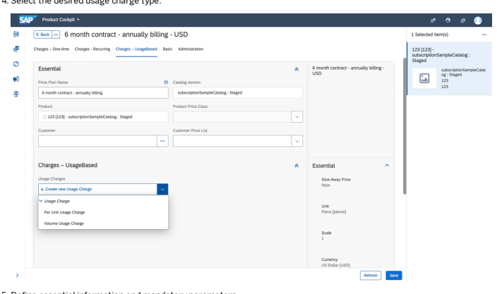
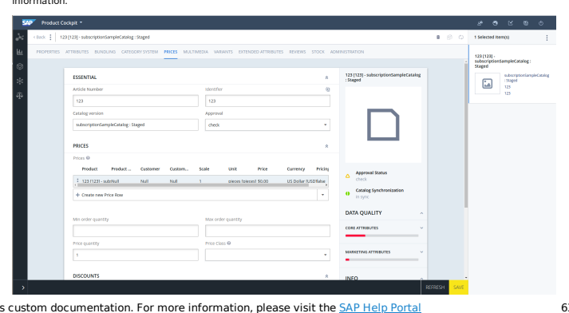
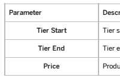

# Subscriptions

The Subscriptions module provides business users with tools to easily set up subscription-based pricing models, pricing periods, subscription terms, and conditions, and more, supporting innovation and fast time to market.

## Subscriptions Module

The Subscriptions module is designed to address the needs of subscription-based sales. SAP Commerce Cloud enables you to manage frequency, length, renewals, and other attributes unique to subscription business models. Powerful tools allow business users to easily set up subscription-based pricing models, pricing periods, subscription terms, and conditions, entitlements and metering, and more, supporting innovation and fast time to market. Subscription Bundles Module Subscription Bundles provides functionality and tests which rely upon having both Congurable Bundles and Subscriptions modules in order to function.

## Subscriptions Module

The Subscriptions module is designed to address the needs of subscription-based sales. SAP Commerce Cloud enables you to manage frequency, length, renewals, and other attributes unique to subscription business models. Powerful tools allow business users to easily set up subscription-based pricing models, pricing periods, subscription terms, and conditions, entitlements and metering, and more, supporting innovation and fast time to market.

subscriptioncockpits Extension cissubscription Extension subscriptionbackoffice Extension

## Subscriptions Features

The Subscriptions module provides a range of features related to dening and selling subscription-based products and capturing subscription orders. Through the Subscription Billing Gateway (SBG) and the Entitlements functionality the Subscriptions module provides you with the following features:
Manage varying levels of service plans as products with subscription-based pricing.

Personalize pricing based on the customer prole. Manage standard terms of service, for example term frequency and length, and renewal types. Provide exible fulllment options, for example order splitting. Optimize checkout ows for subscriptions. Support combinations of one-time, recurring, and per-usage charges. Manage multiple price periods. Integrate into third-party billing systems.
Subscriptions Functionality Regular products are purchased with one-off payments during the checkout process. Products with subscriptions, however, have a more complex ongoing payment process that require more complex handling. Setting Up Subscriptions in Backoffice Administration Cockpit Conguration options for dening subscriptions are available in the Administration Cockpit of Backoffice. Setting Up Subscriptions in the Legacy Cockpit Conguration options for dening subscriptions are available in the legacy Administration Cockpit.

## Subscriptions Functionality

Regular products are purchased with one-off payments during the checkout process. Products with subscriptions, however, have a more complex ongoing payment process that require more complex handling.

## Regular Products Vs. Products With Subscriptions

Figure: Regular products vs. products with subscriptions. Unlike regular products, products with subscriptions have both an initial price as well as on-going prices. For products with subscriptions, prices are often relative to the subscription's duration, e.g., the longer the term, the lesser the initial and/or ongoing prices. The reference solution offered with SBG offers following periods of time:
Monthly

Quarterly Semiannually Annually

## Features Of Products With Subscriptions

There are a few features related to products with subscriptions:

1. Subscription Terms: They specify what are terms of a subscription and length of a customer's commitment. You can also dene the conditions of renewal of a subscription or whether a customer is eligible to cancel the commitment and under which conditions. Subscription terms are related to Billing Cycle Plan where you can specify what is the frequency of payments, of what cycle type they are and what is the cycle day, that is, the day when a customer is to pay for the subscription.
2. Price Plan: It denes what are the periodic charges depending on length of the commitment.

## Communication Model

The communication for products with subscriptions looks as follows:

As you can see, the concept is modular. The first phase of communication is conducted between SAP Commerce Cloud and CIS
server. The solution ensures proper mapping of attributes in both directions. Then, the attributes are passed to subscription billing provider system. Again, the system ensures proper mapping of required attributes. Whole communication between SAP Commerce Cloud and CIS server is done using REST calls. You can find more details on communication between SAP Commerce Cloud and CIS server in cissubscription Extension .

## Related Information

ycommercewebservices Extension Configurable Bundle Features

## Setting Up Subscriptions In Backoffice Administration Cockpit

Conguration options for dening subscriptions are available in the Administration Cockpit of Backoffice.

## Dening Pricing Models For Products With Subscriptions

Backoffice enables product managers to view the product selection criteria and dependency rules from the backoffice perspective. Product managers can assign products to components and set rules regarding pricing and disabling of products.

## Creating Subscription Products

Learn how to create subscription products.

1. Make sure you are in the Product Cockpit perspective.

2. Select the desired product catalog and click the Create New Item button to open the Create/Add Item window: 3. Select the Product item type. 4. Dene the following information:

| Field             | Description                                                                                                                                                                                                                                                                     |
|-------------------|---------------------------------------------------------------------------------------------------------------------------------------------------------------------------------------------------------------------------------------------------------------------------------|
| Catalog version   | Product catalog assignment. Clicking the Add Reference button opens the reference selector. The following options are available: Catalog version: for more information, see Catalogs and Catalog Versions. Classication system version: for more information, see Classication. |
| Subscription Term | Subscription validity time period. Clicking the Add Reference button opens the reference selector. For more information, see Dening the Subscription Term.                                                                                                                      |
| Article Number    | Product number in catalog.                                                                                                                                                                                                                                                      |
| Sales unit        | Unit in which product is offered. Clicking the Add Reference button opens the reference selector.                                                                                                                                                                               |
| Supercategories   | Additional product category assignment. Clicking the Add Reference button opens the reference selector.                                                                                                                                                                         |
| Identier          | Product identier.                                                                                                                                                                                                                                                               |

5. Click Done to save the new subscription product.

## Dening The Subscription Term

Dene a subscription term to establish the validity period of the subscription.

Procedure 1. Double-click the previously created subscription product. See Creating Subscription Products.

The editor area opens.

2. In the editor area, click Subscriptions Terms & Conditions to display the available options. 

4. Click Save.

## Dening Subscription Price Plans

Dene subscription product price plans containing all price denitions for different billing events and recurring charges.

1. Double-click the product to open the editor.

2. Click Subscription Price Plans to display available options. 3. Click the Add Reference button to open the Create New Price Plan window. 4. Dene essential information and mandatory parameters.

5. Click Finish to save changes.

## Defining One-Time Charges

Define any one-time charges associated with the subscription.

1. Display the previously defined product.

2. Click Edit next to the newly created Subscription Price Plans to define additional charges and other information:

## Dening Recurring Charges

Dene recurring charges that occur periodically throughout the entire subscription validity period.

## Context

By dening recurring charge entries, you can differentiate pricing in given time periods. For example, during the rst three months from signing the contract, the subscriber is eligible for a discount, and the service access is free. From the fourth month on until the end of the contract, the subscription service costs $20 each month.

This is   For more    the SAP Help  38

1. Select the previously defined product.

2. Click Edit next to the newly created Subscription Price Plan, to define additional charges and other information.

5. Click Finish to save changes. Note that the recurring charge cycles cannot overlap.

## Dening Usage Charges

Dene usage charges to be applied based on the number of users that are charged.

1. Select a product.

This is   For more    the SAP Help  40

| Parameter   | Description                                      |
|-------------|--------------------------------------------------|
| Name        | Name of a given usage charge item.               |
| Usage Unit  | Unit in which given charge item is expressed in. |

Parameter Description

Usage Charge Type Denes which tier is applied in case the usage exceeds

specied values.

Example Denition For example, service access for a number of users costs:
$5 for 1-5 users,

$3 for 6-20 users, $1 for 21 users and more.

In case the usage reaches 25 users, contract owner can be

charged either $1 for each user starting from the rst one
(highest applicable tier) or can be charged by the number of users qualifying to each tier (each respective tier).

Figure: Each respective tier.

Figure: Highest applicable tier.

6. Click Finish to save changes. There can be only one usage charge entry with a given usage unit in a price plan. 7. Click the Edit button to open a newly created Usage Charge entry for editing. 8. Click the Add Reference button in the Usage Charge Entries section. 9. Select the Tier Usage Charge entry.

10. Dene tier information.

| Parameter   | Description                    |
|-------------|--------------------------------|
| Tier Start  | Tier starting value.           |
| Tier End    | Tier ending value.             |
| Price       | Product price in a given tier. |

11. Click Done to save changes.

12. Click the Add Reference button once again to dene the price for overage usage. 13. Select the Overage Usage Charge Entry option. 14. Dene the price customers are charged when exceeding usage values dened in tiers. 15. Click Done to save changes.

## Dening Billing Events And Plans For Subscription Products

Use Backoffice Administration Cockpit to create and manage billing events and plans for products offered on a subscription basis.

## Dening Billing Events

Dene billing events needed for modelling subscription products, for example service activation or subscription cancellation. These values are used during the creation of subscription products.

This is   For more    the SAP Help  43

1. Navigate to the Backoffice Administration Cockpit.

2. Select the Billing Event type element from available types list.

SAP

| SAP                 | s                   | Search                |                       |                      |                      |    |      |
|---------------------|---------------------|-----------------------|-----------------------|----------------------|----------------------|----|------|
| Filter tree (Alt+D) |                     |                       |                       |                      |                      |    |      |
| @ Cockpit           | >                   | AAAA                  | - & Ill S items       |                      |                      |    |      |
| BB                  | >                   | - Code 10             | Vrene (Order), 19     | Sequence 19          | Cart Aware           |    |      |
| 0 556987            | in cart 55697       | me in order 556987    |                       |                      |                      |    |      |
| I Deeplink Urb      | >                   | i                     | true                  |                      |                      |    |      |
| 1 256342            | Name in cart 256342 | Name in order 256342. | true                  |                      |                      |    |      |
| v                   | Rule Engine         | >                     | 1 446191              | Name in cart 446191. | Name in order 446191 | r  | true |
| 1.                  | 00                  | Name in cart 830711   | Name in order 830711. | true                 |                      |    |      |
| >                   | ❏ paynow            | Pay on Checkout       | Paid on order         | .                    | true                 |    |      |

»
3. Click the Create New Item  +  button to open the Create New Billing Event window.

4. Define the essential information and mandatory parameters.

No items selected

| Field                                                                                | Description                                                 |
|--------------------------------------------------------------------------------------|-------------------------------------------------------------|
| Code                                                                                 | Unique item identifier                                      |
| Name (Cart)                                                                          | Name of the billing event as displayed in the shopping cart |
| Name (Order)                                                                         | Name of the billing event as displayed on the order         |
| This is custom documentation. For more information, please visit the SAP Help Portal |                                                             |

(

| Field       | Description               |
|-------------|---------------------------|
| Description | Billing event description |

5. Click Finish to save the billing event.

## Dening Billing Plans

Dene usage units for subscription entitlements and regular usage charges. These values are used when creating subscription products in the Product Cockpit.

1. Navigate to the Backoffice Administration Cockpit.

2. Select the billing type from the available types.

3. Click the Create New Item button to open the Create New Billing Plan window.

5. Click Finish to save the new billing plan.

## Adding A New Subscription Term

Create a new subscription term that you can assign to subscription products.

1. Navigate to the Backoffice Administration Cockpit.

2. Select one of the available subscription terms.

This is   For more    the SAP Help  46
( )
[ 
ven... 0 Cancellar

| Contract Renewal Ty... © Contract Term F   |          |
|--------------------------------------------|----------|
| Acto-recent                                | Month(s) |

true Billing plan 3883.

true Billing plan 6575.

D
3. Click the Create New Item button to open the Create New Subscription Term window.
»
4. Define the essential information and mandatory parameters.

)

| Parameter               | Description                                                                                                                                                  |
|-------------------------|--------------------------------------------------------------------------------------------------------------------------------------------------------------|
| Id                      | Unique object identier.                                                                                                                                      |
| Name                    | Name of the billing event as it appears in the cart.                                                                                                         |
| Contract Term Number    | Determines the contract length.  Note Contract Length The length is calculated as follows: Contract Term Number * Contract Term Frequency = Contract Length |
| Contract Term Frequency | Denes basic contract length unit.                                                                                                                            |
| Contract Renewal Type   | Species system behavior after a given contract expires.                                                                                                      |
| Cancellable             | Species whether given subscription can be cancelled.                                                                                                         |
| Billing Plan            | Denes subscription term relation to given billing plan.                                                                                                      |

5. Click Finish to save the new subscription term.

## Setting Up Subscriptions In The Legacy Cockpit

Conguration options for dening subscriptions are available in the legacy Administration Cockpit.

## Dening Pricing Models And Entitlements For Subscription Products

The SAP Commerce Cloud Product Cockpit enables product managers to view the product selection criteria and dependency rules from the Administration Cockpit. SAP Commerce Cloud Product Cockpit enables product managers to assign products to This is   For more    the SAP Help  48 components and set rules regarding pricing and disabling of products.

This section focusses on:
Creating subscription products

Dening pricing model Managing product by assigning entitlements

## Starting The Sap Commerce Cloud Product Cockpit Procedure

1. Open an Internet browser.

2. Enter the URL of the Commerce Cockpit in the browser's address bar. The default URL is http://localhost:9001/mcc.

3. Log in with you user ID and the password you dened for that user.
4. Select the Language. 5. Click Login.

The selected cockpit appears.

## The Product Cockpit Menu

Once you have logged in, the default perspective for your selected cockpit appears. A menu appears in the upper left corner of the perspective. From the menu, you can select the following:
Data Language: Choose the language in which the screen text should appear.

User Group: View to which user group your user account is assigned. User Settings: Select which user settings to reset. Logout: Sign out of the current cockpit.

## Creating Subscription Products

This section explains how to create subscription products.

Context This is   For more    the SAP Help  50

1. Make sure you are in the Product perspective.

2. Select the desired product catalog and click the Create New Item button to open the Create/Add Item window:

 3. Select Product entry. 4. Dene essential information:

| Field             | Description                                                                                                                                                                                                                                                                     |
|-------------------|---------------------------------------------------------------------------------------------------------------------------------------------------------------------------------------------------------------------------------------------------------------------------------|
| Catalog version   | Product catalog assignment. Clicking the Add Reference button opens the reference selector. The following options are available: Catalog version: for more information, see Catalogs and Catalog Versions. Classication system version: for more information, see Classication. |
| Subscription Term | Subscription validity time period. Clicking the Add Reference button opens the reference selector. For more information, see Dening the Subscription Term.                                                                                                                      |
| Article Number    | Product number in catalog.                                                                                                                                                                                                                                                      |
| Sales unit        | Unit in which product is offered. Clicking the Add Reference button opens the reference selector.                                                                                                                                                                               |
| Supercategories   | Additional product category assignment. Clicking the Add Reference button opens the reference selector.                                                                                                                                                                         |
| Identier          | Product identier.                                                                                                                                                                                                                                                               |

5. Click the Done button to save the new subscription product.

## Dening The Subscription Term

This section explains how to dene a subscription term in the Product Cockpit.

## Context

Subscription term species time period a subscription product is offered in.

1. Double-click the previously created subscription product (see Creating Subscription Products).

The editor area opens.

2. In the editor area, click the Subscriptions Terms & Conditions section to display the available options. 3. Select a Subscription Term from the drop-down list:

## Assigning Entitlements To Subscription Products

This section explains how to dene entitlements the customer is eligible to after purchasing a given subscription product.

## Context

Entitlements specify what the customer is eligible to within a given product.

1. Double-click the subscription product you added in the previous chapter to edit its details. The editor area opens.

2. In the editor area, click the Included Entitlements section to display available options. 3. Click the Add Reference button.

4. Define essential parameters:

| Field   |
|---------|

| Description   |
|---------------|

| Field                           | Description                                                                                                                                                                                                                   |                                                                        |
|---------------------------------|-------------------------------------------------------------------------------------------------------------------------------------------------------------------------------------------------------------------------------|------------------------------------------------------------------------|
| Entitlement                     | Opens the entitlement drop-down list.  Note This eld is mandatory.Entitlements are presented in the following formats: Template Example                                                                                      | Description                                                            |
| Entitlement.name                | Phone mins (minute)                                                                                                                                                                                                           | The description contains                                               |
| (usageUnit.name)                | information about the name ofthe entitlement and the unit which the entitlement is measured in.                                                                                                                               |                                                                        |
| Entitlement.name                | Text messages                                                                                                                                                                                                                 | The description contains information about the name ofthe entitlement. |
| For example: Access to Football |                                                                                                                                                                                                                               |                                                                        |
| Description                     | Species what is displayed as a description of the ProductEntitlement in Product Cockpit. For example: Season-long game coverage access                                                                                        |                                                                        |
| Quantity                        | Species maximum quantity of the entitlement. This eld expects an integer. You should only ll in this eld if you have assigned a Usage Unit to the entitlement. For more information see Dening Entitlements. For example: 100 |                                                                        |
| String Condition                | Checks a grant string against a check string. For example: String Condition is discount20%, the customer types discount20% and receives 20 free documentaries to watch.                                                       |                                                                        |

| 7/12/2024 Field   | Description                                                                                                                                                                                                                                                                                                                                                                                                                                                                                                                                                                              |
|-------------------|------------------------------------------------------------------------------------------------------------------------------------------------------------------------------------------------------------------------------------------------------------------------------------------------------------------------------------------------------------------------------------------------------------------------------------------------------------------------------------------------------------------------------------------------------------------------------------------|
| Path Condition    | Checks a grant string against a check string, but the entire grant string does not have to match. Instead, only the grant string sections have to match. For example: Grant String CheckString Check Result /comedy/simpsons/season02 /comedy/simpsons/season02/episode04 Check passed, string sections match. /comedy/simpsons /comedy/simpsons/season02/episode04 Check passed, string sections match. /comedy /comedy/simpsons/season02/episode04 Check passed, string sections match. /comedy/simps /comedy/simpsons/season02/episode04 Check failed, string sections are different. |

| 7/12/2024 Field   | Description                                                                                                                                                                                                                                                                                                                                                                                                                                                                                                                                                                                                                                                                                                                                                                                                                                                                                                                                                                                        |
|-------------------|----------------------------------------------------------------------------------------------------------------------------------------------------------------------------------------------------------------------------------------------------------------------------------------------------------------------------------------------------------------------------------------------------------------------------------------------------------------------------------------------------------------------------------------------------------------------------------------------------------------------------------------------------------------------------------------------------------------------------------------------------------------------------------------------------------------------------------------------------------------------------------------------------------------------------------------------------------------------------------------------------|
| Geo Condition     | Checks a grant string against a check string, uses only the / separator for hierarchy levels, and the , separator for multi-geolocations. The grant and check strings are in the geoPath String format, which looks as follows: Country/Region/City or Country/Region or Country. Grant strings are geoPath Strings separated by commas, so grant strings can consist of more than one location. For example: Grant String CheckString Check Result Germany/Bavaria/Munich, Germany/Bremen /Bremen Check Germany/Bremen, USA passed, checked geoPath String is subregion of a location from grant geoPath String. Germany/Bavaria, Germany/Bavaria /Munich Check Germany/Bremen, USA passed, checked geoPath String is subregion of a location from grant geoPath String. Russia, USA Germany/Bavaria Check failed, checked geoPath String is not a subregion of any location from grant geoPath String. Germany/Bavaria/Munich Germany/Bavaria Check failed, grant geoPath String is more specic. |

| Field       | Description                                                                                                                                                                                                                                                                                                                                                                                                                                |
|-------------|--------------------------------------------------------------------------------------------------------------------------------------------------------------------------------------------------------------------------------------------------------------------------------------------------------------------------------------------------------------------------------------------------------------------------------------------|
| Time Units  | Denes time unit used in Begins from and Duration elds. For example: If Time Unit is Day, Start is 10, the checkout is 10th May, and Duration is 10 then a given entitlement is available from 20th May to 30th May. If Time Unit is Month, Start is 6, the checkout is 10th May, and Duration is 2 then a given entitlement is available from 10th October to 10th December.                                                               |
| Begins from | Indicates when the entitlement starts. This eld expects an integer.  Note 0 means the entitlement starts on checkoutFor example: If Time Unit is Day, Start is 10, the checkout is 10th May, and Duration is 10 then a given entitlement is available from 20th May to 30th May. If Time Unit is Month, Start is 6, the checkout is 10th May, and Duration is 2 then a given entitlement is available from 10th October to 10th December. |
| Duration    | How many Time Units the entitlement is available for. For example: If Time Unit is Day, Start is 10, the checkout is 10th May, and Duration is 10 then a given entitlement is available from 20th May to 30th May. If Time Unit is Month, Start is 6, the checkout is 10th May, and Duration is 2 then a given entitlement is available from 10th October to 10th December.                                                                |

## Dening Subscription Price Plans

This section explains how to dene subscription product price plan containing all price denitions for different billing events and recurring charges.

## Context

Subscription Price Plans provide the specic information about the price plan, containing all price denitions for different billing events and recurring charges.

1. Double-click the product dened in previous chapters of this tutorial. The editor area opens.

2. Click the Prices tab to display available options. 3. Select Price Plan in the drop-down list. 4. Dene essential information and mandatory parameters:

## Dening One-Time Charges

This section explains how to dene one-time charges.

1. Display the previously dened product.

2. Click the Edit button next to the newly created Subscription Price Plans, to dene additional charges and other

information:

## Dening Recurring Charges

Recurring charges occur periodically throughout the entire subscription validity period. By dening recurring charge entries, you can differentiate pricing in given time periods. For example, during the rst three months from signing the contract subscriber is eligible to discount, and thus service access costs $0. From the fourth month until the end of the contract, subscription service costs $20 each month.

## Context

To dene recurring charges, proceed as follows:

1. Display the previously dened product dened.

2. Click the Edit button next to the newly created Subscription Price Plan, to dene additional charges and other

information:

3. Click the Add Reference button in the Charges - Recurring section:

 4. Dene essential information and mandatory parameters. If you leave the End Cycle eld empty, this will result in a time interval valid until the subscription expires.
This is   For more    the SAP Help  62

5. Click the Done button to save changes. Note that the recurring charge cycles cannot overlap.

## Dening Usage Charges

Usage charges are applied basing on the number of users that are charged.

## Context

To dene the usage charge, proceed as follows:

1. Display the product dened in previous chapters of this tutorial.

2. Click the Edit button next to the newly created Subscription Price Plan, to dene additional charges and other information:

4. Select desired usage charge type:

5. Dene essential information and mandatory parameters.

| Parameter   | Description                                      |
|-------------|--------------------------------------------------|
| Name        | Name of a given usage charge item.               |
| Usage Unit  | Unit in which given charge item is expressed in. |

Parameter Description

Usage Charge Type Denes which tier is applied in case the usage exceeds

specied values.

Example Denition For example, service access for a number of users costs:
$5 for 1-5 users,

$3 for 6-20 users, $1 for 21 users and more.

In case the usage reaches 25 users, contract owner can be

charged either $1 for each user starting from the rst one
(highest applicable tier) or can be charged by the number of users qualifying to each tier (each respective tier).

Figure: Each respective tier.

Figure: Highest applicable tier.

6. Click the Done button to save changes. There can be only one usage charge entry with given usage unit in a price plan.
7. Click the Edit button to open newly created Usage Charge entry for editing. 8. Click the Add Reference button in the Usage Charge Entries section. 9. Select the Tier Usage Charge entry.

10. Dene tier information.

| Parameter   | Description                    |
|-------------|--------------------------------|
| Tier Start  | Tier starting value.           |
| Tier End    | Tier ending value.             |
| Price       | Product price in a given tier. |

11. Click the Done button to store changes.

12. Click the Add Reference button once again to dene price for overage usage. 13. Select the Overage Usage Charge Entry option. 14. Dene the price customers are charged when exceeding usage values dened in tiers. 15. Click the Done button to save changes.

## Related Information

Working with the Product Cockpit

## Dening Billing Events And Plans For Subscription Products

Create and manage billing events and plans for products offered on a subscription basis.

## Dening Billing Events

This section explains how to dene different billing events needed for modelling subscription products, for example service activation or subscription cancellation. These values are used during the creation of subscription products in the Product Cockpit.

## Context

Billing Events dene different types of one-time charges related to specic events, such as service activation or contract termination. To dene a billing event, perform the following steps:

1. Make sure you are in the Admin perspective of the Administration Cockpit.

 3. Click the Create New Item button to open the Create/Add Item window.

| Field        | Description                                                                |
|--------------|----------------------------------------------------------------------------|
| Code         | Unique item identier                                                       |
| Name (Cart)  | Name of the billing event as displayed in the shopping cart                |
| Name (Order) | Name of the billing event as displayed on the order                        |
| Description  | Billing event description                                                  |
| Sequence     | Billing event position in billing events sequence                          |
| Cart Aware   | Determines if the billing event is visible in the cart and during checkout |

5. Click the Done button to save the billing event.

## Dening Billing Plans

This section explains how to dene usage units for subscription entitlements and regular usage charges. These values are used when creating subscription products in the Product Cockpit.

A Billing Plan denes the billing specics of the subscription plan.

To dene a billing plan, perform following steps:

1. Make sure you are in the Admin perspective of the Administration Cockpit.

3. Click the Create New Item button to open the Create/Add Item window. The system asks you whether you want to create a billing plan for a specic frequency or event.

## Defining The Subscription Term

This section explains how to define subscription terms. These values are used during the creation of subscription products in the Product Cockpit.

## Context

A subscription term defines the subscription validity time period. To define a subscription term, perform following steps:

1. Make sure you are in the Admin perspective of the Administration Cockpit.

This is custom documentation. For more information, please visit the SAP Help Portal

5. Click the Done button to save the new subscription term.

## Subscriptions Architecture

This is   For more    the SAP Help  72 The Subscriptions module's extensions provide additional functionalities for subscription services and storefronts.

## Dependencies

For a complete list of SAP Commerce Cloud recipes that may include this module, see Installer Recipes. For a complete list of the SAP Commerce Cloud, integration extension pack recipes that may include this module, see Installer Recipe Reference.

## Extensions

The Subscriptions module consists of the following extensions:
subscriptionservices Extension

subscriptionfacades Extension subscriptioncockpits Extension cissubscription Extension subscriptionbackoffice Extension

## Subscriptionservices Extension

The subscriptionservices provides a data model and functionality around subscription-based services that are commonly required in the telecommunication and digital distribution industries. The subscriptions services are relatively generic and, therefore, can be used for constructing storefronts for other industries.

## Note

An SAP Commerce Cloud extension may provide functionality that is licensed through different SAP Commerce Cloud modules. Make sure to limit your implementation to the features dened in your contract license. In case of doubt, please contact your sales representative.

## Subscription Functionality

To separate the subscription products that have different billing times than regular pay now products, and to re-use the existing calculation framework, a multicart solution has been implemented. A parent cart contains every product that has been added and references additional child carts. Each child cart represents prices for one specic billing time like On First Bill, Monthly, or Yearly and the parent cart represents the Pay Now prices and well as all other product information.

| Item        | Description                                                                                                                         |
|-------------|-------------------------------------------------------------------------------------------------------------------------------------|
| BillingTime | BillingTime denes the time component of a price. This could either be a one time BillingEvent or a recurring time BillingFrequency. |

This is   For more    the SAP Help  74

| 7/12/2024 Item   | Description                                                                                                                                                                                                                                                                                                                        |
|------------------|------------------------------------------------------------------------------------------------------------------------------------------------------------------------------------------------------------------------------------------------------------------------------------------------------------------------------------|
| BillingEvent     | BillingEvent denes specic events that are subject to being charged. Examples include Pay now, On rst bill, and On cancellation.                                                                                                                                                                                                    |
| BillingPlan      | The BillingPlan object denes billing-specic settings such as the frequency in which the customer should be billed and the exact date.                                                                                                                                                                                              |
| BillingFrequency | The BillingFrequency denes the interval on which the customer is charged. Examples include Pay now, On rst bill, Daily, Monthly, and so on.                                                                                                                                                                                        |
| BillingCycleType | The BillingCycleType, together with the attribute billingCycleDay, denes the handling of the billing cycle. The reference solution comes with the following default values: end_of_month day_of_month subscription_start Some values require dening a billingCycleDay item day_of_month, others such as subscription_start do not. |

## Subscription Product

A Product contains attributes to create subscription product type.

The SubscriptionProduct type provides a generic base that an implementation team can use to implement specic subscription types such as a service plan for telecommunication business. It is special in the following ways:

You can associate it with a SubscriptionTerm, covering terms and conditions under which a given subscription item is offered. You can associate it with metered and non-metered entitlements. For more information on entitlements, see the Entitlements Module.

You can associate it with one or more SubscriptionPricePlans, which in addition to a paynow price also stores information about recurring period charges, additional one-time charges, and usage charges.

The system can easily identify a subscription product to thanks to SubscriptionProductService.

## Tip

The Telco and Utilities Accelerator includes the additional ServicePlan and ServiceAddOn product types, which contain additional elds specic for their purpose. Find more information in Price, Tax, and Discount Calculation.

## Subscription Term

The SubscriptionTerm object stores information about the term of service denition and its renewal options. It also references a BillingPlan to dene billing specic settings.

Element Description

| 7/12/2024 Element        | Description                                                                                                                                                                                                                                                                                                                                                                                       |
|--------------------------|---------------------------------------------------------------------------------------------------------------------------------------------------------------------------------------------------------------------------------------------------------------------------------------------------------------------------------------------------------------------------------------------------|
| TermOfServiceFrequency   | TermOfServiceFrequency is an enumerated type and can be set at the SubscriptionTerm to specify the incremental periods of time, which lapse throughout the contract. When multiplied by the integer TermOfServicenumber, the total duration of the contract term is found. For example, in the context of 12 months, 12 would be TermOfServicenumber, and months would be TermOfServiceFrequency. |
| TermOfServiceRenewalType | The TermOfServiceRenewalType can be specied at a SubscriptionTerm and denes handling of contract renewal once the validity period specied by the TermOfServiceFrequency is reached. The reference solution is delivered with the following values: none auto once twice three-times                                                                                                               |

## Subscription Price Plan

SubscriptionPricePlan species in detail the pricing of subscription products. It includes one time charges, recurring charges, and usage charges. Price item denition includes following attributes:

| Attribute   | Description                                                                                                                          |
|-------------|--------------------------------------------------------------------------------------------------------------------------------------|
| name        | The name of the price plan. An example is the VIP that can appear on a bill later on.                                                |
| currency    | Species the currency of a given price denition.                                                                                      |
| pg          | Price group denition, allows applying a given price denition to a group of products dened on a Product Pricelist.                    |
| ug          | Price group denition, allows applying a given price denition to a group of customers dened on a Customer Pricelist.                  |
| price       | Actual price value, that is equals to paynow price for the SubscriptionProducts.                                                     |
| net         | Boolean value determining whether the price is before tax (gross price), or after tax (net price). By default, prices include taxes. |

The above attributes contribute in the price-nding algorithm that has been re-used from the europe1 extension functionality and explained in the europe1 Pricing System Guide document.

All the following charges extend the abstract super type ChargeEntry, which is used for storing the specic prices.

## One-Time Charges

OneTimeChargeEntry entities represent one-time, non-recurring charges such as an activation fee or service installation cost. A name can be dened. Examples include Activation Fee, BillingEvent, and On rst bill.

One exceptional BillingEvent is paynow, which overrides the default paynow price attribute in the SubscriptionPricePlan.

## Recurring Charges

RecurringChargeEntry entities enable exible modeling of recurring charges. For example, service access in the rst three

months from signing the contract is eligible for discount and costs $0. For the next months, the charge is $20 until the end of the contract.

## Usage Charges

| Data Type              | Description                                                                                                                                                                                                                      |
|------------------------|----------------------------------------------------------------------------------------------------------------------------------------------------------------------------------------------------------------------------------|
| UsageCharge            | Abstract UsageCharge entities comprise usage unit and name of an item subject to usage charging. UsageCharges dene how a given item appears on the bill. Example includes cloud data storage service or service access licenses. |
| UsageUnit              | UsageUnits denes singular and plural names of units applied to metered entitlements.                                                                                                                                             |
| PerUnitUsageCharge     | PerUnitUsageCharge entities represent unit-dependent usage charging. PerUnitUsageCharge denitions are supplemented by UsageChargeType entities.                                                                                  |
| VolumeUsageCharge      | VolumeUsageCharge entities represent volume-dependent usage charging.                                                                                                                                                            |
| UsageChargeEntry       | UsageChargeEntry objects are complete charging entries. For example, Storage service, charged Monthly, per Unit, GB, with 2 tiers and an overage dened.                                                                          |
| TierUsageChargeEntry   | TierUsageChargeEntry entities enable modeling tiered charging scenarios in which the unit price of given service changes with service usage.                                                                                     |
| OverageUnitChargeEntry | OverageUnitChargeEntry entity denes unit pricing when the subscriber is past the last specied tier.                                                                                                                              |

## Usage Charge Type

UsageChargeType in tiered pricing denes which tier is applied in case the usage exceeds specied values.

For example, service access for a number of users costs:
$5 for 1-5 users, $3 for 6-20 users,

In case the usage reaches 25 users, the contract owner can be charged either $1 for each user starting from the rst one, that is highest applicable tier, or can be charged by the number of users qualifying to each tier, that is each respective tier.

 Figure: Highest applicable tier.

 Figure: Each respective tier.

## Billing Event Promotions

The subscriptionservices extension provides a functionality of assigning promotions to particular billing frequencies and events. For example:
A customer purchases a Pay Now item for over 50$ and receives a 5$ promotion A customer purchases a monthly billing plan for 120$ and receives a 15$ discount each month.

You can add a billing time restriction during the creation of a new promotion in the Restrictions tab of the Backoffice. The subscriptionbackoffice extension provides the necessary Backoffice customization to support adding billing time restrictions.

## Subscription Services

The subscriptionservices extension provides some special services required to implement logic common in the telecommunication and digital distribution industries:

Service Name Description

| 7/12/2024 Service Name                                 | Description                                                                                                                                                                                                                                                                                                                                                                                                                                                                                                                                                                                                                                                            |
|--------------------------------------------------------|------------------------------------------------------------------------------------------------------------------------------------------------------------------------------------------------------------------------------------------------------------------------------------------------------------------------------------------------------------------------------------------------------------------------------------------------------------------------------------------------------------------------------------------------------------------------------------------------------------------------------------------------------------------------|
| SubscriptionCommerceCartService                        | Overrides DefaultCommerceCartService where necessary to implement the functionality specic to subscription products. The addToCart method with the xmlProduct parameter are deprecated and the logic is moved to the SubscriptionAddToCartMethodHook hook. On a method level, it adds or overrides existing methods to support the Products type and especially their BillingTimes. It creates or resolves the specic child cart based on BillingTime and delegates the add, update - including remove - or calculate operation to that child cart.                                                                                                                    |
| BillingTimeService                                     | Exposes methods to deal with billing time operations.                                                                                                                                                                                                                                                                                                                                                                                                                                                                                                                                                                                                                  |
| FindSubscriptionPricingWithCurrentPriceFactoryStrategy | Overrides FindPricingWithCurrentPriceFactoryStrategy and retrieves prices from the valid SubscriptionPricePlan and their one-time and recurring price denitions. Discounts are only applied to the recurring price. The simple logic for the recurring price is as follows: base price = last recurring price discounted price = rst recurring price This assumes that tiered recurring prices are dened and the price increases during time. If there is only one recurring price (no tiers), there is no discount. This logic can be customized according to business requirements. This method is deprecated. Instead use SubscriptionBundleFindDiscountValuesHook. |
| DefaultSubscriptionCommerceCheckoutService             | Overrides DefaultCommerceCheckoutService where necessary to implement the functionality for the handling of multi-cart orders (parent + dependent children).                                                                                                                                                                                                                                                                                                                                                                                                                                                                                                           |
| SubscriptionCommercePriceService                       | Extends CommercePriceService to retrieve the applicable SubscriptionPricePlan for a product as CommercePriceService returns the price information only. The standard ltering functionality for PriceRows of the active PriceFactory is used.                                                                                                                                                                                                                                                                                                                                                                                                                           |
| ExtendedCatalogAwareEurope1PriceFactory                | Extends CatalogAwareEurope1PriceFactory to return a SubscriptionPricePlan for a product with subscription attributes assigned. It uses the standard matching functionality for price rows to identify the rst matching price row.                                                                                                                                                                                                                                                                                                                                                                                                                                      |

| 7/12/2024 Service Name             | Description                                                                                                                                                                             |
|------------------------------------|-----------------------------------------------------------------------------------------------------------------------------------------------------------------------------------------|
| DefaultSubscriptionCommerceCartDao | Extends the DefaultCommerceCartDao class overriding the getCartsForSiteAndUser() method. The overridden method returns a list of carts that do not have parent carts (parent carts). Moreover, the new DAO is referenced in the subscriptionservicesspring.xml le, so it is used instead of the DefaultCommerceCartDao class.                                                                                                                                                                                         |
| DefaultSubscriptionProductService  | Contains only oneisSubscription(Product) method that enables to distinguish between subscription products and regular products. It replaces the product instanceof SubscriptionProduct. |

## Subscription Management

Management of subscriptions is implemented in the cissubscription extension. Refer to cissubscription Extension for more information.

## Item Type

The subscriptionservices extension provides a Subscription item type dened in the **subscriptionservicesitems.xml** le.

subscriptionservices-items.xml
<itemtype code="Subscription" generate="true" jaloclass="de.hybris.platform.subscriptionservices.ja extends="GenericItem" autocreate="true" > <deployment table="Subscription" typecode="9503"/>
The Subscription item type contains the following attributes:

| Attribute Name     | Data Type   |
|--------------------|-------------|
| id                 | String      |
| name               | String      |
| description        | String      |
| productId          | String      |
| orderId            | String      |
| billingsystemId    | String      |
| startDate          | Date        |
| endDate            | Date        |
| renewalType        | String      |
| subscriptionStatus | String      |
| cancellable        | Boolean     |
| billingFrequency   | String      |
| contractDuration   | String      |

| 7/12/2024 Attribute Name   | Data Type   |
|----------------------------|-------------|
| placedOn                   | Date        |
| cancelledDate              | Date        |
| customerId                 | String      |

## Multicart Implementation

Every product in the cart is present in the parent paynow cart and in child carts, if applicable. If there is no paynow price for a given item, a respective entry in the parent cart takes the zero value. For example:
Product1: 20$ paynow, 10$ onrstbill and 60$ monthly Product2: 100$ paynow

| parentcart (paynow)     | childcart (onrstbill)   | childcart (monthly)   |    |
|-------------------------|-------------------------|-----------------------|----|
| Product1 20             | Product1 10             | Product1 60           |    |
| Product2 100 Product3 0 | Product3 30             |                       |    |
| subtotal                | 120                     | 10                    | 90 |

Product3: 0$ paynow and 30$ monthly Identifying Correct Cart Total Price

## Parent Cart

Standard product - standard paynow price is taken for cart price calculation.

Subscription product - paynow price is taken if applicable, or 0 if paynow price is not dened.

## Child Cart

Standard product: 0, as the paynow price is dened in the parent cart. Subscription product: one-time charge for billing event, for example onrstbill, is taken in the calculation if such exists, or 0 otherwise. In case of the billing frequency item, for example monthly and matching subscriptionterm.billingplan.billingfrequency value, the last period is taken as the standard price or the rst period is taken as discount price.

## Add To Cart

The parent cart, which always has the billing time paynow, stores an entry for each product that is added to cart. Entries of subscription products that do not have a paynow price are stored with a 0.00 price in the parent cart. The parent cart may have one or more child carts which contain additional entries for those subscription products that have other/additional billing times.

One child cart per billing time is created. To support this functionality, the SubscriptionAddToCartMethodHook has been introduced.

The beforeAddToCart hook method checks if cart is a parent cart. In case of subscription product, it also checks if it is allowed to add given quantity.

This is   For more    the SAP Help  81 The afterAddToCart hook in case of subscription product, handles multicart functionality by creating child carts. Child cart entries are created using DefaultCartService.

Subscription specic multicart functionality is implemented in SubscriptionAddToCartMethodHook. With the SubscriptionAddToCartMethodHook hook there is no need to extend addToCart of DefaultCommerceCartService.

CommerceCartParameter is extended with xmlProduct attribute for XML representation of the product.

## Save Cart

The save cart functionality primarily allows a customer to save and restore their saved carts at a later date. This functionality is provided as a set of methods embedded within independent strategies that can be wired-up, relative to the different business requirements and the front-end implementations they are used for. These strategies can be easily extended with pre/posthooks. The following save cart operations are currently supported:

Save a session cart as a saved cart Save specic cart IDs, for a back-end operations, as saved carts Display a list of saved carts Display the details of a saved cart Restore a saved cart to an active session cart Delete saved carts Clone saved carts Edit the name and description of a saved cart
To support this functionality, the CommerceSaveCartMethodHook interface has been introduced. As subscription products consist of parent and child carts in the Platform, handling them is different than handling of regular products. Upon calling the saveCart() or cloneSaveCart() methods, the CommerceSaveCartMethodHook interface ensures that all the child carts are cloned/saved, but only the parent cart is processed, returned and passed further. If a save or a clone cart request is sent to a child cart, the system throws the CommerceSaveCartException.

## Update Cart

The SubscriptionUpdateCartEntryHook hook extends the default functionality of cart entry quantity change and removal. It is resposible for the following:

updating quantity of child entries, that keep information about recurring payments removing child entries along with removal of the parent cart entry recalculating child carts removing empty child carts
The SubscriptionFindDiscountValuesHook implements FindDiscountValuesHook for subscriptions. It implements the discount nding strategy.

The SubscriptionPriceFindPriceHook implements FindPriceHook for subscriptions. It implements the price nding strategy.

Merging Subscription Products The EntryMergeFilterSubscription class denies merging of entries with subscription products. Quantity of subscription

entries should always be one, so any merge between subscription entries is disabled. The class achieves that by rejecting merge for subscription products unconditionally.

## Additional Filter For Find Orders By Store Search

The following property is dened in the project.properties le for the subscriptionservices extension, and is set to true:
commerceservices.find.orders.additional.filter.enabled=true This property is used by the commerceservices extension. With the property enabled, an additional lter is added to the "nd orders by customer store" query, ltering by attribute AbstractOrder.parent, as follows:
" AND {parent} IS NULL"
If you choose to do so, you can override this property in your local.properties le.

## Related Information

Subscriptions Module acceleratorservices Extension

## Subscriptionfacades Extension

The subscriptionfacades extension extends the commercefacades extension with implementation of the subscription functionality. extension provides a data model and functionality around subscription-based services that are commonly required in the telecommunication and digital distribution industries. The subscriptions services are relatively generic and, therefore, can be used for constructing storefronts for other industries.

## Note

An SAP Commerce Cloud extension may provide functionality that is licensed through different SAP Commerce Cloud modules. Make sure to limit your implementation to the features dened in your contract license. In case of doubt, please contact your sales representative.

This is   For more    the SAP Help  83

## Data Transfer Objects

Legend Core SAP Commerce Cloud functionality Subscription functionality

## Facades

The SAP Commerce Cloud subscriptionfacades extension extends the default functionality of commercefacades with

implementation of subscription-specic features. Figure: Facades data model. Legend This is   For more    the SAP Help  84 Subscription functionality - purple

## Subscriptioncartfacade

The CartFacade is enhanced to deal with the subscription functionality. No subscription-specic method has been added yet, but one existing method has been overwritten:

addToCart method is persisting an XML representation of the product at the cart entry to store the contract of the customer and not just link the cart entry to the catalog product. xmlProduct is added to CommerceCartParameter in case of the subscription products. To preserve backwards compatibility xmlProduct is added to CommerceCartParameter into BundleCommerceCartService in subscriptionbundle module.

## Defaultsubscriptionfacade

The DefaultSubscriptionFacade extends the AbstractSubscriptionFacade class and provides a no-op implementation of the de.hybris.platform.subscriptionfacades.SubscriptionFacade interface. The cissubscription extension provides both a real integration with a CIS subscription service, as well as a mock implementation of the subscription interface, the DefaultCisSubscriptionFacade class.

## Populators

OrderEntry Populators

The majority of the populators are simple and straightforward converting attributes, except for the following ones:

| Populator Name                     | Description                                                                                                                                                                                              |
|------------------------------------|----------------------------------------------------------------------------------------------------------------------------------------------------------------------------------------------------------|
| SubscriptionProductStockPopulator  | Sets a constant high value of stock for every Product as telecommunication subscriptions typically do not rely on stock levels.                                                                          |
| AbstractSubscriptionOrderPopulator | Responsible for merging child carts along with all their prices (total price, total tax, delivery cost, total discount and subtotal). Those prices are stored at billing time in an OrderPriceData list. |
| SubscriptionOrderEntryPopulator    | Responsible for merging entries from child carts along with all their prices (total price and base price). Those prices are stored per billing time in an OrderEntryPriceData list.                      |

## Related Information

Subscriptions Module commercefacades Extension Using Façades and DTOs - Best Practice How To Extend the ProductFacade

## Subscriptioncockpits Extension

The subscriptioncockpits extension contains specic pieces of customization that offer goods sold as subscriptions, such as magazines subscriptions or video on demand membership subscription. The subscriptioncockpits extension allows modelling prices depending on the subscription term.

## Caution

This page refers to deprecated software. For further details, see Deprecation Status.

## Note

An SAP Commerce Cloud extension may provide functionality that is licensed through different SAP Commerce Cloud modules. Make sure to limit your implementation to the features dened in your contract license. In case of doubt, please contact your sales representative.

The subscriptioncockpits extension adds type customizations to the SAP Administration Cockpit and Product Cockpit in order to dene a subscription product along with the subscription terms. Other than standard cockpit customizations, it uses a special feature to allow nested popups in multiple levels. This can be enabled with the following settings in your project.properties le:
productcockpit.default.popUpEditor.allowOverlap=true default.popUpEditor.allowOverlap=true

## Related Information

Subscriptions Module yacceleratorcockpits Extension

## Cissubscription Extension

The cissubscription extension enables communication between a SAP Commerce Cloud back-end CIS server and a subscription billing provider.

## Note

An SAP Commerce Cloud extension may provide functionality that is licensed through different SAP Commerce Cloud modules. Make sure to limit your implementation to the features dened in your contract license. In case of doubt, please contact your sales representative.

## Default Cis Subscription Facade

When you add the cissubscription extension to your localextensions.xml le, the DefaultCisSubscriptionFacade automatically injects the SubscriptionFacade interface. The injection of the SubscriptionFacade interface causes the Subscription Billing Gateway to call the subscription billing provider for all methods. If no subscription billing provider is congured, an embedded default mock implementation is used and mock values are returned. The default implementation executes most API methods against the SAP Commerce Cloud back-end. However, in some instances, NO-OP calls are used.

The cissubscription extension adds the accelerator.storefront.checkout.multistep.sop ag to the project.properties le:
cissubscription/project.properties accelerator.storefront.checkout.multistep.sop=true true - sets the storefront to use the standard payment method form

false - sets the storefront to use the mocked silent order post form

## Subscription Facade Interface Description

| Subscription Facade                        | Description                                                                                                                                                     |
|--------------------------------------------|-----------------------------------------------------------------------------------------------------------------------------------------------------------------|
| SubscriptionFacade.updateProfile()         | Calls the CIS Service to create or update an account in CIS the user that is currently logged into the storefront. Calls: CisSubscriptionService.updateProfile( |
| SubscriptionFacade.hpfUrl()                | Calls the CIS Service to retrieve the URL for the silent orde page. Calls: CisSubscriptionService.hpfUrl()                                                      |
| SubscriptionFacade.initializeTransaction() | Calls the CIS Service to initialize the web session. Calls: CisSubscriptionService.initializeTransaction()                                                      |
| SubscriptionFacade.finalizeTransaction()   | Calls the CIS Service to nalize the web session. Calls CisSubscriptionService.finalizeTransaction                                                               |

| 7/12/2024 Subscription Facade                                                        | Description                                                                                                                                                                                                                                                                                                                                                                                                                                                                                                                                                    |
|--------------------------------------------------------------------------------------|----------------------------------------------------------------------------------------------------------------------------------------------------------------------------------------------------------------------------------------------------------------------------------------------------------------------------------------------------------------------------------------------------------------------------------------------------------------------------------------------------------------------------------------------------------------|
| SubscriptionFacade.createSubscriptions()                                             | Calls the CIS service, so that the information about the ord delegates, for example to a billing provider. The method is wrapper for the processSubscriptions() and processPayNow() methods as it checks if there are subscriptions in the order and calls the processSubscriptions() method for them. If payno prices are in the order, the processPayNow() method is called. Calls: if there is a paynow product in the order, use SbgCheckoutFacade.processPayNow() if there is a subscription product in the order, u SbgCheckoutFacade.processSubscriptio |
| SubscriptionFacade.processSubscriptions()                                            | Calls the CIS service to process the subscription prices of order at the payment provider. Calls: cissubscription Extension                                                                                                                                                                                                                                                                                                                                                                                                                                    |
| SubscriptionFacade.processPayNow()                                                   | Calls the CIS service to process the paynow prices of an o at the payment provider. Calls: CisSubscriptionService.processPayNow()                                                                                                                                                                                                                                                                                                                                                                                                                              |
| SubscriptionFacade.replacePaymentMethod()                                            | Calls the CIS server to replace the payment method for an existing subscription with another already existing paymen method. Calls: CisSubscriptionService.replacePaymentMethod()                                                                                                                                                                                                                                                                                                                                                                              |
| SubscriptionFacade.getCancelReturnUrl()                                              | Retrieves the callback URL, which is called by the paymen provider after the silent order page post has not been successful. The method may be overridden to nd the URL complex strategy.                                                                                                                                                                                                                                                                                                                                                                      |
| SubscriptionFacade.getReturnUrl()                                                    | Retrieves the callback URL, which is called by the paymen provider after the silent order page post has been success The method may be overridden to nd the URL in a comple strategy.                                                                                                                                                                                                                                                                                                                                                                          |
| SubscriptionFacade.getMerchantAccountId()                                            | Retrieves the merchant account ID, which is a unique ident for the customer to be registered at the payment provider.                                                                                                                                                                                                                                                                                                                                                                                                                                          |
| SubscriptionFacade.changePaymentMethod()                                             | Calls the CIS server to change an existing payment method                                                                                                                                                                                                                                                                                                                                                                                                                                                                                                      |
| SubscriptionFacade.updateSubscription()                                              | Calls the CIS server to update a subscription.                                                                                                                                                                                                                                                                                                                                                                                                                                                                                                                 |
| SubscriptionFacade.getSubscriptions()                                                | Returns all subscriptions for the logged in customer.                                                                                                                                                                                                                                                                                                                                                                                                                                                                                                          |
| This is custom documentation. For more information, please visit the SAP Help Portal | 89                                                                                                                                                                                                                                                                                                                                                                                                                                                                                                                                                             |

| 7/12/2024 Subscription Facade                            | Description                                                                                                          |
|----------------------------------------------------------|----------------------------------------------------------------------------------------------------------------------|
| SubscriptionFacade.createPaymentSubscription()           | Creates a payment subscription on the hybris side.                                                                   |
| SubscriptionFacade.getSubscription()                     | Returns a subscription for the logged in customer.                                                                   |
| SubscriptionFacade.getUpsellingOptionsForASubscription() | Returns possible upselling options.                                                                                  |
| SubscriptionFacade.getUpgradePreviewBillings()           | Returns possible billing changes between current subscrip and the upgrade option. Returns a list of future billings. |
| SubscriptionFacade.updateSubscriptionAutoRenewal()       | Updates the autorenew status of a subscription.                                                                      |
| SubscriptionFacade.changeSubscriptionState()             | Changes the state of a subscription.                                                                                 |
| SubscriptionFacade.extendSubscriptionTermDuration()      | Extends the duration of a subscription.                                                                              |
| SubscriptionFacade.getBillingActiityList()               | Returns a list of billing activity for a subscription.                                                               |
| SubscriptionFacade.getBillingActivityDetail()            | Returns a le stream containing details for the billing activ                                                         |

## Cis Subscription Client Service Interface Description

| CIS Service                            | Description                                  | Input                                                                                                                                                                              |
|----------------------------------------|----------------------------------------------|------------------------------------------------------------------------------------------------------------------------------------------------------------------------------------|
| CisSubscriptionService.updateProfile() | Creates or updates an account in CIS.        | cisClientRef(String) CisSubscriptionProfileRequest currencyIso(String) profileId(String) emailAddress(String) shippingAddress(CisAddress) firstname lastname vendorParameters(Map) |
| CisSubscriptionService.hpfUrl()        | Retrieves the URL for the silent order page. | cisClientRef(String)                                                                                                                                                               |

| 7/12/2024 CIS Service                               | Description                                                                                                                                                            | Input                                                                                                                                                                                                                                      |
|-----------------------------------------------------|------------------------------------------------------------------------------------------------------------------------------------------------------------------------|--------------------------------------------------------------------------------------------------------------------------------------------------------------------------------------------------------------------------------------------|
| Calls the CIS server to initialize the web session. | cisClientRef(String) CisSubscriptionSessionInitReque clientIpAddress(String) returnUrl(String) cancelReturnUrl(String) merchantAccountId(String) vendorParameters(Map) |                                                                                                                                                                                                                                            |
| CisSubscriptionService.finalizeTransaction()        | Calls the CIS server to nalize the web session.                                                                                                                        | cisClientRef CisSubscriptionSessionFinalizeR authorizationRequestId(String) authorizationRequestToken(Strin vendorParameters(Map)                                                                                                          |
| CisSubscriptionService.post()                       | Calls the CIS server. Delegates the information about the order, for example, to a billing provider.                                                                   | cisClientRef(String) CisSubscriptionOrderPostRequest                                                                                                                                                                                       |
|                                                    | Note                                                                                                                                                                   | subscriptionOrder(CisSubscripti                                                                                                                                                                                                            |
| This method is deprecated.                          | merchantAccountId(String) merchantPaymentMethodId(String) vendorParameters(Map)                                                                                        |                                                                                                                                                                                                                                            |
| CisSubscriptionService.processPayNow()              | Calls the CIS Service to process the paynow prices of an order at the payment provider.                                                                                | cisClientRef(String) CisSubscriptionPayNowRequest profileId(String) amount(BigDecimal) currency(String) paymentMethodId(String) merchantTransactionId(String) merchantTransactionDescription( lineItems(CisLineItem) vendorParameters(Map) |
| CisSubscriptionService.replacePaymentMethod()       | Calls the CIS server to replace the payment method for an existing subscription with another existing payment method.                                                  | cisClientRef(String) CisSubscriptionReplacePaymentMe subscriptionId(String) paymentMethodId(String) vendorParameters(Map)                                                                                                                  |

| 7/12/2024 CIS Service                                                                | Description                                                                                                               | Input                                                                     |
|--------------------------------------------------------------------------------------|---------------------------------------------------------------------------------------------------------------------------|---------------------------------------------------------------------------|
| CisSubscriptionService.changePaymentMethod()                                         | Calls the CIS server to change details on the payment method for an existing account,for example to disable a creditcard. | cisClientRef(String) CisChangePaymentMethodRequest                        |
|                                                                                     | Note                                                                                                                      |                                                                           |
| This method is deprecated.                                                           | paymentMethodId(String) vendorParameters(Map)                                                                             |                                                                           |
| CisSubscriptionService.cancelSubscription()                                          | Calls the CIS server to cancel an existing subscription.                                                                  | cisClientRef(String) CisSubscriptionCancelSubscripti                      |
|                                                                                     | Note                                                                                                                      |                                                                           |
| This method is deprecated.                                                           | paymentMethodId(String) vendorParameters(Map)                                                                             |                                                                           |
| CisSubscriptionService.cancelSubscription()                                          | Calls the CIS server to cancel an existing subscription.                                                                  | cisClientRef(String) merchantSubscriptionId(String) effectiveFrom(String) |
| CisSubscriptionService.createCustomerProfile()                                       | The methods calls the CIS server to create a customer prole.                                                              | cisClientRef(String) CisSubscriptionProfileRequest                        |
| cissubscription Extension                                                            | Calls the CIS server. The information about the order can be delegated to a billing provider to create a subscription.    | cisClientRef(String) CisSubscriptionCreateRequest                         |
| CisSubscriptionService.initializeTransaction()                                       | Calls the CIS Server to initialize the Web Session.                                                                       | cisClientRef(String) CisSubscriptionSessionInitReque                      |
| CisSubscriptionService.finalizeTransaction()                                         | Calls the CIS Server to nalize the Web Session.                                                                           | cisClientRef(String) CisSubscriptionSessionFinalizeR                      |
| CisSubscriptionService.updatePaymentMethod()                                         | Calls the CIS server to perform changes on an existing payment method.                                                    | cisClientRef(String) CisChangePaymentMethodRequest                        |
| This is custom documentation. For more information, please visit the SAP Help Portal | 92                                                                                                                        |                                                                           |

| 7/12/2024 CIS Service                                                                                                                                                                                                                                                                                                                                                                                                                                    | Description                                                                             | Input                                                                                          |
|----------------------------------------------------------------------------------------------------------------------------------------------------------------------------------------------------------------------------------------------------------------------------------------------------------------------------------------------------------------------------------------------------------------------------------------------------------|-----------------------------------------------------------------------------------------|------------------------------------------------------------------------------------------------|
| CisSubscriptionService.updateSubscription()                                                                                                                                                                                                                                                                                                                                                                                                              | Calls the CIS server to update an existing subscription.                                | cisClientRef(String) merchantSubscriptionId(String) force(boolean) CisSubscriptionUpdateAction |
| CisSubscriptionService.getCustomerProfile()                                                                                                                                                                                                                                                                                                                                                                                                              | Calls the CIS server to retrieve a customer's prole data, including subscriptions.      | cisClientRef(String) merchantSubscriptionId(String)                                            |
| CisSubscriptionService.upgradeSubscription()                                                                                                                                                                                                                                                                                                                                                                                                             | Calls the CIS server to upgrade an existing subscription.                               | cisClientRef(String) CisSubscriptionUpgradeRequest                                             |
| CisSubscriptionService.changeSubscriptionState()                                                                                                                                                                                                                                                                                                                                                                                                         | Calls the CIS server to change the status of an existing subscription.                  | cisClientRef(String) CisSubscriptionChangeStateReque                                           |
| CisSubscriptionService.getBillingActivityList()                                                                                                                                                                                                                                                                                                                                                                                                          | Returns the billing activity list for the given subscription optionally ltered by date. | cisClientRef(String) subscriptionId(String) fromDate(Date) toDate(Date)                        |
| CisSubscriptionService.getBillingActivityDetail()                                                                                                                                                                                                                                                                                                                                                                                                        | Returns the billing activity detail for the given subscription ID.                      | cisClientRef(String) subscriptionId(String)                                                    |
| Typical Client Calls Sequence The typical sequence of client calls in the reference solution looks as follows: Method Purpose cissubscription Extension Creates a new account. CisSubscriptionService.initializeTransaction() Initializes an HOA session. CisSubscriptionService.hpfUrl() Retrieves the URL to post PCI compliant data to. Post payment details form to the URL which is returned by the Posts PCI compliant data. previous hpfurl call. |                                                                                         |                                                                                                |
| This is custom documentation. For more information, please visit the SAP Help Portal                                                                                                                                                                                                                                                                                                                                                                     | 93                                                                                      |                                                                                                |

| 7/12/2024 Method                           | Purpose                                               |
|--------------------------------------------|-------------------------------------------------------|
| CisSubscriptionService.nalizeTransaction() | Finalizes the session and creates the payment method. |
| cissubscription Extension                  | Creates a subscription.                               |
| cissubscription Extension                  | Creates paynow transaction.                           |

## Oauth2 Token

Both hybris-cis-subscription-rest-client and hybris-cis-mock-subscription-web are set up to request and use oAuth2 token from Platform oAuth2 endpoint. They need to be congured before running on the production environment.

The hybris-cis-subscription-rest-client supports authorization of one user, which performs all necessary requests to hybris-cis-mock-subscription-web. This user is sbgadmin by default 1. Create a new user and make them able to receive oAuth2 token, by referring to this ImpEx:
$defaultPassword=[password] $lang=en INSERT_UPDATE Employee;UID[unique=true];groups(uid)[mode=append];sessionLanguage(isocode);pass ;sbgadmin;sbgadmingroup;$lang;;SBG Admin INSERT_UPDATE UserGroup;UID[unique=true];groups(uid)[mode=append];locname[lang=en] ;basesbgadmingroup;employeegroup;Base SBG Admin Group ;sbgadmingroup;employeegroup,basesbgadmingroup;SBG Admin Group INSERT_UPDATE User;UID[unique=true];name;groups(uid); ;sbgadmin;SBG Admin;sbgadmingroup; INSERT_UPDATE OAuthClientDetails;clientId[unique=true];resourceIds;scope;authorizedGrantTypes ;sbg_admin;hybris;basic;authorization_code,refresh_token,password,client_credentials;ROLE_SBGA
2. Set up SBG REST client to receive oAuth2 token from the Platform. Add these properties to the cissubscription/project.properties le:
hybris.sbg.web.platform.oauth.enabled=true security.oauth2.client.clientId=sbg_admin security.oauth2.client.clientSecret=secret security.oauth2.client.username=sbgadmin security.oauth2.client.password=[password] security.oauth2.client.accessTokenUri=https://localhost:9002/authorizationserver/oauth/token The properties should match the conguration provided in ImpEx.

3. Congure hybris-cis-mock-subscription-web to verify the token, in
${HYBRIS_BIN_DIR}/platform/tomcat/lib/sbg-subscription.properties:
hybris.sbg.web.platform.oauth.enabled=true hybris.sbg.web.platform.oauth.whoami.url=https://localhost:9002/authorizationserver/oauth/whoa Default implementation of HTTP client used by hybris-cis-subscription-rest-client is not secure. It trusts selfsigned certicates and does not validate the host names. For a more secure implementation, provide your HttpClient implementation for sbgHttpClient. For a base implementation, refer to com.hybris.cis.client.rest.subscription.config.SubscriptionConfiguration.

## Congure Ssl

You can congure the SSL by setting the server.ssl.* properties in
${HYBRIS_BIN_DIR}/platform/tomcat/lib/sbg-subscription.properties. The following example shows how to set SSL properties in sbg-subscription.properties:

## Sample Code

server.port=8443 server.ssl.key-store=classpath:keystore.jks server.ssl.key-store-password=password server.ssl.key-password=password

## Customize Context Path

If you need to customize the server's context-path you can congure it in the
${HYBRIS_BIN_DIR}/platform/tomcat/lib/sbg-subscription.properties le:

## Sample Code

server.servlet.context-path=/hybris-cis-mock-subscription-web

## Attribute Mapping Details

Map the mandatory attributes dened within the hybris on-premise system to their counterparts on the CIS side. This section describes these mandatory attributes and how they are mapped between the hybris on-premise system and CIS.

CisSubscriptionService.createCustomerProle()

| On-premise                                                                           | SAP Commerce       | Description               | Example        | CIS Attribute   |
|--------------------------------------------------------------------------------------|--------------------|---------------------------|----------------|-----------------|
| Attributes Hierarchy                                                                 | Cloud              |                           |                |                 |
| <customer>                                                                           | <uid>              | Customer's ID             | <uid>          | <emailAddress>  |
| example.customer@hybris.com </uid>                                                   |                    |                           |                |                 |
| <name>                                                                               | Customer's full    | <name> Example Customer   | <customerName> |                 |
| name                                                                                 | </name>            |                           |                |                 |
| <firstName>                                                                          | Customer's rst     | <firstName> Example       | <firstName>    |                 |
| name                                                                                 | </firstName>       |                           |                |                 |
| <lastName>                                                                           | Customer's last    | <lastName> Customer       | <lastName>     |                 |
| name                                                                                 | </lastName>        |                           |                |                 |
| <phone>                                                                              | Customer's phone   | <phone>                   |                |                 |
| <phone> +49 89 890 650                                                               |                    |                           |                |                 |
| number                                                                               | </phone>           |                           |                |                 |
| <companyName>                                                                        | Customer's         | <companyName> hybris GmBH | <company>      |                 |
| company name                                                                         | </companyName>     |                           |                |                 |
| <isocode>                                                                            | Customer's country | <isocode> DE </isocode>   | <country>      |                 |
| ISO code of                                                                          |                    |                           |                |                 |
| <postalCode>                                                                         | Customer's postal  | <postalCode> 80636        | <zipCode>      |                 |
| code                                                                                 | </postalCode>      |                           |                |                 |
| This is custom documentation. For more information, please visit the SAP Help Portal | 95                 |                           |                |                 |

| 7/12/2024 On-premise   | SAP Commerce       | Description                | Example                  | CIS Attribute        |
|------------------------|--------------------|----------------------------|--------------------------|----------------------|
| Attributes Hierarchy   | Cloud <town>       | Customer's town            | <town> Munich </town>    | <city>               |
| <line1>                | Customer's address | <line1> Nymphenburger Str. | <addressLine1>           |                      |
| line 1                 | 86 </line1>        |                            |                          |                      |
| <line2>                | Customer's address | <line2> PO Box 345         | <addressLine2>           |                      |
| line 2                 | </line2>           |                            |                          |                      |
| <language>             | <isocode>          | Customer's language        | <isocode> en </isocode>  | <languagePreference> |
| preference             |                    |                            |                          |                      |
| <currency>             | <isocode>          | Customer's currency        | <isocode> USD </isocode> | <currency>           |
| preference             |                    |                            |                          |                      |

Additionally, the following notes are applicable next to the attributes mentioned in the previous table:
SAP Commerce Cloud customer customerID maps to the CIS profileId. It is not present in the table, as customerID is only a part of the CustomerModel, not of the CustomerData.

If the prole is created during the checkout process, the currency ISO of the session cart total price maps to the CIS
currency. Otherwise, the mapping uses the currency ISO of the customer session.

If present, the SAP Commerce Cloud customer defaultShippingAddress maps to the CIS shippingAddress.

Otherwise, the mapping uses a dummy shipping address with only firstName and lastName.

If present, the SAP Commerce Cloud customer language ISO code maps to the CIS languagePreference. Otherwise, default value is en.

The CIS emailPreference is currently set to plaintext by default.

## Cissubscriptionservice.Initializetransaction()

While initializing the transaction, the following attributes are mapped:
initializeTransaction() Attributes
<?xml version="1.0" encoding="UTF-8" standalone="yes"?> <subscriptionSessionInitRequest> <returnUrl> https://127.0.0.1:9001/ytelcoacceleratorstorefront/checkout/multi/sop-response </ret <cancelReturnUrl> https://127.0.0.1:9001/ytelcoacceleratorstorefront/checkout/multi/sop-response <ipAddress> 127.0.0.1 </ipAddress> <vendorParameters/> <merchantAccountId> 81886cff-8d19-4d8f-8286-3635d6c90af6 </merchantAccountId> </subscriptionSessionInitRequest>
The current customer customerID, retrieves from the CustomerModel, and maps to the CIS merchantAccountId.

The calling client IP address maps to the CIS ipAddress.
The URL redirects to the PCI compliant form post.The redirection nalizes the transaction, and maps it to the CIS
returnUrl and cancelReturnUrl respectively.

The merchantPaymentMethodIdis an important attribute that generates on the CIS server side and returns in the response.

After the initialize call, the merchantPaymentMethodId stores along with the paymentInfo object in the attribute subscriptionId.

## Cissubscriptionservice.Hpfurl()

The CisSubscriptionService.hpfUrl() method calling with the clientRef parameter and returns the subscription billing provider URL. The returned URL of the subscription billing provider allows PCI compliant payment data to be handled.

This is   For more    the SAP Help  96

## Posting Payment Data

Post payment data to a subscription billing provider through an HTTPS form post to the URL retrieved by the preceding CisSubscriptionService.hpfUrl() call. The form elds to submit are specic to the particular subscription billing provider. The sample implementation provides the elds in the following table, integrated with a mock implementation of the Subscription Billing Gateway.

| Attribute cardNumber cardType expiryMonth expiryYear startMonth startYear issueNumber nameOnCard billingAddress.firstName billingAddress.lastName billingAddress.line1 billingAddress.line2 billingAddress.townCity billingAddress.postcode billingAddress.countryIso   |
|-------------------------------------------------------------------------------------------------------------------------------------------------------------------------------------------------------------------------------------------------------------------------|

CisSubscriptionService.nalizeSubscriptionSession()
The sessionTransactionToken is the result of a preceding CisSubscriptionService.initializeTransaction()
call. The call maps to the CIS authorizationRequestToken. The IP address of the calling client maps to the CIS
authorizationRequestId.

## Cissubscriptionservice.Createsubscription()

| hybris On-premise Attributes                                                 | SAP Commerce Cloud   | Description             | Example                   | CIS Serv   |
|------------------------------------------------------------------------------|----------------------|-------------------------|---------------------------|------------|
| Hierarchy <entries> <orderEntry>                                             | <entryNumber>        | Number of an entry      | <item i                   |            |
| <entryNumber> 0                                                              |                      |                         |                           |            |
| in an order.                                                                 | </entryNumber>       |                         |                           |            |
| <entries> <orderEntry> <product> <subscriptionTerm> <termOfServiceFrequency> | <code>               | Frequency of a          | <code> monthly </code>    | <freque    |
| subscription order.                                                          |                      |                         |                           |            |
| <entries> <orderEntry> <product>                                             | <name>               | Name of a               | <name> 1 Month contract - | <subscri   |
| <subscriptionTerm>                                                           | subscription.        | monthly billing </name> |                           |            |

| 7/12/2024 hybris On-premise Attributes                                               | SAP Commerce Cloud                                   | Description                                    | Example                | CIS Serv   |
|--------------------------------------------------------------------------------------|------------------------------------------------------|------------------------------------------------|------------------------|------------|
| Hierarchy <entries> <orderEntry> <product> <subscriptionTerm> <termOfServiceRenewal> | <code>                                               | Check if subscription is of auto_renewal type. | <code> auto_renewing   | <autoRe    |
| </code>                                                                              |                                                      |                                                |                        |            |
| <entries> <orderEntry> <product> <subscriptionTerm> <billingPlan>                    | <name>                                               | Name of a billing                              | <name> Monthly Plan    | <billin    |
| plan.                                                                                | </name>                                              |                                                |                        |            |
| <entries> <orderEntry> <product> <subscriptionTerm> <billingPlan> <billingTime>      | <code>                                               | Billing frequency.                             | <code> monthly </code> | <billin    |
| <cancellable>                                                                        | Denition if a                                        |                                                |                        |            |
| <entries> <orderEntry> <product> <subscriptionTerm>                                  | subscription is cancellable.                         | <cancel                                        |                        |            |
| <cancellable> false </cancellable>                                                   |                                                      |                                                |                        |            |
| <entries> <orderEntry> <product>                                                     | <termOfServiceNumber>                                | Length of the                                  |                        |            |
| <subscriptionTerm>                                                                   | contract in numbers of "Billing Frequency" measures. | <termOfServiceNumber> 1 </termOfServiceNumber> | <numbe                 |            |
| <entries> <orderEntry> <product>                                                     | <name>                                               | Name of a product.                             | <name> P1 </name>      | <item id   |
| <entries> <orderEntry> <product>                                                     | <code>                                               | Code of a product.                             | <code> P1 </code>      | <code>     |

| 7/12/2024 hybris On-premise Attributes                                                                                                                                                                            | SAP Commerce Cloud                                          | Description           | Example                  | CIS Serv   |
|-------------------------------------------------------------------------------------------------------------------------------------------------------------------------------------------------------------------|-------------------------------------------------------------|-----------------------|--------------------------|------------|
| Hierarchy In this case, two hybris attributes are mapped to one CIS attribute: 1. <entries> <orderEntry> <product>                                                                                                | 1. <code>                                                   | 1. Code of a product. | 1. <code> P1 </code>     | <subsc     |
| 2. <modifiedTime>                                                                                                                                                                                                 | 2. <modifiedTime> 2013-08-02 09:39:10.0 UTC </modifiedTime> |                       |                          |            |
| 2. Date of modication of the product.                                                                                                                                                                             |                                                             |                       |                          |            |
| 2. <entries> <orderEntry> <product>                                                                                                                                                                               |                                                             |                       |                          |            |
| <entries> <orderEntry> <product>                                                                                                                                                                                  | <currencyIso>                                               | ISO code of           | <currencyIso> USD        | <curren    |
| <price class="">                                                                                                                                                                                                  | currency.                                                   | </currencyIso>        |                          |            |
| <value>                                                                                                                                                                                                           | Price for a one time                                        | <value> 50.0 </value> | <charge                  |            |
| charge entry.                                                                                                                                                                                                     |                                                             |                       |                          |            |
| <entries> <orderEntry> <product> <price class=""> <oneTimeChargeEntries> <oneTimeChargeEntry> <price> <entries> <orderEntry> <product> <price class=""> <oneTimeChargeEntries> <oneTimeChargeEntry> <billingTime> | <code>                                                      | Denition when a       | <code> onrstbill </code> | <oneTim    |
| charge occurs.                                                                                                                                                                                                    |                                                             |                       |                          |            |
| <name>                                                                                                                                                                                                            | Name of a price                                             |                       |                          |            |
| <entries> <orderEntry> <product>                                                                                                                                                                                  | <name> PP1 </name>                                          | <subscri              |                          |            |
| <price class="">                                                                                                                                                                                                  | plan.                                                       |                       |                          |            |

| 7/12/2024 hybris On-premise Attributes                                                                                                                                                              | SAP Commerce Cloud                | Description                                        | Example                         | CIS Serv   |
|-----------------------------------------------------------------------------------------------------------------------------------------------------------------------------------------------------|-----------------------------------|----------------------------------------------------|---------------------------------|------------|
| Hierarchy <entries> <orderEntry> <product> <price class=""> <recurringChargeEntries> <recurringChargeEntry> <price>                                                                                 | <value>                           | Value charge for a specic pricing plan.            | <value> 10.0 </value>           | <charge    |
| In this case, two hybris on-premise attributes are calculated and mapped to one CIS attribute: 1. <entries> <orderEntry> <product> <price class=""> <recurringChargeEntries> <recurringChargeEntry> | 1. <cycleStart>                   | 1. Number of the cycle when a pricing plan starts. | 1. <cycleStart> 1 </cycleStart> | <numbe     |
| 2. <cycleEnd>                                                                                                                                                                                       | 2. <cycleEnd> 2 </cycleEnd>       |                                                    |                                 |            |
| 2. Number of the cycle when a pricing plan ends.                                                                                                                                                    |                                   |                                                    |                                 |            |
| 2. <entries> <orderEntry> <product> <price class=""> <recurringChargeEntries> <recurringChargeEntry>                                                                                                |                                   |                                                    |                                 |            |
| <order>                                                                                                                                                                                             | <creationTime>                    | Creation time of an                                | <creationTime> 2013-08-         |            |
| order.                                                                                                                                                                                              | 05 10:35:11.0 UTC </creationTime> | <orderD                                            |                                 |            |
| <order>                                                                                                                                                                                             | <code>                            | Identier of an                                     | <code> 00017013 </code>         | <orderI    |
| order.                                                                                                                                                                                              |                                   |                                                    |                                 |            |
| <order> <paymentInfo>                                                                                                                                                                               | <subscriptionId>                  | ID of the                                          | <subscriptionId>                |            |
| subscription.                                                                                                                                                                                       | 2790521d-e286-4e7d-9f87-          | <mercha                                            |                                 |            |
| 86744528ea1d_cfc90600- ec98-4217-87d1- 288299009cdb </subscriptionId>                                                                                                                               |                                   |                                                    |                                 |            |
| In addition to the mapped attributes above, are the following important notes:                                                                                                                      |                                   |                                                    |                                 |            |

hybris system customer UID maps to the CIS merchantAccountId.

hybris system order, potentially containing multiple subscription products as order entries, maps to one CisSubscriptionCreateRequest per subscription product.

hybris OrderData.merchantCustomerId maps to CisSubscriptionCreateRequest.merchantAccountId hybris OrderData.code maps to CisSubscriptionCreateRequest.orderId hybris OrderData.created maps to CisSubscriptionCreateRequest.orderDate hybris OrderData.totalPrice.currencyIso maps to CisSubscriptionCreateRequest.currency This is   For more    the SAP Help  100 hybris OrderData.paymentInfo.subscriptionId maps to CisSubscriptionCreateRequest.merchantPaymentMethodId Each hybris order entry maps to a CIS subscription item.

hybris SubscriptionTerm including BillingPlan maps to the CIS subscriptionTerm.

The code of the BillingPlan BillingTime maps to the CIS billingFrequency the following way:
monthly -> Month quarterly -> Quarter annually -> Year If present, the BillingPlan billingCycleDay maps to the CIS billingCycleDay, otherwise the CIS billingCycleDay is set to 1.

hybris SubscriptionPricePlan maps to the CIS subscriptionPlan hybris product code and product modifiedTime, as a timestamp, are mapped to the id=
attribute of the subscriptionPlan: [product\#code]_[product\#modiedTime]
Each hybris RecurringChargeEntry maps to a CIS charge.

Absolute hybris cycleStart and cycleEnd are converted into relative CIS
numberOfCycles.

If the value for cycleEnd is -1, numberOfCyles is set to 0.

Each hybris OneTimeChargeEntry maps to a CIS charge.

CIS numberOfCycles is set to 1.

hybris BillingEvent maps to CIS oneTimeChargeTime.

Exception Scenarios

## Cissubscriptionservice.Processpaynow()

| hybris On-premise Attributes Hierarchy                                               | SAP Commerce          | Description     | Example              | CIS Server Attribute   |
|--------------------------------------------------------------------------------------|-----------------------|-----------------|----------------------|------------------------|
| Cloud                                                                                |                       |                 |                      |                        |
| <entries>                                                                            | <entryNumber>         | Number of       |                      |                        |
| <orderEntry>                                                                         | an entry in an order. | <entryNumber> 0 | <line item id="0">   |                        |
| </entryNumber>                                                                       |                       |                 |                      |                        |
| <entries> <orderEntryPrices> <orderEntryPrice> <totalPrice>                          | <value>               | Value of the    | <value> 6.0 </value> | <unitPrice>            |
| entry.                                                                               |                       |                 |                      |                        |
| <entries> <orderEntry> <product>                                                     | <name>                | Name of the     | <name> P1 </name>    | <productDescription>   |
| product.                                                                             |                       |                 |                      |                        |
| <entries> <orderEntry> <product>                                                     | <code>                | Code of the     | <code> P1 </code>    | <itemCode>             |
| product.                                                                             |                       |                 |                      |                        |
| <entries>                                                                            | <quantity>            | Quantity of     | <quantity> 1         | <quantity>             |
| <orderEntry>                                                                         | the product.          | </quantity>     |                      |                        |
| <currencyIso>                                                                        | ISO code of           | <currency>      |                      |                        |
| <currencyIso> USD                                                                    |                       |                 |                      |                        |
| the currency.                                                                        | </currencyIso>        |                 |                      |                        |
| <orderPrices> <orderPrice> <totalPrice>                                              |                       |                 |                      |                        |
| This is custom documentation. For more information, please visit the SAP Help Portal | 101                   |                 |                      |                        |

| 7/12/2024 hybris On-premise Attributes Hierarchy                            | SAP Commerce   | Description                      | Example              | CIS Server Attribute   |
|-----------------------------------------------------------------------------|----------------|----------------------------------|----------------------|------------------------|
| Cloud                                                                       |                |                                  |                      |                        |
| <orderPrices> <orderPrice> <totalPrice>                                     | <value>        | Value of the                     | <value> 6.0 </value> | <amount>               |
| product.                                                                    |                |                                  |                      |                        |
| This attribute is mapped to two CIS attributes. <order>                     | <code>         | Code of the                      | <code> 00026001      | <merchantTransaction>  |
| order.                                                                      | </code>        | <merchantTransactionDescription> |                      |                        |
| <subscriptionId>                                                            | ID of the      | <subscriptionId>                 |                      |                        |
| <order> <paymentInfo>                                                       | subscription.  | b69c0253-6766-4cf7-              | <paymentMethodId>    |                        |
| 9927- 033f59e6460f_67383c58- 5983-4f00-9f44- 18bcd8b6c53f </subscriptionId> |                |                                  |                      |                        |

hybris order elements unnecessary for the processPayNow call are ommited in the table above.

In addition to the mapped attributes above, are the following important notes:
The orderPrice\#totalPrice\#value for the orderPrice where orderPrice\#billingTime\#code is paynow is mapped to the CIS <amount>.

The orderPrice\#totalPrice\#currencyIso for the orderPrice where orderPrice\#billingTime\#code is paynow is mapped to the CIS <currency>.

The current customer's customerID, retrieved through the CustomerModel, is mapped to the CIS <profileId>.

The paymentInfo\#subscriptionId is mapped to the CIS <paymentMethodId>
The order\#code and current customer's customerID (see above) are mapped to the CIS
merchantTransactionId: "[order\#code]_[customerID]"
The order\#code and current customer's customerID (see above) are mapped to the CIS
merchantTransactionDescription: "PayNow amount for order [order\#code]_[customerID]"
Each orderEntry with a paynow orderEntryPrice is mapped to a CIS <lineItem>.

The orderEntry\#product\#name is mapped to the CIS lineItem <productDescription>.

The orderEntry\#product\#code is mapped to the CIS lineItem <itemCode>.

The orderEntry\#quantity is mapped to the CIS lineItem <quantity>.

The orderEntryPrice\#totalPrice\#value for the <orderEntryPrice> where orderEntryPrice\#billingTime\#code is paynow is mapped to the CIS lineItem <unitPrice>.

The CIS transactionMode is always set to AUTHCAPTURE.

CisSubscriptionService.replacePaymentMethod()
Following method parameters are mapped to the CIS server attributes:
The subscriptionId parameter is mapped to the CIS <merchantSubscriptionId>.

The paymentMethodId parameter is mapped to the CIS <merchantPaymentMethodId>.

This is   For more    the SAP Help  102 Following method parameters are mapped to the CIS server attributes:

The paymentMethodId parameter is mapped to the CIS <paymentMethod>.<merchantPaymentMethodId>.

The action parameter is mapped to the CIS <paymentMethod>.<active>.
CisSubscriptionService.cancelSubscription()
Following method parameters are mapped to the CIS server attributes:
The subscriptionId parameter is mapped to the CIS <merchantSubscriptionId>.

## Submitting New Payment Details To A Subscription Billing Provider From Cs Cockpit

The cissubscription Extension allows a CS Cockpit user to submit new payment details via the Subscription Billing Gateway. A web module with /cissubscription webroot hosts the standalone payment details form.

## Initializing A Session

The CisSubscriptionCheckoutPaymentWidgetRenderer class initiates this process by initializing a session using the Subscription Billing Gateway and requesting the standalone payment details form by calling the handleOpenNewPaymentOptionClickEvent() method. The payment form has the following parameters:
sessionToken

billingAddressPK language
The form displays in the browser where it can be lled in.

## Payment Details Submission

Since the cissubscription extension is integrated with a mock implementation of the Subscription Billing Gateway, payment details are not submitted to an actual subscription billing provider but directly to a mock event handler which uses the jump-in URL mechanism of the Cockpit framework to handle the form data:
1. A sop-mock event is congured in the cissubscription/resources/cissubscription/cscockpit/spring/cscockpit-web.xml le. The event has a boolean error parameter.

2. The corresponding event handler is implemented in the SopMockResponseEventHandler bean.

a. Session is nalized via the Subscription Billing Gateway using the transaction token retrieved from the UI session.

The payment data is submitted to the mock Subscription Billing Gateway implementation inside the vendor parameters of the nalize request.
b. The payment information contained in the nalize response is saved on the hybris side.

After all the steps above have been performed, the payment method an its details displays in the Payment widget on the Checkout tab.

## Note

The current mock implementation of payment details submission is meant for demonstration purposes only and must not be used in productive systems without adjustments. Since sensitive payment details are submitted directly to the SopMockResponseEventHandler, the implementation is not PCI compliant. In a productive system integrated with a real subscription billing provider the process should look like this:
1. The jump-in URL of the response event handler is submitted to the subscription billing provider with the initialize session request.

2. The payment details form is submitted to a URL provided by the subscription billing provider which is retrieved from the hpfUrl() method of the Subscription Billing Gateway.

3. The subscription billing provider responds to the form post with a redirection to the jump-in URL. 4. Inside the response event handler the session with the subscription billing provider is nalized, so that payment details are persisted on the billing provider side.

5. Non-sensitive payment information, for example card number masked with asterisks, contained in the nalize response might be saved on the hybris side.

## Related Information

Cockpit Jump-In URLs

## Subscriptionbackoffice Extension

The subscriptionbackoffice extension exposes congurations in Backoffice to support operations on subscriptions.

## About The Extension

The subscriptionbackoffice extension allows to add, update and remove entities of the following types:
BillingPlan BillingTime PromotionBillingTimeRestriction OneTimeChargeEntry RecurringChargeEntry

OverageUsageChargeEntry
TierUsageChargeEntry SubscriptionPricePlan SubscriptionTerm PerUnitUsageCharge VolumeUsageCharge UsageUnit

| Name                   | Directory                                               | Related Module       |
|------------------------|---------------------------------------------------------|----------------------|
| subscriptionbackoffice | hybris/bin/modules/subscriptions/subscriptionbackoffice | Subscriptions Module |

This is   For more    the SAP Help  104 The subscriptionbackoffice extension structure is based on the following folders:

| Path      | Description                                                                                                         |
|-----------|---------------------------------------------------------------------------------------------------------------------|
| resources | The conguration of CockpitNG components                                                                             |
| resources/subscriptionbackofficebackoffice-labels           | The conguration les for the specic properties of a CockpitNG user interface and their localized values dependencies |

## Dependencies

 Application Conguration

The application conguration contains information about all widgets added to your application. It stores settings such as viewing restrictions and socket connections. Different les are related to this conguration.

The following table provides information about beans within the subscriptionbackoffice-backoffice-spring.xml le:

| File               | Description                                                                             |
|--------------------|-----------------------------------------------------------------------------------------|
| resources/subscriptionbackoffice-backofficeconfig.xml                    | Conguration of components on the Backoffice level                                       |
| resources/subscriptionbackoffice-backofficewidgets.xml                    | Conguration of widgets on the Backoffice level                                          |
| resources/subscriptionbackoffice-backofficespring.xml                    | Conguration of components on the Backoffice level, imports, and bean denitions          |
| project.properties | Conguration of some widgets that hide out some information for a certain group of users |

## Conguration

| Bean Id                            | Class                                                  | Description                                                         |
|------------------------------------|--------------------------------------------------------|---------------------------------------------------------------------|
| subscriptionbackofficeLabelLocator | com.hybris.cockpitng.util.labels.ResourcesLabelLocator | Refers to the Abstract label provider from the cockpitng extension. |

The extensioninfo.xml le is also modied and the promotionsbackoffice and subscriptionservices extensions are added as one of its required extensions.

## Authorization

These user groups can access the subscriptionbackoffice features:
productmanagergroup admin Related Information Extensions and AddOns

## Subscription Bundles Module

Subscription Bundles provides functionality and tests which rely upon having both Congurable Bundles and Subscriptions modules in order to function.

## Subscription Bundles Architecture

The Subscription Bundles module was introduced to make the Congurable Bundle module independent of the Subscriptions module. This includes migrating the Congurable Bundle logic to the Subscription Bundles module to preserve the functionalities used in the industry accelerators.

Dependencies

This is   For more    the SAP Help  106

## Recipes

For a complete list of SAP Commerce Cloud recipes that may include this module, see Installer Recipes.

For a complete list of the SAP Commerce Cloud, integration extension pack recipes that may include this module, see Installer Recipe Reference.

## Extensions

The Subscription Bundles module consists of the following extensions:
subscriptionbundleservices Extension subscriptionbundlefacades Extension subscriptionbundlecockpits Extension subscriptionbundlebackoffice Extension

## Subscriptionbundleservices Extension

The subscriptionbundleservices extension contains relations, items, and Spring denitions used for tying in subscriptionservices and configurablebundleservices extensions functionality together.

BundleOrderEntryRemoveableChecker Extends BundleCommerceOrderEntryRemoveableChecker and - in addition to the parent's logic - respects subscription product types.

## Defaultbundleruleservice

Extends congurablebundle's DefaultBundleCommerceRuleService and takes into account child cart model dened by subscriptions.

This is   For more    the SAP Help  107 FindBundlePricingWithCurrentPriceFactoryStrategy Processes bundle price change rules in addition to the parent's logic. This method is deprecated. Instead use SubscriptionBundleFindDiscountValuesHook. DefaultSubscriptionBundleCartHookHelper Extends DefaultBundleCartHookHelper to recalculate child entries on bundle change. SubscriptionBundleFindDiscountValuesHook Extends SubscriptionFindDiscountValuesHook. Implements the discount nding strategy.

## Value Providers

LowestBundlePriceValueProvider Provides the lowest possible price for product taking into account all bundle and subscription discounts.

## Hooks

DefaultBundleCommercePlaceOrderMethodHook (Deprecated)
The Configurablebundles extension has a similar feature.

## Items Types

 Related Information

subscriptionservices Extension congurablebundleservices Extension This is   For more    the SAP Help  108

## Subscriptionbundlefacades Extension

The subscriptionbundlefacades extension contains Spring denitions used for tying together the subscriptionfacades and configurablebundlefacades extensions functionality.

## Related Information

subscriptionfacades Extension

## Subscriptionbundlecockpits Extension

The subscriptionbundlecockpits is based on both configurablebundlecockpits and subscriptioncockpits extensions. It provides Products and SubscriptionProducts editor areas with both bundling (for example:
bundleTemplates) and subscription-related (for example: subscription price plans) elds.

## Caution

This page refers to deprecated software. For further details, see Deprecation Status.

## Related Information

congurablebundlecockpits Extension subscriptioncockpits Extension

## Subscriptionbundlebackoffice Extension

The subscriptionbundlebackoffice extension enhances the backoffice extensions to support operations on subscriptions.

## About The Extension

The subscriptionbundlebackoffice extension allows to add, update and remove entities of the following types:
AutopickBundleSelectionCriteria

ChangeProductPriceBundleRule
BillingEvent

| Name                         | Directory   | Related Module                         |
|------------------------------|-------------|----------------------------------------|
| subscriptionbundlebackoffice | hybris/bin/modules/subscriptionbundles/subscriptionbundlebackoffice             | subscriptionbundlebackoffice Extension |

The subscriptionbundlebackoffice extension structure is based on the following folders:

| Path                                                                                 | Description                                                                                                         |
|--------------------------------------------------------------------------------------|---------------------------------------------------------------------------------------------------------------------|
| resources                                                                            | The conguration of CockpitNG components                                                                             |
| resources/subscriptionbackofficebackoffice-labels                                                                                      | The conguration les for the specic properties of a CockpitNG user interface and their localized values dependencies |
| This is custom documentation. For more information, please visit the SAP Help Portal | 109                                                                                                                 |

## Application Conguration

The application conguration contains information about all widgets added to your application. It stores settings such as viewing restrictions and socket connections. Different les are related to this conguration.

| File               | Description                                                                             |
|--------------------|-----------------------------------------------------------------------------------------|
| resources/subscriptionbundlebackofficebackoffice-config.xml                    | Conguration of components on the Backoffice level                                       |
| resources/subscriptionbundlebackofficebackoffice-widgets.xml                    | Conguration of widgets on the Backoffice level                                          |
| resources/subscriptionbundlebackofficebackoffice-spring.xml                    | Conguration of components on the Backoffice level, imports, and bean denitions          |
| project.properties | Conguration of some widgets that hide out some information for a certain group of users |

## Conguration

The extensioninfo.xml le is also modied and the configurablebundlebackoffice, subscriptionbackoffice and subscriptionbundleservices extensions are added as one of its required extensions.

## Authorization

These user groups can access the subscriptionbundlebackoffice features:
productmanagergroup admin

## Perspectives

subscriptionbundlebackoffice extends the conguration for configurablebundlebackoffice and subscriptionbackoffice.

## Related Information

congurablebundlebackoffice Extension subscriptionbackoffice Extension
