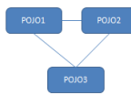
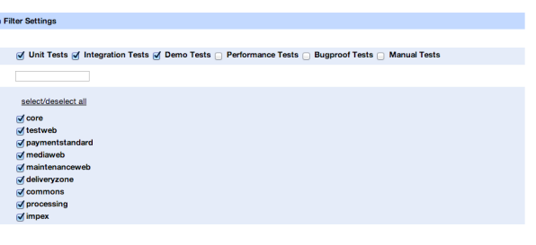
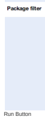
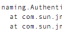
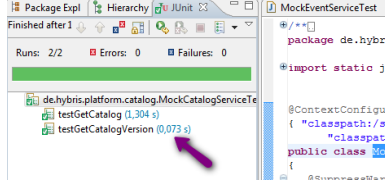

# Testing

SAP Commerce Cloud and its components use several various frameworks and abstraction layers. Depending on the abstraction level and the framework in use, you have to use various methods of testing. For example, you need different tools to test a web application, and different tools to test its underlying business code.

## Ensuring All Spock Tests Are Compiled

To ensure that all Spock tests are run correctly, use the following properties:
<extname>.backoffice.compile.groovy=true - ensures that all Spock tests from the backoffice/testsrc directory are compiled. The default value is true.

compile.groovy.web.tests=true - ensures that all Spock tests from the web/testsrc directory of web extensions are complied. The default value is false.

Creating Builds with Forked groovyc Ant Task By default, the groovyc ant task compiles builds in a forked mode for all operating systems. To disable forking, use the following property with the value false:
groovyc.fork=false Change the value of the property to true if you want to restore the default behavior.

To create builds with forked groovyc for selected extensions, use the following property:
<extname>.groovyc.fork Use the values true or false to enable or disable forking for selected extensions. The *<extname>*.groovyc.fork= property overrides global settings. For more information on groovyc ant task, see The <groovyc> Ant Task .

## Testing With Junit

You can use the JUnit framework to test your code with Unit and Integration tests. SAP Commerce Cloud provides the libraries of the current JUnit version, as well as specic SAP Commerce Cloud classes for easier testing. It is also shipped with several components to make it easy to execute tests, such as a special test servlet, which is a part of the SAP Commerce Cloud Administration Console or designed Ant targets. Before writing your rst JUnit test, it is recommended to read the JUnit cookbook which explains the basic structure of a test class. To test SAP Commerce Cloud, you have to use special classes. You can distinguish two types of tests:
Unit test: It does not require access to the database and you do not need the running SAP Commerce Cloud environment to execute them. For more details, read the Writing Unit Tests section.

Integration test: It is also called functional tests and needs access to SAP Commerce Cloud, which has to be started in order to execute them. For more details, read the Writing Integration Tests section.

Your test classes should have the **Test** suffix in the name, and be stored in the following locations:
extensionname / **testsrc**: Here you can test classes from the extensionname / src directory.

extensionname / web / **testsrc**: Here you can test classes from the extensionname / web / src directory.

## Writing And Executing Tests

Familiarize yourself with the preferred practices for writing both the unit, and integration tests. Learn how to use JUnit tenant to execute tests.

## Writing Unit Tests

When developing new software, a key programming practice is to write small, loosely coupled classes, with each one concentrating on one area of responsibility. Such classes are commonly referred to as Plain Old Java Objects, or POJOs. The Servicelayer follows this coding principle, and therefore consists of many POJOs. Each POJO implements an interface, and is wired to other POJOs using Spring's Dependency Injection. This approach enables you to easily isolate a class for testing by replacing dependent POJOs with mocks as described below.

This is   For more    the SAP Help  2

The Unit tests for POJO1 should test and demonstrate the behavior of POJO1 for expected and unexpected input. The Unit tests should not reference other dependent POJOs, such as POJO2 and POJO3. These POJOs should be mocked, which means they should be simulated with correct behavior. By focusing the tests on POJO1, the tests are able to:
Avoid false positives, for example, when a method in POJO1 has an error, but an error in POJO2 compensated for it and thus hid the error.

Avoid false negatives, for example, when POJO1 is working correctly, but an error in POJO2 causes the test to fail.
Run quickly, as POJO2 or POJO3 might have long-running methods, or even worse, require a SAP Commerce Cloud environment boot-up in which to run.

The main focus of Unit tests is to test the programmed code, and the content of the java class. The tests should check:
Each public method of the class with valid parameters The same methods with illegal parameters, like NULL or negative values or values where exceptions are expected If possible the test should cover all possible values accepted in the method body. For example if the method contains an if-then-else statement then if clause should be tested with a true and a false value, to make sure it covers the then clause and the else clause.

Other conventions to keep in mind include:
The Unit test class should be in the same package as POJO1, but is located in the test folder, typically **/testsrc**
The test code, variable names, and method names are intuitively named in order for commenting not to be necessary.

Mockito should be used to help to isolate a POJO for Unit testing. Mockito is a test framework that enables you to mock entire interfaces, entire classes, and parts of classes. In the example below, you can see how Mockito enables you to modify the behavior of a class without touching the class itself.

package de.hybris.mockito; import static org.junit.Assert.assertEquals; import static org.junit.Assert.fail; import static org.mockito.Mockito.mock; import static org.mockito.Mockito.when; import java.util.LinkedList; import org.junit.Test; public class MockedLinkedList {
@Test public void testMockito() {
// In this example mock the behaviour of LinkedList. // First step is to get a reference to a mocked LinkedList, by calling Mockito's mock method. final LinkedList mockedList = mock(LinkedList.class); // Tell mockito that if at a later stage mockedList.get(0) is called, // the real implementation should NOT called, // but instead the value "first" should be returned when(mockedList.get(0)).thenReturn("first");
// Tell mockito that if at a later stage mockedList.get(1) is called, // the real implementation should NOT called, // but instead a RuntimeException should be thrown/ when(mockedList.get(1)).thenThrow(new RuntimeException()); // Now if you call mockedList.get(0), you will get the value "first" assertEquals("The call to LinkedList.get(0) is mocked and returns 'first'", "first", mockedList.get(0)); System.out.println(mockedList.get(0));
try
{
mockedList.get(1);
fail("The call to LinkedList.get(1) is mocked and should have thrown a RuntimeException");
} catch (final RuntimeException rte)
{
// The call to LinkedList.get(1) is mocked and threw a RuntimeException This is   For more    the SAP Help  3 The class name should be called **POJO1Test**
Each method should focus on testing one use-case, for example testFindUserWithNull(), **testFindUserWithIncorrectCase()**
// Call the method mockedList.get(999), which has not been stubbed, // and therefore calls the LinkedList's "real" get(999) assertEquals("The call to LinkedList.get(999) is not mocked so calls the genuine method", null, mockedList
}
}

## Stubbing

To help you focus on testing a single POJO, you can replace any POJO on which it depends with stub implementation. A stub object is used to replace more heavy-weight objects on which an object under test usually depends. You could, for example, mock a method in POJO2 or POJO3 and simply return hard-wired responses. This enables you to speed up tests due to removing a dependency on slow POJOs, and to avoid the necessity to connect to the database. For example, if you fake a DAO nder method in POJO2. Stubbing is state verication, because it veries if the state of the POJO is as expected. Using Mockito you can stub out entire interfaces, entire classes, and parts of classes. The following code snippet presents different examples from Mockito:
// Two methods of the LinkedList class are mocked // If you call any other method of LinkedList, it will call the original method, as stubs are provided only for only get(0 LinkedList mockedList = mock(LinkedList.class); // Provide a stub, such that when mockedList.get(0) is called, the real implementation is NOT called, // but instead directly returns the value "first" when(mockedList.get(0)).thenReturn("first"); // Provide a stub, such that when mockedList.get(1) is called, the real implementation is NOT called, // but instead directly throws RuntimeException when(mockedList.get(1)).thenThrow(new RuntimeException()); // Call mockedList.get(0), which will invoke the stub and return "first" System.out.println(mockedList.get(0)); // Call mockedList.get(1), which will invoke the stub and throw the RuntimeException System.out.println(mockedList.get(1)); // Call the method mockedList.get(999), which has not been stubbed,
// and therefore calls the LinkedList's "real" get(999) System.out.println(mockedList.get(999));

## Bdd Way Of Stubbing

Behavior-driven development (BDD) focuses on obtaining a clear understanding of desired software behavior through discussion with stakeholders. It extends Test-driven development (TDD) by writing test cases in a natural language that non-programmers can read. Behavior-driven developers use their native language in combination with the ubiquitous language of domain driven design to describe the purpose and benet of their code. Mockito provides a nice interface to write BDD-oriented tests with simple given/when/then scenarios. Below is sample test written in this manner. Notice the self-explanatory name of the test method with the prepending word, should.

@Test public void shouldCreateSimpleDateFormatObjectOfGivenFormatForCurrentLocale()
{
// given final String format = "yyyy-mm-dd"; given(i18nService.getCurrentLocale()).willReturn(new Locale("en"));
// when final DateFormat result = factory.createDateTimeFormat(format); // then assertThat(result).isNotNull();
assertThat(result).isInstanceOf(SimpleDateFormat.class);
verify(i18nService, times(1)).getCurrentLocale();
}
The idea of writing BDD tests is to write small test cases that cover one behavior.

## Mocking

Mocking helps to verify a conversation. For example, if the sequence of methods calls between POJO1 and its dependent POJOs is as expected. It is usually done hand-in-hand with stubbing.

Mocking is a behavioral verication because it veries if the behavior of the POJO is as expected. To use Mockito framework to perform the verication, follow the basic steps below:
1. Create the POJO2 mock and then wire this mock instead of the original POJO2 in to POJO1.

2. Call method A from POJO1, which you expect to call methods B and C from POJO2.

3. Verify that POJO1 did call methods B and C from POJO2.

An example of verifying that calls to a mocked object are made:
import static org.mockito.Mockito.*; // Create a mock of List interface List mockedList = mock(List.class);
mockedList.add("one");
mockedList.clear();
// Verify that add and clear methods from List are called verify(mockedList).add("one"); verify(mockedList).clear();
Mockito makes it easy to combine mocking and stubbing, which also enables you to perform state and behavioral tests on your services. See, for example, DefaultCompetitionServiceTest.java from the cuppy extension.

package de.hybris.platform.cuppy.services; import static org.junit.Assert.assertEquals; import static org.mockito.Mockito.verify; import static org.mockito.Mockito.when; import de.hybris.platform.cuppy.daos.CompetitionDao; import de.hybris.platform.cuppy.model.CompetitionModel; import de.hybris.platform.cuppy.services.impl.DefaultCompetitionService; import de.hybris.platform.servicelayer.model.ModelService; import java.util.Arrays; import java.util.List; import org.junit.Before; import org.junit.Test; import org.mockito.Mock; import org.mockito.MockitoAnnotations; public class DefaultCompetitionServiceTest {
// The service under test.. private DefaultCompetitionService competitionService; // Mock out the services/daos on which competition service depends using Mockito's mock annotation
@Mock private PlayerService playerService; @Mock private ModelService modelService; @Mock private CompetitionDao competitionDao; @Before public void setUp()
{
// So that the @Mock annotations is recognised, you need the following line.. MockitoAnnotations.initMocks(this);
// Create the service and wire in the services/daos competitionService = new DefaultCompetitionService();
competitionService.setPlayerService(playerService);
competitionService.setModelService(modelService); competitionService.setCompetitionDao(competitionDao);
}
@Test public void testGetAllCompetitions()
{
// The purpose of this test is to check that..

// CompetitionService's method getAllCompetitions makes a call to CompetitionDao's method findCompetitions
// The value that CompetitionService's method getAllCompetitions final CompetitionModel comp1 = new CompetitionModel();
comp1.setCode("comp1");
final CompetitionModel comp2 = new CompetitionModel();
comp2.setCode("comp2");
// Create a stub of competitionDao's method findCompetitions. Should it be called, return a hard-wired re
// This helps you focus this test on CompetitionService, and not also on CompetationDAO, and also means yo
// access to the persistence layer to test CompetitionService. when(competitionDao.findCompetitions()).thenReturn(Arrays.asList(comp1, comp2)); // <--- Example of Stubb
// Now call the service's method (which you expect to call findCompetitions) final List<CompetitionModel> result = competitionService.getAllCompetitions(); // If it did call findCompeitions, then our hard-coded response will have been returned to the service. // and you can confirm that competiationService did what you expect with this hard-wired response assertEquals(2, result.size());
assertEquals(comp1, result.get(0)); assertEquals(comp2, result.get(1));
This is   For more    the SAP Help  5 DefaultCompetitionServiceTest
// Finally confirm that the call to findCompetitions was made verify(competitionDao).findCompetitions(); // <--- Example of Behaviour Verification using Mocking
}
}

## Setting Up Mocks Using Mockito

Mockito provides annotations that are helpful in making test classes simpler. For instance, if you have to test some service that is dependent on two other services and you want to test it in isolation, then you have to mock them. Instead of using setters on a tested service to provide mocked services, you can use
@InjectMocks annotation like this:
@UnitTest public class DefaultFormatFactoryTest {
@InjectMocks private final DefaultFormatFactory factory = new DefaultFormatFactory(); @Mock private I18NService i18nService;
@Mock private CommonI18NService commonI18NService; @Before public void setUp()
{
MockitoAnnotations.initMocks(this);
}
}
Notice that the **factory** instance variable is initialized directly instead of doing it in the **setUp()** method. This speeds up whole test. The **@InjectMock** annotation injects all required mocks into the **DefaultFormatFactory** object in one call of **MockitoAnnotations.initMocks(this)**, so there is no need to use set methods in **setUp()**.

## Code Coverage

Using stubbing and mocking gives the possibility to thoroughly test your POJOs. To know how complete the testing is, you need statistics of the code coverage. An easy way to determine this in the SpringSource Tool Suite using the EclEmma plugin:
1. Download and install EclEmma.

2. Right-click a test and run it by selecting Coverage As → JUnit Test.

3. Select the class you are testing from the Coverage view, and spot the green covered code, and the red uncovered code.

The goal should be to maximize your test coverage, and this is much easier to do by Unit testing with mocks and stubs than by Integration tests only.

## Writing Integration Tests

SAP Commerce Cloud provides the possibility to use a precongured, JUnit tenant where you can execute your JUnit tests isolated from other tenants. You can test your business functionality using real item instances.

## Basic Mechanism

The easiest way to add specic functionality to your test class is to extend the **ServicelayerTest** class. In this way, you gain access to methods that create some very basic test items that can be used for testing. By extending the **ServicelayerTest** class, you may create instances of all basic SAP Commerce Cloud Models like language, currency, unit, and country using the **createCoreData** method. You may also import test data stored in a CSV le using the **importCsv** method, or import test data using the **importStream()** method. For more details, see the API documentation.

If you want to use other services in a test, you can inject them using the **@Resource** annotation. Use the **@Before** annotation to execute code or import data before each test method. Do not use the **@Before** annotation more than once in your test. All methods with this annotation are executed before each test method, but it is not clear in which order. For example, the Sun JDK executes them in 99% of all cases from top-to-down, whereas the IBM JDK executes them in an alphabetical order. To execute code or clean up data after each method, use the **@After** annotation. Do not use the **@BeforeClass** annotation as it is executed in a static way and is out of the test run scope. With this, a tenant is not set and changes are not reverted.

public class CreateUserTest extends ServicelayerTest { @Resource private ModelService modelService;
 @Resource private UserService userService; @Test public void testCreateUser() { //create a user final EmployeeModel user = new EmployeeModel();
 user.setUid("testUser"); modelService.save(user); //test creation assertNotNull(userService.getUserForUID("testUser")); }
Pay attention to the static import of the **Assert** class of the JUnit framework, which makes all assert methods available in your test class. The listed import of the SAP Commerce Cloud **de.hybris.platform.testframework.Assert** class provides additional assert methods written by SAP Commerce Cloud. Extending a test class is not always suitable, for example, when already extending another class. In this case, you can easily add the functionality of the SAP Commerce Cloud test class using annotations, as done by the **HybrisJUnit4Test** too.

import static org.junit.Assert.*; import static de.hybris.platform.testframework.Assert.*; import de.hybris.platform.testframework.*;
import de.hybris.platform.jalo.ConsistencyCheckException; import de.hybris.platform.servicelayer.i18n.commonI18NService; import org.junit.Test; import org.junit.runner.RunWith; @RunWith(HybrisJUnit4ClassRunner.class) @RunListeners({ ItemCreationListener.class, LogRunListener.class, PlatformRunListener.class }) public class MyTestClass
{
@Test public void countryTest()
{
//because this class does not extend the ServicelayerTest class, //Spring wiring does not work; you must get the service
//over the registry application context CommonI18NService commonI18NService = Registry.getApplicationContext().getBean(CommonI18NService.class);
CountryModel myCountry = commonI18NService.getCountry("en");
assertNotNull(myCountry);
}
}
All the additional logic is implemented using JUnit **RunListener** classes. Unfortunately, these listeners cannot be registered easily to the test process.

Instead, you can use the **HybrisJUnit4ClassRunner** class, which has to be registered using the JUnit **@RunWith** annotation. This runner registers all listeners specied using the **@RunListeners** annotation. When using the **ItemCreationListener** class, all created items are removed after a test is nished. This kind of proprietary transaction system has several aws. All creations of items are written persistent to the database and then removed, so you have no isolation in concurrent processing. Furthermore, only a creation of an item is registered, not a modication of an item. If you modify a standard meta item in your test, for example, if you change the write ag of an **AttributeDescriptor**, it will not be reverted at the end of the test. For more details about all available listeners and their usage, see the API documentation.

## Note

When using the annotation style, jaloSession and defaultLanguage variables, as well as the **getOrCreateLanguage** method provided by the ServicelayerTest class are not available.

## Preferred Mechanism

The preferred way of writing tests is to extend the **ServicelayerTransactionalTest** class. This class adds transaction-based isolation logic to your tests by registering the **TransactionRunListener** listener. Before the **@Before** method of your test is called, a new transaction is started. After the
@After method of your test is called, a transaction rollback is performed. This assures complete isolation of your test. The ServicelayerTransactionalTest class extends the **ServicelayerTest** class, and therefore also provides the variables and methods of this class.

The following example demonstrates how to test a modication of the admin user. As the admin user already exists before the test starts, the modications are not reverted when using the direct **ServicelayerTest** class, as only newly created items are tracked. By using the ServicelayerTransactionalTest class, all changes are reverted. Be aware that for testing logic using transactions with this test class can cause problems.

public class ModifyAdminTest extends ServicelayerTransactionalTest {
 @Resource private ModelService modelService;
 @Resource private UserService userService;
@Test public void modifyAdminTest() {
UserModel admin = userService.getAdminUser();
 admin.setName("test"); modelService.save(admin);
This is   For more    the SAP Help  7 You also can add the transaction logic using annotations in the same way as described in Basic Mechanism section:
@RunWith(HybrisJUnit4ClassRunner.class) @RunListeners({TransactionRunListener.class, ItemCreationListener.class, LogRunListener.class, PlatformRunListener.class } @Transactional public class MyTestClass
{ // ...

}
The additional **TransactionRunListener** listener is registered. This listener enables the transaction support if the annotation **@Transaction** is found. The **@Transactional** annotation can be specied on a class or method level, so you can enable the transaction support for separate methods. This is also the reason for registering the ItemCreationListener. If no transactional support is enabled, because the **@Transactional** annotation is missing or the underlying database does not support transactions, the proprietary mechanism is used.

Be aware that if you want to test transaction functionality, for example, assuring the correctness of a rollback, you cannot use the transactional support.

## Annotations

The table below presents available class annotations for inclusion in Java test les. They are used as labels to help generate Bamboo scripts that automatically select and run tests of particular types.

| Annotation       | Usage                                                                                                                                                                                                                                                                                            |
|------------------|--------------------------------------------------------------------------------------------------------------------------------------------------------------------------------------------------------------------------------------------------------------------------------------------------|
| @IntegrationTest | Tests that are to be executed inside an application server environment, like Apache Tomcat or WebSphere.                                                                                                                                                                                         |
| @DemoTest        | Typically well or self-documented Integration tests for inclusion in SAP Commerce Cloud Wiki and available to partners.                                                                                                                                                                          |
| @UnitTest        | Tests that do not require a SAP Commerce Cloud environment in which to run, and are therefore fast. Unless your test needs the SAP Commerce Cloud environment, for example, because of the persistence layer, then you should consider writing a unit test instead with mocked-out dependencies. |
| @PerformanceTest | A performance test can be congured to run under different circumstances, for example: 6000 times in a row, with 1 mio items, under heavy load It is designed for helping to examine performance characteristics.                                                                                 |
| @ManualTest      | Some tests require external software, for example the CyberSource tests. These tests should not be executed during automated testing.                                                                                                                                                            |

## Testing Exceptions

Follow the rules below when writing tests:
1. Do not use **@Test(expected)**. This feature can potentially make a few tests cleaner, but is really error-prone:
@Test(expected=Exception.class) public void testSomething() { //line 1: throws NullPointerException //lines 2-30: some test code }
If due to some bug in the setup, the test method breaks in the rst line, most of the test code is not even executed. The expected exception hides this issue and the test is green, so it is completely useless.

2. If you violate the rule above, then at least the exception should be very specic. For example:
@Test(expected=BreadOutOfStockException.class)
public void shouldBuyBread() {}
Even if you use a specic exception, the test does not document exactly where the exception is thrown. Sometimes it may lead to subtle bugs. Therefore, if the test method has multiple lines, do not violate the \#1 rule. Instead, you can simply write:
This is   For more    the SAP Help  8
@Test public void shouldBuyBread() throws Exception { //given me.goToBakery(bakery); bakery.setBreadAmount(0); try { //when me.buyBread(); //then fail("BreadOutOfStockException to be thrown");
 } 
 catch (BreadOutOfStockException e) { //ok here, we expect this exception here } catch (Exception e) { fail(" caught unexpected exception: "+e); } }

## Executing Tests

Use JUnit tenant to execute tests. When you update to the newer version of SAP Commerce Cloud, you also should congure new extensions for the JUnit tenant. Follow the steps below to make sure that all needed extensions are enabled, and to initialize JUnit tenant:
1. Open the SAP Commerce Cloud Administration Console.

2. Go to the Platform tab and select Tenants option. 3. The Tenants Overview page displays a list of existing tenants. Click the View button next to the JUnit tenant.

4. On the Edit Tenant page, check if all extensions are enabled.

5. Now initialize the JUnit tenant. Click the Initialize button. 6. The JUnit tenant activates and Initialization page displays.

7. Click the Initialize button.

Furthermore, you can initialize SAP Commerce Cloud by calling ant **yunitinit** from the command prompt or calling the Initialization.initializeTestSystem() within a standalone class. All three variants initialize the test system with a minimum data containing no essential data and no project data of installed extensions. If you want to set up essential or project data of a specic extension in your **@Before** method, you can execute the following code:
// creating essential data of MyExtension MyExtensionManager.createEssentialData(Collections.EMPTY_MAP, null); // creating project data of MyExtension MyExtensionManager.createProjectData(Collections.EMPTY_MAP, null);
For creating essential data of the core extension, you should execute:
new CoreBasicDataCreator().createEssentialData(Collections.EMPTY_MAP, null);
You are not able to use ImpEx on the initialized test system because of missing encodings. You can install them by creating essential data of the core extension or by installing the encodings directly:
new CoreBasicDataCreator().createSupportedEncodings();
There are three different ways of executing tests:
Using Eclipse Using Ant Using the Test Servlet Note If all tests are completed, then a report is generated and the message is displayed, stating build successful (even if some tests fail). To see the details of the outcomes of the tests, nd the report in platform-module/log/junit.

Eclipse To execute a test using the Eclipse, follow below instructions:
1. Right-click your test class.

You may get:
Warnings like below:
WARN [Utilities] cannot load extension storefoundation because: java.lang.ClassNotFoundException: ystorefoundationpackage.jalo.YStoreFoundationManager WARN [Utilities] If you receive this error while starting from eclipse, you need to add the project that WARN [Utilities] contains the storefoundation extension to the java build path of your project from where you have WARN [Utilities] started this class. (project->right click->properties->build path->tab Projects. WARN (junit) [ComposedTypeEJBImpl] missing jalo class 'de.hybris.platform.xprint.jalo.PurgeGettersJob' for item type 'XPurgeGettersJob' - trying supertype class instead Exceptions like below:
java.lang.ClassNotFoundException: de.hybris.platform.webfoundation.jalo.workflow.orderprocess.OrderProcessingBatchJob If this is the case, you probably do not have all congured extensions of your **localextensions.xml** le registered at the classpath of the Eclipse JUnit test conguration. To x it, perform the following steps:
1. Open the Run menu click Run Congurations to open Run Congurations dialog box.

2. In the Run Congurations dialog box, select your test conguration. 3. Navigate to the Classpath tab.

4. Select the **platform** folder.

5. Click the Add Projects button. In the Project Selection dialog box, select all extensions you have congured in the **localextensions.xml** le.

If your Spring conguration does not get bootstrapped at the startup of the Platform, the Spring le is probably not a part of test classpath. This can either be caused by a missing project at the classpath, or by not including your resources folder in the Eclipse classpath at all. Assure that your **.classpath** le contains the following line:
<classpathentry exported="true" kind="lib" path="resources"/>

## Ant

All ant targets can be executed in the **platform** folder or in the specic extension directory. If you execute a target inside an extension directory, the extension lter is added automatically for the current extension.

## Ant Targets

List of available ant targets:

| Ant Call             | Description                                                            |
|----------------------|------------------------------------------------------------------------|
| ant alltests         | Executes all tests found by testClassesUtil.getAllTestClasses()        |
| ant unittests        | Executes all tests found by testClassesUtil.getAllUnitClasses()        |
| ant demotests        | Executes all tests found by testClassesUtil.getAllDemoClasses()        |
| ant integrationtests | Executes all tests found by testClassesUtil.getAllIntegrationClasses() |
| ant performancetests | Executes all tests found by testClassesUtil.getAllPerformanceClasses() |
| ant manualtests      | Executes all tests found by testClassesUtil.getAllManualClasses()      |

Commandline Modiers If you want to specify an ant target a bit more, you can pass one or more of these properties to the ant call:

| Modier                 | Example                                                  | Description                              |
|------------------------|----------------------------------------------------------|------------------------------------------|
| testclasses.extensions | ant unittests -Dtestclasses.extensions=basecommerce,core | executes all tests from given extensions |

| 7/12/2024 Modier                                         | Example                                                | Description                                                                                                                                                      |
|----------------------------------------------------------|--------------------------------------------------------|------------------------------------------------------------------------------------------------------------------------------------------------------------------|
| testclasses.annotations                                  | ant alltests -                                         | executes tests with given                                                                                                                                        |
| Dtestclasses.annotations=demotests,unittests,manualtests | annotations                                            |                                                                                                                                                                  |
| testclasses.packages                                     | ant unittests -                                        | executes tests from given                                                                                                                                        |
| Dtestclasses.packages=de.hybris.platform.payment.*       | package                                                |                                                                                                                                                                  |
| testclasses.split                                        | ant alltests -Dtestclasses.split=1-3                   | Divides the number of tests by the second number, and executes the part indicated by the rst number. For example, a split=1-5 executes the rst 20% of the tests. |
| -Dtestclasses.suppress.junit.tenant                      | ant unittests -Dtestclasses.suppress.junit.tenant=true | switches off starting up of Platform for every test                                                                                                              |

Like all other ant properties, these properties are set once and cannot be modied anymore. If you call ant demotests -
Dtestclasses.annotations=unittests, all UnitTests are executed.

Including and Excluding Tests For more information, see -Dtestclasses.packages in Customizing Test Execution.

WebServices Tests Use the ant target -allwebtests to run all tests inside the web/testsrc folder.

Ant Callbacks If you want to provide custom logic before or after test execution, or initialization, you can write a buildcallback in **buildcallbacks.xml** of your extension:

| Callback Name                     | When it is Performed                                     |
|-----------------------------------|----------------------------------------------------------|
| (extension_name)_before_yunit     | Performed right before test execution                    |
| (extension_name)_after_yunit      | Performed right after test execution, if tests succeed   |
| (extension_name)_before_yunitinit | Performed right before the test framework is initialized |
| (extension_name)_after_yunitinit  | Performed right after the test framework is initialized  |

An example below creates essential data of core extension right after the initialization of the test system. It uses the **yrun** macro that starts the Platform and executes the given code as BeanShell command. The rst line of the code sets the tenant of test system, the second call creates the essential data of core, and last statement shuts down the Platform.

<macrodef name="(extension_name)_after_yunitinit"> <sequential> <yrun> de.hybris.platform.core.Registry.setCurrentTenantByID("junit");
 new de.hybris.platform.jalo.CoreBasicDataCreator().createEssentialData(null,null); de.hybris.platform.util.RedeployUtilities.shutdown(); </yrun> </sequential> </macrodef>
Test Servlet Note Do not forget to initialize the test systems by using the Initialize button.

For information on SAP Commerce Cloud JUnitEE TestRunner, see The SAP Commerce Cloud Testweb Front End.

## Customizing Test Execution

There is a set of lters available you can use with Java to create your own servlet for test execution, and to design custom Ant targets. With this, you can customize the execution of tests tailored for your project needs.

Overview This is   For more    the SAP Help  11

## 

Customization of the tests execution is possible because of the TestClassesUtil, that scans the SAP Commerce Cloud environment for test classes and is located in the SAP Commerce Cloud bootstrap. It does not need a running SAP Commerce Cloud instance and is therefore usable to get different collections of JUnit test classes before and while runtime.

To get an instance, follow below examples:
Using Java:
final PlatformConfig platformConfig = ConfigUtil.getPlatformConfig(this.getClass());
TestClassesUtil testClassesUtil = new TestClassesUtil(platformConfig);
Using Ant Targets:
<taskdef name="testclasses" classname="de.hybris.ant.taskdefs.TestClassesTask">
<classpath>
<fileset dir="${platformhome}/bootstrap/bin">
<include name="*.jar" />
</fileset>
</classpath>
</taskdef> <testclasses property="testlist" />
Afterwards, the given property can be used as a list property.

## Test Class Scan

The TestClassesUtil does not hold a result or a list. It searches for the test classes on the classpath every time you invoke a method. This lets you change the behavior at runtime, for example by setting new lters. The result can be ltered by annotations, package, or extension. For more details, see the API documentation.

## Note

As a fallback, all Tests that do not have one of the SAP Commerce Cloud annotations are treated as @IntegrationTests.

## Filters

Filters can be used in many various ways. It all depends how you want to customize the execution of your tests. If you want to lter the result in a specic way, you can use one of the following lters:

| Filter Name                                                                                                                                                                        | Description                                                                                                                                                             | Usage Format                                                                                                                                                                                                                                                                                                                           |
|------------------------------------------------------------------------------------------------------------------------------------------------------------------------------------|-------------------------------------------------------------------------------------------------------------------------------------------------------------------------|----------------------------------------------------------------------------------------------------------------------------------------------------------------------------------------------------------------------------------------------------------------------------------------------------------------------------------------|
| Annotation                                                                                                                                                                         | This lter accepts only test classes that are annotated                                                                                                                  | The expected format is a single annotation class or a                                                                                                                                                                                                                                                                                  |
| with the given annotation.                                                                                                                                                         | collection of class les. Supported annotations are DemoTest, IntegrationTest, PerformanceTest, ManualTest, and UnitTest.                                                |                                                                                                                                                                                                                                                                                                                                        |
| Package                                                                                                                                                                            | This lter accepts only test classes for the given                                                                                                                       | Regular expressions like de.hybris.*.cockpit.* are                                                                                                                                                                                                                                                                                     |
| packages.                                                                                                                                                                          | allowed. The expected format is a single string or a collection of strings.                                                                                             |                                                                                                                                                                                                                                                                                                                                        |
| Negative Package                                                                                                                                                                   | This lter accepts only test classes that do not match these packages. The positive list is evaluated before the negative list.                                          | Regular expressions like de.hybris.*.cockpit.* are allowed. The expected format is a single string or a collection of strings.                                                                                                                                                                                                         |
| Extension                                                                                                                                                                          | This lter allows only extensions to be scanned that are in the given list. This lter is automatically applied if you call an ant target inside the extension directory. | The expected format is a single string or a collection of strings.                                                                                                                                                                                                                                                                     |
| Split                                                                                                                                                                              | This lter splits the nal number of tests by the given string, which can be used for automatic testing purposes.                                                         | The given object has to be a String with the format a-b. b is the total number of parts you want the tests to be split into. a is the number of the current part you want to get. These are the possible string values: 1-4 - tests from 1 to 250 2-4 - tests from 251 to 500 3-4 - tests from 501 to 750 4-4 - tests from 751 to 1000 |
|  Note Different classloaders load classes in different order. For getting the same result for all classloaders, the test classes are sorted alphabetically before they are split. |                                                                                                                                                                         |                                                                                                                                                                                                                                                                                                                                        |

Using Filters with Java

| You can use below examples of how to use specic lter in your own test servlet. Filter Name Example Annotation Search for all test classes that are annotated as UnitTests: testClassesUtil.addFilter(FILTER.FILTER_BY_ANNOTATION, UnitTest.class); Collection<Classes> testClasses = testClassesUtil.getFilteredTestClasses(); Search for all test classes that are annotated as UnitTest and IntegrationTest: Set<Class> annotations = new HashSet<Class>(); annotations.add(IntegrationTest.class); annotations.add(UnitTest.class); testClassesUtil.addFilter(FILTER.FILTER_BY_ANNOTATION, annotations); Collection<Classes> testClasses = testClassesUtil.getFilteredTestClasses(); Package Search for all test classes that are in the standard SAP Commerce Cloud package: testClassesUtil.addFilter(FILTER.FILTER_BY_PACKAGE, "de.hybris.platform.*"); Collection<Classes> testClasses = testClassesUtil.getFilteredTestClasses(); Search for all test classes that are from SAP Commerce Cloud and in a cockpit package or from google: Set<String> packages = new HashSet<String>(); packages.add("de.hybris.*.cockpit.*"); packages.add("com.google.*"); testClassesUtil.addFilter(FILTER.FILTER_BY_PACKAGE, packages); Collection<Classes> testClasses = testClassesUtil.getFilteredTestClasses(); Negative Package Get all classes that are not from SAP Commerce Cloud: testClassesUtil.addFilter(FILTER.FILTER_BY_PACKAGE_NEGATIVE, "de.hybris.*"); Collection<Classes> testClasses = testClassesUtil.getFilteredTestClasses(); Extension Execute all payment, basecommerce, and core extensions tests: Set<String> extensions = new HashSet<String>(); extensions.add("payment"); extensions.add("basecommerce"); extensions.add("core"); testClassesUtil.addFilter(FILTER.FILTER_BY_EXTENSION, extensions); Collection<Classes> testClasses = testClassesUtil.getFilteredTestClasses(); Split You have one thousand tests and you want to split them into four pieces: testClassesUtil.addFilter(FILTER.SPLIT_FILTER, "1-4"); Collection<Classes> testClasses = testClassesUtil.getFilteredTestClasses();   |
|-----------------------------------------------------------------------------------------------------------------------------------------------------------------------------------------------------------------------------------------------------------------------------------------------------------------------------------------------------------------------------------------------------------------------------------------------------------------------------------------------------------------------------------------------------------------------------------------------------------------------------------------------------------------------------------------------------------------------------------------------------------------------------------------------------------------------------------------------------------------------------------------------------------------------------------------------------------------------------------------------------------------------------------------------------------------------------------------------------------------------------------------------------------------------------------------------------------------------------------------------------------------------------------------------------------------------------------------------------------------------------------------------------------------------------------------------------------------------------------------------------------------------------------------------------------------------------------------------------------------------------------------------------------------------------------------------------------------------------------------------------------------------------------------------------------------------------------------------------------------------------------------------------------------------------------------------------------------------------------------------------------------------------------------------------------------------------------------------------------------------------|

## Using Filters With Ant Target

You can use below examples to design your own Ant targets to lter and execute specic test. You can do it in the antmacros.xml le.

| Filter                                                                                                                                                       | Ant Example                                                  | Ant Command Line              |
|--------------------------------------------------------------------------------------------------------------------------------------------------------------|--------------------------------------------------------------|-------------------------------|
| Name Annotation                                                                                                                                              | Search for all test classes that are annotated as UnitTests: | ant unittests -Dtestclasses.a |
| <testclasses property="testlist" annotations="unittests" />                                                                                                  | ant unittests -Dtestclasses.a                                |                               |
| Search for all test classes that are annotated as UnitTest and IntegrationTest: <testclasses property="testlist" annotations="unittests,integrationtests" /> |                                                              |                               |

This is   For more    the SAP Help  13

| 7/12/2024 Filter                                                                                                                                                                        | Ant Example                                                                      | Ant Command Line              |
|-----------------------------------------------------------------------------------------------------------------------------------------------------------------------------------------|----------------------------------------------------------------------------------|-------------------------------|
| Name Package                                                                                                                                                                            | Search for all test classes that are in the standard SAP Commerce Cloud package: | ant unittests -Dtestclasses.p |
| <testclasses property="testlist" packages="de.hybris.platform.*" />                                                                                                                     | ant unittests -Dtestclasses.p                                                    |                               |
| Search for all test classes that are from SAP Commerce Cloud and in a cockpit package or from google: <testclasses property="testlist" packages="de.hybris.*.cockpit.*,com.google.*" /> |                                                                                  |                               |
| Negative                                                                                                                                                                                | Get all classes that are not from SAP Commerce Cloud:                            |                               |
| Package                                                                                                                                                                                 | ant unittests -Dtestclasses.p                                                    |                               |
| <testclasses property="testlist" packages_negative="de.hybris.platform.*" />                                                                                                            |                                                                                  |                               |
| Extension                                                                                                                                                                               | Execute all payment, basecommerce, and core extensions tests:                    | ant unittests -Dtestclasses.e |
| <testclasses property="testlist" extensions="payment,basecommerce,core" />                                                                                                              |                                                                                  |                               |
| Split                                                                                                                                                                                   | You have one thousand tests and you want to split them into four pieces:         | ant unittests -Dtestclasses.s |
| <testclasses property="testlist" split="1-4" />                                                                                                                                         |                                                                                  |                               |

## The Sap Commerce Cloud Testweb Front End

With the Testweb front end, you can execute one or more tests or test suites. This can be done on a running system, especially when there is no ant environment from which to execute such tests.

Access the Testweb front end using the direct address http://*<server-address>*/test. For example, http://localhost:9001/test.

Main Areas The Testweb front end consists of the following main areas:
System initialization

Filtered test run for specic extension
Test run by test suite name

| Junit testweb frontend                                                                        |                       |
|-----------------------------------------------------------------------------------------------|-----------------------|
| Initialize System for unit tests                                                              | System initalization  |
| Initialize   (This will create new tables with prefix junit_ and will NOT destroy your data.) |                       |
| Test Execution Filter Settings                                                                |                       |
| Run                                                                                           | A Unit Tests          |
| Annotations                                                                                   |                       |
| Package filter                                                                                | select/deselect all   |
| / core                                                                                        |                       |
| t testweb                                                                                     |                       |
| ✓ paymentstandard                                                                             |                       |
| ✓ mediaweb                                                                                    |                       |
| s maintenanceweb                                                                              |                       |
| ✓ deliveryzone                                                                                |                       |
| A commons                                                                                     |                       |
| ✓ processing                                                                                  |                       |
| S impex                                                                                       |                       |
| validation                                                                                    | Filtered test run for |
| / catalog                                                                                     | specific extension    |
| Weurope1                                                                                      |                       |
| platformservices                                                                              |                       |
| s workflow                                                                                    |                       |
| Extensions                                                                                    | s had                 |
| A comments                                                                                    |                       |
| ✓ advanced saved query                                                                        |                       |
| o cockpit                                                                                     |                       |
| r Idap                                                                                        |                       |
| r lucenesearch                                                                                |                       |
| yempty                                                                                        |                       |
| s hmc                                                                                         |                       |
| lucenesearchhmc                                                                               |                       |
| s platformhmo                                                                                 |                       |
| I mediaconversion                                                                             |                       |
| N mam                                                                                         |                       |
| s sampledata                                                                                  |                       |
| Testweb Front End: Test Servlet System Initialization and Filtered Test Run                   |                       |
| - Run -                                                                                       |                       |
| Show Some Entries                                                                             | Search:               |
| Select Test Suite(S) To Run                                                                   |                       |
|                                                                                               |                       |
| α                                                                                             |                       |
|                                                                                               |                       |
| @                                                                                             |                       |
|                                                                                               |                       |
|                                                                                               |                       |
|                                                                                               |                       |
|                                                                                               |                       |
| ❏                                                                                             |                       |
|                                                                                               |                       |
|                                                                                               |                       |
| Testweb Front End: Test Run by Test Suite Name                                                |                       |

## System Initialization In Testweb Front End

To run any test, first you need to initialize the system to prepare it for all future test runs. You can initialize the system from the test web frontend by clicking the Initialize button. You will see the information Test system initialized correctly when the initialization finishes.

## Initialize System For Unit Tests

Initialize [ (This will create new tables with prefix junit_ and will NOT destroy your data.)
Control and the state This is custom documentation. For more information, please visit the SAP Help Portal Note Initialize the master tenant before initializing the JUnit tenant.

## Filtered Test Run For Specic Extension

There are several lters that you can use when running your tests.

In this area, you can run tests selected using one or all of the following lters:

Annotations: You can lter by annotations, so that only those tests are executed that have that specic annotation. If you do not select any annotations at all, then only tests without any special annotation are executed. Package Filter: You can lter by package name by specifying pattern that all package paths of the tests should match. This lter is not case-sensitive and accepts wildcard characters. For example, *de.hybris.*impex*. It also supports ltering down to the actual test class if you prefer that approach: *.LocalizationTest. If you do not use the Package Filter, all tests are executed that have not been ltered out by the Annotations and Extensions lter. Extensions: With this lter, you can select extensions of which the tests are executed. If you do not use the Extensions lter, no tests will be run.
After choosing the appropriate lter, click the Run button.

## Test Run By Test Suite Name

You can run tests by selecting the test suite from the list. The test suite is the name of the test class with its full package path. It is called a suite as it may contain more than one test method.

## Selecting Test Suites To Be Execute

You can select individual test suites or test cases by selecting checkboxes:
Selecting Individual test Suites or test Cases Results are displayed as a simple table.

JUnit Test Results Test suite Overall time Result o de.hybris.platform.amazon.media.url.S3MediaURLStrategyTest

92 S
S
o de.hybris.platform.azure.media.services.impl.DefaultWindowsAzureServiceFactoryTest 323 e de.hybris.platform.azure.media.storage.WindowsAzureBlobStorageStrategyTest 453 e Initialization Button If results contain errors, they are marked with a red cross. Click an individual test case cross icon to get failure details:

| de.hybris.platform.jmx.HybrisJmxIntegrationTest                                    | 797   |
|------------------------------------------------------------------------------------|-------|
| de.hybris.platform.test.SecureMediaFolderTest                                      | 163   |
| de.hybris.platform.core.RestartSlaveTenantTest                                     | 4352  |
| de.hybris.platform.persistence.property.PropertyJDBCTest                           | 0     |
| de.hybris.platform.processengine.actionstrategy.ProcessActionTest                  | 1381  |
| de.hybris.platform.task.action.TaskActionTest                                      | 1056  |
| de.hybris.platform.flexiblesearch.performance.LimitStatementRawJDBCPerformanceTest | 46347 |
| de.hybris.platform.Idap.jalo.impl.RemoteLDAPLoginCaseTest                          | 872   |

| S   |
|-----|
| x   |
| X   |
| S   |
| s   |
| F   |
|     |

o o o o o O
o D
Failure Details
© hybris AG, 2013 Test case details

x javax.naming.AuthenticationException: [LDAP: error code 49 - 80090308; LdapErr: DSID-0C0903A9. comment: AcceptSecurityContext error, data S2e, vidb10]
at com.sun.jndi.ldap.LdapCtx.mapErrorCode(LdapCtx.java:3087)

at com.sun.jndi.ldap.LdapCtx.processReturnCode(LdapCtx.java:3033)
at com.sun.jndi.ldap.LdapCtx.processReturnCode(LdapCtx.java:2835)
at com.sum.jndi.ldsp.LdspCtx.commect(LdspCtx.jsva:2749)
at com.sun.jndi.ldap.LdapCtx.<init>(LdapCtx.java:316)
at com.sun.jndi.ldap.LdapCtxFactory.getUsingURL(LdapCtxFactory.java:193)
at com.sun.jndi.ldap.LdapCtxFactory.getUsingURLs(LdapCtxFactory.java:211)
at com.sun.jndi.idap.LdapCtxFactory.getldapCtxInstance(LdapCtxFactory.java:154)
at com.sun.jndi.ldap.LdapCtxFactory.getInitialContext(LdapCtxFactory.java:84)
at javax.naming.spi.NamingManager.getInitialContext(NamingManager.java:684)
at javax.naming.InitialContext.getDefaultInitCtx(InitialContext.java:307)
at javax.naming.InitialContext.init(InitialContext.java:242)
at javax.naming.ldap.InitialldapContext.<init>(InitialLdapContext.java:153)
at de.hybris.platform.ldsp.jalo.AbstractLDAPTest.getWiredContext(AbstractLDAPTest.java:294)
Test Case Details at de.hvbris.platform.ldsp.ialo.impl.RemoteLDAPLotinCaseTest.testSimpleFetchLotin(RemoteLDAPLotinCaseTest.iava:70)

## Rest Api For Calling Specific Test Groups

It is possible to call special URLs to execute tests by their annotations or all test in current extensions set.

| URL                   | tests group                       |
|-----------------------|-----------------------------------|
| /test/run/all         | all tests                         |
| /test/run/unit        | @UnitTest annotated tests         |
| /test/run/integration | ® IntegrationTest annotated tests |
| /test/run/manual      | © ManualTest annotated tests      |
| /test/run/performance | ©PerformanceTest annotated tests  |
| /test/run/demo        | © DemoTest annotated tests        |

To each of the above URLs, you can always pass the extensions parameter in which you can specify comma-separated extension names to narrow down the search results. Sample URL calls can look as follows:

## // Run All Tests

http://localhost:9001/test/run/all
// run all tests but from extensions core and ldap http://localhost:9001/test/run/all?extensions=core,ldap Additionally, there is another URL to execute specific test suites by their fully qualified names by using parameter names as follows:
http://localhost:9001/test/run/suites?

This is custom documentation. For more information, please visit the SAP Help Portal names=de.hybris.platform.catalog.jalo.classification.ClassificationTest,de.hybris.platform.catalog.jalo.CatalogTest A sample call to URL above executes tests for two test suites: ClassicationTest and CatalogTest.

The result is generated in the XML form. Below you can nd an example of a generated xml le:
<?xml version="1.0" encoding="UTF-8" ?> <testsuites> <testsuite name="HybrisJmxIntegrationTest" package="de.hybris.platform.jmx" tests="1" time="778" failures="0" errors="0" <testcase name="testJMXAPI" time="778" ></testcase>
 </testsuite>
 <testsuite name="SecureMediaFolderTest" package="de.hybris.platform.test" tests="1" time="160" failures="0" errors="0" > <testcase name="testSecureFolder" time="160" ></testcase>
 </testsuite>
 <testsuite name="RestartSlaveTenantTest" package="de.hybris.platform.core" tests="5" time="4308" failures="1" errors="1" <testcase name="testCanQueryFlexibleSearchAfterRestart" time="0" >
 <error message="" type="java.lang.NullPointerException">
<![CDATA[java.lang.NullPointerException at de.hybris.platform.jalo.Item.getCacheBoundItem(Item.java:3762)
at de.hybris.platform.jalo.type.TypeManager.getComposedType(TypeManager.java:400)
at de.hybris.platform.servicelayer.interceptor.impl.DefaultInterceptorRegistry.getAssignableTypes(DefaultIntercept
 .....

]]>
 </error>
 </testcase>
 </testuite>
</testsuites>

## Mocking Of Models

The SAP Commerce Cloud Servicelayer uses Models. Models can be mocked easily to be used in unit tests that can run completely without starting the SAP Commerce Cloud stack. This allows you to benet from a very fast turnaround for tests of your business logic. The SAP Commerce Cloud software package contains test classes (MockTest) for your convenience.

## Test Case Example

Example of a test case with mocked-up models:

The test le:
MockCatalogServiceTest.java
@ContextConfiguration(locations = { "classpath:/servicelayer/test/servicelayer-mock-base-test.xml", "classpath:/platformservices/test/platformservices-mock-catalog-test.xml" }) public class MockCatalogServiceTest extends MockTest {
 @Resource(name = "catalogService") private CatalogService catalogService; @Test public void testGetCatalog() {
 final Collection<CatalogModel> catalogs = this.catalogService.getAllCatalogs(); assertTrue("There must be two catalogs in the system!", (catalogs != null && catalogs.size() == 2));
 }
 ... }
Registering the DAO for the mock:
platformservices-mock-catalog-test.xml
<bean id="defaultCatalogService" class="de.hybris.platform.catalog.impl.DefaultCatalogService" parent="abstractBusinessService" > <property name="catalogDao" ref="catalogDao"/> <property name="catalogVersionDao" ref="catalogVersionDao"/> </bean> <bean id="catalogDao" class="de.hybris.platform.catalog.CatalogMockDao" /> <bean id="catalogVersionDao" class="de.hybris.platform.catalog.CatalogVersionMockDao"
 /> <bean id="catalogService" class="de.hybris.platform.catalog.impl.DefaultCatalogService" .../> <property name="catalogDao" ref="mockCatalogDao"/> </bean> <bean id="catalogDao" class="de.hybris.platform.catalog.CatalogMockDao" ../>
The DAO for the mocked test:
CatalogMockDao package de.hybris.platform.catalog; import de.hybris.platform.catalog.impl.CatalogDao; import de.hybris.platform.catalog.model.CatalogModel; import java.util.ArrayList; import java.util.Collection; import java.util.Collections; import java.util.List;
/**
 *
 */ public class CatalogMockDao implements CatalogDao
{
 public static final String DOESNOTEXIST = "doesnotexist";
 public static final String ONECATALOG = "onecatalog";
 public static final String TWOCATALOGS = "twocatalogs";
 @Override public Collection<CatalogModel> findCatalogs(final String id) {
 if (id == null)
 { final List<CatalogModel> allCatalogs = new ArrayList<CatalogModel>(); final CatalogModel test0 = new CatalogModel("one"); allCatalogs.add(test0); final CatalogModel test1 = new CatalogModel("two"); allCatalogs.add(test1);
 return allCatalogs;
 } if (id.equals(DOESNOTEXIST)) { return Collections.EMPTY_LIST; } else if (id.equals(ONECATALOG)) { final List<CatalogModel> twoCatalogs = new ArrayList<CatalogModel>();
 final CatalogModel test0 = new CatalogModel(ONECATALOG); twoCatalogs.add(test0); return twoCatalogs; } else if (id.equals(TWOCATALOGS))
 { final List<CatalogModel> twoCatalogs = new ArrayList<CatalogModel>(); final CatalogModel test0 = new CatalogModel(TWOCATALOGS); twoCatalogs.add(test0); twoCatalogs.add(test0); return twoCatalogs; }
 throw new UnsupportedOperationException(""); }
}

## Related Information Testthreadsholder

Sometimes you may need to test some functionality running on many threads at once, to see if concurrent execution won't break anything.The TestThreadsHolder is a class that can help you with that.

To do that, create a new instance with a number of threads and a Runnable with a code that you want to execute. Additionally, you can set a ag that makes all threads aware of the tenant.

final TestThreadsHolder<Runnable> holderA1 = new TestThreadsHolder<>(10, someRunnable, true);
The class offers many support methods that help with concurrent testing. To start all threads at once, use the startAll() method, and stop them using the stopAll() or waitForAll(nal long timeout, nal TimeUnit unit) methods.

When using stopAll(), please make sure that the tested logic is handling thread interrupts correctly.

To get all the errors that happened during execution, use getErrors() (it returns a map with a thread number key and the Throwable value). The getAlive() method returns the current number of threads that didn't complete their testing logic. The getStartToFinishMillis() method returns the number of milliseconds that passed since all threads started until the time when all of them nished.

## Testing With Spock

Spock is an optional framework for testing your code with Unit and Integration tests. SAP Commerce Cloud provides the libraries of the current groovy and spock versions, as well as specic SAP Commerce Cloud classes for easier testing.

## Note

Before writing your rst Spock test, it is recommended to read the Spock cookbook that explains the basic structure of the test class. For details, see https://spockframework.org/spock/docs/2.0/index.html .

To test SAP Commerce Cloud, you have to use special classes. You can distinguish two types of tests:
Unit test: It doesn't require access to the database and you don't need the running SAP Commerce Cloud environment to execute it. For more details, see Writing Unit Tests. Integration test: It is also called functional, and needs access to SAP Commerce Cloud, which has to be started to execute the test. For more details, read Writing Integration Tests.

Your test classes should have the Test suffix in the name, and be stored in the following locations:
extensionname / testsrc: Here you can test classes from the extensionname / src directory.

extensionname / web / testsrc: Here you can test classes from the extensionname / web / src directory.

## Writing Unit Tests

Follow the guidelines for writing unit tests.

When developing new software, a key programming practice is to write small, loosely coupled classes, with each one concentrating on one area of responsibility. Such classes are commonly referred to as Plain Old Java Objects, or POJOs. The ServiceLayer follows this coding principle, and therefore consists of many POJOs. Each POJO implements an interface, and is wired to other POJOs using Spring's Dependency Injection. This approach enables you to easily isolate a class for testing by replacing dependent POJOs with mocks as described below.

Unit tests each focus on single POJOs. Consider the three POJOs as seen in the example below - POJO1, POJO2 and POJO3: The Unit tests for POJO1 should test and demonstrate the behavior of POJO1 for expected and unexpected input. The Unit tests should not reference other dependent POJOs, such as POJO2 and POJO3. These POJOs should be mocked, which means they should be simulated with correct behavior. By focusing the tests on POJO1, the tests are able to:
Avoid false positives, for example, when a method in POJO1 has an error, but an error in POJO2 compensated for it and thus hid the error.

Avoid false negatives, for example, when POJO1 is working correctly, but an error in POJO2 causes the test to fail.

Run quickly, as POJO2 or POJO3 might have long-running methods, or even worse, require a SAP Commerce Cloud environment boot-up in which to run.

The main focus of Unit tests is to test the programmed code, and the content of the java class. The tests should check:

Each public method of the class with valid parameters. The same methods with illegal parameters, like NULL or negative values or values where exceptions are expected. If possible the test should cover all possible values accepted in the method body. For example if the method contains an if-then-else statement then if clause should be tested with a true and a false value, to make sure it covers the then clause and the else clause.
Other conventions to keep in mind include:
The Unit test class should be in the same package as POJO1, but is located in the test folder, typically /testsrc. The class name should be called POJO1Test.

Each method should focus on testing one use-case, for example "test find user with null"(), "test find user with incorrect case"().

The test code, variable names, and method names are intuitively named in order for commenting not to be necessary.

Spock includes a mocking mechanism and it should be used to help isolate a POJO for Unit testing.

package de.hybris.platform import org.junit.Test import spock.lang.Specification class MockedLinkedList extends Specification { 
 @Test def "test mocking"()
 {
 setup: // In this example mock the behaviour of LinkedList.

 // First step is to get a reference to a mocked LinkedList, by calling Mock(Class).

 def mockedList = Mock(LinkedList) {
 // Tell the mock that if at a later stage mockedList.get(0) is called,
 // the real implementation should NOT called,
 // but instead the value "first" should be returned get(0) >> "first"
 // Tell mock that if at a later stage mockedList.get(1) is called, // the real implementation should NOT called,
 // but instead a RuntimeException should be thrown get(1) >> {throw new RuntimeException()}
 }
 // Now if you call mockedList.get(0), you will get the value "first" when:
 def first = mockedList.get(0) then:
 first == "first"
 //If you call mockedList.get(1), exception will be thrown when: mockedList.get(1) then:
 thrown(RuntimeException) // Call the method mockedList.get(999), which has not been recorded,
 // and therefore mock's default value is returned when: def defaultValue = mockedList.get(999)
 then:
This is   For more    the SAP Help  21

## Stubbing

To help you focus on testing a single POJO, you can replace any POJO on which it depends with stub implementation.

A stub object is used to replace more heavy-weight objects on which an object under test usually depends. You could, for example, mock a method inPOJO2 or POJO3 and simply return hard-wired responses. This enables you to speed up tests due to removing a dependency on slow POJOs, and to avoid the necessity to connect to the database. For example, if you fake a DAO nder method in POJO2. Stubbing is state verication, because it veries if the state of the POJO
is as expected.

Using Stub(), you can stub out entire interfaces, entire classes, and parts of classes. The following code snippet presents different examples:
setup:
// In this example mock the behaviour of LinkedList. // First step is to get a reference to a mocked LinkedList, by calling Mock(Class). def mockedList = Spy(LinkedList) {
 // Tell the mock that if at a later stage mockedList.get(0) is called,
 // the real implementation should NOT called, // but instead the value "first" should be returned get(0) >> "first"
 // Tell mock that if at a later stage mockedList.get(1) is called,
 // the real implementation should NOT called, // but instead a RuntimeException should be thrown get(1) >> {throw new RuntimeException()}
 }
// Now if you call mockedList.get(0), you will get the value "first" when: def first = mockedList.get(0) then:
first == "first"
//If you call mockedList.get(1), exception will be thrown when: mockedList.get(1)
then:
thrown(RuntimeException) // Call the method mockedList.get(999), which has not been recorded,
// and therefore mock's default value is returned when:
def defaultValue = mockedList.get(999)
then: defaultValue == null

## Bdd Way Of Stubbing

Behavior-driven development (BDD) focuses on obtaining a clear understanding of desired software behaviour through discussion with stakeholders. It extends Test-driven development (TDD) by writing test cases in a natural language that non-programmers can read. Behavior-driven developers use their native language in combination with the ubiquitous language of domain driven design to describe the purpose and benet of their code. Spock requires usage of following blocks:
setup given then expect cleanup where Below is a sample test written in this manner. Notice the self-explanatory name of the test method with the prepending word, should.

@Test def "should create simple date format object of given format for current locale"()
{
 setup:
 def format = "yyyy-mm-dd" def i18nService = Mock(I18NService) {
 getCurrentLocale() >> new Locale("en")
 }
 when:
 final DateFormat result = factory.createDateTimeFormat(format)
 then:
 reuslt != null SimpleDateFormat.isCase(result)
 1 * i18nService.getCurrentLocale()
}
The idea of writing BDD tests is to write small test cases that cover one behavior.

## Mocking

Mocking helps to verify a conversation. For example, whether the sequence of methods calls between POJO1 and its dependent POJOs is as expected. It is usually done hand-in-hand with stubbing.

## Context

Mocking is a behavioral verication because it veries whether the behavior of the POJO is as expected. To use Mock to perform the verication, follow the basic steps below:

## Procedure

1. Create the POJO2 mock and then wire this mock instead of the original POJO2 in to POJO1.

2. Call method A from POJO1, which you expect to call methods B and C from POJO2.

3. Verify that POJO1 did call methods B and C from POJO2.

An example of verifying that calls to a mocked object are made:
@Test def "verify mock"()
{
 setup: // Create a mock of List interface def mockedList = Mock(List)
 when:
 mockedList.add("one");
 mockedList.clear(); then:
 // Verify that add and clear methods from List are called 1 * mockedList.add("one") 1 * mockedList.clear()
}
Spock makes it easy to combine mocking and stubbing, which also enables you to perform state and behavioral tests on your services.

## Parameterized Tests

Spock provides full support for parameterized tests.

The test data is provided by the where: block. Do not forget to put parameters into the test method. See example:
@Test
@Unroll def "test square"(int parameter, int expected) { when:
 def result = parameter * parameter then: result == expected where:
 parameter | expected 1 | 1
 -2 | 4 3 | 9 95 | 9025 }
@Unroll annotation is not required, but useful. Without this annotation, spock treat all invocations as one test. With this annotation, spock separates foregoing test into four test suites.

## Writing Integration Tests

SAP Commerce Cloud provides the possibility to use a precongured JUnit tenant where you can execute your tests isolated from other tenants. You can test your business functionality using real item instances.

## Basic Mechanism

The easiest way to add specic functionality to your test class is to extend the ServicelayerSpockSpecification class. In this way, you gain access to methods that create some very basic test items that can be used for testing. By extending the ServicelayerSpockSpecification class, you may create instances of all basic SAP Commerce Cloud Models like language, currency, unit, and country using the createCoreData method. You may also import test data stored in a CSV le using the importCsv method, or import test data using the importStream() method. For more details, see the API
documentation.

If you want to use other services in a test, you can inject them using the @Resource annotation. Use the setup block to execute code or import data before each test method. Do not use the setup block more than once in your test. All methods with this annotation are executed before each test method, but it is not clear in which order. To execute code or clean up data after each method, use the cleanup block. Do not use the setupSpec block as it is executed in a static way and is out of the test run scope. With this, a tenant is not set and changes will not be reverted.

class CreateUserTest extends ServicelayerSpockSpecification { @Resource private ModelService modelService;
 @Resource private UserService userService;
 @Test def "test create user"() {
 //create a user when:
 def user = new EmployeeModel();
 user.setUid("testUser");
 modelService.save(user);
 then:
 userService.getUserForUID("testUser") != null
 } }

## Preferred Mechanism

The preferred way of writing tests is to extend the ServicelayerTransactionalSpockSpecification class. This class adds transaction-based isolation logic to your tests by registering the TransactionRunListener listener. Before the setup() method of your test is called, a new transaction is started. After the cleanup() method of your test is called, a transaction rollback is performed. This assures complete isolation of your test. The ServicelayerTransactionalSpockSpecification class extends the ServicelayerSpockSpecification class, and therefore also provides the variables and methods of this class.

The following example demonstrates how to test a modication of the admin user. As the admin user already exists before the test starts, the modication will not be reverted when using the direct ServicelayerTest class, as only newly created items are tracked. By using the ServicelayerTransactionalSpockSpecification class, all changes will be reverted. Be aware that for testing logic using transactions with this test class can cause problems.

class ModifyAdminTest extends ServicelayerTransactionalSpockSpecification { @Resource private ModelService modelService;
 @Resource private UserService userService;
 @Test def "modify admin test"()
 { when: UserModel admin = userService.getAdminUser() admin.setName("test")
 modelService.save(admin)
 then: admin.getName() == "test" }
}