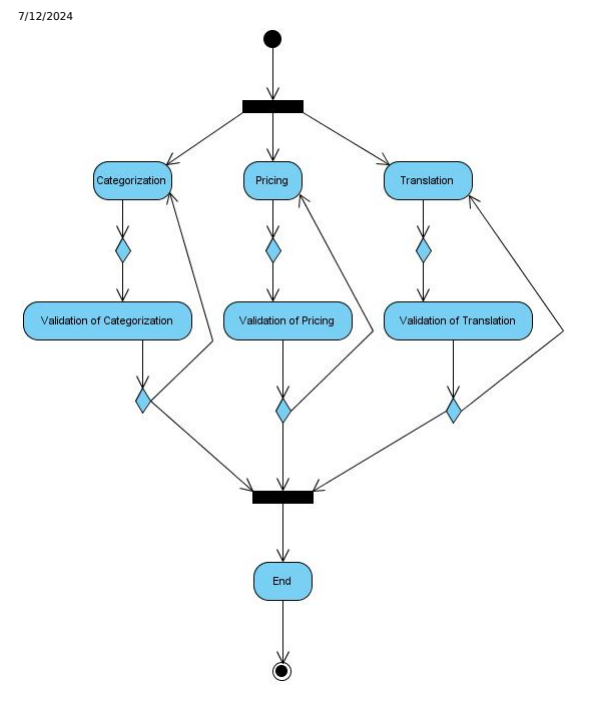

# Workflow And Collaboration

The workflow and collaboration tools rely on the workflow and comments extensions.

Modeling a workflow Using the API To create the representation of workflows, you can use the SAP Commerce Cloud system API. Processing an Action Using the API
The SAP Commerce Cloud workflow extension allows modeling in-house business processes for companies.

Setting Backoffice Access Rights The SAP Commerce Cloud workflow extension relies on the Backoffice Framework for user interaction.

## Related Information

comments Extension

## Modeling A workflow Using The Api

To create the representation of workflows, you can use the SAP Commerce Cloud system API. The procedure of modeling a workflow assumes you know the workflow you want to model. To make modeling workflows easier, SAP Commerce Cloud recommends creating a sketch of the workflows rst.

Once the workflow sketches are done, it's quite easy to represent the workflows in the SAP Commerce Cloud workflow extension.

## Modeling A workflow

To create a workflow you have to model it using a workflow template. The best practice would be to draw the workflow you want to model before. Modeling workflows directly in the workflow extension without setting up a sketch beforehand is not an easy task. The workflow modeled in this example looks like this:

This workflow consists of three sub-processes each of which consists of two actions:

## Categorization And Validation Of Categorization Pricing And Validation Of Pricing Translation And Validation Of Translation

When the rst action of each sub-process is completed (Pricing, for example), the upcoming action (Validation of Pricing, in that case) will be a validation of the previous action's result. If the result is not approved, the rst action will be re-activated. If the result is approved, the workflow will be able to proceed to the next phase. If and only if all three sub-processes have passed their respective validation action, the workflow is completed.

## Modeling A workflow Via Api

1. A workflow template can then be used for creating as many workflow instances as needed.

final WorkflowTemplateModel workflowTemplate = modelService.create(WorkflowTemplateModel.class workflowTemplate.setOwner(userService.getUserForUID("admin")); workflowTemplate.setCode("SampleWorkflow"); workflowTemplate.setName("New Product", Locale.ENGLISH); workflowTemplate.setName("Neues Produkt", Locale.GERMAN); workflowTemplate.setDescription("This is an examplary workflow tem This is   For more    the SAP Help  4 workflowTemplate.setDescription("Dies ist eine exemplarische Vorla modelService.save(workflowTemplate);
2. Next, the action templates should be added to the workflow template. The code for creating an action template looks like this:
final WorkflowActionTemplateModel workflowActionTemplate = modelService.create(WorkflowActionT workflowActionTemplate.setOwner(userService.getUserForUID("admin" workflowActionTemplate.setCode("SampleAction1"); workflowActionTemplate.setPrincipalAssigned(userService.getUserFo workflowActionTemplate.setWorkflow(workflowTemplate); workflowActionTemplate.setSendEmail(Boolean.TRUE); workflowActionTemplate.setEmailAddress("productmanagergroup@hybris workflowActionTemplate.setName("Validation of Categorization", Loc workflowActionTemplate.setName("Validierung der Kategorisierung", workflowActionTemplate.setDescription("Please assign the attached workflowActionTemplate.setDescription("Bitte ordnen Sie das angehä workflowActionTemplate.setActionType(WorkflowActionType.NORMAL); modelService.save(workflowActionTemplate);
3. Each action template needs decisions that refer to the next action template:
// create a decision final WorkflowDecisionTemplateModel decision1 = modelService.creat decision1.setCode("SampleDecision1"); decision1.setActionTemplate(workflowActionTemplate); decision1.setName("finished validating the categorization", Locale decision1.setName("Validierung der Kategorisierung beendet", Local modelService.save(decision1); decision1.setToTemplateActions(Collections.singletonList(workflowA //set AND-Connection workflowProcessingService.setAndConnectionBetweenActionAndDecision 4. After modeling the workflow you can create a real instance. Assumed a product with the code sample_product was added to the platform , then you need to create such a workflow using the following code:
final WorkflowModel workflow = workflowService.createWorkflow(workflowTemplate, userService.ge final ProductModel product = ... final WorkflowItemAttachmentModel attachment = modelService.create attachment.setItem(product);
 attachment.setWorkflow(workflow);
 attachment.setCode("SampleProductAtt"); workflow.setAttachments(Collections.singletonList(attachment)); workflowProcessingService.startWorkflow(workflow);
The rst code line creates a workflow with all precongured actions using the template. All other lines except the last one will create an attachment holding the new product and setting it to the workflow. By executing the last line, the workflow processing will be triggered. That means all actions of action type start will be activated. Now the workflow as well as the start actions are active and wait for user interaction. The triggering has to be done explicitly when using the API.

## Modeling A workflow Via Impex

A workflow template can also be created via ImpEx.

INSERT_UPDATE WorkflowTemplate;code[unique=true];name[lang=de];name[lang=en];owner(uid);description ;SampleWorkflow;Produkt Workflow;Product Workflow;admin;Dies ist eine exemplari The eld owner is a mandatory eld when creating a workflow template. It is also recommended to set a code because when creating an action template for a workflow template you have refer to the workflow template in some way. This is how an action template is created:
This is   For more    the SAP Help  5 INSERT_UPDATE WorkflowActionTemplate;code[unique=true];name[lang=de];name[lang=en];description[lang ;SampleAction1;Kategorisierung;Categorization;Bitte ordnen Sie das angehängte P
This ImpEx statement has the following mandatory elds:
actionType

principalAssigned sendEmail workflow
As with the workflow template it is recommended to set the code for the action template because it is needed for creating decision templates. A decision template is created like this:
INSERT_UPDATE WorkflowDecisionTemplate;code[unique=true];name[lang=de];name[lang=en];actionTemplate ;SampleDecision1;Kategorisierung beendet;finished Categorization;SampleAction1; This ImpEx statement has the following mandatory elds:
actionTemplate Also, it is recommended to set the code for the decision template because it is needed for creating the link between the decision templates and its successive action templates. Finally you can set the link from the decision to the next action:
insert_update WorkflowActionTemplateLinkTemplateRelation;source(code)[unique=true];target(code)[uni ;SampleDecision1;SampleAction1;false;WorkflowActionTemplateLinkTemplateRelation This ImpEx statement has the following mandatory elds:
source

target qualifier

## Processing An Action Using The Api

The SAP Commerce Cloud workflow extension allows modeling in-house business processes for companies.

Business processes in which customers are involved are only covered where an in-house employee has to do with customer input. For example, the SAP Commerce Cloud workflow extension allows modeling the following business processes:
Handle customer complaints

Create and put live a website paragraph Rewrite and review a product description

## Processing An Action Via Api

If the workflow is started, you have to know which actions are active and have to be processed. Either you know that there is a workflow where an action has to be performed (caused by mail notication, for example) or you just do a search for all actions you are assigned to and where the status is active (as used for the inbox of Backoffice):
final Map params = new HashMap(); params.put("status", WorkflowActionStatus.IN_PROGRESS); params.put("user", userService.getUserForUID("productmanager_wf1")); final String query = "SELECT tbl.action FROM ("
+ "{{SELECT {actions:PK} action FROM {WORKFLOWACTION as actions} WH + " UNION ALL " + "{{SELECT {actions:PK} action FROM {WORKFLOWACTION as actions}, { + "{actions:principalAssigned}={rel:target} AND {rel:source} = ?use final List<WorkflowActionModel> actions = flexibleSearchService.search(query, params).getResult();
So if you have an active action, you can access all attributes as usual and complete the action nally through the following code:
workflowProcessingService.decideAction(action1, decision1);
This line sets the selected decision for that action as completed and the second one starts the activation of the selected decision.

## Setting Backoffice Access Rights

The SAP Commerce Cloud workflow extension relies on the Backoffice Framework for user interaction.

Setting access rights using Backoffice The Backoffice Framework allows dening specic access rights for individual users. For more information, refer to Permissions in The Backoffice Framework.

## Setting Access Rights Using Impex

The following code sample shows how to set Backoffice access rights related to the SAP Commerce Cloud workflow extension:
$START_USERRIGHTS Type;UID;MemberOfGroups;Password;Target;read;change;create;remove;change_perm;; UserGroup;productmanagergroup;employeegroup;;;;;;;;; ;;;;WorkflowTemplate;+;;;;;; ;;;;Workflow;+;;;;;; ;;;;AbstractWorkflowAction;+;;;;;; ;;;;WorkflowActionTemplate;+;;;;;; ;;;;WorkflowAction;;;;;-;; ;;;;WorkflowAction.name;+;;;;;; ;;;;WorkflowAction.attachments;+;;;;;; ;;;;WorkflowItemAttachment;+;;;;;; ;;;;WorkflowActionStatus;+;;;;;; ;;;;WorkflowActionComment ;;;+;;;; ;;;;WorkflowDecision ;+;;;;;; ;;;;WorkflowActionLinkRelation ;+;;;;;; ;;;;InboxView;+;;;;;; $END_USERRIGHTS

## Related Information

ImpEx Users in Platform Permissions in The Backoffice Framework